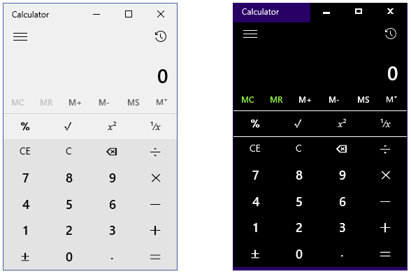
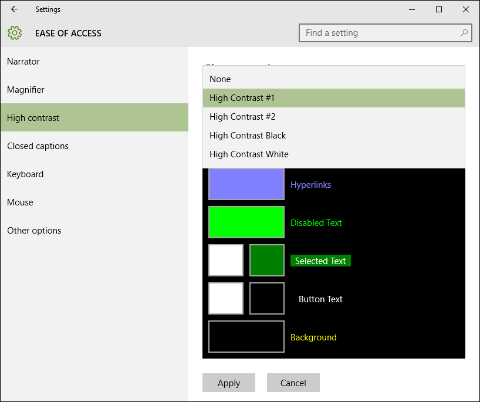
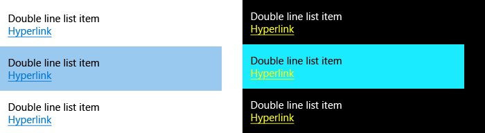

# <a name="high-contrast-themes"></a>Темы с высокой контрастностью  

Windows поддерживает темы с высокой контрастностью для операционной системы и приложений, которые пользователи могут включить. В темах с высокой контрастностью используется небольшая палитра контрастных цветов, благодаря чему интерфейс хорошо видно.

**Рисунок 1. Калькулятор в светлой теме и в черной теме с высокой контрастностью.**




Для переключения на тему с высокой контрастностью последовательно щелкните *Параметры > Специальные возможности > Высокая контрастность*.

> [!NOTE]
> Не путайте темы с высокой контрастностью со светлыми и темными темами. Последние представлены в гораздо более разнообразной цветовой палитре, которая не считается палитрой с высокой контрастностью. Более подробные сведения о светлых и темных темах см. в статье о [цвете](../style/color.md).

Стандартные элементы управления предоставляются с полной бесплатной поддержкой высокой контрастности, а вот при пользовательской настройке интерфейса следует проявлять осторожность. Самая распространенная ошибка в области высокой контрастности вызвана жестким программированием цвета в элементе управления.

```xaml
<!-- Don't do this! -->
<Grid Background="#E6E6E6">

<!-- Instead, create BrandedPageBackgroundBrush and do this. -->
<Grid Background="{ThemeResource BrandedPageBackgroundBrush}">
```

Если цвет `#E6E6E6` задан в самом элементе (см. первый пример), этот цвет фона будет использоваться во всех темах сетки. Если пользователь переключается на черную тему с высокой контрастностью, ожидается, что у приложения будет черный фон. Поскольку `#E6E6E6` почти белый, некоторые пользователи не смогут взаимодействовать с вашим приложением.

Во втором примере [**расширение разметки {ThemeResource}**](../xaml-platform/themeresource-markup-extension.md) используется для ссылки на цвет в коллекции [**ThemeDictionaries**](https://msdn.microsoft.com/library/windows/apps/windows.ui.xaml.resourcedictionary.themedictionaries.aspx), которая представляет собой выделенное свойство элемента [**ResourceDictionary**](https://msdn.microsoft.com/library/windows/apps/BR208794). ThemeDictionaries позволяет XAML автоматически менять для вас цвета с учетом текущей темы пользователя.

## <a name="theme-dictionaries"></a>Словари тем

Если необходимо изменить цвет, заданный в системе по умолчанию, создайте для приложения коллекцию ThemeDictionaries.

1. Начните с создания надлежащих элементов подключения, если они еще не созданы. В файле App.xaml создайте коллекцию ThemeDictionaries и включите в нее (как минимум) элементы **Default** и **HighContrast**.
2. В разделе Default создайте нужный тип элемента [Brush](http://msdn.microsoft.com/library/windows/apps/xaml/windows.ui.xaml.media.brush.aspx)— как правило, это кисть SolidColorBrush. Присвойте этому элементу имя x:Key, указывающее на его предназначение.
3. Назначьте ему требуемое значение цвета Color.
4. Скопируйте этот инструмент Brush в раздел HighContrast.

``` xaml
<Application.Resources>
    <ResourceDictionary>
        <ResourceDictionary.ThemeDictionaries>
            <!-- Default is a fallback if a more precise theme isn't called
            out below -->
            <ResourceDictionary x:Key="Default">
                <SolidColorBrush x:Key="BrandedPageBackgroundBrush" Color="#E6E6E6" />
            </ResourceDictionary>

            <!-- Optional, Light is used in light theme.
            If included, Default will be used for Dark theme -->
            <ResourceDictionary x:Key="Light">
                <SolidColorBrush x:Key="BrandedPageBackgroundBrush" Color="#E6E6E6" />
            </ResourceDictionary>

            <!-- HighContrast is used in all high contrast themes -->
            <ResourceDictionary x:Key="HighContrast">
                <SolidColorBrush x:Key="BrandedPageBackgroundBrush" Color="#E6E6E6" />
            </ResourceDictionary>
        </ResourceDictionary.ThemeDictionaries>
    </ResourceDictionary>
</Application.Resources>
```

Наконец, нужно определить, какой цвет использовать в режиме высокой контрастности (см. следующий раздел).

> [!NOTE]
> HighContrast— не единственное доступное имя ключа. Также существуют HighContrastBlack, HighContrastWhite и HighContrastCustom. В большинстве случаев HighContrast будет достаточно.

## <a name="high-contrast-colors"></a>Высококонтрастные цвета

На странице *Параметры > Специальные возможности > Высокая контрастность* по умолчанию доступны 4 темы с высокой контрастностью. 

**Рисунок 2. После того как пользователь выберет один из параметров, на странице отображается образец для предварительного просмотра.**



**Рисунок 3. Каждый набор цветов на образце для предварительного просмотра можно нажать, чтобы изменить его значение. Каждый набор также напрямую связан с ресурсом цвета XAML.**


Каждый ресурс `SystemColor*Color` представляет собой переменную, которая автоматически обновляет цвет, когда пользователь меняет высококонтрастные темы. Ниже приведены рекомендации о том, где и когда использовать каждый ресурс.

Ресурс | Использование
-------- | -----
SystemColorWindowTextColor | Основной текст, заголовки, списки; любой текст, с которым невозможно осуществлять взаимодействие
SystemColorHotlightColor | Гиперссылки
SystemColorGrayTextColor | Отключенный пользовательский интерфейс
SystemColorHighlightTextColor | Основной цвет текста или элементов пользовательского интерфейса, которые в настоящее время выполняются, выбраны или участвуют во взаимодействии
SystemColorHighlightColor | Фоновый цвет текста или элементов пользовательского интерфейса, которые в настоящее время выполняются, выбраны или участвуют во взаимодействии
SystemColorButtonTextColor | Основной цвет кнопок и любых элементов пользовательского интерфейса, с которыми можно осуществлять взаимодействие
SystemColorButtonFaceColor | Фоновый цвет кнопок и любых элементов пользовательского интерфейса, с которыми можно осуществлять взаимодействие
SystemColorWindowColor | Фон страниц, областей, всплывающих окон и панелей
<br/>
Часто полезно взглянуть на существующие приложения, меню «Пуск» и стандартные элементы управления, чтобы понять, как другие разработчики решают аналогичные задачи по созданию высококонтрастного интерфейса.

**Рекомендуется**

* По возможности сохранять пары основных и фоновых цветов.
* Протестировать работающее приложение во всех 4 темах с высокой контрастностью. После переключения тем не должно возникать необходимости в перезапуске приложения.
* Соблюдать единообразие.

**Не рекомендуется**

* Выполнять жесткое кодирование цвета в теме HighContrast; используйте ресурсы `SystemColor*Color`.
* Выберите ресурс цвета, исходя из эстетических предпочтений. Помните, что цвета меняются с темой!
* Не используйте `SystemColorGrayTextColor` для основного текста, который является дополнительным или выступает в качестве подсказки.


Чтобы продолжить предыдущий пример, необходимо выбрать ресурс для `BrandedPageBackgroundBrush`. Поскольку имя указывает, что он будет использован для фона, имеет смысл выбрать `SystemColorWindowColor`.

``` xaml
<Application.Resources>
    <ResourceDictionary>
        <ResourceDictionary.ThemeDictionaries>
            <!-- Default is a fallback if a more precise theme isn't called
            out below -->
            <ResourceDictionary x:Key="Default">
                <SolidColorBrush x:Key="BrandedPageBackgroundBrush" Color="#E6E6E6" />
            </ResourceDictionary>

            <!-- Optional, Light is used in light theme.
            If included, Default will be used for Dark theme -->
            <ResourceDictionary x:Key="Light">
                <SolidColorBrush x:Key="BrandedPageBackgroundBrush" Color="#E6E6E6" />
            </ResourceDictionary>

            <!-- HighContrast is used in all high contrast themes -->
            <ResourceDictionary x:Key="HighContrast">
                <SolidColorBrush x:Key="BrandedPageBackgroundBrush" Color="{ThemeResource SystemColorWindowColor}" />
            </ResourceDictionary>
        </ResourceDictionary.ThemeDictionaries>
    </ResourceDictionary>
</Application.Resources>
```

Теперь можно задать фон в приложении.

```xaml
<Grid Background="{ThemeResource BrandedPageBackgroundBrush}">
```

Обратите внимание, что `{ThemeResource}` используется дважды: один раз, чтобы создать ссылку на `SystemColorWindowColor`, а второй— на `BrandedPageBackgroundBrush`. Оба необходимы для правильного использования темы в приложении во время выполнения. Это хорошая возможность протестировать эту функциональность в вашем приложении. Фон сетки автоматически обновляется по мере переключения на высококонтрастную тему. Фон также обновляется при переключении между разными высококонтрастными темами.

## <a name="when-to-use-borders"></a>Когда следует использовать границы

`SystemColorWindowColor` следует использовать для фона страниц, областей, всплывающих окон и панелей в режиме высокой контрастности. Чтобы сохранить важные границы в пользовательском интерфейсе, при необходимости можно добавить границу высокой контрастности.

**Рисунок 4. Панель навигации и страница имеют общий цвет фона в режиме высокой контрастности. Для их разделения необходимо использовать границу высокой контрастности.**


## <a name="list-items"></a>Элементы списка

В режиме высокой контрастности для элементов в [ListView](https://msdn.microsoft.com/library/windows/apps/windows.ui.xaml.controls.listview.aspx) при наведении, нажатии или выборе используется фон `SystemColorHighlightColor`. Сложные элементы списка содержат ошибку, когда содержимое элемента списка не меняет цвет при наведении на элемент, нажатии или выборе элемента. В результате прочитать элемент невозможно.

**Рисунок 5. Простой список в светлой теме (слева) и черной теме с высокой контрастностью (справа). Выбран второй элемент; обратите внимание, как цвет текста меняется в режиме высокой контрастности.**


### <a name="list-items-with-colored-text"></a>Элементы списка с цветным текстом

Одно из затруднений— настройка параметра TextBlock.Foreground в элементе [DataTemplate](https://msdn.microsoft.com/library/windows/apps/windows.ui.xaml.controls.itemscontrol.itemtemplate.aspx) представления списка. Это обычно делается, чтобы установить визуальную иерархию. Свойство Foreground настраивается в элементе [ListViewItem](https://msdn.microsoft.com/library/windows/apps/windows.ui.xaml.controls.listviewitem.aspx), а элемент TextBlocks в шаблоне DataTemplate наследует правильный цвет фона при наведении на элемент, нажатии или выборе элемента. Однако при настройке параметра Foreground наследование нарушается.

**Рисунок 6. Сложный список в светлой теме (слева) и черной теме с высокой контрастностью (справа). Обратите внимание, что в режиме высокой контрастности вторая строка выбранного элемента не поменяла цвет.**


Чтобы решить эту проблему, можно условно настроить параметр Foreground в элементе Style, который находится в коллекции ThemeDictionaries. Поскольку параметр Foreground не настраивается элементом SecondaryBodyTextBlockStyle из коллекции HighContrast, его цвет будет меняться правильно.

```xaml
<!-- In App.xaml... -->
<ResourceDictionary.ThemeDictionaries>
    <ResourceDictionary x:Key="Default">
        <Style
            x:Key="SecondaryBodyTextBlockStyle"
            TargetType="TextBlock"
            BasedOn="{StaticResource BodyTextBlockStyle}">
            <Setter Property="Foreground" Value="{StaticResource SystemControlForegroundBaseMediumBrush}" />
        </Style>
    </ResourceDictionary>

    <ResourceDictionary x:Key="Light">
        <Style
            x:Key="SecondaryBodyTextBlockStyle"
            TargetType="TextBlock"
            BasedOn="{StaticResource BodyTextBlockStyle}">
            <Setter Property="Foreground" Value="{StaticResource SystemControlForegroundBaseMediumBrush}" />
        </Style>
    </ResourceDictionary>

    <ResourceDictionary x:Key="HighContrast">
        <!-- The Foreground Setter is omitted in HighContrast -->
        <Style
            x:Key="SecondaryBodyTextBlockStyle"
            TargetType="TextBlock"
            BasedOn="{StaticResource BodyTextBlockStyle}" />
    </ResourceDictionary>
</ResourceDictionary.ThemeDictionaries>

<!-- Usage in your DataTemplate... -->
<DataTemplate>
    <StackPanel>
        <TextBlock Style="{StaticResource BodyTextBlockStyle}" Text="Double line list item" />

        <!-- Note how ThemeResource is used to reference the Style -->
        <TextBlock Style="{ThemeResource SecondaryBodyTextBlockStyle}" Text="Second line of text" />
    </StackPanel>
</DataTemplate>
```

### <a name="list-items-with-buttons-and-links"></a>Элементы списка с кнопками и ссылками

Иногда в состав элементов списка входят более сложные элементы управления, такие как [HyperlinkButton](https://msdn.microsoft.com/library/windows/apps/windows.ui.xaml.controls.hyperlinkbutton.aspx) или [Button](https://msdn.microsoft.com/library/windows/apps/windows.ui.xaml.controls.button.aspx). Эти элементы управления имеют собственные состояния для наведения, нажатия и выбора, которые не работают таким же образом для элемента списка. В черной теме с высокой контрастностью гиперссылки желтые, что осложняет их чтение при наведении указателя на элемент списка, нажатии или выборе элемента.

**Рисунок 7. Обратите внимание, как сложно прочитать гиперссылку в режиме высокой контрастности.**



Чтобы решить эту проблему, нужно задать фон DataTemplate равным `SystemColorWindowColor` с высокой контрастностью. Это создает эффект рамки с высокой контрастностью.

```xaml
<!-- In App.xaml... -->
<ResourceDictionary.ThemeDictionaries>
    <ResourceDictionary x:Key="Default">
        <SolidColorBrush x:Key="HighContrastOnlyBackgroundBrush" Color="Transparent" />
    </ResourceDictionary>

    <ResourceDictionary x:Key="HighContrast">
        <SolidColorBrush x:Key="HighContrastOnlyBackgroundBrush" Color="{ThemeResource SystemColorWindowColor}" />
    </ResourceDictionary>
</ResourceDictionary.ThemeDictionaries>

<!-- Usage in your ListView... -->
<ListView>
    <ListView.ItemContainerStyle>
        <Style TargetType="ListViewItem">
            <!-- Causes the DataTemplate to fill the entire width and height
            of the list item -->
            <Setter Property="HorizontalContentAlignment" Value="Stretch" />
            <Setter Property="VerticalContentAlignment" Value="Stretch" />

            <!-- Padding is handled in the DataTemplate -->
            <Setter Property="Padding" Value="0" />
        </Style>
    </ListView.ItemContainerStyle>
    <ListView.ItemTemplate>
        <DataTemplate>
            <!-- Margin of 2px allows some of the ListViewItem's background
            to shine through. An additional left padding of 10px puts the
            content a total of 12px from the left edge -->
            <StackPanel
                Margin="2,2,2,2"
                Padding="10,0,0,0"
                Background="{ThemeResource HighContrastOnlyBackgroundBrush}">

                <!-- Foreground is explicitly set so that it doesn't
                disappear on hovered, pressed, or selected -->
                <TextBlock
                    Foreground="{ThemeResource SystemControlForegroundBaseHighBrush}"
                    Text="Double line list item" />

                <HyperlinkButton Content="Hyperlink" />
            </StackPanel>
        </DataTemplate>
    </ListView.ItemTemplate>
</ListView>
```
**Рисунок 8. Эффект рамки— отличное решение, если в элементах списка имеются более сложные элементы управления.**


## <a name="detecting-high-contrast"></a>Обнаружение высокой контрастности

Можно программным способом проверить, является ли текущая тема темой с высокой контрастностью, воспользовавшись элементами класса [**AccessibilitySettings**](https://msdn.microsoft.com/library/windows/apps/BR242237).

> [!NOTE]
> Убедитесь, что конструктор **AccessibilitySettings** вызывается из области, в которой приложение инициализировано и уже отображает содержимое.

## <a name="related-topics"></a>Связанные статьи  
* [Специальные возможности](accessibility.md)
* [Пример контрастности и параметров пользовательского интерфейса](http://go.microsoft.com/fwlink/p/?linkid=231539)
* [Пример XAML accessibility](http://go.microsoft.com/fwlink/p/?linkid=238570)
* [Пример XAML с высокой контрастностью](http://go.microsoft.com/fwlink/p/?linkid=254993)
* [**AccessibilitySettings**](https://msdn.microsoft.com/library/windows/apps/BR242237)
