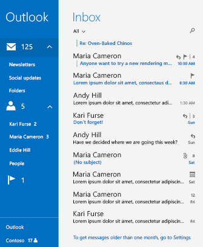

# Руководства по инструктивному пользовательскому интерфейсу

В некоторых случаях полезно обучить пользователя работе с неочевидными функциями вашего приложения, например с сенсорным взаимодействием. В этих случаях необходимо представить пользователю инструкции в пользовательском интерфейсе, чтобы в дальнейшем он мог пользоваться функциями, о наличии которых, возможно, и не подозревал.

## Когда использовать инструктивный пользовательский интерфейс

Использовать инструктивный пользовательский интерфейс следует осторожно. В случае злоупотребления этой возможностью интерфейс может просто игнорироваться пользователем или даже раздражать его, что сделает всю методику неэффективной.

Инструктивный интерфейс следует использовать для того, чтобы помочь пользователю открыть для себя полезные и неочевидные функции вашего приложения, такие как сенсорные жесты или расширенные параметры. С помощью инструктивного интерфейса также можно проинформировать пользователей о новых функциях или изменениях в приложении, на которые они, возможно, не обратили внимание.

Использовать инструктивный пользовательский интерфейс для обучения пользователям работе с базовыми функциями вашего приложения стоит лишь в том случае, если работа с приложением основана на сенсорных жестах.

## Принципы создания инструктивного пользовательского интерфейса

Хороший инструктивный пользовательский интерфейс актуален для пользователя, учит его полезному и повышает удобство работы. К такому интерфейсу предъявляются некоторые требования.

-   **Простота:** пользователи не хотят отвлекаться на сложную информацию
-   **Запоминаемость:** пользователи не хотят видеть одни и те же инструкции всякий раз при попытке выполнить ту или иную задачу, поэтому инструкции должны хорошо запоминаться.
-   **Актуальность:** если инструктивный пользовательский интерфейс не учит пользователя тому, что последнему нужно выполнить прямо сейчас, обращать на него внимание нет смысла.

Старайтесь не злоупотреблять инструктивным пользовательским интерфейсом и выбирать правильные темы для обучения. Не учите:

-   **базовым функциям**, потому что если пользователю требуется обучения, чтобы приступить к работе с приложением, нужно сделать приложение более интуитивно понятным;
-   **очевидным функциям**, ведь если пользователь может выяснить, как работает та или иная функция, без дополнительного обучения, инструктивный пользовательский интерфейс только помешает ему;
-   **сложным функциям**, поскольку инструктивный пользовательский интерфейс должен содержать простую и понятную информацию — пользователи, которые интересуются сложными функциями, как правило, готовы поискать инструкции самостоятельно.

Старайтесь сделать так, чтобы ваш инструктивный пользовательский интерфейс не доставлял пользователю неудобств. Не рекомендуется:

-   **загораживать важную информацию:** инструктивный пользовательский интерфейс не должен препятствовать работе с другими функциями приложения;
-   **принуждать пользователей воспользоваться инструктивным интерфейсом:** у пользователей должна быть возможность проигнорировать инструктивный интерфейс и продолжить работу с приложением;
-   **отображать повторяющиеся сведения**, потому что если пользователь проигнорировал инструктивный пользовательский интерфейс в первый раз, не имеет смысла надоедать ему с ним; в этом случае лучше добавить настройку, позволяющую отобразить инструктивный интерфейс снова.

## Примеры инструктивного пользовательского интерфейса

Вот несколько примеров, в которых инструктивный интерфейс поможет вашим пользователям:

-   **Ознакомление пользователей с сенсорными взаимодействиями.** На следующем снимке экрана показан инструктивный пользовательский интерфейс, обучающий игрока применению жестов касания в игре Cut the Rope.

    

-   **Создание эффектного первого впечатления.** При первом запуске приложения "Киностудия" в интерфейсе отображается приглашение приступить к созданию фильмов. Комфорт пользователя при этом не нарушается.

    

-   **Перенаправление пользователей к следующему шагу при выполнении сложной задачи.** В приложении Почта Windows в нижней части папки "Входящие" для пользователя отображается подсказка о необходимости перехода в раздел **Параметры** для доступа к более ранним сообщениям.

    

    Когда пользователь щелкает сообщение, справа на экране сразу появляется всплывающий элемент **Параметры**, который помогает пользователю выполнить задачу. На следующих снимках экрана показано приложение "Почта" до и после выбора пользователем сообщения инструктивного пользовательского интерфейса.

    | До                                                               | После                                                                                                        |
    |----------------------------------------------------------------------|--------------------------------------------------------------------------------------------------------------|
    |  |  |

## Связанные разделы

* [Руководство по справке для приложений](guidelines-for-app-help.md)

<!--HONumber=Jun16_HO4-->

