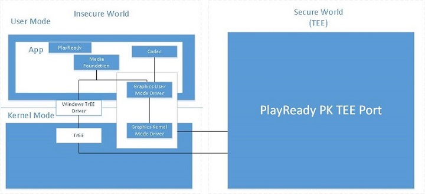

# <a name="hardware-drm"></a>Аппаратное управление цифровыми правами (DRM)


В данной статье рассказывается, как добавить аппаратное управление цифровыми правами PlayReady в приложение универсальной платформы Windows.

> [!NOTE] 
> Аппаратное управление цифровыми правами PlayReady поддерживается на самых разных устройствах, включая и устройства с Windows, и без Windows, такие как телевизоры, телефоны и планшеты. Для того чтобы устройство с Windows поддерживало аппаратное управление цифровыми правами PlayReady, на нем должна быть установлена Windows 10 и его конфигурация оборудования должна поддерживаться.

Все чаще поставщики содержимого используют аппаратную защиту для предоставления разрешений на воспроизведение полноценного содержимого в приложениях. Для удовлетворения этих потребностей в PlayReady добавлена надежная поддержка аппаратной реализации криптографического ядра. Эта поддержка обеспечивает безопасное воспроизведение содержимого высокого (1080p) и сверхвысокого (UHD) разрешений на нескольких платформах устройств. Материал ключей (включая закрытые ключи, ключи содержимого и любой другой материал ключей, используемый для наследования или разблокировки указанных выше ключей), а также расшифрованные сжатые и несжатые примеры видео защищены с помощью аппаратной системы безопасности.

## <a name="windows-tee-implementation"></a>Реализация надежной среды выполнения в Windows

В данной статье содержится краткий обзор того, как в Windows 10 реализована надежная среда выполнения (TEE).

Предоставление подробных сведений о реализации надежной среды выполнения в Windows выходит за рамки данного документа. Тем не менее следует вкратце рассказать о разнице между стандартным портом надежной среды выполнения набора для портирования и портом Windows. Windows реализует уровень прокси-сервера изготовителя оборудования и передает сериализованные вызовы функций PRITEE в драйвер пользовательского режима в подсистеме Windows Media Foundation. В конечном счете происходит его маршрутизация либо в драйвер надежной среды выполнения в Windows, либо в графический драйвер изготовителя оборудования. Предоставление подробных сведений о каждом из этих подходов выходит за рамки данного документа. На схеме ниже показано общее взаимодействие компонентов для порта Windows. Если вы хотите разрабатывать реализации доверенной среды выполнения PlayReady в Windows, напишите на адрес <WMLA@Microsoft.com>.



## <a name="considerations-for-using-hardware-drm"></a>Рекомендации по использованию аппаратного управления цифровыми правами

В данной статье содержится краткий перечень вопросов, которые необходимо учесть при разработке приложений, использующих аппаратное управление цифровыми правами. Как поясняется в [PlayReady DRM](playready-client-sdk.md#output-protection), с помощью HWDRM PlayReady для Windows 10 все виды защиты выходных данных вступают в действие из реализации надежной среды выполнения в Windows, что влечет определенные последствия в поведении защиты выходных данных.

-   **Поддержка уровня защиты выходных данных (OPL) для несжатого цифрового видео 270:** PlayReady HWDRM для Windows 10 не поддерживает снижение разрешения и будет принудительно включать HDCP. Рекомендуется, чтобы содержимое высокого разрешения для HWDRM имело значение показателя OPL более 270 (хотя это и необязательно). Кроме того, рекомендуется установить ограничение типа HDCP в лицензии (стандарт HDCP версии 2.2 в Windows 10).
-   **В отличие от программного управления цифровыми правами (SWDRM) защита выходных данных применяется на всех мониторах, при этом учитываются характеристики монитора с самыми худшими возможностями.** Например, если у пользователя подключено два монитора, один из которых поддерживает стандарт HDCP, а другой— нет и при этом лицензия требует наличия стандарта HDCP, то не удастся воспроизвести содержимое даже если предполагается воспроизводить его только на мониторе, поддерживающем этот стандарт. При использовании программного управления цифровыми правами можно воспроизводить содержимое при условии, что оно будет отображаться только на мониторе, поддерживающем стандарт HDCP.
-   **Чтобы аппаратное управление цифровыми правами (HWDRM) гарантированно использовалось в клиенте и обеспечивало защиту, должны быть выполнены указанные ниже условия** для ключей содержимого и лицензий.
    -   Лицензия, используемая для ключа содержимого видео, должна иметь уровень безопасности не менее 3000.
    -   Аудиоданные необходимо шифровать ключом, отличным от ключа для видеоданных, а лицензия, используемая для аудиоданных, должна иметь уровень безопасности, равный 2000. Также звук можно оставить в чистом виде.
    
Кроме того при использовании HWDRM необходимо учесть следующие вопросы.

-   Технология Protected Media Process (PMP) не поддерживается.
-   Видео в формате Windows Media (также называемом VC-1) не поддерживается (см. статью [Переопределение аппаратного управления цифровыми правами](#override-hardware-drm)).
-   При использовании сохраняемых лицензий отсутствует поддержка нескольких графических процессоров (GPU).

Для обработки сохраняемых лицензий на компьютерах с несколькими графическими процессорами (GPU) можно использовать указанный ниже сценарий.

1.  Клиент покупает новый компьютер со встроенной графической картой.
2.  Клиент использует приложение, которое получает сохраняемые лицензии при использовании аппаратного управления цифровыми правами.
3.  Теперь сохраняемая лицензия связана с ключами оборудования этой графической карты.
4.  Затем клиент устанавливает новую графическую карту.
5.  Все лицензии в хранилище хэшированных данных связаны со встроенной графической картой, но теперь клиенту необходимо воспроизвести защищенное содержимое с помощью новой графической карты.

Чтобы предотвратить сбой воспроизведения из-за невозможности расшифровки лицензий оборудованием, PlayReady использует отдельное хранилище хэшированных данных (HDS) для каждой обнаруженной им графической карты. Из-за этого PlayReady попытается получить лицензию на содержимое, хотя при обычных обстоятельствах у PlayReady уже была бы лицензия (то есть в случае использовании программного управления цифровыми правами или в случае отсутствия изменений в составе оборудования PlayReady не потребовалось бы повторно получать лицензию). Таким образом, если приложение получает сохраняемую лицензию при использовании аппаратного управления цифровыми правами, оно должно быть способно обрабатывать ситуацию, когда эта лицензия фактически "теряется", если конечный пользователь устанавливает (или удаляет) графическую карту. Так как это довольно редкий сценарий, вы, возможно, предпочтете обрабатывать звонки в службу поддержки от клиентов, у которых содержимое не воспроизводится после изменения состава оборудования, а не писать код для клиента или сервера, обрабатывающий ситуации, в которых происходит изменение аппаратной конфигурации.

## <a name="override-hardware-drm"></a>Переопределение аппаратного управления цифровыми правами

В данном разделе рассказывается о том, как переопределить аппаратное управление цифровыми правами (HWDRM), если содержимое, которое необходимо воспроизвести, не поддерживает его.

По умолчанию аппаратное управление цифровыми правами используется, если система поддерживает его. Тем не менее некоторое содержимое не поддерживается аппаратным управлением цифровыми правами. Пример такого содержимого— Cocktail. Другой пример— любое содержимое, использующее видеокодек, отличный от H.264 или HEVC. Еще один пример— содержимое в формате HEVC, так как некоторые виды аппаратного управления цифровыми правами поддерживают стандарт HEVC, а другие— нет. Таким образом, если вам необходимо воспроизвести содержимое, а аппаратное управление цифровыми правами не поддерживает его на рассматриваемой системе, вам, возможно, потребуется отключить аппаратное управление цифровыми правами.

В примере ниже показано, как отключить аппаратное управление цифровыми правами. Необходимо сделать это до переключения. Кроме того, убедитесь, что в памяти нет никаких объектов PlayReady, иначе это может привести к непредсказуемым результатам.

```js
var applicationData = Windows.Storage.ApplicationData.current;
var localSettings = applicationData.localSettings.createContainer("PlayReady", Windows.Storage.ApplicationDataCreateDisposition.always);
localSettings.values["SoftwareOverride"] = 1;
```

Чтобы снова включить аппаратное управление цифровыми правами, присвойте параметру **SoftwareOverride** значение **0**.

Для каждого воспроизведения мультимедиа необходимо задать для **MediaProtectionManager** значение:

```js
mediaProtectionManager.properties["Windows.Media.Protection.UseSoftwareProtectionLayer"] = true;
```

Лучший способ программного управления цифровыми правами используется рассмотрим C:\\Users\\, если вы являетесь аппаратным управлением цифровыми правами или&lt;имя пользователя&gt;\\AppData\\Local\\Packages\\&lt;имя приложения&gt;\\LocalCache\\PlayReady\\\*

-   Если там присутствует файл mspr.hds, используется программное управление цифровыми правами DRM.
-   Если там имеется другой файл \*.hds, используется аппаратное управление DRM.
-   Вы можете удалить всю папку PlayReady и повторить тестирование.

## <a name="detect-the-type-of-hardware-drm"></a>Определение типа аппаратного управления цифровыми правами

В данном разделе рассказывается, как определить тип аппаратного управления цифровыми правами, поддерживаемого в системе.

Чтобы узнать, поддерживает ли система определенный компонент аппаратного управления цифровыми правами, можно использовать метод [**PlayReadyStatics.CheckSupportedHardware**](https://msdn.microsoft.com/library/windows/apps/dn986441). Пример.

```csharp
bool isFeatureSupported = PlayReadyStatics.CheckSupportedHardware(PlayReadyHardwareDRMFeatures.HEVC);
```

Перечисление [**PlayReadyHardwareDRMFeatures**](https://msdn.microsoft.com/library/windows/apps/dn986265) содержит допустимый список значений компонентов аппаратного управления цифровыми правами, которые можно запросить. Чтобы определить, поддерживается ли аппаратное управление цифровыми правами, воспользуйтесь членом **HardwareDRM** в очереди. Чтобы определить, поддерживает ли оборудование кодек High Efficiency Video Coding (HEVC)/H.265, воспользуйтесь членом **HEVC** в очереди.

Кроме того, чтобы получить сведения об уровне безопасности сертификата клиента и определить, поддерживается ли аппаратное управление цифровыми правами, вы можете воспользоваться свойством [**PlayReadyStatics.PlayReadyCertificateSecurityLevel**](https://msdn.microsoft.com/library/windows/apps/windows.media.protection.playready.playreadystatics.playreadycertificatesecuritylevel.aspx). Если возвращенное значение уровня защиты сертификата клиента меньше 3000, то либо клиент не индивидуализирован или не подготовлен к работе (в этом случае свойство возвратит значение 0), либо аппаратное управление цифровыми правами не используется (в этом случае это свойство возвратит значение, меньшее 3000).

### <a name="detecting-support-for-aes128cbc-hardware-drm"></a>Обнаружение поддержки аппаратного управления цифровыми правами DRM AES128CBC
Начиная с Windows 10 версии 1709 вы можете определить поддержку аппаратного шифрования AES128CBC на устройстве, вызывая метод **[PlayReadyStatics.CheckSupportedHardware](https://msdn.microsoft.com/library/windows/apps/dn986441)** и указывая значение перечисления [**PlayReadyHardwareDRMFeatures.Aes128Cbc**](https://msdn.microsoft.com/library/windows/apps/dn986265). В предыдущих версиях Windows 10 указание этого значения приводит к вызову исключения. Поэтому вам следует проверить наличие значения перечисления, вызвав метод **[ApiInformation.IsApiContractPresent](https://docs.microsoft.com/uwp/api/windows.foundation.metadata.apiinformation.isapicontractpresent)** и указав основную версию контракта 5 перед вызовом метода **CheckSupportedHardware**.

```csharp
bool supportsAes128Cbc = ApiInformation.IsApiContractPresent("Windows.Foundation.UniversalApiContract", 5);

if (supportsAes128Cbc)
{
    supportsAes128Cbc = PlayReadyStatics.CheckSupportedHardware(PlayReadyHardwareDRMFeatures.Aes128Cbc);
}
```

## <a name="see-also"></a>См. также:
- [PlayReady DRM](playready-client-sdk.md)
