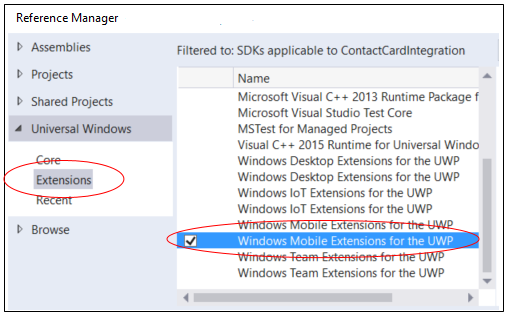

# Реализация социальных веб-каналов в приложении "Люди"

Интеграция данных социальных веб-каналов из базы данных с приложением "Люди".

Данные ваших веб-каналов появятся на страницах **Что нового** в приложении "Люди" или на странице **Профиль** контакта.

Пользователи могут нажать элемента веб-канала, чтобы открыть приложение.


Для начала создайте приложение переднего плана, помечающее контакты для социальных веб-каналов, и фоновый агент, отправляющий данные веб-каналов в приложение "Люди".

Более подробный пример см. в разделе [Пример сведений социальных сетей](https://github.com/Microsoft/Windows-Social-Samples/tree/master/SocialInfoSampleApp).

## Создание приложения переднего плана

Сначала создайте проект универсальной платформы Windows (UWP), а затем добавьте к нему **Мобильные расширения Windows для UWP**.



### Поиск и создание контактов

Вы можете искать контакты по имени, адресу электронной почты или номеру телефона.

```cs
ContactStore contactStore = await ContactManager.RequestStoreAsync();

IReadOnlyList<Contact> contacts = null;

contacts = await contactStore.FindContactsAsync(emailAddress);

Contact contact = contacts[0];
```
Вы также можете создавать контакты и добавлять их в список контактов.

```cs
Contact contact = new Contact();
contact.FirstName = "TestContact";

ContactEmail email = new ContactEmail();
email.Address = "TestContact@contoso.com";
email.Kind = ContactEmailKind.Other;
contact.Emails.Add(email);

ContactPhone phone = new ContactPhone();
phone.Number = "4255550101";
phone.Kind = ContactPhoneKind.Mobile;
contact.Phones.Add(phone);

ContactStore store = await
    ContactManager.RequestStoreAsync(ContactStoreAccessType.AppContactsReadWrite);

ContactList contactList;

IReadOnlyList<ContactList> contactLists = await store.FindContactListsAsync();

if (0 == contactLists.Count)
    contactList = await store.CreateContactListAsync("TestContactList");
else
    contactList = contactLists[0];

await contactList.SaveContactAsync(contact);
```

### Маркировка каждого контакта с помощью аннотаций

В результате добавления этой *аннотации* приложение "Люди" запрашивает данные веб-каналов для контакта из фонового агента.

В рамках аннотации свяжите идентификатор контакта с идентификатором, который приложение использует внутренне для определения этого контакта.

```cs
ContactAnnotationStore annotationStore = await
   ContactManager.RequestAnnotationStoreAsync(ContactAnnotationStoreAccessType.AppAnnotationsReadWrite);

ContactAnnotationList annotationList;

IReadOnlyList<ContactAnnotationList> annotationLists = await annotationStore.FindAnnotationListsAsync();
if (0 == annotationLists.Count)
    annotationList = await annotationStore.CreateAnnotationListAsync();
else
    annotationList = annotationLists[0];

ContactAnnotation annotation = new ContactAnnotation();
annotation.ContactId = contact.Id;
annotation.RemoteId = "user22";

annotation.SupportedOperations = ContactAnnotationOperations.SocialFeeds;

await annotationList.TrySaveAnnotationAsync(annotation);

```
### Подготовка фонового агента к работе

Убедитесь, что контракт API [SocialInfoContract](https://msdn.microsoft.com/library/windows/apps/dn706146.aspx) доступен на устройстве, на котором будет запускаться приложение.

Если он доступен, подготовьте фоновый агент к работе.

```cs
if (Windows.Foundation.Metadata.ApiInformation.IsApiContractPresent(
"Windows.ApplicationModel.SocialInfo.SocialInfoContract",
1))
{
    bool isProvisionSuccessful = await Windows.ApplicationModel.SocialInfo.Provider.SocialInfoProviderManager.ProvisionAsync();

    // Throw an exception if the app could not be provisioned
    if (!isProvisionSuccessful)
    {
        throw new Exception("Could not provision the app with the SocialInfoProviderManager");
    }
}
```
## Создание фонового агента

Фоновый агент— это компонент среды выполнения Windows, отвечающий на запросы веб-каналов от приложения "Люди".

В вашем агенте вы будете отвечать на эти запросы, предоставляя приложению "Люди" данные веб-каналов из вашей базы данных.

### Создание компонента среды выполнения Windows

Добавьте проект **Компонент среды выполнения Windows (универсальная платформа Windows)** в ваше решение.


### Регистрация фонового агента в качестве службы приложения

Выполните регистрацию путем добавления обработчиков протоколов в элемент ``Extensions`` манифеста.

```xml
<Extensions>
  <uap:Extension Category="windows.appService" EntryPoint="SocialFeeds.BackgroundAgent">
    <uap:AppService Name="com.microsoft.windows.social-feeds" />
  </uap:Extension>
</Extensions>
```
Вы также можете добавить их на вкладку **Объявления** конструктора манифестов в Visual Studio.


### Запрос операций у приложения "Люди"

Запросите у приложения "Люди" требуемый далее тип данных. В ответ на ваш запрос приложение "Люди" отправит код, в котором будет указано, для какого веб-канала требуются данные.

В этой таблице описан каждый веб-канал:

| Веб-канал | Описание |
|-------|-------------|
| Главный | Этот веб-канал появляется на странице "Что нового" в приложении "Люди". |
| Контакт | Этот веб-канал появляется на странице "Что нового" в контакте. |
| Информационная панель | Этот веб-канал появляется на карточке контакта рядом с изображением профиля. |
<br>
Для отправки запроса в приложение "Люди" требуется запросить *операцию*. Реализуйте интерфейс [IBackgroundTask](https://msdn.microsoft.com/library/windows/apps/windows.applicationmodel.background.ibackgroundtask.aspx) и переопределите метод [Run](https://msdn.microsoft.com/library/windows/apps/windows.applicationmodel.background.ibackgroundtask.run.aspx).

В методе [Run](https://msdn.microsoft.com/library/windows/apps/windows.applicationmodel.background.ibackgroundtask.run.aspx) отправьте приложению "Люди" две пары "ключ-значение". Одна из них содержит версию протокола, а другая— тип операции.

Затем дождитесь ответа от приложения "Люди". Ответ будет содержать код.

```cs
public sealed class BackgroundAgent : IBackgroundTask
{
    public async void Run(IBackgroundTaskInstance taskInstance)
    {
        BackgroundTaskDeferral backgroundTaskDeferral = taskInstance.GetDeferral();

        AppServiceTriggerDetails triggerDetails = taskInstance.TriggerDetails as AppServiceTriggerDetails;

        AppServiceConnection appServiceConnection = triggerDetails.AppServiceConnection;

        bool continueProcessing = true;

        while (continueProcessing)
        {
            // Get next operation.
            ValueSet fields =
                new ValueSet();

            fields.Add("Version",
                (1 << 16) | 0);

            fields.Add(
                "Type", 0x10);

            AppServiceResponse response =
                await appServiceConnection.SendMessageAsync(fields);

            if (response == null || response.Status != AppServiceResponseStatus.Success)
            { /* throw exception */ }

            UInt32 type = (UInt32)response.Message["Type"];

            switch (type)
            {
                //Get Next Operation.
                case 0x10:
                    break;
                //Download Home Feed Operation.
                case 0x11:
                    break;
                //Download Contact Feed Operation.
                case 0x13:
                    break;
                //Download Dashboard Feed Operation.
                case 0x15:
                    break;
                //Operation Result.
                case 0x80:
                    break;
                //Good Bye.
                case 0xF1:
                    continueProcessing = false;
                    break;
            }
        }
        // Complete the task deferral
        backgroundTaskDeferral.Complete();

        backgroundTaskDeferral = null;
        appServiceConnection = null;
    }

}
```

Сошлитесь на элемент ``Type`` свойства [AppServiceResponse.Message](https://msdn.microsoft.com/library/windows/apps/windows.applicationmodel.appservice.appserviceresponse.message.aspx) для получения этого кода. Вот полный список кодов.

| Тип| Описание |
|-----|-------------|
| 0x10 | Запрос приложению "Люди" на следующую операцию. |
| 0x11 | Запрос от приложения "Люди" на предоставление главного веб-канала для основного пользователя. |
| 0x13 | Запрос от приложения "Люди" на получение веб-канала контакта для выбранного контакта. |
| 0x15 | Запрос от приложения "Люди" на получение элемента информационной панели выбранного контакта. |
| 0x80 | Указывает на завершение операции. Этот код уведомляет приложение "Люди" о доступности данных. |
| 0xF1 | Сообщение от приложения "Люди", указывающее на отсутствие необходимости выполнения каких-либо других операций. Теперь фоновый агент может завершить работу. |
<br>
Свойство [AppServiceResponse.Message](https://msdn.microsoft.com/library/windows/apps/windows.applicationmodel.appservice.appserviceresponse.message.aspx) также возвращает коллекцию других пар "ключ-значение", описывающих ответ. Вот их перечень.

| Ключ | Тип | Описание |
|-----|------|-------------|
| Version | UINT32 | (Обязательно) Указывает версию протокола сообщений. Верхние 16 бит указывают основной номер версии, а нижние— дополнительный. |
| Type | UINT32 | (Обязательно) Тип выполняемой операции. В предыдущем примере ключ Type используется для определения типы операции, которую запрашивает приложение "Люди".
| OperationId | UINT32 | Идентификатор операции. |
| OwnerRemoteId | Строка | Идентификатор, который приложение использует внутренне для определения этого контакта. |
| LastFeedItemTimeStamp | Строка | Идентификатор последнего полученного элемента веб-канала. |
| LastFeedItemTimeStamp | Дата и время | Метка времени последнего полученного элемента веб-канала. |
| ItemCount | UINT32 | Число элементов, запрашиваемых приложением "Люди". |
| IsFetchMore | Логический | Определяет время обновления внутреннего кэша. |
| ErrorCode | UINT32 | Код ошибки, связанный с операцией фонового агента. |
<br>
### Предоставление веб-канала данных приложению "Люди"

Значение **Type** ``0x11``, ``0x13`` или ``0x15``— это запрос от приложению "Люди" на данные веб-канала.  

В нескольких следующих фрагментах кода демонстрируется подход к предоставлению данных приложению "Люди".

> [!NOTE]
> Эти фрагменты кода взяты из раздела [Пример сведений социальных сетей](https://github.com/Microsoft/Windows-Social-Samples/tree/master/SocialInfoSampleApp). Они содержат ссылки на интерфейсы, классы и участников, определенных в других частях примера. Используйте эти фрагменты кода с другими примерами в данной статье, чтобы уяснить последовательность задач и обратиться к примеру, если вам требуется подробнее изучить стек интерфейсов, классов и типов.

**Получение элементов веб-канала контакта**

```cs
public override async Task DownloadFeedAsync()
{
    // Get the contact feeds
    IEnumerable<FeedItem> contactFeedItems =
        InMemorySocialCache.Instance.GetContactFeeds(OwnerRemoteId, ItemCount);

    // Check if the platform supports the SocialInfo APIs
    if (!Windows.Foundation.Metadata.ApiInformation.IsApiContractPresent(
         "Windows.ApplicationModel.SocialInfo.SocialInfoContract", 1))
    {

        return;
    }

    // Create the social feed updater.
    SocialFeedUpdater feedUpdater = await SocialInfoProviderManager.CreateSocialFeedUpdaterAsync(
        SocialFeedKind.ContactFeed,
        SocialFeedUpdateMode.Replace,
        OwnerRemoteId);

    // Translate the sample feed into Social info feed items.
    foreach (FeedItem fi in contactFeedItems)
    {
        SocialFeedItem item = new SocialFeedItem();

        item.Timestamp = fi.Timestamp;
        item.RemoteId = fi.Id;
        item.TargetUri = fi.TargetUri;
        item.Author.DisplayName = fi.AuthorDisplayName;
        item.Author.RemoteId = fi.AuthorId;
        item.PrimaryContent.Title = fi.Title;
        item.PrimaryContent.Message = fi.Message;

        if (fi.ImageUri != null)
        {
            item.Thumbnails.Add(new SocialItemThumbnail()
            {
                TargetUri = fi.TargetUri,
                ImageUri = fi.ImageUri
            });
        }

        feedUpdater.Items.Add(item);
    }

    await feedUpdater.CommitAsync();
}
```

**Получение элементов информационной панели**

```cs
public override async Task DownloadFeedAsync()
{
    // Get the dashboard feed item from your database.
    FeedItem dashboardFeedItem = InMemorySocialCache.Instance.GetDashboardFeed(OwnerRemoteId);

    if (dashboardFeedItem != null)
    {
        // Check if the platform supports the social info APIs.
        if (!Windows.Foundation.Metadata.ApiInformation.IsApiContractPresent(
             "Windows.ApplicationModel.SocialInfo.SocialInfoContract", 1))
        {

            return;
        }

        SocialDashboardItemUpdater dashboard =
            await SocialInfoProviderManager.CreateDashboardItemUpdaterAsync(OwnerRemoteId);

        dashboard.Content.Message = dashboardFeedItem.Message;
        dashboard.Content.Title = dashboardFeedItem.Title;
        dashboard.Timestamp = dashboardFeedItem.Timestamp;

        // The TargetUri of the dashboard always has to be set.
        dashboard.TargetUri = dashboardFeedItem.TargetUri;

        // For a thumbnail, there must always be a target Uri.
        if ((dashboardFeedItem.ImageUri != null) && (dashboardFeedItem.TargetUri != null))
        {
            dashboard.Thumbnail = new SocialItemThumbnail()
            {
                ImageUri = dashboardFeedItem.ImageUri,
                TargetUri = dashboardFeedItem.TargetUri
            };
        }

        await dashboard.CommitAsync();
    }
}
```

**Получение элементов главного веб-канала**

```cs
public override async Task DownloadFeedAsync()
{
    // Query the "database" for the home feeds.
    IEnumerable<FeedItem> homeFeedItems =
        InMemorySocialCache.Instance.GetHomeFeeds(OwnerRemoteId, ItemCount);

    // Check if the platform supports the social info APIs.
    if (!Windows.Foundation.Metadata.ApiInformation.IsApiContractPresent(
         "Windows.ApplicationModel.SocialInfo.SocialInfoContract", 1))
    {

        return;
    }

    // Create the social feed updater.
    SocialFeedUpdater feedUpdater = await SocialInfoProviderManager.CreateSocialFeedUpdaterAsync(
        SocialFeedKind.HomeFeed,
        SocialFeedUpdateMode.Replace,
        OwnerRemoteId);

    // Generate each of the feed items.
    foreach (FeedItem fi in homeFeedItems)
    {
        SocialFeedItem item = new SocialFeedItem();

        item.Timestamp = fi.Timestamp;
        item.RemoteId = fi.Id;
        item.TargetUri = fi.TargetUri;
        item.Author.DisplayName = fi.AuthorDisplayName;
        item.Author.RemoteId = fi.AuthorId;
        item.PrimaryContent.Title = fi.Title;
        item.PrimaryContent.Message = fi.Message;

        if (fi.ImageUri != null)
        {
            item.Thumbnails.Add(new SocialItemThumbnail()
            {
                TargetUri = fi.TargetUri,
                ImageUri = fi.ImageUri
            });
        }

        feedUpdater.Items.Add(item);
    }

    await feedUpdater.CommitAsync();
}
```

### Отправка уведомления об успешном или неуспешном выполнении операции приложению "Люди"

Инкапсулируйте вызовы в блоке Try/Catch, а затем передайте сообщение об успешном или неуспешном выполнении операции приложению "Люди" после предоставления данных веб-канала.

```cs
try
{
    // Calls to methods that fetch data and populate feed.
}
catch (Exception exception)
{
    errorCode = (UInt32)exception.HResult;
}

// Send status back to the people app.
ValueSet fields =
    new ValueSet();

fields.Add("ErrorCode", errorCode);

UInt32 operationID = (UInt32)response.Message["OperationId"];

fields.Add("OperationId", operationID);

await this.mAppServiceConnection.SendMessageAsync(fields);

```


<!--HONumber=Aug16_HO4-->


