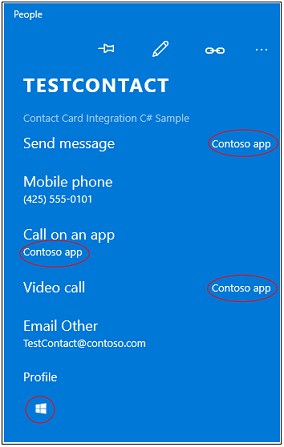

# <a name="connect-your-app-to-actions-on-a-contact-card"></a>Подключение приложения к действиям в карточках контактов

Ваше приложение может отображаться рядом с действиями на карточке контакта или свернутой карточке контакта. Пользователи могут выбрать действие, выполняемое вашим приложением, например открытие страницы профиля, совершение вызова или отправку сообщения.


Для начала найдите существующие контакты или создайте новые. Затем создайте *аннотацию* и несколько записей в манифесте пакета для описания поддерживаемых приложением действий. Затем напишите код для выполнения действий.

Более подробный пример см. в разделе [Пример интеграции с карточкой контакта](https://github.com/Microsoft/Windows-universal-samples/tree/master/Samples/ContactCardIntegration).

## <a name="find-or-create-a-contact"></a>Поиск и создание контакта

Если ваше приложение служит для общения, найдите контакты в Windows и добавьте к ним аннотации. Если ваше приложение управляет контактами, вы можете внести их в список контактов Windows, а затем добавить к ним аннотации.

### <a name="find-a-contact"></a>Поиск контакта

Найдите контакты по имени, адресу электронной почты или номеру телефона.

```cs
ContactStore contactStore = await ContactManager.RequestStoreAsync();

IReadOnlyList<Contact> contacts = null;

contacts = await contactStore.FindContactsAsync(emailAddress);

Contact contact = contacts[0];
```

### <a name="create-a-contact"></a>Создание контакта

Если ваше приложение больше напоминает адресную книгу, создайте контакты и добавьте их в список контактов.

```cs
Contact contact = new Contact();
contact.FirstName = "TestContact";

ContactEmail email = new ContactEmail();
email.Address = "TestContact@contoso.com";
email.Kind = ContactEmailKind.Other;
contact.Emails.Add(email);

ContactPhone phone = new ContactPhone();
phone.Number = "4255550101";
phone.Kind = ContactPhoneKind.Mobile;
contact.Phones.Add(phone);

ContactStore store = await
    ContactManager.RequestStoreAsync(ContactStoreAccessType.AppContactsReadWrite);

ContactList contactList;

IReadOnlyList<ContactList> contactLists = await store.FindContactListsAsync();

if (0 == contactLists.Count)
    contactList = await store.CreateContactListAsync("TestContactList");
else
    contactList = contactLists[0];

await contactList.SaveContactAsync(contact);

```

## <a name="tag-each-contact-with-an-annotation"></a>Маркировка каждого контакта с помощью аннотаций

Пометьте каждый контакт списком действий (операций), которые может выполнять приложение (например, видеовызовы и обмен сообщениями).

Затем свяжите идентификатор контакта с идентификатором, который приложение использует внутренне для определения этого пользователя.

```cs
ContactAnnotationStore annotationStore = await
   ContactManager.RequestAnnotationStoreAsync(ContactAnnotationStoreAccessType.AppAnnotationsReadWrite);

ContactAnnotationList annotationList;

IReadOnlyList<ContactAnnotationList> annotationLists = await annotationStore.FindAnnotationListsAsync();
if (0 == annotationLists.Count)
    annotationList = await annotationStore.CreateAnnotationListAsync();
else
    annotationList = annotationLists[0];

ContactAnnotation annotation = new ContactAnnotation();
annotation.ContactId = contact.Id;
annotation.RemoteId = "user22";

annotation.SupportedOperations = ContactAnnotationOperations.Message |
  ContactAnnotationOperations.AudioCall |
  ContactAnnotationOperations.VideoCall |
 ContactAnnotationOperations.ContactProfile;

await annotationList.TrySaveAnnotationAsync(annotation);
```

## <a name="register-for-each-operation"></a>Регистрация каждой операции

В манифесте пакета зарегистрируйте каждую операцию, указанную в аннотации.

Выполните регистрацию путем добавления обработчиков протоколов в элемент ``Extensions`` манифеста.

```xml
<Extensions>
  <uap:Extension Category="windows.protocol">
    <uap:Protocol Name="ms-contact-profile">
      <uap:DisplayName>TestProfileApp</uap:DisplayName>
    </uap:Protocol>
  </uap:Extension>
  <uap:Extension Category="windows.protocol">
    <uap:Protocol Name="ms-ipmessaging">
      <uap:DisplayName>TestMsgApp</uap:DisplayName>
    </uap:Protocol>
  </uap:Extension>
  <uap:Extension Category="windows.protocol">
    <uap:Protocol Name="ms-voip-video">
      <uap:DisplayName>TestVideoApp</uap:DisplayName>
    </uap:Protocol>
  </uap:Extension>
  <uap:Extension Category="windows.protocol">
    <uap:Protocol Name="ms-voip-call">
      <uap:DisplayName>TestCallApp</uap:DisplayName>
    </uap:Protocol>
  </uap:Extension>
</Extensions>
```
Вы также можете добавить их на вкладку **Объявления** конструктора манифестов в Visual Studio.


## <a name="find-your-app-next-to-actions-in-a-contact-card"></a>Поиск приложения рядом с действиями на карточке контакта

Откройте приложение "Люди". Ваше приложение отображается рядом с каждым действием (операцией), указанным в аннотации и манифесте пакета.



Если пользователь выбрал ваше приложение для выполнения действия, оно отобразится как приложение по умолчанию для этого действия, когда пользователь откроет карточку контакта в следующий раз.

## <a name="find-your-app-next-to-actions-in-a-mini-contact-card"></a>Поиск приложения рядом с действиями на свернутой карточке контакта

В свернутых карточках контакта ваше приложение появляется на вкладках, представляющих действия.


Такие приложения, как **Почта**, открывают свернутые карточки контактов. Ваше приложение тоже может их открывать. В данном примере кода показано, как это делается.

```cs
public async void OpenContactCard(object sender, RoutedEventArgs e)
{
    // Get the selection rect of the button pressed to show contact card.
    FrameworkElement element = (FrameworkElement)sender;

    Windows.UI.Xaml.Media.GeneralTransform buttonTransform = element.TransformToVisual(null);
    Windows.Foundation.Point point = buttonTransform.TransformPoint(new Windows.Foundation.Point());
    Windows.Foundation.Rect rect =
        new Windows.Foundation.Rect(point, new Windows.Foundation.Size(element.ActualWidth, element.ActualHeight));

   // helper method to find a contact just for illustrative purposes.
    Contact contact = await findContact("contoso@contoso.com");

    ContactManager.ShowContactCard(contact, rect, Windows.UI.Popups.Placement.Default);

}
```

Дополнительные примеры со свернутыми карточками контактов см. в разделе [Пример с карточками контактов](https://github.com/Microsoft/Windows-universal-samples/tree/master/Samples/ContactCards).

Как и в случае с карточкой контакта, на каждой вкладке запоминается последнее использованное приложение, что упрощает возврат к приложению.

## <a name="perform-operations-when-users-select-your-app-in-a-contact-card"></a>Выполнение операций при выборе приложения пользователем в карточке контакта

Переопределите метод [Application.OnActivated](https://msdn.microsoft.com/library/windows/apps/br242330) в файле **App.cs** и переведите пользователя на страницу в приложении. В [примере интеграции с карточкой контакта](https://github.com/Microsoft/Windows-universal-samples/tree/master/Samples/ContactCardIntegration) показан один из способов сделать это.

В коде файла страницы переопределите метод [Page.OnNavigatedTo](https://msdn.microsoft.com/library/windows/apps/windows.ui.xaml.controls.page.onnavigatedto.aspx). Карточка контакта передает этому методу название операции и идентификатор пользователя.

См. [пример с VoIP](https://github.com/Microsoft/Windows-universal-samples/tree/master/Samples/VoIP), чтобы начать видеовызов или звонок. Полноценный API можно найти в пространстве имен [WIndows.ApplicationModel.Calls](https://msdn.microsoft.com/library/windows/apps/windows.applicationmodel.calls.aspx).

Способ упрощения обмена сообщениями см. в пространстве имен [Windows.ApplicationModel.Chat](https://msdn.microsoft.com/library/windows/apps/windows.applicationmodel.chat.aspx).

Вы также можете запустить другое приложение. Вот что делает этот код.

```cs
protected override async void OnNavigatedTo(NavigationEventArgs e)
{
    base.OnNavigatedTo(e);

    var args = e.Parameter as ProtocolActivatedEventArgs;
    // Display the result of the protocol activation if we got here as a result of being activated for a protocol.

    if (args != null)
    {
        var options = new Windows.System.LauncherOptions();
        options.DisplayApplicationPicker = true;

        options.TargetApplicationPackageFamilyName = “ContosoApp”;

        string launchString = args.uri.Scheme + ":" + args.uri.Query;
        var launchUri = new Uri(launchString);
        await Windows.System.Launcher.LaunchUriAsync(launchUri, options);
    }
}
```

Свойство ```args.uri.scheme``` содержит название операции, а свойство ```args.uri.Query```— идентификатор пользователя.
