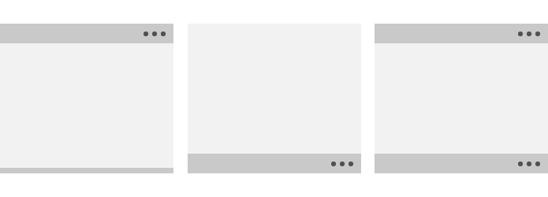

# Панель приложения и панель команд

Панели команд (также называемые "панели приложения") предоставляют пользователям удобный доступ к самым распространенным задачам приложения и могут использоваться для отображения команд или параметров, относящихся к пользовательскому контексту, например к выбору фотографий или режиму рисования. Кроме того, они могут служить для навигации по страницам или разделам приложения. Панели команд можно использовать с любым шаблоном навигации.


<span class="sidebar_heading" style="font-weight: bold;">Важные API</span>

-   [**CommandBar **](https://msdn.microsoft.com/library/windows/apps/windows.ui.xaml.controls.commandbar.aspx)
-   [**AppBarButton**](https://msdn.microsoft.com/library/windows/apps/windows.ui.xaml.controls.appbarbutton.aspx)
-   [**AppBarToggleButton**](https://msdn.microsoft.com/library/windows/apps/windows.ui.xaml.controls.appbartogglebutton.aspx)
-   [**AppBarSeparator**](https://msdn.microsoft.com/library/windows/apps/windows.ui.xaml.controls.appbarseparator.aspx)

## Выбор правильного элемента управления

CommandBar — это гибкий облегченный элемент управления общего назначения, способный отображать как сложное содержимое, такое как изображения и текстовые блоки, так и простые команды, такие как элементы управления [AppBarButton](https://msdn.microsoft.com/library/windows/apps/windows.ui.xaml.controls.appbarbutton.aspx), [AppBarToggleButton](https://msdn.microsoft.com/library/windows/apps/windows.ui.xaml.controls.appbartogglebutton.aspx) и [AppBarSeparator](https://msdn.microsoft.com/library/windows/apps/windows.ui.xaml.controls.appbarseparator.aspx).

XAML одновременно поддерживает элементы управления AppBar и CommandBar. Элемент AppBar следует использовать, только если вы выполняете обновление универсального приложения для Windows 8, использующего AppBar, и хотите свести изменения к минимуму. Для новых приложений Windows 10 рекомендуется использовать элемент управления CommandBar. В этом документе предполагается, что вы используете элемент управления CommandBar.

## Примеры
Расширенная панель команд в приложении Фотографии (Майкрософт).


Панель команд в Календаре Outlook на Windows Phone.


## Структура

По умолчанию панель команд отображает строку кнопок со значками и необязательную кнопку "Дополнительно", которая отображается в виде трех точек (\[•••\]). Так выглядит панель команд, созданная с помощью кода из примера, показанного ниже. Она отображается в закрытом компактном состоянии.


Панель команд также может отображаться в закрытом минимальном представлении, которое выглядит следующим образом. Дополнительную информацию можно найти в разделе [Открытое и закрытое состояние](#open-and-closed-states).


Так выглядит эта же панель команд в открытом состоянии. Подписями обозначены основные компоненты элемента управления.


Панель команд разделена на четыре основных области:
- Кнопка "Дополнительно" (\[•••\]) отображается в правой части панели. Кнопка "Дополнительно" \[•••\] выполняет две функции: отображает подписи на кнопках основных команд и открывает меню переполнения, если присутствуют вспомогательные команды. Кнопка не будет видна при отсутствии вспомогательных команд и скрытых подписей. Свойство [
              `OverflowButtonVisibility`
            ](https://msdn.microsoft.com/library/windows/apps/windows.ui.xaml.controls.commandbar.overflowbuttonvisibility.aspx) позволяет приложениям менять это поведение по умолчанию с автоматическим скрытием.
- Область содержимого находится в левой части панели. Она отображается, если заполнено значение свойства `Content`.
- Область главных команд выровнена по правому краю панели и расположена рядом с кнопкой "Дополнительно" (\[•••\]). Она отображается, если заполнено значение свойства `PrimaryCommands`.  
- Меню переполнения отображается, только когда открыта панель команд и заполнено значение свойства `SecondaryCommands`. 

Элементы макета отображаются в обратном порядке, когда для свойства [FlowDirection]() указано значение **RightToLeft**.

## Создание панели команд
В этом примере создается панель команд, показанная ранее.

```xaml
<CommandBar>
    <AppBarToggleButton Icon="Shuffle" Label="Shuffle" Click="AppBarButton_Click" />
    <AppBarToggleButton Icon="RepeatAll" Label="Repeat" Click="AppBarButton_Click"/>
    <AppBarSeparator/>
    <AppBarButton Icon="Back" Label="Back" Click="AppBarButton_Click"/>
    <AppBarButton Icon="Stop" Label="Stop" Click="AppBarButton_Click"/>
    <AppBarButton Icon="Play" Label="Play" Click="AppBarButton_Click"/>
    <AppBarButton Icon="Forward" Label="Forward" Click="AppBarButton_Click"/>

    <CommandBar.SecondaryCommands>
        <AppBarButton Icon="Like" Label="Like" Click="AppBarButton_Click"/>
        <AppBarButton Icon="Dislike" Label="Dislike" Click="AppBarButton_Click"/>
    </CommandBar.SecondaryCommands>

    <CommandBar.Content>
        <TextBlock Text="Now playing..." Margin="12,14"/>
    </CommandBar.Content>
</CommandBar>
```

## Команды и содержимое
Элемент управления CommandBar имеет три свойства, которые можно использовать для добавления команд и содержимого: [**PrimaryCommands**](https://msdn.microsoft.com/library/windows/apps/xaml/windows.ui.xaml.controls.commandbar.primarycommands.aspx), [**SecondaryCommands**](https://msdn.microsoft.com/library/windows/apps/xaml/windows.ui.xaml.controls.commandbar.secondarycommands.aspx) и [**Content**](https://msdn.microsoft.com/library/windows/apps/xaml/windows.ui.xaml.controls.contentcontrol.content.aspx).


### Основные действия и область переполнения

По умолчанию элементы, добавляемые вами на панель команд, добавляются в коллекцию **PrimaryCommands**. Такие команды отображаются слева от кнопки "Дополнительно" (\[•••\]) в области, называемой пространством действий. Поместите в пространство действий самые важные команды (те, которые должны оставаться видимыми на панели). На самых маленьких экранах (шириной в 320 эффективных пикселей) в пространство действий панели команд умещаются не более 4 элементов.

Вы можете также добавлять команды в коллекцию **SecondaryCommands**, и эти элементы будут отображаться в области переполнения. Разместите менее важные команды в области переполнения.

Стиль области переполнения отличается от стиля панели. Вы можете настроить оформление, установив свойство [**CommandBarOverflowPresenterStyle**](https://msdn.microsoft.com/library/windows/apps/xaml/windows.ui.xaml.controls.commandbar.commandbaroverflowpresenterstyle.aspx) класса [Style](https://msdn.microsoft.com/library/windows/apps/xaml/windows.ui.xaml.style.aspx) для [**CommandBarOverflowPresenter**](https://msdn.microsoft.com/library/windows/apps/xaml/windows.ui.xaml.controls.commandbaroverflowpresenter.aspx).

При необходимости вы можете перемещать команды между PrimaryCommands и SecondaryCommands программным путем. 

### Кнопки панели приложения

Свойствам PrimaryCommands и SecondaryCommands можно установить только значения [**AppBarButton**](https://msdn.microsoft.com/library/windows/apps/xaml/windows.ui.xaml.controls.appbarbutton.aspx), [**AppBarToggleButton**](https://msdn.microsoft.com/library/windows/apps/xaml/windows.ui.xaml.controls.appbartogglebutton.aspx) и [**AppBarSeparator**](https://msdn.microsoft.com/library/windows/apps/xaml/windows.ui.xaml.controls.appbarseparator.aspx), соответствующие командным элементам. Эти элементы управления оптимизированы для использования на панели команд и меняют свой вид в зависимости от того, используется ли элемент управления в пространстве действий или в области переполнения.

Кнопки панели приложения характеризуются значком и соответствующей меткой. Они имеют два размера: обычный и компактный. По умолчанию текстовая метка отображается. Если для свойства [**IsCompact**](https://msdn.microsoft.com/library/windows/apps/xaml/windows.ui.xaml.controls.appbarbutton.iscompact.aspx) установлено значение **true**, текстовая метка скрывается. При использовании кнопки в элементе управления CommandBar, панель команд автоматически перезаписывает свойство IsCompact кнопки при открытии и закрытии панели команд.

Для размещения подписей кнопок панели приложения справа от значков приложение может использовать новое свойство CommandBar [`DefaultLabelPosition`](https://msdn.microsoft.com/library/windows/apps/windows.ui.xaml.controls.commandbar.defaultlabelposition.aspx). Перемещение подписей отдельных кнопок панели приложения невозможно, это необходимо делать для панели команд в целом.
```xaml
<CommandBar DefaultLabelPosition="Right">
    <AppBarToggleButton Icon="Shuffle" Label="Shuffle"/>
    <AppBarToggleButton Icon="RepeatAll" Label="Repeat"/>
</CommandBar>
```

Вот как этот фрагмент кода выглядит при отображении приложением.


При размещении кнопки панели приложения в меню переполнения (SecondaryCommands), она отображается только в виде текста. Далее показан один и тот же переключатель панели приложения, размещенный в пространстве действий в качестве основной команды (вверху) и в области переполнения в качестве второстепенной команды (внизу).


- *Если существует команда, которая будет доступна на всех страницах, лучше разместить ее в одном и том же месте.*
- *Рекомендуется располагать команды "Принять", "Да" и "ОК" слева от команд "Отклонить", "Нет" и "Отмена". Такая последовательность позволяет пользователям уверенно перемещаться по системе и применять полученный опыт навигации в разных приложениях.*

### Метки кнопок

Мы рекомендуем использовать короткие метки кнопок на панели приложения, желательно не более одного слова. Длинные метки, расположенные под значком кнопки панели приложения, будут переноситься на несколько строк, увеличивая общую высоту открытой панели команд. Вы можете включить в текст метки символ мягкого переноса (0x00AD), чтобы обозначить границу знака, после которой должен происходить разрыв слова. В XAML это выражается с помощью escape-последовательности следующим образом:

```xaml
<AppBarButton Icon="Back" Label="Areally&#x00AD;longlabel"/>
```

При переносе текста метки в указанном месте она выглядит следующим образом.


### Другое содержимое

Вы можете добавить в область содержимого любые элементы XAML, установив свойство **Content**. Если необходимо добавить более одного элемента, вам понадобится разместить элементы в контейнере панели и сделать панель единственным дочерним элементом свойства Content.

При одновременном наличии основных команд и содержимого основные команды имеют приоритет, что может привести к обрезанию содержимого. 

Когда для свойства [**ClosedDisplayMode**](https://msdn.microsoft.com/library/windows/apps/xaml/windows.ui.xaml.controls.appbar.closeddisplaymode.aspx) установлено значение **Compact**, содержимое может быть обрезано, если оно больше компактной панели команд по размеру. Вы должны обрабатывать события [**Opening**](https://msdn.microsoft.com/library/windows/apps/xaml/windows.ui.xaml.controls.appbar.opening.aspx) и [**Closed**](https://msdn.microsoft.com/library/windows/apps/xaml/windows.ui.xaml.controls.appbar.closed.aspx), чтобы отображать и скрывать части пользовательского интерфейса в области содержимого так, чтобы они не обрезались. Дополнительную информацию можно найти в разделе [Открытое и закрытое состояние](#open-and-closed-states).

## Открытое и закрытое состояние

Панель команд может быть открыта или закрыта. Пользователь может переключиться между этими состояниями, выбрав кнопку "Дополнительно" \[•••\]. Вы можете переключаться между ними программным способом, установив свойство [**IsOpen**](https://msdn.microsoft.com/library/windows/apps/xaml/windows.ui.xaml.controls.appbar.isopen.aspx). В открытом состоянии кнопки основных команд отображаются с текстовыми метками, а меню переполнения открыто, если присутствуют вспомогательные команды, как показано ранее.

События [**Opening**](https://msdn.microsoft.com/library/windows/apps/xaml/windows.ui.xaml.controls.appbar.opening.aspx), [**Opened**](https://msdn.microsoft.com/library/windows/apps/xaml/windows.ui.xaml.controls.appbar.opened.aspx), [**Closing**](https://msdn.microsoft.com/library/windows/apps/xaml/windows.ui.xaml.controls.appbar.closing.aspx) и [**Closed**](https://msdn.microsoft.com/library/windows/apps/xaml/windows.ui.xaml.controls.appbar.closed.aspx) позволяют реагировать на открытие и закрытие панели команд.  
- События Opening и Closing возникают до начала анимации перехода.
- События Opened и Closed возникают после завершения перехода.

В этом примере событий Opening и Closing используются для изменения уровня прозрачности панели команд. Если панель команд закрыта, она становится полупрозрачной, чтобы был виден фон приложения. Если панель команд открыта, она становится непрозрачной, чтобы сосредоточить внимание пользователя на командах.

```xaml
<CommandBar Opening="CommandBar_Opening"
            Closing="CommandBar_Closing">
    <AppBarButton Icon="Accept" Label="Accept"/>
    <AppBarButton Icon="Edit" Label="Edit"/>
    <AppBarButton Icon="Save" Label="Save"/>
    <AppBarButton Icon="Cancel" Label="Cancel"/>
</CommandBar>
```

```csharp
private void CommandBar_Opening(object sender, object e)
{
    CommandBar cb = sender as CommandBar;
    if (cb != null) cb.Background.Opacity = 1.0;
}

private void CommandBar_Closing(object sender, object e)
{
    CommandBar cb = sender as CommandBar;
    if (cb != null) cb.Background.Opacity = 0.5;
}

```

### ClosedDisplayMode

Вы можете управлять отображением панели в закрытом состоянии, установив свойство [**ClosedDisplayMode**](https://msdn.microsoft.com/library/windows/apps/xaml/windows.ui.xaml.controls.appbar.closeddisplaymode.aspx). Вы можете выбрать один из трех режимов отображения:
- **Compact**: режим по умолчанию. Отображается содержимое, значки основных команд без меток и кнопка "Дополнительно" (\[•••\]).
- **Minimal**: отображается только тонкая панель, действующая как кнопка "Дополнительно" (\[•••\]). Пользователь может открыть панель нажатием в любом месте панели.
- **Hidden**: панель команд в закрытом состоянии не отображается. Это может быть полезно для отображения контекстно-зависимых команд с помощью встроенной панели команд. В этом случае следует открыть панель команд программным способом, установив свойство **IsOpen** или изменив значение свойства ClosedDisplayMode на **Minimal** или **Compact**.

В этом примере панель команд используется для отображения простых команд форматирования для [RichEditBox](https://msdn.microsoft.com/library/windows/apps/xaml/windows.ui.xaml.controls.richeditbox.aspx). Когда поле ввода не имеет фокуса, команды форматирования могут отвлекать, поэтому они скрыты. При использовании поля ввода значение свойства панели команд ClosedDisplayMode меняется на Compact, чтобы отобразить команды форматирования.

```xaml
<StackPanel Width="300"
            GotFocus="EditStackPanel_GotFocus"
            LostFocus="EditStackPanel_LostFocus">
    <CommandBar x:Name="FormattingCommandBar" ClosedDisplayMode="Hidden">
        <AppBarButton Icon="Bold" Label="Bold" ToolTipService.ToolTip="Bold"/>
        <AppBarButton Icon="Italic" Label="Italic" ToolTipService.ToolTip="Italic"/>
        <AppBarButton Icon="Underline" Label="Underline" ToolTipService.ToolTip="Underline"/>
    </CommandBar>
    <RichEditBox Height="200"/>
</StackPanel>
```

```csharp
private void EditStackPanel_GotFocus(object sender, RoutedEventArgs e)
{
    FormattingCommandBar.ClosedDisplayMode = AppBarClosedDisplayMode.Compact;
}

private void EditStackPanel_LostFocus(object sender, RoutedEventArgs e)
{
    FormattingCommandBar.ClosedDisplayMode = AppBarClosedDisplayMode.Hidden;
}
```

>**Примечание**
            &nbsp;&nbsp;В данном примере не рассматривается реализация команд редактирования. Дополнительные сведения см. в статье [RichEditBox](rich-edit-box.md).

Несмотря на то, что режимы Minimal и Hidden могут быть полезны в некоторых ситуациях, необходимо помнить о том, что сокрытие всех действий может поставить пользователя в замешательство.

Изменение значения ClosedDisplayMode для предоставления пользователю подсказки влияет на расположение окружающих элементов. Смена состояния панели команд с закрытого на открытое и обратно не влияет на расположение других элементов.

### IsSticky

Если пользователь взаимодействует с любой частью приложения за пределами панели команд после ее открытия, меню переполнения закрывается, а метки скрываются. Такое закрытие элемента управления называется *исчезновением*. Вы можете управлять исчезновением панели, установив свойство [**IsSticky**](https://msdn.microsoft.com/library/windows/apps/xaml/windows.ui.xaml.controls.appbar.issticky.aspx). Если панель закреплена (`IsSticky="true"`), она не закрывается жестом исчезновения. Панель остается открытой, пока пользователь не нажмет кнопку "Дополнительно" (\[•••\]) или не выберет элемент в меню переполнения (при наличии).

## Рекомендации

### Размещение

Панели команд можно размещать в верхней части окна приложения, в нижней части окна приложения и во встроенном режиме.



-   Для небольших наладонных устройств мы рекомендуем размещать панели команд в нижней части экрана для удобства доступа.
-   В случае устройств с большими экранами, если вы размещаете только одну панель команд, мы рекомендуем поместить ее в верхней части окна.
Используйте API [**DiagonalSizeInInches**](https://msdn.microsoft.com/library/windows/apps/windows.graphics.display.displayinformation.diagonalsizeininches.aspx) для определения физических размеров экрана.

Панели команд можно размещать в следующих областях экранов с одним представлением (пример слева) и с несколькими представлениями (пример справа). Встроенные панели команд можно размещать в любом месте пространства действий.


>**Сенсорные устройства**: если панель команд должна остаться видимой пользователю при появлении сенсорной клавиатуры или панели функционального ввода, вы можете назначить значение панели команд свойству `BottomAppBar` класса Page, и панель будет перемещена и останется видимой. В противном случае следует встроить панель команд и позиционировать ее относительно содержимого приложения.

### Действия

Назначьте приоритет для действий, входящих в панель команд, на основе их видимости.

-   Поместите наиболее важные команды (те, которые должны оставаться видимыми на панели) в первые несколько ячеек пространства действий. На самых маленьких экранах (шириной в 320 epx) в пространстве действий панели команд помещается 2–4 элемента, в зависимости от остальных элементов пользовательского интерфейса на экране.
-   Разместите менее важные команды далее в пространстве действий панели или в первых нескольких ячейках области переполнения. Эти команды будут видимыми, если для панели будет достаточно экранного пространства, а при нехватке места они войдут в раскрывающееся меню области переполнения.
-   Разместите наименее важные команды в области переполнения. Эти команды всегда будут отображаться в раскрывающемся меню.

Если существует команда, которая будет доступна на всех страницах, лучше разместить ее в одном и том же месте. Рекомендуется располагать команды "Принять", "Да" и "ОК" слева от команд "Отклонить", "Нет" и "Отмена". Такая последовательность позволяет пользователям сохранять уверенность при перемещении по системе и применять полученный опыт навигации в разных приложениях.

Несмотря на то, что вы можете разместить все действия в области переполнения, чтобы на панели команд отображалась только кнопка \[•••\], помните, что сокрытие всех действий может ввести пользователя в замешательство.

### Всплывающие элементы панели команд

Используйте логическую группировку команд. Например, поместите команды "Ответить", "Ответить всем" и "Переслать" в меню "Ответ". Хотя обычно кнопка панели приложения активирует одну команду, ее можно использовать для отображения элемента [**MenuFlyout**](https://msdn.microsoft.com/library/windows/apps/windows.ui.xaml.controls.menuflyout.aspx) или [**Flyout**](https://msdn.microsoft.com/library/windows/apps/windows.ui.xaml.controls.flyout.aspx) с пользовательским содержимым.


### Меню переполнения


-   Меню переполнения представлено кнопкой "Дополнительно" (\[•••\]), которая служит видимой точкой входа в меню. Оно расположено в правом конце панели инструментов рядом с основными действиями.
-   Область переполнения выделена для действий, которые пользователь использует реже.
-   Действия могут появляться и исчезать между основным пространством действий и меню переполнения в точках останова. Можно также указывать действия как всегда отображающиеся в основном пространстве действий независимо от размера экрана или окна приложения.
-   Редко используемые действия могут оставаться в меню переполнения, даже если панель приложения развернута на больших экранах.

## Адаптируемость

-   В книжной и в альбомной ориентации на панели приложения должно быть видно одинаковое число действий, что упрощает пользователю восприятие информации. Количество доступных действий должно определяться шириной устройства в книжной ориентации.
-   На устройствах с небольшими экранами, которыми часто пользуются одной рукой, панели приложений следует размещать в нижней части экрана.
-   На более крупных экранах панели приложений следует размещать ближе к верхней части окна, чтобы сделать их заметнее.
-   Нацеливая точки останова, вы можете помещать действия в меню и извлекать их из него при изменении размера экрана или окна приложения.
-   Нацеливая диагональ экрана, вы можете изменять расположение панели приложения в зависимости от размера экрана устройства.
-   Попробуйте переместить метки вправо от значков кнопок панели приложения, чтобы улучшить восприятие. Подписи в нижней части требуют от пользователя открытия панели команд для их отображения, тогда как при расположении справа подписи видны, даже если панель команд закрыта. Эта оптимизация хорошо себя проявляет в более широких окнах.

## Статьи по теме

**Для дизайнеров**
            
          
            [Основы проектирования команд в приложениях UWP](https://msdn.microsoft.com/library/windows/apps/dn958433)

**Для разработчиков (XAML)**
            
          
            [
              **CommandBar**
            ](https://msdn.microsoft.com/library/windows/apps/dn279427)


<!--HONumber=Jun16_HO3-->


