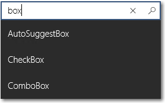
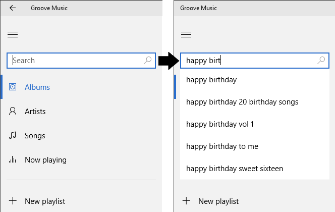
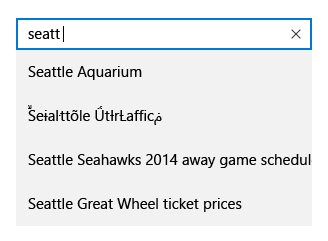

# Поле автозаполнения
Используйте AutoSuggestBox, чтобы предоставить список предложений, из которых пользователь может выбрать нужное по мере набора.



<span class="sidebar_heading" style="font-weight: bold;">Важные API</span>

-   [**Класс AutoSuggestBox**](https://msdn.microsoft.com/library/windows/apps/xaml/windows.ui.xaml.controls.autosuggestbox.aspx)
-   [**Событие TextChanged**](https://msdn.microsoft.com/library/windows/apps/xaml/windows.ui.xaml.controls.autosuggestbox.textchanged.aspx)
-   [**Событие SuggestionChose**](https://msdn.microsoft.com/library/windows/apps/xaml/windows.ui.xaml.controls.autosuggestbox.suggestionchosen.aspx)
-   [**Событие QuerySubmitted**](https://msdn.microsoft.com/library/windows/apps/xaml/windows.ui.xaml.controls.autosuggestbox.querysubmitted.aspx)

## Это подходящий элемент управления?

Если вам нужен простой настраиваемый элемент управления, который обеспечивает текстовый поиск со списком предложений, выберите поле автозаполнения.

Дополнительные сведения о выборе подходящего элемента управления текстом можно найти в статье [Элементы управления текстом](text-controls.md).

## Примеры

Поле автозаполнения в приложении "Музыка Groove".



## Структура
Точка входа для поля автозаполнения состоит из необязательного заголовка и текстового поля с необязательной подсказкой:


Список результатов автозаполнения заполняется автоматически, как только пользователь начинает вводить текст. Список результатов может отображаться над текстовым полем или под ним. Появляется кнопка «Очистить все».



## Создайте поле автозаполнения

Для использования AutoSuggestBox необходимо ответить на 3 действия пользователя.

- Изменение текста — обновляйте список предложений при вводе текста пользователем.
- Выбор предложения — обновите текстовое поле при выборе пользователем предложения из списка вариантов.
- Отправка запроса — отобразите результаты запроса при отправке запроса пользователем.

### Изменение текста

Событие [**TextChanged**](https://msdn.microsoft.com/library/windows/apps/xaml/windows.ui.xaml.controls.autosuggestbox.textchanged.aspx) возникает, когда обновляется содержимое текстового поля. Используйте свойство [Причина](https://msdn.microsoft.com/library/windows/apps/xaml/windows.ui.xaml.controls.autosuggestboxtextchangedeventargs.reason.aspx) аргументов события, чтобы определить, было ли изменение внесено пользователем. Если причиной изменения является **UserInput**, отфильтруйте данные на основе введенных данных. После этого установите отфильтрованные данные как свойство [ItemsSource](https://msdn.microsoft.com/library/windows/apps/xaml/windows.ui.xaml.controls.itemscontrol.itemssource.aspx) элемента AutoSuggestBox для обновления списка предложений.

Для управления отображением элементов в списке предложений можно использовать [DisplayMemberPath](https://msdn.microsoft.com/library/windows/apps/xaml/windows.ui.xaml.controls.itemscontrol.displaymemberpath.aspx) или [ItemTemplate](https://msdn.microsoft.com/library/windows/apps/xaml/windows.ui.xaml.controls.itemscontrol.itemtemplate.aspx).

- Для отображения текста одного свойства элемента данных задайте свойство DisplayMemberPath, чтобы выбрать, какое свойство объекта отображать в списке предложений.
- Для определения пользовательского вида каждого элемента в списке используйте свойство ItemTemplate.

### Выбор предложения

Когда пользователь переходит с помощью клавиатуры по списку предложений, необходимо обновлять текст в текстовом поле соответствующим образом.

Вы можете настроить свойство [TextMemberPath](https://msdn.microsoft.com/library/windows/apps/xaml/windows.ui.xaml.controls.autosuggestbox.textmemberpath.aspx), чтобы выбрать, какое свойство объекта данных отображать в текстовом поле. Если вы определяете TextMemberPath, то текстовое поле обновляется автоматически. Обычно необходимо указать одно и то же значение DisplayMemberPath и TextMemberPath, чтобы текст совпадал в списке предложений и текстовом поле.

Если нужно отобразить нечто большее, чем простое свойство, обработайте событие [SuggestionChosen](https://msdn.microsoft.com/library/windows/apps/xaml/windows.ui.xaml.controls.autosuggestbox.suggestionchosen.aspx), чтобы заполнить текстовое поле пользовательским текстом на основе выбранного элемента.

### Отправка запроса

Обработайте событие [QuerySubmitted](https://msdn.microsoft.com/library/windows/apps/xaml/windows.ui.xaml.controls.autosuggestbox.querysubmitted.aspx), чтобы выполнить соответствующий приложению запрос и показать пользователю результат.

Событие QuerySubmitted происходит, когда пользователь отправляет строку запроса. Пользователь может отправить запрос одним из следующих способов.
- Нажать клавишу ВВОД или щелкнуть значок запроса, в то время как фокус находится в текстовом поле. Свойство аргумента события [ChosenSuggestion](https://msdn.microsoft.com/library/windows/apps/xaml/windows.ui.xaml.controls.autosuggestboxquerysubmittedeventargs.chosensuggestion.aspx) — **null**.
- Нажать клавишу ВВОД, щелкнуть или нажать элемент, в то время как фокус находится в списке предложений. Свойство аргумента события ChosenSuggestion содержит элемент, который был выбран в списке.

Во всех случаях свойство аргумента [QueryText](https://msdn.microsoft.com/library/windows/apps/xaml/windows.ui.xaml.controls.autosuggestboxquerysubmittedeventargs.querytext.aspx) содержит текст из текстового поля. 

### Использование AutoSuggestBox для поиска

Используйте AutoSuggestBox, чтобы предоставить список предложений, из которых пользователь может выбрать нужный по мере набора.

По умолчанию поле ввода текста не имеет кнопки запроса. Вы можете настроить свойство [QueryIcon](https://msdn.microsoft.com/library/windows/apps/xaml/windows.ui.xaml.controls.autosuggestbox.queryicon.aspx), чтобы добавить кнопку с выбранным значком справа от текстового поля. Например, чтобы AutoSuggestBox выглядело как типичное поле поиска, добавьте значок поиска.

```xaml
<AutoSuggestBox QueryIcon="Find"/>
```

Вот пример AutoSuggestBox со значком поиска.


## Образцы

Полные рабочие примеры AutoSuggestBox см. в статье [Пример переноса AutoSuggestBox](http://go.microsoft.com/fwlink/p/?LinkId=619996) и [Пример базовых характеристик пользовательского интерфейса XAML](http://go.microsoft.com/fwlink/p/?LinkId=619992).

Вот простой класс AutoSuggestBox с необходимыми обработчиками событий.

```xaml
<AutoSuggestBox PlaceholderText="Search" QueryIcon="Find" Width="200"
                TextChanged="AutoSuggestBox_TextChanged"
                QuerySubmitted="AutoSuggestBox_QuerySubmitted"
                SuggestionChosen="AutoSuggestBox_SuggestionChosen"/>
```

```csharp
private void AutoSuggestBox_TextChanged(AutoSuggestBox sender, AutoSuggestBoxTextChangedEventArgs args)
{
    // Only get results when it was a user typing, 
    // otherwise assume the value got filled in by TextMemberPath 
    // or the handler for SuggestionChosen.
    if (args.Reason == AutoSuggestionBoxTextChangeReason.UserInput)
    {
        //Set the ItemsSource to be your filtered dataset
        //sender.ItemsSource = dataset;
    }
}


private void AutoSuggestBox_SuggestionChosen(AutoSuggestBox sender, AutoSuggestBoxSuggestionChosenEventArgs args)
{
    // Set sender.Text. You can use args.SelectedItem to build your text string.
}


private void AutoSuggestBox_QuerySubmitted(AutoSuggestBox sender, AutoSuggestBoxQuerySubmittedEventArgs args)
{
    if (args.ChosenSuggestion != null)
    {
        // User selected an item from the suggestion list, take an action on it here.
    }
    else
    {
        // Use args.QueryText to determine what to do.
    }
}
```

## Рекомендации

-   Если используется поле автозаполнения и для введенного текста поиск не дает результатов, выводите вместо результатов строку сообщения "Результатов нет", чтобы пользователь знал, что поисковый запрос был выполнен.

    


## Связанные статьи

- [Элементы управления текстом](text-controls.md)
- [Проверка правописания](spell-checking-and-prediction.md)
- [Поиск](search.md)
- [**Класс TextBox**](https://msdn.microsoft.com/library/windows/apps/br209683)
- [**Класс Windows.UI.Xaml.Controls PasswordBox**](https://msdn.microsoft.com/library/windows/apps/br227519)
- [Свойство String.Length](https://msdn.microsoft.com/library/system.string.length(v=vs.110).aspx)


<!--HONumber=Jun16_HO3-->


