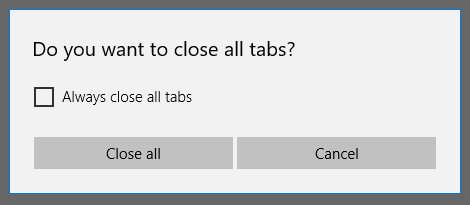

# <a name="buttons"></a>Кнопки
<link rel="stylesheet" href="https://az835927.vo.msecnd.net/sites/uwp/Resources/css/custom.css"> 

Кнопка предоставляет пользователю возможность вызвать немедленное действие.


<div class="important-apis" >
<b>Важные API</b><br/>
<ul>
<li>[**Класс Button**](https://msdn.microsoft.com/library/windows/apps/windows.ui.xaml.controls.button.aspx)</li>
<li>[**Класс RepeatButton**](https://msdn.microsoft.com/library/windows/apps/windows.ui.xaml.controls.primitives.repeatbutton.aspx)</li>
<li>[**Событие Click**](https://msdn.microsoft.com/library/windows/apps/windows.ui.xaml.controls.primitives.buttonbase.click.aspx)</li>
<li> </li>
<li> </li>
<li> </li>
</ul>
</div>

## <a name="is-this-the-right-control"></a>Выбор правильного элемента управления

Кнопка позволяет пользователю немедленно начать действие, например отправить форму.

Не используйте кнопку, когда вам нужно перейти на другую страницу — вместо нее используйте ссылку. Подробнее см. на странице [Гиперссылки](hyperlinks.md).
    
> Исключение: для навигации по мастеру используйте кнопки "Вперед" и "Назад". Для других видов навигации на уровень выше или ниже используйте кнопку "Назад".

## <a name="example"></a>Пример

В этом примере используются две кнопки — "Закрыть все" и "Отмена" — в диалоговом окне в браузере Microsoft Edge. 



## <a name="create-a-button"></a>Создание кнопки

В этом примере рассматривается реакция кнопки на щелчок. 

Создайте кнопку в XAML.

```xaml
<Button Content="Submit" Click="SubmitButton_Click"/>
```

Либо создайте кнопку в коде.

```csharp
Button submitButton = new Button();
submitButton.Content = "Submit";
submitButton.Click += SubmitButton_Click;

// Add the button to a parent container in the visual tree.
stackPanel1.Children.Add(submitButton);
```

Обработайте событие "Click".

```csharp
private async void SubmitButton_Click(object sender, RoutedEventArgs e)
{
    // Call app specific code to submit form. For example:
    // form.Submit();
    Windows.UI.Popups.MessageDialog messageDialog = 
        new Windows.UI.Popups.MessageDialog("Thank you for your submission.");
    await messageDialog.ShowAsync();
}
```

### <a name="button-interaction"></a>Взаимодействие с кнопкой

Если коснуться кнопки пальцем или стилусом либо навести на нее указатель и нажать левую кнопку мыши, кнопка вызывает событие [**Click**](https://msdn.microsoft.com/library/windows/apps/windows.ui.xaml.controls.primitives.buttonbase.click.aspx). Если для кнопки предусмотрен фокус клавиатуры, при нажатии клавиши ВВОД или ПРОБЕЛ также происходит вызов события "Click".

Как правило, нельзя обрабатывать низкоуровневые события [**PointerPressed**](https://msdn.microsoft.com/library/windows/apps/windows.ui.xaml.uielement.pointerpressed.aspx) с помощью элемента "Button", поскольку для него предусмотрено поведение "Click". Дополнительные сведения см. в разделе [Общие сведения о событиях и перенаправленных событиях](https://msdn.microsoft.com/en-us/library/windows/apps/mt185584.aspx).

Можно выбирать порядок вызова кнопкой события "Click" путем изменения свойства [**ClickMode**](https://msdn.microsoft.com/library/windows/apps/windows.ui.xaml.controls.primitives.buttonbase.clickmode.aspx). Значением ClickMode по умолчанию является **Release**. Если для параметра ClickMode выбрано значение **Hover**, событие "Click" невозможно вызвать нажатием клавиши или касанием. 


### <a name="button-content"></a>Содержимое кнопки

Кнопка представляет собой [**ContentControl**](https://msdn.microsoft.com/library/windows/apps/xaml/windows.ui.xaml.controls.contentcontrol.aspx). Ее свойство содержимого XAML — [**Content**](https://msdn.microsoft.com/library/windows/apps/xaml/windows.ui.xaml.controls.contentcontrol.content.aspx), благодаря чему возможно использование подобного синтаксиса для: `<Button>A button's content</Button>`. В качестве содержимого кнопки можно задать любой объект. Если содержимым является класс [UIElement](https://msdn.microsoft.com/library/windows/apps/xaml/windows.ui.xaml.uielement.aspx), он обрабатывается для просмотра в кнопке. Если содержимым является другой тип объекта, в кнопке отображается его строковое представление.

Здесь класс **StackPanel**, содержащий изображение банана и текст, задан в качестве содержимого кнопки.

```xaml
<Button Click="Button_Click" 
        Background="#FF0D6AA3" 
        Height="100" Width="80">
    <StackPanel>
        <Image Source="Assets/Slices.png" Height="62"/>
        <TextBlock Text="Orange"  Foreground="White"
                   HorizontalAlignment="Center"/>
    </StackPanel>
</Button>
```

Кнопка выглядит следующим образом.


## <a name="create-a-repeat-button"></a>Создание кнопки повтора

[**RepeatButton**](https://msdn.microsoft.com/library/windows/apps/windows.ui.xaml.controls.primitives.repeatbutton.aspx) — это кнопка, при нажатии которой события [**Click**](https://msdn.microsoft.com/library/windows/apps/windows.ui.xaml.controls.primitives.buttonbase.click.aspx) повторяются до тех пор, пока она не будет отпущена. Задайте свойство [**Delay**](https://msdn.microsoft.com/library/windows/apps/windows.ui.xaml.controls.primitives.repeatbutton.delay.aspx), чтобы указать время задержки после нажатия кнопки, по прошествии которого начнется повторение действия щелчка. Задайте свойство [**Interval**](https://msdn.microsoft.com/library/windows/apps/windows.ui.xaml.controls.primitives.repeatbutton.interval.aspx), чтобы указать время между повторениями действия щелчка. Время для обоих свойств указывается в миллисекундах.

В следующем примере показаны два элемента управления RepeatButton, чьи соответствующие события "Click" используются для увеличения и уменьшения значения, приведенного в блоке текста.

```xaml
<StackPanel>
    <RepeatButton Width="100" Delay="500" Interval="100" Click="Increase_Click">Increase</RepeatButton>
    <RepeatButton Width="100" Delay="500" Interval="100" Click="Decrease_Click">Decrease</RepeatButton>
    <TextBlock x:Name="clickTextBlock" Text="Number of Clicks:" />
</StackPanel>
```

```csharp
private static int _clicks = 0;
private void Increase_Click(object sender, RoutedEventArgs e)
{
    _clicks += 1;
    clickTextBlock.Text = "Number of Clicks: " + _clicks;
}

private void Decrease_Click(object sender, RoutedEventArgs e)
{
    if(_clicks > 0)
    {
        _clicks -= 1;
        clickTextBlock.Text = "Number of Clicks: " + _clicks;
    }
}
```

## <a name="recommendations"></a>Рекомендации

-   Сделайте так, чтобы назначение и состояние кнопки было понятно пользователю.
-   Используйте краткий, конкретный, не требующий разъяснений текст, который четко описывает действие, выполняемое кнопкой. Обычно текст надписи на кнопке состоит из одного слова — как правило, глагола.
-   Если для одного решения предусмотрено несколько кнопок (например, в диалоговом окне подтверждения), расположите эти кнопки в следующем порядке: 
    -   ОК/[Выполнить]/Да
    -   [Не выполнять] / Нет
    -   Отмена

    (Где [Выполнить] и [Не выполнять] — конкретные варианты ответа на основную инструкцию.)

-   Если текст надписи на кнопке динамический (например, локализуемый), продумайте, как кнопка сможет изменять свои размеры и как это повлияет на элементы управления, окружающие ее.
-   Для кнопок команд с текстовым содержимым используйте минимальную ширину кнопки.
-   Не используйте узкие, короткие или высокие кнопки команд с текстовым содержимым.
-   Используйте шрифт, заданный по умолчанию, если в соответствии со стилем торговой марки не требуется использовать другой.
-   Для действия, которое требуется выполнить над множеством страниц вашего приложения, лучше использовать [нижнюю панель приложения](app-bars.md), а не повторять соответствующую кнопку на каждой странице.
-   Сделайте одновременно доступными пользователю только одну или две кнопки, например "Принять" и "Отклонить". Если требуется предоставить пользователю больше действий, введите в интерфейс [флажки](checkbox.md) или [переключатели](radio-button.md), с помощью которых пользователь сможет выбрать нужные действия, а затем путем нажатия одной кнопки начать выполнение всех этих действий.
-   Используйте кнопку команды, определенную по умолчанию, для запуска наиболее часто используемого или рекомендуемого действия.
-   При желании параметры кнопок можно изменить. По умолчанию кнопки имеют прямоугольную форму, однако визуальные элементы, создающие внешний вид кнопки, можно изменить. Содержимым кнопки обычно является текст, например, "Принять" или "Отклонить", но его можно заменить на значок или сочетание значка и текста.
-   Сделайте так, чтобы при взаимодействии пользователя с кнопкой состояние и внешний вид кнопки менялись для отображения отклика на действия пользователя. Кнопка может быть, к примеру, в нормальном состоянии, нажатом или неактивном.
-   Определите начало выполнения действия в момент, когда пользователь касается кнопки или нажимает ее. Обычно действие начинает выполняться при отпускании кнопки, но можно также определить начало выполнения действия в момент, когда палец первый раз нажимает кнопку.
-   Не используйте кнопки команд для задания состояния.
-   Не меняйте текст кнопки во время работы приложения. Например, не изменяйте текст кнопки "Далее" на "Продолжить".
-   Не меняйте местами заданные по умолчанию стили "отправить", "сбросить" и "кнопка".
-   Не размещайте слишком много содержимого на одной кнопке. Содержимое должно быть кратким и понятным (только изображение и немного текста).

## <a name="back-buttons"></a>Кнопки "Назад"
Кнопка "Назад" — это предоставленный системой элемент пользовательского интерфейса для обратной навигации через обратный стек или журнал навигации пользователя. Вы не обязаны создавать собственную кнопку "Назад", но вы можете выполнить определенные действия, чтобы реализовать хорошие возможности обратной навигации. Дополнительные сведения см. в разделе [Журнал и навигация в обратном направлении](../layout/navigation-history-and-backwards-navigation.md)

## <a name="get-the-sample-code"></a>Получить пример кода
*   [Пример основных элементов пользовательского интерфейса XAML](https://github.com/Microsoft/Windows-universal-samples/blob/master/Samples/XamlUIBasics)<br/>
    Ознакомьтесь со всеми элементами управления XAML в интерактивном формате.


## <a name="related-articles"></a>Связанные разделы

- [Переключатели](radio-button.md)
- [Тумблеры](toggles.md)
- [Флажки](checkbox.md)
- [**Класс Button**](https://msdn.microsoft.com/library/windows/apps/windows.ui.xaml.controls.button.aspx)


