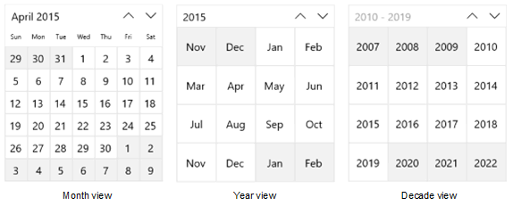
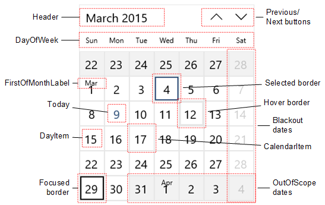

# <a name="calendar-view"></a>Представление календаря

<link rel="stylesheet" href="https://az835927.vo.msecnd.net/sites/uwp/Resources/css/custom.css"> 

Представление календаря позволяет пользователю просматривать календарь и взаимодействовать с ним, перемещаясь по месяцам, годам и десятилетиям. Пользователь может выбрать отдельную дату или диапазон дат. Не имеет поверхности выбора, и календарь всегда виден. 


<div class="important-apis" >
<b>Важные API</b><br/>
<ul>
<li>[**Класс CalendarView**](https://msdn.microsoft.com/library/windows/apps/xaml/windows.ui.xaml.controls.calendarview.aspx)</li>
<li>[**Событие SelectedDatesChanged**](https://msdn.microsoft.com/library/windows/apps/xaml/windows.ui.xaml.controls.calendarview.selecteddateschanged.aspx)</li>
</ul>
</div>


## <a name="is-this-the-right-control"></a>Выбор правильного элемента управления
Используйте представление календаря, чтобы пользователь мог выбрать дату или диапазон дат в постоянно отображаемом календаре.

Если необходимо предоставить пользователю возможность выбора нескольких дат одновременно, используйте представление календаря. - Если необходимо предоставить пользователю возможность выбора одной даты и не нужно, чтобы календарь был виден всегда, рекомендуется использовать элементы управления [Выбор даты календаря](calendar-date-picker.md) или [Выбор даты](date-picker.md) .

Дополнительные сведения о выборе правильного элемента см. в статье [Элементы управления датой и временем](date-and-time.md).

## <a name="examples"></a>Примеры

Представление календаря состоит из 3 отдельных представлений: представление месяца, представление года и представление десятилетия. По умолчанию он запускается с открытым представлением месяца. Чтобы указать желаемое начальное представление, задав свойство [**DisplayMode**](https://msdn.microsoft.com/library/windows/apps/xaml/windows.ui.xaml.controls.calendarview.displaymode.aspx).



Пользователю необходимо нажать на заголовок в представлении месяца, чтобы открыть представление года, и нажать на заголовок в представлении года, чтобы открыть представление десятилетия. Чтобы вернуться в представление года, необходимо выбрать год в представление десятилетия, и выбрать месяц в представлении года, чтобы вернуться в представление месяца. С помощью двух стрелок возле заголовка можно перемещаться вперед или назад по месяцам, годам и десятилетиям. 

## <a name="create-a-calendar-view"></a>Создание представления календаря

Этот пример демонстрирует, как создать простое представление календаря.

```xaml
<CalendarView/>
```

Созданное представление календаря будет выглядеть следующим образом:


### <a name="selecting-dates"></a>Выбора дат

По умолчанию для свойства [**SelectionMode**](https://msdn.microsoft.com/library/windows/apps/xaml/windows.ui.xaml.controls.calendarview.selectionmode.aspx) задано значение **Single**. Это позволяет пользователю выбрать дату в календаре. Установите для SelectionMode значение **None**, чтобы отключить выбор даты. 

Установите для SelectionMode значение **Multiple**, чтобы пользователь мог выбрать несколько дат. Чтобы программно обеспечить выбор нескольких дат, добавьте объекты [DateTime](https://msdn.microsoft.com/library/windows/apps/xaml/system.datetime.aspx)/[DateTimeOffset](https://msdn.microsoft.com/library/windows/apps/xaml/system.datetimeoffset.aspx) в коллекцию [**SelectedDates**](https://msdn.microsoft.com/library/windows/apps/xaml/windows.ui.xaml.controls.calendarview.selecteddates.aspx), как показано здесь:

```csharp
calendarView1.SelectedDates.Add(DateTimeOffset.Now);
calendarView1.SelectedDates.Add(new DateTime(1977, 1, 5));
```

Пользователь может отменить выбор даты, нажав эту дату в сетке календаря.

Можно обработать событие [**SelectedDatesChanged**](https://msdn.microsoft.com/library/windows/apps/xaml/windows.ui.xaml.controls.calendarview.selecteddateschanged.aspx) так, чтобы оно получало оповещение в случае изменения коллекции [**SelectedDates**](https://msdn.microsoft.com/library/windows/apps/xaml/windows.ui.xaml.controls.calendarview.selecteddates.aspx).

> [!NOTE]
> Важные сведения о значениях даты см. в разделе [Значения DateTime и Calendar](date-and-time.md#datetime-and-calendar-values) статьи "Элементы управления датой и временем".

### <a name="customizing-the-calendar-views-appearance"></a>Настройка вида представления календаря

Представление календаря состоит как из элементов XAML , определенных в ControlTemplate, так и визуальных элементов, обработанных непосредственно элементом управления. 
- Элементы XAML, определенные в шаблоне элементов управления, включают границу, которая содержит элемент управления, заголовок, кнопки "Назад" и "Далее", а также элементы DayOfWeek. Можно задать стиль и изменить шаблон этих элементов, как и любого другого элемента управления XAML. 
- Сетка календаря состоит из объектов [**CalendarViewDayItem**](https://msdn.microsoft.com/library/windows/apps/xaml/windows.ui.xaml.controls.calendarviewdayitem.aspx). Задать стиль и изменить шаблон этих элементов невозможно, но для настройки их внешнего вида предоставляются различные свойства.

На данной диаграмме показаны элементы, которые составляют представление месяца в календаре. Дополнительные сведения см. в разделе "Примечания" в классе [**CalendarViewDayItem**](https://msdn.microsoft.com/library/windows/apps/xaml/windows.ui.xaml.controls.calendarviewdayitem.aspx).



В следующей таблице приведен список свойств, которые можно редактировать для изменения внешнего вида элементов календаря.

Элемент | Свойства
--------|-----------
DayOfWeek | [DayOfWeekFormat](https://msdn.microsoft.com/library/windows/apps/xaml/windows.ui.xaml.controls.calendarview.dayofweekformat.aspx)  
CalendarItem | [CalendarItemBackground](https://msdn.microsoft.com/library/windows/apps/xaml/windows.ui.xaml.controls.calendarview.calendaritembackground.aspx), [CalendarItemBorderBrush](https://msdn.microsoft.com/library/windows/apps/xaml/windows.ui.xaml.controls.calendarview.calendaritemborderbrush.aspx), [CalendarItemBorderThickness](https://msdn.microsoft.com/library/windows/apps/xaml/windows.ui.xaml.controls.calendarview.calendaritemborderthickness.aspx), [CalendarItemForeground](https://msdn.microsoft.com/library/windows/apps/xaml/windows.ui.xaml.controls.calendarview.calendaritemforeground.aspx)  
DayItem | [DayItemFontFamily](https://msdn.microsoft.com/library/windows/apps/xaml/windows.ui.xaml.controls.calendarview.dayitemfontfamily.aspx), [DayItemFontSize](https://msdn.microsoft.com/library/windows/apps/xaml/windows.ui.xaml.controls.calendarview.dayitemfontsize.aspx), [DayItemFontStyle](https://msdn.microsoft.com/library/windows/apps/xaml/windows.ui.xaml.controls.calendarview.dayitemfontstyle.aspx), [DayItemFontWeight](https://msdn.microsoft.com/library/windows/apps/xaml/windows.ui.xaml.controls.calendarview.dayitemfontweight.aspx), [HorizontalDayItemAlignment](https://msdn.microsoft.com/library/windows/apps/xaml/windows.ui.xaml.controls.calendarview.horizontaldayitemalignment.aspx), [VerticalDayItemAlignment](https://msdn.microsoft.com/library/windows/apps/xaml/windows.ui.xaml.controls.calendarview.verticaldayitemalignment.aspx), [CalendarViewDayItemStyle](https://msdn.microsoft.com/library/windows/apps/xaml/windows.ui.xaml.controls.calendarview.calendarviewdayitemstyle.aspx)  
MonthYearItem (в представлениях года и десятилетия эквивалентно DayItem) | [MonthYearItemFontFamily](https://msdn.microsoft.com/library/windows/apps/xaml/windows.ui.xaml.controls.calendarview.monthyearitemfontfamily.aspx), [MonthYearItemFontSize](https://msdn.microsoft.com/library/windows/apps/xaml/windows.ui.xaml.controls.calendarview.monthyearitemfontsize.aspx), [MonthYearItemFontStyle](https://msdn.microsoft.com/library/windows/apps/xaml/windows.ui.xaml.controls.calendarview.monthyearitemfontstyle.aspx), [MonthYearItemFontWeight](https://msdn.microsoft.com/library/windows/apps/xaml/windows.ui.xaml.controls.calendarview.monthyearitemfontweight.aspx)  
FirstOfMonthLabel | [FirstOfMonthLabelFontFamily](https://msdn.microsoft.com/library/windows/apps/xaml/windows.ui.xaml.controls.calendarview.firstofmonthlabelfontfamily.aspx), [FirstOfMonthLabelFontSize](https://msdn.microsoft.com/library/windows/apps/xaml/windows.ui.xaml.controls.calendarview.firstofmonthlabelfontsize.aspx), [FirstOfMonthLabelFontStyle](https://msdn.microsoft.com/library/windows/apps/xaml/windows.ui.xaml.controls.calendarview.firstofmonthlabelfontstyle.aspx), [FirstOfMonthLabelFontWeight](https://msdn.microsoft.com/library/windows/apps/xaml/windows.ui.xaml.controls.calendarview.firstofmonthlabelfontweight.aspx), [HorizontalFirstOfMonthLabelAlignment](https://msdn.microsoft.com/library/windows/apps/xaml/windows.ui.xaml.controls.calendarview.horizontalfirstofmonthlabelalignment.aspx), [VerticalFirstOfMonthLabelAlignment](https://msdn.microsoft.com/library/windows/apps/xaml/windows.ui.xaml.controls.calendarview.verticalfirstofmonthlabelalignment.aspx), [IsGroupLabelVisible](https://msdn.microsoft.com/library/windows/apps/xaml/windows.ui.xaml.controls.calendarview.isgrouplabelvisible.aspx)  
FirstofYearDecadeLabel (в представлениях года и десятилетия эквивалентно FirstOfMonthLabel) | [FirstOfYearDecadeLabelFontFamily](https://msdn.microsoft.com/library/windows/apps/xaml/windows.ui.xaml.controls.calendarview.firstofyeardecadelabelfontfamily.aspx), [FirstOfYearDecadeLabelFontSize](https://msdn.microsoft.com/library/windows/apps/xaml/windows.ui.xaml.controls.calendarview.firstofyeardecadelabelfontsize.aspx), [FirstOfYearDecadeLabelFontStyle](https://msdn.microsoft.com/library/windows/apps/xaml/windows.ui.xaml.controls.calendarview.firstofyeardecadelabelfontstyle.aspx), [FirstOfYearDecadeLabelFontWeight](https://msdn.microsoft.com/library/windows/apps/xaml/windows.ui.xaml.controls.calendarview.firstofyeardecadelabelfontweight.aspx)  
Границы визуального состояния | [FocusBorderBrush](https://msdn.microsoft.com/library/windows/apps/xaml/windows.ui.xaml.controls.calendarview.focusborderbrush.aspx), [HoverBorderBrush](https://msdn.microsoft.com/library/windows/apps/xaml/windows.ui.xaml.controls.calendarview.hoverborderbrush.aspx), [PressedBorderBrush](https://msdn.microsoft.com/library/windows/apps/xaml/windows.ui.xaml.controls.calendarview.pressedborderbrush.aspx), [SelectedBorderBrush](https://msdn.microsoft.com/library/windows/apps/xaml/windows.ui.xaml.controls.calendarview.selectedborderbrush.aspx), [SelectedForeground](https://msdn.microsoft.com/library/windows/apps/xaml/windows.ui.xaml.controls.calendarview.selectedforeground.aspx), [SelectedHoverBorderBrush](https://msdn.microsoft.com/library/windows/apps/xaml/windows.ui.xaml.controls.calendarview.selectedhoverborderbrush.aspx), [SelectedPressedBorderBrush](https://msdn.microsoft.com/library/windows/apps/xaml/windows.ui.xaml.controls.calendarview.selectedpressedborderbrush.aspx)  
OutofScope | [IsOutOfScopeEnabled](https://msdn.microsoft.com/library/windows/apps/xaml/windows.ui.xaml.controls.calendarview.isoutofscopeenabled.aspx), [OutOfScopeBackground](https://msdn.microsoft.com/library/windows/apps/xaml/windows.ui.xaml.controls.calendarview.outofscopebackground.aspx), [OutOfScopeForeground](https://msdn.microsoft.com/library/windows/apps/xaml/windows.ui.xaml.controls.calendarview.outofscopeforeground.aspx)  
Сегодня | [IsTodayHighlighted](https://msdn.microsoft.com/library/windows/apps/xaml/windows.ui.xaml.controls.calendarview.istodayhighlighted.aspx), [TodayFontWeight](https://msdn.microsoft.com/library/windows/apps/xaml/windows.ui.xaml.controls.calendarview.todayfontweight.aspx), [TodayForeground](https://msdn.microsoft.com/library/windows/apps/xaml/windows.ui.xaml.controls.calendarview.todayforeground.aspx)  

 По умолчанию в представлении месяца отображается одновременно 6 недель. Чтобы изменить количество отображаемых недель, задайте свойство [**NumberOfWeeksInView**](https://msdn.microsoft.com/library/windows/apps/xaml/windows.ui.xaml.controls.calendarview.numberofweeksinview.aspx). Минимальное количество отображаемых недель — 2; максимальное — 8.

По умолчанию представления года и десятилетия отображаются в сетке 4x4. Чтобы изменить количество строк или столбцов, вызовите [**SetYearDecadeDisplayDimensions**](https://msdn.microsoft.com/library/windows/apps/xaml/windows.ui.xaml.controls.calendarview.setyeardecadedisplaydimensions.aspx) с желаемым количеством строк и столбцов. Это изменит сетку для представлений и года, и десятилетия.

Здесь представления года и десятилетия устанавливаются для отображения в сетке 3x4.

```csharp
calendarView1.SetYearDecadeDisplayDimensions(3, 4);
```

По умолчанию минимальная дата, отображаемая в представлении календаря, —100 лет до текущей даты, а максимальная дата — 100 лет после текущей даты. Чтобы изменить минимальную и максимальную даты, отображаемые в календаре, задайте свойства [**MinDate**](https://msdn.microsoft.com/library/windows/apps/xaml/windows.ui.xaml.controls.calendarview.mindate.aspx) и [**MaxDate**](https://msdn.microsoft.com/library/windows/apps/xaml/windows.ui.xaml.controls.calendarview.maxdate.aspx).

```csharp
calendarView1.MinDate = new DateTime(2000, 1, 1);
calendarView1.MaxDate = new DateTime(2099, 12, 31);
```

### <a name="updating-calendar-day-items"></a>Обновление элементов дня в календаре

Каждый день в календаре представляется объектом [**CalendarViewDayItem**](https://msdn.microsoft.com/library/windows/apps/xaml/windows.ui.xaml.controls.calendarviewdayitem.aspx). Для получения доступа к отдельному элементу дня и использования его свойств и методов, обработайте событие [**CalendarViewDayItemChanging**](https://msdn.microsoft.com/library/windows/apps/xaml/windows.ui.xaml.controls.calendarview.calendarviewdayitemchanging.aspx) и используйте свойство Item аргументов события для доступа к CalendarViewDayItem.

Чтобы запретить выбор дня в представлении календаря, установите для свойства [**CalendarViewDayItem.IsBlackout**](https://msdn.microsoft.com/library/windows/apps/xaml/windows.ui.xaml.controls.calendarviewdayitem.isblackout.aspx) значение **true**. 

Чтобы отобразить контекстные данные о плотности событий дня, вызовите метод [**CalendarViewDayItem.SetDensityColors**](https://msdn.microsoft.com/library/windows/apps/xaml/dn890067.aspx). Можно отобразить от 0 до 10 шкал плотности для каждого дня и установить цвет для каждой шкалы. 

Вот некоторые элементы дня в календаре. Дни 1 и 2 затемнены. Для дней 2, 3 и 4 установлены разные шкалы плотности.


### <a name="phased-rendering"></a>Поэтапная отрисовка

Представление календаря может содержать большое количество объектов CalendarViewDayItem. Чтобы обеспечить быстрое реагирование пользовательского интерфейса и плавные переходы в календаре, представление календаря поддерживает поэтапную отрисовку. Позволяет разбить обработку элемента дня на этапы. Если день перемещен из представления до завершения выполнения всех этапов, время на попытку обработки и отрисовки этого элемента больше тратиться не будет.

Этот пример иллюстрирует поэтапную отрисовку представления календаря для планирования встреч. 
- На этапе 0 отрисовывается элемент дня по умолчанию. 
- На этапе 1 затемняются даты, которые нельзя забронировать. Сюда входят прошлые даты, воскресенья, а также полностью забронированные даты. 
- На этапе 2 проверяется каждая встреча, забронированная на этот день. Для каждой подтвержденной встречи отображается зеленая шкала плотности, а для каждойнеподтвержденной встречи — синяя. 

Класс `Bookings` в этом примере взят из несуществующего приложения резервирования встреч и не отображается.

```xaml
<CalendarView CalendarViewDayItemChanging="CalendarView_CalendarViewDayItemChanging"/>
```

```csharp
private void CalendarView_CalendarViewDayItemChanging(CalendarView sender, 
                                   CalendarViewDayItemChangingEventArgs args)
{
    // Render basic day items.
    if (args.Phase == 0)
    {
        // Register callback for next phase.
        args.RegisterUpdateCallback(CalendarView_CalendarViewDayItemChanging);
    }
    // Set blackout dates.
    else if (args.Phase == 1)
    {   
        // Blackout dates in the past, Sundays, and dates that are fully booked.
        if (args.Item.Date < DateTimeOffset.Now ||
            args.Item.Date.DayOfWeek == DayOfWeek.Sunday ||
            Bookings.HasOpenings(args.Item.Date) == false)
        {
            args.Item.IsBlackout = true;
        }
        // Register callback for next phase.
        args.RegisterUpdateCallback(CalendarView_CalendarViewDayItemChanging);
    }
    // Set density bars.
    else if (args.Phase == 2)
    {
        // Avoid unnecessary processing.
        // You don't need to set bars on past dates or Sundays.
        if (args.Item.Date > DateTimeOffset.Now &&
            args.Item.Date.DayOfWeek != DayOfWeek.Sunday)
        {
            // Get bookings for the date being rendered.
            var currentBookings = Bookings.GetBookings(args.Item.Date);

            List<Color> densityColors = new List<Color>();
            // Set a density bar color for each of the days bookings.
            // It's assumed that there can't be more than 10 bookings in a day. Otherwise,
            // further processing is needed to fit within the max of 10 density bars.
            foreach (booking in currentBookings)
            {
                if (booking.IsConfirmed == true)
                {
                    densityColors.Add(Colors.Green);
                }
                else
                {
                    densityColors.Add(Colors.Blue);
                }
            }
            args.Item.SetDensityColors(densityColors);
        }
    }
}
```

## <a name="related-articles"></a>Связанные разделы

- [Элементы управления датой и временем](date-and-time.md)
- [Управляющий элемент выбора даты в календаре](calendar-date-picker.md)
- [Управляющий элемент выбора даты](date-picker.md)
- [Управляющий элемент выбора времени](time-picker.md)

