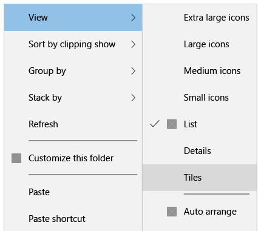
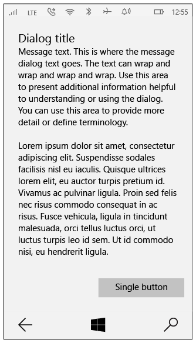

# Меню, диалоговые окна и всплывающие окна

Меню, диалоговые окна, всплывающие элементы и всплывающие окна используются для временного отображения элементов пользовательского интерфейса по запросу пользователя либо если происходит нечто требующее уведомления или подтверждения.

<span class="sidebar_heading" style="font-weight: bold;">Важные API</span>

-   [Класс MenuFlyout](https://msdn.microsoft.com/library/windows/apps/dn299030)
-   [Класс Flyout](https://msdn.microsoft.com/library/windows/apps/dn279496)
-   [Класс ContentDialog](https://msdn.microsoft.com/library/windows/apps/windows.ui.xaml.controls.contentdialog.aspx)

Контекстное меню предоставляет пользователю варианты быстрых действий. Оно может быть заполнено текстовыми командами. Контекстные меню исчезают, если щелкнуть участок экрана за пределами меню.

Диалоговые окна — это модальные наложения пользовательского интерфейса, которые предоставляют контекстную информацию о приложении. Диалоговые окна блокируют взаимодействие с окном приложения, пока пользователь явно не закроет окно. Они часто требуют от пользователя совершения каких-либо действий.

Всплывающий элемент — это облегченное всплывающее контекстно-зависимое окно, отображающее элемент пользовательского интерфейса в зависимости от действий пользователя. Расположение и размер всплывающего элемента подчиняются определенным правилам. Он позволяет обнаружить скрытый элемент управления, отобразить дополнительные сведения об элементе либо запросить у пользователя подтверждение действия. Всплывающий элемент исчезнет, если щелкнуть участок экрана за его пределами.


## Выбор правильного элемента управления

Контекстные меню можно использовать в следующих целях.

-   контекстные действия;
-   команды для выполнения операций с объектом, с которым нужно взаимодействовать, но который нельзя выбрать.

Диалоговые окна можно использовать в следующих целях.

- Чтобы сообщить важную информацию, которую пользователь должен прочитать и осознать перед продолжением работы.
- Чтобы запросить от пользователя четкое действие или сообщить ему важную информацию, получение которой пользователь должен подтвердить. Примеры:
  - угроза безопасности пользователя;
  - намерение изменить ценные данные без возможности отмены действия;
  - намерение удалить ценные данные;
  - подтверждение покупки из приложения;
- Сообщения об ошибках, которые относятся к приложению в целом, например ошибка подключения.
- Вопросы, если приложению нужно задать пользователю блокирующий вопрос, например, если приложение не может сделать выбор от имени пользователя. Блокирующий вопрос нельзя проигнорировать или отложить. У пользователя должны быть понятные варианты выбора.

Всплывающие элементы можно использовать в следующих целях:

-   контекстно-зависимые временные элементы пользовательского интерфейса;
-   предупреждения и подтверждения, в том числе связанные с потенциально деструктивными действиями;
-   отображение дополнительной информации, например подробных сведений или более длинных описаний элемента на странице.


## Примеры

Это типичное контекстное меню с одной панелью и коротким списком простых команд. При необходимости его можно прокручивать. Используйте разделители, чтобы группировать похожие команды.


Каскадное контекстное меню подходит для более обширной коллекции команд. В нем имеется несколько уровней всплывающих элементов и возможность прокрутки. Используйте разделители, чтобы группировать похожие команды.



Это пример полноэкранного окна подтверждения с одной кнопкой. В диалоговом окне данного типа содержится значительное количество информации, которую пользователь должен прочитать, прежде чем нажать кнопку, чтобы продолжить.



Вот пример диалогового окна с двумя кнопками, в котором пользователь может выбрать A или B. Как правило, количество информации, представленное в этом диалоговом окне, невелико.


## Модальность и исчезновение

Диалоговые окна являются модальными, то есть блокируют любое взаимодействие с приложением до тех пор, пока пользователь не нажмет кнопку диалогового окна. Чтобы представить такое модальное поведение визуально, диалоговые окна создают уровень наложения, то есть частично скрывают пользовательский интерфейс временно недоступного приложения.


            **Примечание**. Если "Отмена"— один из доступных вариантов в диалоговом окне, приложение может позволить пользователю закрыть диалоговое окно нажатием клавиши Escape. Такое поведение не является встроенным в элемент управления— скорее, это распространенное сочетание клавиш.

Всплывающие элементы и контекстные меню— это элементы с возможностью исчезновения, то есть существует несколько способов быстрого закрытия временно отображаемых элементов пользовательского интерфейса. Это облегченные элементы, которые не блокируют пользовательский интерфейс. Чтобы эти элементы исчезли, можно выполнить следующие действия:
- щелкнуть или коснуться за пределом кратковременно отображаемого элемента пользовательского интерфейса
- нажать клавишу Escape
- нажать кнопку "Назад"
- изменить размер окна приложения
- изменить ориентацию устройства


## Инструкции по использованию диалоговых окон

-   В первой строке диалогового сообщения явно изложите, в чем проблема или что требуется от пользователя.
-   Заголовок диалогового окна — это основная инструкция. Он необязателен.
    -   Используйте краткий заголовок для пояснений, что пользователям следует сделать в диалоговом окне. Длинные заголовки не переносятся по строкам и будут усечены.
    -   Если вы используете диалоговое окно для простого сообщения, указания на ошибку или вопроса, заголовок можно опустить. Ключевую информацию должен передавать текст сообщения.
    -   Убедитесь, что заголовок соответствует предлагаемому выбору кнопок.
-   Содержимое диалогового окна включает текст описания. Оно обязательно.
    -   Изложите сообщение, ошибку или блокирующий вопрос как можно проще.
    -   Если имеется заголовок диалогового окна, используйте область содержимого для более подробных сведений или пояснения терминологии. Не повторяйте заголовок в немного измененной формулировке.
-   Должна иметься по крайней мере одна диалоговая кнопка.
    -   Кнопки — это единственный механизм, позволяющий пользователям закрыть диалоговое окно.
    -   Используйте кнопки с текстом, которые определяют конкретные варианты ответа на основную инструкцию или содержание. Например: "Разрешить приложению AppName доступ к вашему расположению?", после которого следуют кнопки "Разрешить" и "Запретить". Конкретные варианты ответа воспринимаются быстрее, что помогает эффективно принимать решения.
-   Диалоговые окна ошибки отображают сообщение об ошибке в диалоговом окне, а также любые сопутствующие сведения. На единственной кнопке, используемой в диалоговом окне ошибки, должно быть написано «Закрыть» или аналогичное действие.
-   Не используйте диалоговые окна при возникновении контекстно-зависимых от определенной области на странице ошибок, таких как ошибки при проверке (например, в полях для ввода паролей). Используйте непосредственно элемент Canvas приложения для отображения внутренних ошибок.

## Контекстное меню и всплывающие элементы

Контекстные меню и всплывающие элементы— это связанные между собой элементы управления, которые имеют одинаковое поведение взаимодействия. Основное различие между этими элементами управления заключается в типе принимаемого содержимого.

### MenuFlyout
Контекстное меню, реализованное с помощью класса MenuFlyout, может содержать элементы [**MenuFlyoutItem**](https://msdn.microsoft.com/library/windows/apps/windows.ui.xaml.controls.menuflyoutitem.aspx), [**ToggleMenuFlyoutItem**](https://msdn.microsoft.com/library/windows/apps/windows.ui.xaml.controls.togglemenuflyoutitem.aspx), [**MenuFlyoutSubItem**](https://msdn.microsoft.com/library/windows/apps/windows.ui.xaml.controls.menuflyoutsubitem.aspx) и [**MenuFlyoutSeparator**](https://msdn.microsoft.com/library/windows/apps/windows.ui.xaml.controls.menuflyoutseparator.aspx). Чтобы отобразить любой другой тип пользовательского интерфейса, воспользуйтесь элементом Flyout.

- **Рекомендации по использованию**
  - Используйте разделитель между группами команд в контекстном меню:
    - для группировки взаимосвязанных команд;
    - для группировки наборов команд;
    - для отделения набора прогнозируемых команд, например команд буфера обмена («Вырезать», «Копировать», «Вставить»), от команд, относящихся к приложению или представлению.
  -   На ноутбуках и настольных компьютерах контекстные меню и подсказки не ограничиваются окном приложения и могут частично выходить за его рамки. Если приложение пытается отрисовать контекстное меню полностью за пределами своего окна, создается исключение.

- **Рекомендации**
  -   Команды в контекстном меню должны быть короткими. Длинные команды могут быть обрезаны.
  -   Начинайте имя команды с прописной буквы.
  -   Чем меньше команд в контекстном меню, тем лучше.
  -   При возможности непосредственного использования элемента пользовательского интерфейса не стоит помещать такую команду в контекстное меню. Контекстное меню предназначено для контекстно-зависимых команд, которые отсутствуют на экране.

### Всплывающий элемент

Всплывающий элемент— это контейнер с открытым окончанием, который показывает в качестве своего содержимого произвольный ИП.  Всплывающие элементы не имеют собственных визуальных частей— это просто элемент управления содержимым. Всплывающие элементы имеют поля и могут иметь полосы прокрутки вокруг содержимого. Чтобы задать стиль всплывающего элемента, измените его `FlyoutPresenterStyle`.

Следующий код показывает абзац создания программы-оболочки текста и делает блок текста доступным для программ чтения с экрана.

````xaml
<Flyout>
  <Flyout.FlyoutPresenterStyle>
    <Style TargetType="FlyoutPresenter">
      <Setter Property="ScrollViewer.HorizontalScrollMode" Value="Disabled"/>
      <Setter Property="ScrollViewer.HorizontalScrollBarVisibility" Value="Disabled"/>
      <Setter Property="IsTabStop" Value="True"/>
      <Setter Property="TabNavigation" Value="Cycle"/>
    </Style>
  </Flyout.FlyoutPresenterStyle>
  <TextBlock Style="{StaticResource BodyTextBlockStyle}" Text="Lorem ipsum dolor sit amet, consectetur adipiscing elit, sed do eiusmod tempor incididunt ut labore et dolore magna aliqua. Ut enim ad minim veniam, quis nostrud exercitation ullamco laboris nisi ut aliquip ex ea commodo consequat."/>
</Flyout>
````

### Вызов и размещение

Всплывающие элементы и контекстные меню подключены к конкретным элементам управления. Если они видны, их необходимо прикрепить к вызывающему объекту и указать их предпочтительное расположение относительно объекта: сверху, слева, снизу или справа. Всплывающий элемент также имеет полный режим размещения, при котором всплывающий элемент растягивается на весь экран и выравнивается по центру внутри окна приложения.

[Класс Button](https://msdn.microsoft.com/library/windows/apps/windows.ui.xaml.controls.button.aspx) содержит свойство `Flyout`, позволяющее задавать переходный пользовательский интерфейс, который будет открываться при нажатии или касании кнопки.

````xaml
<Button Content="Click me">
  <Button.Flyout>
     <Flyout>
        <TextBlock Text="Yay!"/>
     </Flyout>
  </Button.Flyout>
</Button>
````

Чтобы открыть контекстное меню, пользователь может выполнить одно из следующих действий:
- Щелкните правой кнопкой мыши
- Нажмите и удерживайте с касанием
- Введите Shift + F10
- Нажмите клавишу меню клавиатуры
- Нажмите кнопку меню игрового контроллера

Чтобы легко открывать контекстное меню или всплывающий элемент в ответ на вышеперечисленные действия, приложения могут использовать новое свойство [`ContextFlyout`](https://msdn.microsoft.com/library/windows/apps/windows.ui.xaml.uielement.contextflyout.aspx) в [UIElement](https://msdn.microsoft.com/library/windows/apps/windows.ui.xaml.uielement.aspx)— базовом классе для большинства элементов управления.

````xaml
<Rectangle Height="100" Width="100" Fill="Red">
  <Rectangle.ContextFlyout>
     <MenuFlyout>
        <MenuFlyoutItem Text="Close"/>
     </MenuFlyout>
  </Rectangle.Flyout>
</Rectangle>
````

## Связанные разделы

**Для разработчиков**
- [**Класс MenuFlyout**](https://msdn.microsoft.com/library/windows/apps/dn299030)
- [**Класс Flyout**](https://msdn.microsoft.com/library/windows/apps/dn279496)
- [**Класс ContentDialog**](https://msdn.microsoft.com/library/windows/apps/windows.ui.xaml.controls.contentdialog.aspx)


<!--HONumber=Jun16_HO4-->


