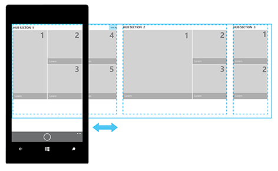

# Шаблон/элемент управления "Главный раздел"

<link rel="stylesheet" href="https://az835927.vo.msecnd.net/sites/uwp/Resources/css/custom.css"> 

Элемент управления "Главный раздел" позволяет организовывать содержимое приложения в отдельные, но связанные между собой разделы или категории. Разделы в главном разделе предназначены для перемещения в предпочтительной последовательности и могут служить исходной точкой для более детализированного взаимодействия.

Содержимое в главном разделе может отображаться панорамно, что акцентирует внимание пользователей на новых, доступных и релевантных элементах. В главных разделах обычно есть заголовок страницы, а разделы содержимого получают заголовки разделов.

<b>Важные API</b> 
<ul>
<li>[**Класс Hub**](https://msdn.microsoft.com/library/windows/apps/dn251843)</li>
<li>[**Класс HubSection**](https://msdn.microsoft.com/library/windows/apps/dn251845)</li>
</ul>

## Выбор правильного элемента управления

Элемент управления "Главный раздел" подходит для отображения большого объема содержимого, организованного в виде иерархии. Главные разделы помогают просматривать и находить новое содержимое в приоритетном порядке, что особенно полезно при отображении элементов в магазине или в коллекции мультимедиа.

У элемента управления "Главный раздел" есть несколько функций, благодаря которым он хорошо подходит для сборки шаблона навигации по содержимому.

-   **Наглядная навигация**

    Главный раздел позволяет отображать содержимое в разных кратких массивах, которые легко просматривать.

-   **Категоризация**

    Каждый раздел элемента управления "Главный раздел" позволяет организовать содержимое в логическом порядке.

-   **Типы смешанного содержимого**

    В случае смешанного содержимого обычно используются различные размеры элементов и соотношения сторон. Главный раздел позволяет размещать в каждом из разделов содержимое разного типа.

-   **Переменная ширина страниц и элементов содержимого**

    Главный раздел является панорамной моделью и поддерживает различную ширину разделов. Он отлично подходит для содержимого с разной глубиной и количеством.

-   **Гибкая архитектура**

    Если вы хотите сохранить плоскую архитектуру своего приложения, вы можете разместить все содержимое канала в сводке по главному разделу.

Главный раздел— это только один из нескольких элементов навигации, которые можно использовать. Дополнительные сведения о шаблонах и других элементах навигации см. в статье [Основы проектирования навигации в приложениях универсальной платформы Windows (UWP)](../layout/navigation-basics.md).

## Архитектура элемента управления "Главный раздел"

Элемент управления "Главный раздел" имеет шаблон иерархической навигации, который поддерживает приложения с реляционной информационной архитектурой. Главный раздел состоит из различных категорий содержимого, каждая из которых сопоставлена со страницами разделов приложения. Страницы разделов могут отображаться в любой форме, которая наилучшим образом отражает сценарий и содержимое раздела.

## Макеты и панорамирование/прокрутка

Размещать содержимое и переходить по нему в главном разделе можно несколькими способами. Необходимо только убедиться, что списки содержимого в главном разделе сдвигаются в направлении, перпендикулярном направлению прокрутки главного раздела.

**Горизонтальный сдвиг**

**Вертикальный сдвиг**

**Горизонтальный сдвиг со списком или сеткой с вертикальной прокруткой**

**Вертикальный сдвиг со списком или сеткой с горизонтальной прокруткой**

## Примеры

Элемент управления «Главный раздел» дает значительную свободу при проектировании. Она позволяет проектировать приложения с разнообразным привлекательным интерфейсом, насыщенным визуальными эффектами. Для первой группы вы можете использовать главное изображение или раздел содержимого. Большое изображение можно кадрировать по вертикали и горизонтали без ущерба для его содержания. Здесь приведен пример одного главного изображения, а также показано, как можно обрезать изображение для альбомной и книжной ориентаций, в том числе до ширины менее стандартной.

На мобильных устройствах нельзя отобразить несколько главных разделов одновременно.

## Рекомендации

-   Чтобы дать понять пользователям, что в главном разделе больше содержимого, рекомендуем обрезать содержимое таким образом, чтобы определенная его часть выглядывала.
-   В зависимости от потребностей вашего приложения вы можете добавить в элемент управления "Главный раздел" несколько разделов, и каждый из них будет выполнять свою функцию. Например, один раздел может содержать набор ссылок и элементов управления, а другой — служить контейнером для эскизов. С помощью касаний пользователь может перемещаться между этими разделами. Поддержка касаний встроена в элемент управления "Главный раздел".
-   Динамическое переформатирование содержимого — это лучший способ адаптировать его под различные размеры окон.
-   Если у вас много главных разделов, вы можете добавить контекстное масштабирование. Это также упростит поиск разделов, если приложение было сжато по ширине.
-   Мы не рекомендуем иметь в разделе элемент, ведущий в другой раздел. Вместо этого для перехода к другому разделу или на другую страницу можно использовать интерактивные заголовки.
-   Главный раздел служит отправной точкой, он должен настраиваться в соответствии с потребностями вашего приложения. Вы можете изменять следующие аспекты главного раздела.
    -   Число разделов
    -   Тип содержимого в каждом разделе
    -   Размещение и порядок следования разделов
    -   Размер разделов
    -   Интервалы между разделами
    -   Интервалы между разделами сверху или снизу от главного раздела
    -   Стиль и размер текста в заголовках и содержимом
    -   Цвет фона, разделов, заголовков разделов и содержимого разделов

## Получить пример кода
* [Основы создания пользовательского интерфейса XAML](https://github.com/Microsoft/Windows-universal-samples/blob/master/Samples/XamlUIBasics)

## Еще по теме

- [Класс Hub](https://msdn.microsoft.com/library/windows/apps/dn251843)
- [Основы навигации](../layout/navigation-basics.md)
- [Использование главного раздела](https://msdn.microsoft.com/library/windows/apps/xaml/dn308518)
- [Пример элемента управления "Главный раздел" на языке XAML](http://go.microsoft.com/fwlink/p/?LinkID=310072)
