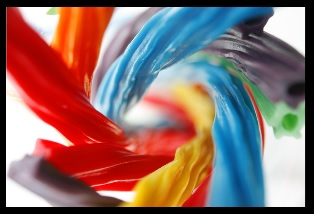
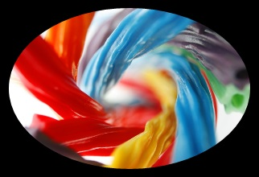
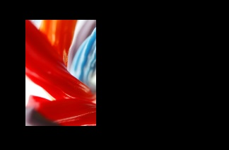
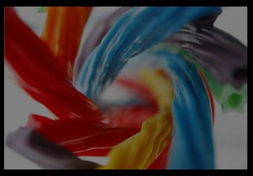

# Изображения и кисти изображений

Чтобы отобразить изображение, вы можете использовать объект **Image** или **ImageBrush**. Объект Image отрисовывает изображение, а объект ImageBrush закрашивает изображением другой объект. 

<span class="sidebar_heading" style="font-weight: bold;">Важные API</span>

-   [**Класс Image**](https://msdn.microsoft.com/library/windows/apps/xaml/windows.ui.xaml.controls.image.aspx)
-   [**Свойство Source**](https://msdn.microsoft.com/library/windows/apps/xaml/windows.ui.xaml.controls.image.source.aspx)
-   [**Класс ImageBrush**](https://msdn.microsoft.com/library/windows/apps/xaml/windows.ui.xaml.media.imagebrush.aspx)
-   [**Свойство ImageSource**](https://msdn.microsoft.com/library/windows/apps/xaml/windows.ui.xaml.media.imagebrush.imagesource.aspx)

## Эти элементы правильные?
Используйте элемент **Image** для отображения отдельного изображения в приложении.

Используйте **ImageBrush** для применения изображения к другому объекту. Способы использования ImageBrush включают декоративные эффекты для текста или мозаичные фоны для элементов управления или контейнеров макета. Вы можете задать растяжение, выравнивание и замощение изображения, а также создать шаблоны и другие эффекты. 

## Примеры.


## Создание изображения

### Image
В этом примере показано, как создать изображение с помощью объекта [**Image**](https://msdn.microsoft.com/library/windows/apps/xaml/windows.ui.xaml.controls.image.aspx).


```XAML
<Image Width="200" Source="licorice.jpg" />
```

Ниже показан отрисованный объект Image.



В этом примере свойство [**Source**](https://msdn.microsoft.com/library/windows/apps/xaml/windows.ui.xaml.controls.image.source.aspx) определяет расположение изображения, которое следует отобразить. В свойстве Source можно указать абсолютный URL-адрес (например, http://contoso.com/myPicture.jpg) или URL-адрес, который соответствует составу и структуре упаковки вашего приложения. В нашем примере мы помещаем файл изображения "licorice.jpg" в корневую папку проекта и объявляем параметры проекта, которые содержат этот файл.

### ImageBrush

Объект [**ImageBrush**](https://msdn.microsoft.com/library/windows/apps/xaml/windows.ui.xaml.media.imagebrush.aspx) позволяет использовать изображение для рисования области, где применяется объект [**Brush**](https://msdn.microsoft.com/library/windows/apps/xaml/windows.ui.xaml.media.brush.aspx). Например, вы можете использовать ImageBrush в качестве значения свойства [**Fill**](https://msdn.microsoft.com/library/windows/apps/xaml/windows.ui.xaml.shapes.shape.fill.aspx) класса [**Ellipse**](https://msdn.microsoft.com/library/windows/apps/xaml/windows.ui.xaml.shapes.ellipse.aspx) или свойства [**Background**](https://msdn.microsoft.com/library/windows/apps/xaml/windows.ui.xaml.controls.control.background.aspx) класса [**Canvas**](https://msdn.microsoft.com/library/windows/apps/xaml/windows.ui.xaml.controls.canvas.aspx).

В следующем примере показано, как можно использовать объект ImageBrush для закрашивания фигуры Ellipse.

```XAML
<Ellipse Height="200" Width="300">
   <Ellipse.Fill>
     <ImageBrush ImageSource="licorice.jpg" />
   </Ellipse.Fill>
</Ellipse>
```

Ниже показана фигура Ellipse, закрашенная с помощью объекта ImageBrush.



### Растяжение изображения

Если не указать значения [**Width**](https://msdn.microsoft.com/library/windows/apps/xaml/windows.ui.xaml.frameworkelement.width.aspx) или [**Height**](https://msdn.microsoft.com/library/windows/apps/xaml/windows.ui.xaml.frameworkelement.height.aspx) для **Image**, то изображение отображается с размерами, задаваемыми **Source**. Определяя значения **Width** и **Height**, вы создаете удерживающую прямоугольную область, в пределах которой отображается изображение. Вы можете выбрать, каким образом изображение будет заполнять удерживающую область, с помощью свойства [**Stretch**](https://msdn.microsoft.com/library/windows/apps/xaml/windows.ui.xaml.controls.image.stretch.aspx). Свойство Stretch может принимать следующие значения, определенные в перечислении [**Stretch**](https://msdn.microsoft.com/library/windows/apps/xaml/windows.ui.xaml.media.stretch.aspx):

-   **None**: изображение не растягивается для заполнения отображаемой области. Будьте осторожны при настройке значения Stretch. Если исходное изображение больше заполняемой области, то изображение будет обрезано, а это обычно нежелательно, так как, в отличие от намеренного вырезания [**Clip**](https://msdn.microsoft.com/library/windows/apps/xaml/windows.ui.xaml.uielement.clip.aspx), окном просмотра управлять вы не можете.
-   **Uniform**: масштаб изображения изменяется так, чтобы оно соответствовало размеру отображаемой области, но пропорции изображения сохраняются. Это значение используется по умолчанию.
-   **UniformToFill**: масштаб изображения изменяется так, чтобы оно полностью заполняло отображаемую область, но исходные пропорции изображения сохраняются.
-   **Fill**: масштаб изображения изменяется так, чтобы оно соответствовало размеру отображаемой области. Поскольку высота и ширина изображения изменяются независимо друг от друга, его исходные пропорции могут быть нарушены. То есть изображение может быть искажено так, что не сможет полностью заполнить отображаемую область.


### Обрезка изображения

С помощью свойства [**Clip**](https://msdn.microsoft.com/library/windows/apps/xaml/windows.ui.xaml.uielement.clip.aspx) можно вырезать область отображаемого изображения. Вы задаете свойство Clip в [**Geometry**](https://msdn.microsoft.com/library/windows/apps/xaml/windows.ui.xaml.media.geometry.aspx). Вырезание областей непрямоугольной формы в настоящее время не поддерживается.

В следующем примере показано, как можно использовать класс [**RectangleGeometry**](https://msdn.microsoft.com/library/windows/apps/xaml/windows.ui.xaml.media.rectanglegeometry.aspx) для вырезания области изображения. В этом примере мы определяем объект **Image** со значением высоты 200. Объект **RectangleGeometry** определяет прямоугольную область для отображаемого изображения. Для свойства [**Rect**](https://msdn.microsoft.com/library/windows/apps/xaml/windows.ui.xaml.media.rectanglegeometry.rect.aspx) задано значение "25,25,100,150", которое определяет начало прямоугольника в точке "25,25" с шириной 100 и высотой 150. Отображается только та часть изображения, которая попадает в область прямоугольника.

```xaml
<Image Source="licorice.jpg" Height="200">
    <Image.Clip>
        <RectangleGeometry Rect="25,25,100,150" />
    </Image.Clip>
</Image>
```

Обрезанное изображение на черном фоне.



### Применение непрозрачности

Вы можете применить к изображению свойство [**Opacity**](https://msdn.microsoft.com/library/windows/apps/xaml/windows.ui.xaml.uielement.opacity.aspx), что позволяет отрисовать его полупрозрачным. Значения непрозрачности варьируют от 0,0 до 1,0, где 1,0 — полная непрозрачность, а 0,0 — полная прозрачность. В этом примере показано, как можно применить непрозрачность 0,5 к объекту Image.

```xaml
<Image Height="200" Source="licorice.jpg" Opacity="0.5" />
```

Ниже показано отрисованное изображение с непрозрачностью 0,5 и черным фоном, видимым сквозь частичную прозрачность.



### Форматы файлов изображений

**Image** и **ImageBrush** могут отображать следующие форматы файлов изображений:

-   JPEG
-   PNG
-   BMP
-   GIF
-   TIFF
-   JPEG XR
-   значки (ICO)

API для [**Image**](https://msdn.microsoft.com/library/windows/apps/xaml/windows.ui.xaml.controls.image.aspx), [**BitmapImage**](https://msdn.microsoft.com/library/windows/apps/xaml/windows.ui.xaml.media.imaging.bitmapimage.aspx) и [**BitmapSource**](https://msdn.microsoft.com/library/windows/apps/xaml/windows.ui.xaml.media.imaging.bitmapsource.aspx) не включают специальные методы для кодирования и декодирования форматов мультимедиа. Все операции кодирования и декодирования — встроенные, и только некоторые аспекты кодирования и декодирования могут быть включены в данные для событий загрузки. Если приложение выполняет преобразования изображений или манипуляции с ними, вам следует использовать API, доступные в пространстве имен [**Windows.Graphics.Imaging**](https://msdn.microsoft.com/library/windows/apps/xaml/windows.graphics.imaging.aspx), при выполнении каких-либо действий по кодированию или декодированию изображений. Кроме того, эти API поддерживаются компонентом обработки изображений Windows (WIC) в Windows.

Дополнительные сведения о ресурсах приложения и о том, как запаковать исходные изображения в приложение, см. в разделе [Определение ресурсов приложения](https://msdn.microsoft.com/library/windows/apps/xaml/hh965321).

### WriteableBitmap

[
            **WriteableBitmap**](https://msdn.microsoft.com/library/windows/apps/xaml/windows.ui.xaml.media.imaging.writeablebitmap.aspx) предоставляет [**BitmapSource**](https://msdn.microsoft.com/library/windows/apps/xaml/windows.ui.xaml.media.imaging.bitmapsource.aspx), который может быть изменен и который не использует основное декодирование файлов компонента WIC. Можно динамически изменять изображения и заново обрабатывать обновленные изображения. Для определения содержимого буфера **WriteableBitmap** используйте свойство [**PixelBuffer**](https://msdn.microsoft.com/library/windows/apps/xaml/windows.ui.xaml.media.imaging.writeablebitmap.pixelbuffer.aspx), чтобы получить доступ к буферу, и потоковый или языковой тип буфера для его наполнения. Пример кода см. в разделе [**WriteableBitmap**](https://msdn.microsoft.com/library/windows/apps/xaml/windows.ui.xaml.media.imaging.writeablebitmap.aspx).

### RenderTargetBitmap

Класс [**RenderTargetBitmap**](https://msdn.microsoft.com/library/windows/apps/xaml/windows.ui.xaml.media.imaging.rendertargetbitmap.aspx) позволяет захватывать дерево пользовательского интерфейса XAML в работающем приложении, а затем представляет источник точечного рисунка. После захвата источник изображения можно применить к другим частям приложения, сохранить в качестве ресурса или данных приложения или использовать для других сценариев. Одним из наиболее полезных сценариев является создание динамического эскиза XAML-страницы для схемы навигации, например предоставление ссылки на изображение из элемента управления [**Hub**](https://msdn.microsoft.com/library/windows/apps/xaml/windows.ui.xaml.controls.hub.aspx). В **RenderTargetBitmap** существуют некоторые ограничения в отношении содержимого, которое появляется в захваченном изображении. Дополнительные сведения см. в справочнике по API в разделе [**RenderTargetBitmap**](https://msdn.microsoft.com/library/windows/apps/xaml/windows.ui.xaml.media.imaging.rendertargetbitmap.aspx).

### Исходные изображения и масштабирование

Создайте исходные изображения в нескольких рекомендуемых размерах, чтобы ваше приложение хорошо выглядело при масштабировании операционной системой Windows. Указывая **Source** для **Image**, вы можете использовать соглашение об именовании, которое будет автоматически ссылаться на правильный ресурс для текущего масштабирования. Особенности контекста именования и дополнительные сведения см. в разделе [Краткое руководство: использование файловых и графических ресурсов](https://msdn.microsoft.com/library/windows/apps/xaml/hh965325).

Дополнительные сведения о проектировании масштабирования см. в документе [Руководство по взаимодействию с пользователями — макеты и масштабирование](https://msdn.microsoft.com/library/windows/apps/dn611863).

### Image и ImageBrush в коде

Обычно для определения элементов Image и ImageBrush используется XAML, а не код. Это происходит потому, что данные элементы часто являются выходными элементами средств разработки в рамках определения пользовательского интерфейса XAML.

При определении Image или ImageBrush с помощью кода используйте конструкторы по умолчанию, а затем задайте соответствующее свойство источника ([**Image.Source**](https://msdn.microsoft.com/library/windows/apps/xaml/windows.ui.xaml.controls.image.source.aspx) или [**ImageBrush.ImageSource**](https://msdn.microsoft.com/library/windows/apps/xaml/windows.ui.xaml.media.imagebrush.imagesource.aspx)). При задании свойства источника с помощью кода потребуется [**BitmapImage**](https://msdn.microsoft.com/library/windows/apps/xaml/windows.ui.xaml.media.imaging.bitmapimage.aspx) (а не URI). Если источником является поток, для инициализации значения используйте метод [**SetSourceAsync**](https://msdn.microsoft.com/library/windows/apps/xaml/windows.ui.xaml.media.imaging.bitmapsource.setsourceasync.aspx). Если источником является URI, который включает содержимое в ваше приложение, использующее схемы **ms-appx** или **ms-resource**, используйте конструктор [**BitmapImage**](https://msdn.microsoft.com/library/windows/apps/xaml/br243238.aspx), который применяет URI. Также можно рассмотреть вариант обработки события [**ImageOpened**](https://msdn.microsoft.com/library/windows/apps/windows.ui.xaml.media.imaging.bitmapimage.imageopened.aspx), если существуют некоторые временные проблемы с получением или декодированием источника изображения, при которых может понадобиться отображать альтернативное содержимое до тех пор, пока источник изображения не станет доступным. Пример кода см. в разделе [Пример использования изображений на основе XAML](http://go.microsoft.com/fwlink/p/?linkid=238575).

> **Примечание**&nbsp;&nbsp;Если вы установили изображения с помощью кода, вы можете использовать автоматическую обработку для получения доступа к неквалифицированным ресурсам с текущими квалификаторами масштаба и языка, либо вы можете использовать [**ResourceManager**](https://msdn.microsoft.com/library/windows/apps/xaml/windows.applicationmodel.resources.core.resourcemanager.aspx) и [**ResourceMap**](https://msdn.microsoft.com/library/windows/apps/xaml/windows.applicationmodel.resources.core.resourcemap.aspx) с квалификаторами масштаба и языка для непосредственного получения ресурсов. Подробнее см. в разделе [Система управления ресурсами](https://msdn.microsoft.com/library/windows/apps/xaml/jj552947.aspx).

## Рекомендации


\[Эта статья содержит сведения, относящиеся к приложениям универсальной платформы Windows (UWP) и Windows 10. Для получения инструкций по Windows 8.1 скачайте [рекомендации для Windows 8.1 в формате PDF](https://go.microsoft.com/fwlink/p/?linkid=258743).\]

## Связанные статьи

**Проектировщикам**

**Разработчикам (XAML)**


<!--HONumber=Mar16_HO1-->


