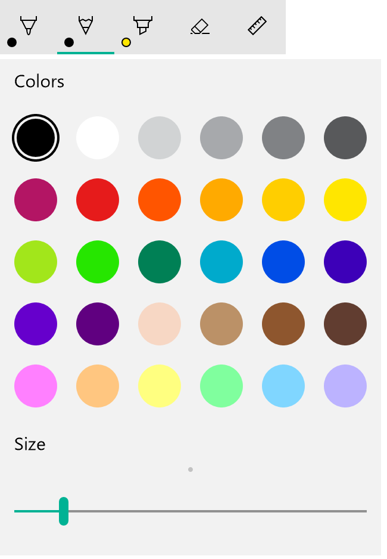
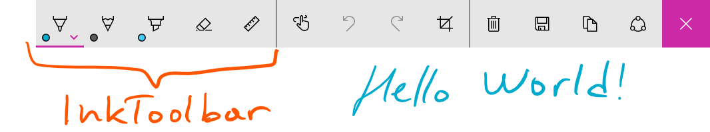
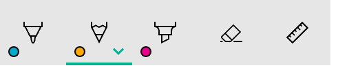
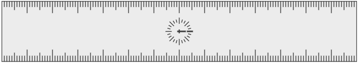

# Элементы управления рукописным вводом

<link rel="stylesheet" href="https://az835927.vo.msecnd.net/sites/uwp/Resources/css/custom.css">

В приложениях универсальной платформы Windows (UWP) рукописный ввод контролируется с помощью двух разных элементов управления: [**InkCanvas**](https://msdn.microsoft.com/en-us/library/windows/apps/windows.ui.xaml.controls.inkcanvas.aspx) и [**InkToolbar**](https://msdn.microsoft.com/en-us/library/windows/apps/windows.ui.xaml.controls.inktoolbar.aspx).

Элемент управления InkCanvas отображает ввод с помощью пера в виде росчерка пера (используя параметры цвета и толщины штриха по умолчанию) или росчерка стирания. Этот элемент управления представляет собой прозрачное наложение, которое не содержит никаких встроенных элементов пользовательского интерфейса для изменения свойств росчерка пера по умолчанию.

>**Примечание.**&nbsp;&nbsp;InkCanvas можно настроить так, чтобы обеспечить поддержку аналогичных функций для ввода с помощью мыши и сенсорного ввода.

Поскольку элемент управления InkCanvas не поддерживает изменение параметров росчерка пера по умолчанию, его можно связать с элементом управления InkToolbar. Элемент управления InkToolbar содержит настраиваемую и расширяемую коллекцию кнопок, которые включают связанные с рукописным вводом функции в элементе управления InkCanvas.

По умолчанию элемент управления InkToolbar содержит кнопки для рисования, стирания, выделения и отображения линейки. В зависимости от функции во всплывающем элементе могут отображаться другие параметры и команды, например цвет чернил, толщина росчерка и стирание всего написанного.

>**Примечание**&nbsp;&nbsp;. Элемент управления InkToolbar поддерживает ввод с помощью мыши и с помощью пера; кроме того, его можно настроить для распознавания сенсорного ввода.



<div class="important-apis" >
<b>Важные API</b><br/>
<ul>
<li><a href="https://msdn.microsoft.com/en-us/library/windows/apps/windows.ui.xaml.controls.inkcanvas.aspx"><strong>Класс InkCanvas</strong></a></li>
<li><a href="https://msdn.microsoft.com/en-us/library/windows/apps/windows.ui.xaml.controls.inktoolbar.aspx"><strong>Класс InkToolbar</strong></a></li>
<li><a href="https://msdn.microsoft.com/en-us/library/windows/apps/windows.ui.input.inking.inkpresenter.aspx"><strong>Класс InkPresenter</strong></a></li>
<li><a href="https://msdn.microsoft.com/library/windows/apps/br208524"><strong>Windows.UI.Input.Inking</strong></a></li>
</ul>

</div>
</div>


## Выбор правильного элемента управления

InkCanvas позволяет включить в приложении базовые функции рукописного ввода, не предоставляя пользователю никаких настроек рукописного ввода.

По умолчанию росчерки отображаются как рукописный ввод при использовании кончика пера (штрих черной шариковой ручки толщиной 2 пикселя) и как ластик при использовании кончика ластика. Если кончик ластика отсутствует, InkCanvas можно настроить для отображения ввода кончиком пера в виде росчерка стирания.

Свяжите элементы управления InkCanvas и InkToolbar, чтобы предоставить пользователям интерфейс для активации функций рукописного ввода и настройки основных свойств пера, таких как размер штриха, цвет и форма кончика пера.

>**Примечание.**&nbsp;&nbsp;Для более детальной настройки отображения росчерков пера с помощью элемента управления InkCanvas воспользуйтесь объектом [**InkPresenter**](https://msdn.microsoft.com/en-us/library/windows/apps/windows.ui.input.inking.inkpresenter.aspx).

## Примеры

**Microsoft Edge**

В браузере Edge элементы управления InkCanvas и InkToolbar используются для **веб-заметок**.  


**Windows Ink Workspace**

Элементы управления InkCanvas и InkToolbar также используются в **Windows Ink Workspace** для **альбома** и **наброска экрана**.  


## Создание элементов управления InkCanvas и InkToolbar

Чтобы добавить элемент управления InkCanvas в приложение, достаточно одной строки разметки:

```xaml
<InkCanvas x:Name=“myInkCanvas”/>
```

>**Примечание.**&nbsp;&nbsp;Сведения о детальной настройке элемента управления InkCanvas с использованием InkPresenter см. в статье [«Взаимодействие с помощью пера в приложениях UWP»](http://windowsstyleguide/input-and-devices/pen-and-stylus-interactions/).

Элементы управления InkToolbar и InkCanvas необходимо использовать вместе. Чтобы включить элемент управления InkToolbar (со всеми встроенными инструментами) в приложение, необходима одна дополнительная строка разметки:

 ```xaml
<InkToolbar TargetInkCanvas=“{x:Bind myInkCanvas}”/>
 ```

Она позволяет отобразить следующий элемент управления InkToolbar:


### Встроенные кнопки

Элемент управления InkToolbar содержит следующие встроенные кнопки:

**Перья**

- Шариковая ручка: рисует сплошной непрозрачный росчерк круглым кончиком пера. Размер росчерка зависит от давления на перо.
- Карандаш: рисует текстурированный полупрозрачный росчерк с плавными границами (полезно для многоуровневых эффектов затенения) круглым кончиком пера. Цвет росчерка (интенсивность) зависит от давления на перо.
- Маркер: рисует полупрозрачный росчерк прямоугольным кончиком пера.

Во всплывающем элементе можно настроить цветовую палитру и атрибуты размера (минимальный, максимальный, по умолчанию) для каждого пера.

**Инструмент**

- Ластик: удаляет все росчерки пера, которых касается. Обратите внимание, что удаляется весь росчерк пера, а не только часть, по которой провели ластиком.

**Переключение**

- Линейка: отображает или скрывает линейку. При рисовании у края линейки росчерк пера прикрепляется к линейке.  
 

Несмотря на то что это конфигурация по умолчанию, вы сохраняете полный контроль над составом встроенных кнопок в элементе управления InkToolbar вашего приложения.

### Пользовательские кнопки

В элементе управления InkToolbar представлены две группы кнопок разных типов.

1. Группа кнопок-инструментов, которая включает встроенные кнопки для рисования, стирания и выделения. Сюда добавляются специальные перья и инструменты.
> **Примечание.**&nbsp;&nbsp;Функции являются взаимоисключающими.

2. Группа кнопок-переключателей, которая содержит встроенную кнопку линейки. Сюда добавляются специальные переключатели.
> **Примечание.**&nbsp;&nbsp;Эти функции не являются взаимоисключающими, их можно использовать вместе с другими активными элементами.

В зависимости от используемого приложения и требуемой функции рукописного ввода в элемент управления InkToolbar можно добавить любые нижеперечисленные кнопки (связанные со специальными функциями пера).

- Специальное перо— перо, для которого соответствующее приложение определяет цветовую палитру и свойства кончика пера, такие как форма, поворот и размер.
- Специальный инструмент— отличный от пера инструмент, который определяется соответствующим приложением.
- Специальный переключатель— включает или выключает определенную приложением функцию. Если функция включена, она действует вместе с активным инструментом.

> **Примечание.**&nbsp;&nbsp;Изменить порядок отображения встроенных кнопок невозможно. Они отображаются в следующем порядке: шариковая ручка, карандаш, маркер, ластик и линейка. Специальные перья добавляются после последнего пера по умолчанию, кнопки специальных инструментов располагаются между кнопкой последнего пера и кнопкой ластика, а кнопки специальных переключателей— после кнопки линейки (специальные кнопки добавляются в порядке настройки).

Элемент управления InkToolbar может являться элементом верхнего уровня, однако обычно он предоставляется с помощью кнопки или команды рукописного ввода. Для оформления значка верхнего уровня рекомендуется использовать глиф EE56 шрифта Segoe MLD2 Assets.

## Взаимодействие с элементом управления InkToolbar

Все встроенные кнопки перьев и инструментов включают всплывающее меню, где можно настроить свойства пера, а также форму и размер кончика пера. «Глиф расширения»  отображается на кнопке и указывает на наличие всплывающего элемента.

Всплывающий элемент отображается, когда пользователь повторно нажимает кнопку активного инструмента. Как только цвет или размер изменен, всплывающий элемент автоматически закрывается и рукописный ввод можно продолжать. Для специальных перьев и инструментов можно использовать всплывающий элемент по умолчанию или указать настраиваемый всплывающий элемент.

Ластик тоже имеет всплывающий элемент с командой **Удалить все рукописные данные**.  


 Сведения о пользовательской настройке и возможностях расширения см. в статье [Пример элемента управления SimpleInk](https://github.com/Microsoft/Windows-universal-samples/tree/master/Samples/SimpleInk).

## Возможности и ограничения

- Элемент управления InkCanvas (и рукописный ввод в общем) удобнее и эффективнее всего использовать с активным пером, однако если этого требует ваше приложение, мы рекомендуем включить поддержку рукописного ввода с помощью мыши и касания (включая неактивное перо).
- Используйте элемент управления InkToolbar вместе с InkCanvas, чтобы реализовать базовые функции и параметры рукописного ввода. Возможна программная настройка обоих элементов управления (InkCanvas и InkToolbar).
- Элемент управления InkToolbar (и рукописный ввод в общем) удобнее и эффективнее всего использовать с активным пером, однако если этого требует ваше приложение, можно включить поддержку рукописного ввода с помощью мыши и касания.
- Если реализуется поддержка рукописного ввода с помощью касания, рекомендуется использовать значок ED5F шрифта Segoe MLD2 Assets для кнопки переключения с подсказкой «Письмо касанием».
- Если используется несколько элементов управления InkCanvas, рекомендуется контролировать рукописный ввод на разных полотнах с помощью одного элемента управления InkToolbar.
- Для оптимальной производительности рекомендуется изменить всплывающий элемент по умолчанию, вместо того чтобы создавать один специальный всплывающий элемент для инструментов по умолчанию и специальных инструментов.

## Воспользуйтесь примерами

[В примере использования элемента управления SimpleInk](https://github.com/Microsoft/Windows-universal-samples/tree/master/Samples/SimpleInk) показано 8 сценариев реализации возможностей настройки и расширения элементов управления InkCanvas и InkToolbar. Каждый сценарий сопровождается базовыми инструкциями по наиболее распространенным ситуациям, в которых используется рукописный ввод, и реализации элементов управления.

Более подробный пример рукописного ввода см. в разделе [Пример использования элемента управления ComplexInk](https://github.com/Microsoft/Windows-universal-samples/tree/master/Samples/ComplexInk).

## Связанные разделы

- [Взаимодействие с помощью пера в приложениях UWP](http://windowsstyleguide/input-and-devices/pen-and-stylus-interactions/)
- [Распознавание росчерков пера](http://windowsstyleguide/input-and-devices/convert-ink-to-text/)
- [Хранение и извлечение росчерков пера](http://windowsstyleguide/input-and-devices/save-and-load-ink/)


<!--HONumber=Aug16_HO3-->


