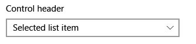

# Списки

<link rel="stylesheet" href="https://az835927.vo.msecnd.net/sites/uwp/Resources/css/custom.css"> 

Списки отображают содержимое коллекций и обеспечивают взаимодействие с ним. В этой статье описаны четыре шаблона списка:

-   представления списка, которые применяются преимущественно для отображения коллекций с большими объемами текста;
-   представления сетки, которые применяются преимущественно для отображения коллекций с большим количеством изображений;
-   раскрывающиеся списки, которые позволяют пользователю выбрать один элемент из развернутого списка;
-   окна со списками, позволяющие пользователям выбрать один или несколько элементов в окне, содержимое которого можно прокрутить.

В этой статье представлены рекомендации по проектированию, описаны возможности и приведены примеры каждого шаблона списка. В конце статьи приведены ссылки на другие статьи по данной теме и интерфейсы API.

<b>Важные API</b> 
<ul>
<li>[**Класс ListView**](https://msdn.microsoft.com/library/windows/apps/br242878)</li>
<li>[**Класс GridView**](https://msdn.microsoft.com/library/windows/apps/br242705)</li>
<li>[**Класс ComboBox**](https://msdn.microsoft.com/library/windows/apps/br209348)</li>
</ul>

## Представления списка

Представления списка позволяют упорядочивать элементы и назначать заголовки групп, а также перетаскивать элементы, организовывать содержимое и изменять порядок элементов.

### Выбор правильного элемента управления

Используйте представление списка, чтобы:

-   отображать коллекции содержимого, которые состоят преимущественно из текста;
-   перемещаться по отдельной или классифицированной коллекции содержимого;
-   создать основную панель в [шаблоне основных и подробных данных](master-details.md). Шаблон основных и подробных данных часто используется в приложениях электронной почты, в которых одна панель (основная) содержит список доступных для выбора элементов, а другая — подробное представление выбранного элемента.

### Примеры

Ниже приведено простое представление списка, отображающие сгруппированные данные на телефоне.

### Рекомендации

-   Элементы в списке должны вести себя одинаково.
-   Если список разделен на группы, можно использовать [контекстное масштабирование](semantic-zoom.md), чтобы облегчить пользователям навигацию по сгруппированному содержимому.

### Статьи, посвященные представлению списка
<table>
<colgroup>
<col width="50%" />
<col width="50%" />
</colgroup>
<thead>
<tr class="header">
<th align="left">Раздел</th>
<th align="left">Описание</th>
</tr>
</thead>
<tbody>
<tr class="odd">
<td align="left">
[Представления списка и сетки](listview-and-gridview.md)
</td>
<td align="left">
Знакомство с основами использования представления списка или сетки в вашем приложении.
</td>
</tr>
<tr class="even">
<td align="left">
[Шаблоны элементов представления списка](listview-item-templates.md)
</td>
<td align="left">
Элементы, которые отображаются в списке или сетке, могут играть важную роль в общем виде вашего приложения. Измените шаблоны элементов управления и шаблоны данных для определения внешнего вида элементов, чтобы ваше приложение отлично выглядело.
</td>
</tr>
<tr class="odd">
<td align="left">
[Перевернутые списки](inverted-lists.md)
</td>
<td align="left">
В перевернутых списках новые элементы добавляются снизу, как, например, в приложении чата. Следуйте этим рекомендациям для использования перевернутого списка в приложении.
</td>
</tr>
<tr class="even">
<td align="left">
[Обновление путем оттягивания](pull-to-refresh.md)
</td>
<td align="left">
Схема с обновлением путем оттягивания позволяет пользователю потянуть список данных вниз, чтобы получить дополнительные данные. Используйте эти рекомендации для реализации обновления путем оттягивания в представлении списка.
</td>
</tr>
<tr class="odd">
<td align="left">
[Вложенные элементы пользовательского интерфейса](nested-ui.md)
</td>
<td align="left">
Вложенный элемент пользовательского интерфейса предоставляет активные элементы управления, заключенные в контейнер, с которым пользователи также могут выполнять действия. Например, элемент представления списка может содержать кнопку, и пользователь может выбрать элемент списка или нажать вложенную в него кнопку. Следуйте этим рекомендациям для оптимизации работы пользователей с вложенными элементами пользовательского интерфейса.
</td>
</tr>
</tbody>
</table>

## Представления сетки

Представления сетки подходят для упорядочивания и просмотра коллекций изображений. Макет сетки прокручивается вертикально и сдвигается по горизонтали. Элементы размещаются и считываются слева направо, а затем сверху вниз.

### Выбор правильного элемента управления

Используйте представление сетки, чтобы:

-   отображать коллекции содержимого, которые состоят преимущественно из изображений;
-   отображать библиотеки содержимого;
-   форматировать два режима просмотра содержимого, связанных с [контекстным масштабированием](semantic-zoom.md).

### Примеры

В этом примере показан типичный макет сетки, в данном случае — для просмотра приложений. Метаданные элементов представления сетки обычно ограничиваются несколькими строками текста и оценкой элемента.

Представление сетки — это идеальное решение для библиотеки содержимого, которая часто используется для представления мультимедийного содержимого, например фотографий и видео. В библиотеке содержимого пользователь должен иметь возможность касаться элемента для вызова действия.

### Рекомендации

-   Элементы в списке должны вести себя одинаково.
-   Если список разделен на группы, можно использовать [контекстное масштабирование](semantic-zoom.md), чтобы облегчить пользователям навигацию по сгруппированному содержимому.

### Статьи, посвященные представлению сетки
<table>
<colgroup>
<col width="50%" />
<col width="50%" />
</colgroup>
<thead>
<tr class="header">
<th align="left">Раздел</th>
<th align="left">Описание</th>
</tr>
</thead>
<tbody>
<tr class="odd">
<td align="left">
[Представление списка и сетки](listview-and-gridview.md)
</td>
<td align="left">
Знакомство с основами использования представления списка или сетки в вашем приложении.
</td>
</tr>
<tr class="even">
<td align="left">
[Шаблоны элементов представления списка](listview-item-templates.md)
</td>
<td align="left">
Элементы, которые отображаются в списке или сетке, могут играть важную роль в общем виде вашего приложения. Измените шаблоны элементов управления и шаблоны данных для определения внешнего вида элементов, чтобы ваше приложение отлично выглядело.
</td>
</tr>
<tr class="odd">
<td align="left">
[Вложенные элементы пользовательского интерфейса](nested-ui.md)
</td>
<td align="left">
Вложенный элемент пользовательского интерфейса предоставляет активные элементы управления, заключенные в контейнер, с которым пользователи также могут выполнять действия. Например, элемент представления списка может содержать кнопку, и пользователь может выбрать элемент списка или нажать вложенную в него кнопку. Следуйте этим рекомендациям для оптимизации работы пользователей с вложенными элементами пользовательского интерфейса.
</td>
</tr>
</tbody>
</table>

## Раскрывающиеся списки

Раскрывающиеся списки, также известные как поля со списком, сначала находятся в компактном состоянии и разворачиваются, чтобы отобразить список доступных для выбора элементов. Выбранный элемент всегда видим, а невидимые элементы пользователь может отобразить, коснувшись поля со списком, чтобы развернуть его.

### Выбор правильного элемента управления

-   Используйте раскрывающийся список, чтобы дать пользователям возможность выбрать одно значение из набора элементов, которые можно надлежащим образом представить с помощью отдельных строк текста.
-   Используйте представление списка или сетки вместо поля со списком для отображения элементов, состоящих из нескольких строк текста или изображений.
-   Если элементов меньше пяти, возможно, лучше воспользоваться [переключателями](radio-button.md) (если можно выбрать только один элемент) или [флажками](checkbox.md) (если можно выбрать несколько элементов).
-   Используйте поле со списком, если элементы выбора не имеют большого значения для работы приложения. Если для большинства пользователей в большей части ситуаций рекомендуется использовать вариант по умолчанию, отображение всех элементов в списке может привлечь излишнее внимание к вариантам. Поле со списком позволяет экономить пространство и не отвлекать пользователя.

### Примеры

Поле со списком в компактном состоянии может отображать заголовок.

Хотя поля со списком разворачиваются для поддержки более длинных строк, избегайте слишком длинных строк, так как их сложно читать.

Если коллекция в поле со списком достаточно длинная, появляется полоса прокрутки. Логически группируйте элементы в списке.

### Рекомендации

-   Ограничьте текстовое содержимое элементов полей со списком одной строкой.
-   Сортируйте элементы в поле со списком в логическом порядке. Группируйте связанные параметры и размещайте часто используемые параметры в начале списка. Названия сортируйте в алфавитном порядке, числа — по возрастанию, даты — по хронологии.

### Поиск по тексту

Поля со списком автоматически поддерживают поиск в их коллекциях. По мере того, как пользователь вводит символы на физической клавиатуре, выбрав открытое или закрытое поле со списком, отображаются варианты, подходящие под строку пользователя. Эта функция особенно полезна при навигации по длинному списку. Например, при взаимодействии с раскрывающимся списком, содержащим список штатов, пользователь может нажать клавишу W, чтобы отобразить "Washington" для быстрого выбора. 

## Окна со списками

Окно со списком позволяет пользователю выбрать один или несколько элементов коллекции. Окна со списками аналогичны раскрывающимся спискам за исключением того, что они всегда открыты — у окна со списком нет компактного (не развернутого) состояния. Элементы списка можно прокручивать, если для отображения списка полностью не хватает места.

### Выбор правильного элемента управления

-   Окно со списком может быть полезно, если элементы списка достаточно важны и экранного пространства достаточно для отображения всего списка.
-   При важном выборе список должен привлечь внимание пользователя к полному списку вариантов. И наоборот, раскрывающийся список изначально привлекает внимание пользователя к выбранному элементу.
-   Не используйте список в следующих случаях.
    -   Список содержит очень малое число элементов. Список с возможностью выбора одного варианта, в котором содержится два пункта, лучше представить в виде [переключателей](radio-button.md). Также подумайте о возможности использования переключателей, если в списке 3 или 4 статических элемента.
    -   Список дает возможность выбрать один вариант из двух. Выбор одного варианта подразумевает, что другой не выбран — например, «включено» и «выключено». Используйте один флажок или тумблер.
    -   Очень большое число элементов. Для длинных списков оптимальным решением является представление сетки и представление списка. Для очень длинных списков сгруппированных данных лучше использовать контекстное масштабирование.
    -   Список представляет собой непрерывные числовые значения. В этом случае попробуйте использовать [ползунок](slider.md).
    -   Элементы выбора не имеют большого значения для работы приложения, или же рекомендуется использовать вариант по умолчанию для большинства пользователей и ситуаций. Вместо списка используйте раскрывающийся список.

### Рекомендации

-   Идеальное количество элементов в окне со списком — от 3 до 9.
-   Также окно со списком хорошо подходит, если элементы списка могут динамически изменяться.
-   По возможности настройте размер окна со списком таким образом, чтобы список элементов не нужно было сдвигать или прокручивать.
-   Убедитесь, что цель окна со списком, а также выбранные в данный момент элементы понятны.
-   Предусмотрите визуальные эффекты и анимации для реакции на касание и состояние выбора элементов.
-   Ограничьте текстовое содержимое элементов списка одной строкой. Если элементы списка — это визуальные элементы, можно настроить их размер. Если элемент содержит несколько строк текста или изображений, используйте представление сетки или представление списка.
-   Используйте шрифт по умолчанию, если руководство по использованию корпоративного стиля не требует использования другого шрифта.
-   Не используйте окно с списком для выполнения команд или динамического скрытия либо отображения других элементов управления.

## Режим выделения

Режим выделения позволяет пользователям выбирать один или несколько элементов и выполнять с ними действия. Его можно вызвать через контекстное меню с помощью клавиши CTRL+щелчок или SHIFT+щелчок элемента, а также путем прокручивания до цели в представлении галереи. Когда режим выделения активен, флажки отображаются рядом с каждым элементом списка, а действия — в верхней или нижней части экрана.

Существуют три различных режима выбора:

-   Выбор одного элемента — пользователь может выбрать только один элемент за раз.
-   Выбор нескольких элементов — пользователь может выбрать несколько элементов без использования модификаторов.
-   Расширенный выбор — пользователь может выбрать несколько элементов с помощью модификатора, например, удерживая клавишу SHIFT.

Чтобы выбрать элемент, прикоснитесь к нему в любом месте. Прикосновение к действию на панели команд действует на все выбранные элементы. Если ни один элемент не выбран, действия на панели команд должны быть неактивны, кроме действия «Выделить все».

Для режима выделения не предусмотрена модель исчезновения. Если коснуться экрана за пределами кадра, в котором активен режим выделения, то режим отменен не будет. Это нужно, чтобы предотвратить случайное выключение режима. При нажатии кнопки «Назад» режим выбора нескольких элементов отменяется.

При выборе действия должно быть визуальное подтверждение. Для некоторых действий рекомендуется показывать диалоговое окно подтверждения, особенно для деструктивных действий, например удаления.

Режим выделения ограничен страницей, на которой он активен, и не влияет на какие-либо элементы за пределами этой страницы.

Точка входа в режим выделения должна находиться рядом с содержимым, на которое она влияет.

Рекомендации по панели команд см. в разделе [Руководство по панелям команд](app-bars.md).

## Глобализация и локализация: контрольный список

<table>
<tr>
<th>Создание программы-оболочки</th><td>Разрешите использовать две строки для метки списка.</td>
</tr>
<tr>
<th>Горизонтальное расширение</th><td>Убедитесь, что поля поддерживают расширение текста и прокручиваются.</td>
</tr>
<tr>
<th>Вертикальный интервал</th><td>Используйте для вертикального интервала символы, не входящие в латинский алфавит, чтобы символы других алфавитов правильно отображались.</td>
</tr>
</table>

## Связанные разделы

- [Главный раздел](hub.md)
- [Основные и подробные данные](master-details.md)
- [Панель навигации](nav-pane.md)
- [Контекстное масштабирование](semantic-zoom.md)
- [Перетаскивание](https://msdn.microsoft.com/windows/uwp/app-to-app/drag-and-drop)

**Для разработчиков**
- [**Класс ListView**](https://msdn.microsoft.com/library/windows/apps/br242878)
- [**Класс GridView**](https://msdn.microsoft.com/library/windows/apps/br242705)
- [**Класс ComboBox**](https://msdn.microsoft.com/library/windows/apps/br209348)
- [**Класс ListBox**](https://msdn.microsoft.com/library/windows/apps/br242868)

<!--HONumber=Dec16_HO2-->

