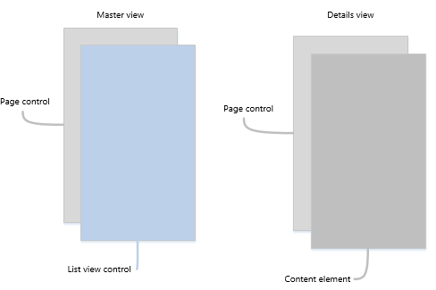
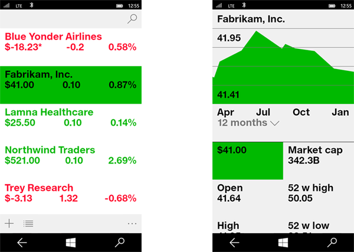

# Шаблон основных и подробных данных

<link rel="stylesheet" href="https://az835927.vo.msecnd.net/sites/uwp/Resources/css/custom.css"> 

В шаблоне основных и подробных есть главная панель (обычно с [представлением списка](lists.md)) и область сведений для содержимого. Если выбрать элемент в главном списке, область сведений обновляется. Этот шаблон часто используется для работы с электронной почтой и адресными книгами.

## Выбор правильного шаблона

Шаблон основных и подробных данных хорошо подходит, если вам нужно:

-   выполнить сборку приложения электронной почты, адресной книги или любого приложения на основе макета списка;
-   найти и назначить приоритет для большой коллекции содержимого;
-   разрешить быстрое добавление и удаление элементов из списка при работе между контекстами;

## выбрать правильный стиль.

При реализации шаблона основных и подробных данных рекомендуется использовать стиль стопкой или рядом в зависимости от доступного места на экране.

| Доступная ширина окна | Рекомендуемый стиль |
|------------------------|-------------------|
| 320–719 epx        | Стопкой           |
| 720 epx или шире       | Рядом      |

 
## Стиль стопкой

При использовании расположения стопкой отображается только одна панель: главная или область сведений.

Пользователь начинает с главной панели и детализирует до области сведений, выбирая элемент в главном списке. Пользователям кажется, что основное и подробное представления существуют на двух отдельных страницах.

### Создание шаблона основных и подробных данных стопкой

Один из способов создания шаблона основных и подробных данных заключается в использовании отдельных страниц для главной панели и области сведений. Разместите представление списка для главного списка на одной странице, а элемент содержимого для области сведений— на отдельной странице.

На главной панели элемент управления [Представление списка](lists.md) хорошо подходит для отображения списков, которые могут содержать изображения и текст.

В области сведений используйте элемент содержимого, который подходит лучше всего. Если имеется множество отдельных полей, можно использовать макет сетки для размещения элементов в форме.

## Стиль рядом

В стиле рядом главная панель и область сведений отображается одновременно.

В списке на главной панели есть визуальный элемент выбора для указания выбранного элемента. При выборе нового элемента в главном списке обновляется область сведений.

### Создание шаблона основных и подробных данных рядом

На главной панели элемент управления [Представление списка](lists.md) хорошо подходит для отображения списков, которые могут содержать изображения и текст.

В области сведений используйте элемент содержимого, который подходит лучше всего. Если имеется множество отдельных полей, можно использовать макет сетки для размещения элементов в форме.

## Примеры.

Эта разработка приложения, которое следит за биржей, использует шаблон основных и подробных данных. В этом примере приложения (как оно выглядит на телефоне) главная панель или список располагается слева, а область сведений — справа.

Эта разработка приложения, которое следит за биржей, использует шаблон основных и подробных данных. В этом примере приложения (как оно выглядит на компьютере) главная панель или список и область сведений видимы и отображаются на весь экран. На главной панели есть поле поиска вверху и панель команд внизу.

## Связанные разделы

- [Списки](lists.md)
- [Поиск](search.md)
- [Панели приложения и команды](app-bars.md)
- [**Класс ListView (XAML)**](https://msdn.microsoft.com/library/windows/apps/br242878)

<!--HONumber=Aug16_HO3-->

