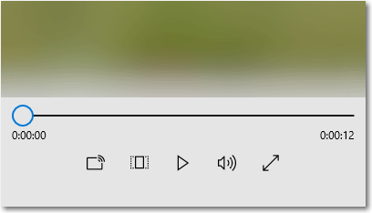

# Проигрыватель мультимедиа

Проигрыватель мультимедиа используется для просмотра и прослушивания видео, звука и изображений. Воспроизведение мультимедиа может быть встроенным (внедренным на страницу или в группу других элементов управления) либо выполняться в специальном полноэкранном режиме. Вы можете изменить набор кнопок проигрывателя и фон панели элементов управления, а также упорядочить макеты любым способом. Просто помните, что пользователи ожидают базовый набор элементов управления (кнопка воспроизведения/паузы, переход вперед, переход назад).



<span class="sidebar_heading" style="font-weight: bold;">Важные API</span>

-   [**Класс MediaElement**](https://msdn.microsoft.com/library/windows/apps/br242926)
-   [**Класс MediaTransportControls**](https://msdn.microsoft.com/library/windows/apps/windows.ui.xaml.controls.mediatransportcontrols)

## Выбор правильного элемента управления

Для воспроизведения звука и видео в приложении используется проигрыватель мультимедиа. Для просмотра коллекции изображений используется [представление пролистывания](flipview.md).

## Примеры

Элемент мультимедиа в приложении «Начало работы» для Windows 10.


## Создание проигрывателя мультимедиа
Чтобы добавить мультимедиа в свое приложение, создайте объект [**MediaElement**](https://msdn.microsoft.com/library/windows/apps/br242926) в XAML-коде и запишите в свойство [**Source**](https://msdn.microsoft.com/library/windows/apps/br227419) универсальный код ресурса (URI), указывающий на звуковой или видеофайл.

Этот код XAML создает объект [**MediaElement**](https://msdn.microsoft.com/library/windows/apps/br242926), в свойство [**Source**](https://msdn.microsoft.com/library/windows/apps/br227419) которого записывается локальный относительно приложения URI видеофайла. Объект **MediaElement** начинает воспроизведение в момент загрузки страницы. Чтобы воспроизведение мультимедиа начиналось не сразу, можно установить для свойства [**AutoPlay**](https://msdn.microsoft.com/library/windows/apps/br227360) значение **false**.

```xaml
<MediaElement x:Name="mediaSimple" 
              Source="Videos/video1.mp4" 
              Width="400" AutoPlay="False"/>
```

Этот XAML создает объект [**MediaElement**](https://msdn.microsoft.com/library/windows/apps/br242926), у которого включены встроенные элементы управления транспортировкой, а для свойства [**AutoPlay**](https://msdn.microsoft.com/library/windows/apps/br227360) установлено значение **false**.


```csharp
<MediaElement x:Name="mediaPlayer" 
              Source="Videos/video1.mp4" 
              Width="400" 
              AutoPlay="False"
              AreTransportControlsEnabled="True"/>
```

### Элементы управления транспортировкой мультимедиа
MediaElement содержит встроенные элементы управления транспортировкой, которые контролируют воспроизведение, остановку, паузу, громкость, выключение звука, поиск и отображение хода выполнения, а также выбор звуковых дорожек. Чтобы включить эти элементы управления, установите для свойства [**AreTransportControlsEnabled**](https://msdn.microsoft.com/library/windows/apps/dn298977) значение **true**. Чтобы отключить их, установите для свойства **AreTransportControlsEnabled** значение **false**. Элементы управления транспортировкой представлены классом [**MediaTransportControls**](https://msdn.microsoft.com/library/windows/apps/dn831962). Вы можете использовать элементы управления транспортировкой как есть или настраивать их различными способами. Подробнее см. в справочнике по классам [**MediaTransportControls**](https://msdn.microsoft.com/library/windows/apps/dn831962) и в разделе [Создание пользовательских элементов управления транспортировкой](custom-transport-controls.md).

Элементы управления транспортировкой позволяют пользователю контролировать большинство аспектов [**MediaElement**](https://msdn.microsoft.com/library/windows/apps/br242926), но **MediaElement** также предоставляет многочисленные свойства и методы, которые можно использовать для управления воспроизведением аудио и видео. Подробнее см. в разделе [Управление MediaElement программным способом](#control_mediaelement_programmatically) далее в этой статье.

Элементы управления транспортировкой поддерживает макеты с одной и двумя строками. Первый пример — это однострочный макет с кнопкой «Воспроизведение/пауза», расположенной слева от временной шкалы мультимедиа. Этот макет лучше всего подходит для компактных экранов. 


Макет элементов управления из двух строк (показан ниже) рекомендуется для большинства сценариев использования, особенно на больших экранах. Этот макет предоставляет больше места для элементов управления и упрощает работу пользователя с временной шкалой.


**Системные элементы управления передачей мультимедиа**

Вы можете также интегрировать [**MediaElement**](https://msdn.microsoft.com/library/windows/apps/br242926) с системными элементами управления транспортировкой мультимедиа. Системные элементы управления транспортировкой открываются при нажатии клавиши на мультимедийном оборудовании, например, клавиш мультимедиа на клавиатуре. Если пользователь нажимает клавишу ПАУЗА на клавиатуре и ваше приложение поддерживает [**SystemMediaTransportControls**](https://msdn.microsoft.com/library/windows/apps/dn278677), приложение получает уведомление и может выполнить соответствующее действие. Подробнее см. в разделе [Системные элементы управления транспортировкой мультимедиа](https://msdn.microsoft.com/library/windows/apps/mt228338).

### Задание источника мультимедиа
Для воспроизведения файлов, находящихся в сети или входящих в состав приложения, достаточно указать в свойстве [**Source**](https://msdn.microsoft.com/library/windows/apps/br227419) путь к файлу.

**Подсказка.** Для открытия файлов в Интернете необходимо объявить возможность **Internet (Client)** в манифесте приложения (Package.appxmanifest). Подробнее об объявлении возможностей см. в разделе [Объявления возможностей приложения](https://msdn.microsoft.com/library/windows/apps/mt270968).

 

Этот код пытается установить в свойстве [**Source**](https://msdn.microsoft.com/library/windows/apps/br227419) объекта [**MediaElement**](https://msdn.microsoft.com/library/windows/apps/br242926), определенного в XAML, путь к файлу, введенный в поле [**TextBox**](https://msdn.microsoft.com/library/windows/apps/br209683).

```xaml
<TextBox x:Name="txtFilePath" Width="400" 
         FontSize="20"
         KeyUp="TxtFilePath_KeyUp"
         Header="File path"
         PlaceholderText="Enter file path"/>
```

```csharp
private void TxtFilePath_KeyUp(object sender, KeyRoutedEventArgs e)
{
    if (e.Key == Windows.System.VirtualKey.Enter)
    {
        TextBox tbPath = sender as TextBox;

        if (tbPath != null)
        {
            LoadMediaFromString(tbPath.Text);
        }
    }
}

private void LoadMediaFromString(string path)
{
    try
    {
        Uri pathUri = new Uri(path);
        mediaPlayer.Source = pathUri;
    }
    catch (Exception ex)
    {
        if (ex is FormatException)
        {
            // handle exception. 
            // For example: Log error or notify user problem with file
        }
    }
}
```

Чтобы задать файл, встроенный в приложение, в качестве источника мультимедиа, создайте объект [**Uri**](https://msdn.microsoft.com/library/windows/apps/br226017) с путем, начинающимся с **ms-appx:///**, и задайте его в свойстве [**Source**](https://msdn.microsoft.com/library/windows/apps/br227419). Например, для файла **video1.mp4**, расположенного во вложенной папке **Videos**, путь будет выглядеть так: **ms-appx:///Videos/video1.mp4**

Этот код присваивает свойству [**Source**](https://msdn.microsoft.com/library/windows/apps/br227419) объекта [**MediaElement**](https://msdn.microsoft.com/library/windows/apps/br242926), заданного раньше в XAML, значение **ms-appx:///Videos/video1.mp4**.

```csharp
private void LoadEmbeddedAppFile()
{
    try
    {
        Uri pathUri = new Uri("ms-appx:///Videos/video1.mp4");
        mediaPlayer.Source = pathUri;
    }
    catch (Exception ex)
    {
        if (ex is FormatException)
        {
            // handle exception. 
            // For example: Log error or notify user problem with file
        }
    }
}
```

### Открытие локальных файлов мультимедиа
Чтобы открыть файлы в локальной системе или из OneDrive, можно использовать объект [**FileOpenPicker**](https://msdn.microsoft.com/library/windows/apps/br207847) для получения файла и метод [**SetSource**](https://msdn.microsoft.com/library/windows/apps/br244338) для установки источника мультимедиа. Также вы можете получить доступ к пользовательским папкам мультимедиа программным способом.

Если приложению нужен доступ без взаимодействия с пользователем к папкам **Музыка** или **Видео** (например, если вы перечисляете все файлы музыки и видео в коллекции пользователя и отображаете их в своем приложении), то необходимо объявить возможности **Music Library** и **Video Library**. Дополнительные сведения см. в статье [Файлы и папки в библиотеках музыки, изображений и видео](https://msdn.microsoft.com/library/windows/apps/mt188703).

[
            **FileOpenPicker**](https://msdn.microsoft.com/library/windows/apps/br207847) не требует специальных возможностей для доступа к файлам в локальной файловой системе, таким как папки **Музыка** или **Видео** пользователя, поскольку пользователь может полностью контролировать, к какому файлу выполняется доступ. С точки зрения безопасности и конфиденциальности лучше свести к минимуму число возможностей, используемых приложением.

**Открытие локального мультимедиа с помощью FileOpenPicker**

1.  Вызовите [**FileOpenPicker**](https://msdn.microsoft.com/library/windows/apps/br207847), чтобы пользователь мог выбрать файл мультимедиа.

    Вызовите класс [**FileOpenPicker**](https://msdn.microsoft.com/library/windows/apps/br207847), чтобы выбрать файл мультимедиа. Задайте значение [**FileTypeFilter**](https://msdn.microsoft.com/library/windows/apps/br207850), чтобы указать, какой тип файлов отображает **FileOpenPicker**. Вызовите метод [**PickSingleFileAsync**](https://msdn.microsoft.com/library/windows/apps/jj635275), чтобы открыть окно выбора файла и получить файл.

2.  Вызовите [**SetSource**](https://msdn.microsoft.com/library/windows/apps/br244338), чтобы установить выбранный файл мультимедиа в качестве [**MediaElement.Source**](https://msdn.microsoft.com/library/windows/apps/br227419).

    Чтобы установить значение свойства [**Source**](https://msdn.microsoft.com/library/windows/apps/br227419) объекта [**MediaElement**](https://msdn.microsoft.com/library/windows/apps/br242926) равным объекту [**StorageFile**](https://msdn.microsoft.com/library/windows/apps/br227171), возвращенному из метода [**FileOpenPicker**](https://msdn.microsoft.com/library/windows/apps/br207847), необходимо открыть поток. Вызовите метод [**OpenAsync**](https://msdn.microsoft.com/library/windows/apps/dn889851) в **StorageFile**, возвращающий поток, который можно передать в метод [**MediaElement.SetSource**](https://msdn.microsoft.com/library/windows/apps/br244338). После этого вы можете вызвать метод [**Play**](https://msdn.microsoft.com/library/windows/apps/br227402) объекта **MediaElement**, чтобы запустить мультимедиа.

В этом примере продемонстрировано использование [**FileOpenPicker**](https://msdn.microsoft.com/library/windows/apps/br207847) для выбора файла и задания файла в качестве свойства [**Source**](https://msdn.microsoft.com/library/windows/apps/br227419) элемента [**MediaElement**](https://msdn.microsoft.com/library/windows/apps/br242926).

```xaml
<MediaElement x:Name="mediaPlayer"/>
...
<Button Content="Choose file" Click="Button_Click"/>
```

```csharp
private async void Button_Click(object sender, RoutedEventArgs e)
{
    await SetLocalMedia();
}

async private System.Threading.Tasks.Task SetLocalMedia()
{
    var openPicker = new Windows.Storage.Pickers.FileOpenPicker();

    openPicker.FileTypeFilter.Add(".wmv");
    openPicker.FileTypeFilter.Add(".mp4");
    openPicker.FileTypeFilter.Add(".wma");
    openPicker.FileTypeFilter.Add(".mp3");

    var file = await openPicker.PickSingleFileAsync();
    
    // mediaPlayer is a MediaElement defined in XAML
    if (file != null)
    {
        var stream = await file.OpenAsync(Windows.Storage.FileAccessMode.Read);
        mediaPlayer.SetSource(stream, file.ContentType);

        mediaPlayer.Play();
    }
}
```

### Задание источника плаката
Вы можете использовать свойство [**PosterSource**](https://msdn.microsoft.com/library/windows/apps/br227409), чтобы дать элементу [**MediaElement**](https://msdn.microsoft.com/library/windows/apps/br242926) визуальное представления до загрузки мультимедиа. **PosterSource** — это изображение, например снимок экрана или киноафиша, отображаемые вместо мультимедиа. **PosterSource** отображается в следующих случаях.

-   Если действительный источник не установлен. Например, [**Source**](https://msdn.microsoft.com/library/windows/apps/br227419) не установлен, для **Source** было установлено значение **NULL**, либо источник недопустим (как в случае возникновения события [**MediaFailed**](https://msdn.microsoft.com/library/windows/apps/br227393)).
-   В ходе загрузки мультимедиа. Например, установлен действительный источник, но событие [**MediaOpened**](https://msdn.microsoft.com/library/windows/apps/br227394) еще не произошло.
-   При потоковой передаче мультимедиа на другое устройство.
-   Если мультимедиа — только звук.

Вот элемент [**MediaElement**](https://msdn.microsoft.com/library/windows/apps/br242926), для параметра [**Source**](https://msdn.microsoft.com/library/windows/apps/br227419) которого установлена запись альбома, a для параметра [**PosterSource**](https://msdn.microsoft.com/library/windows/apps/br227409) установлена титульная страница альбома.

```xaml
<MediaElement Source="Media/Track1.mp4" PosterSource="Media/AlbumCover.png"/> 
```

### Поддержание активности экрана устройства
Обычно устройства затемняют и затем отключают дисплей, чтобы увеличить время работы батареи, когда пользователь не совершает никаких операций. Но приложения для воспроизведения видео должны предотвращать отключение дисплея, чтобы пользователи могли смотреть видео. Чтобы предотвратить отключение дисплея, когда пользователь не выполняет никаких действий, например при воспроизведении видео в полноэкранном режиме, можно вызвать метод [**DisplayRequest.RequestActive**](https://msdn.microsoft.com/library/windows/apps/br241818). С помощью класса [**DisplayRequest**](https://msdn.microsoft.com/library/windows/apps/br241816) можно сообщить Windows, что дисплей не должен отключаться, чтобы пользователь мог смотреть видео.

Чтобы не отправлять запросы дисплею, если это больше не требуется, а также для экономии энергии и уровня заряда батареи, необходимо вызвать [**DisplayRequest.RequestRelease**](https://msdn.microsoft.com/library/windows/apps/br241819). Windows автоматически деактивирует активные запросы дисплея вашего приложения, когда оно удаляется с экрана, и снова активирует их, когда приложение возвращается на передний план.

Вот некоторые из ситуаций, при которых необходимо высвобождать запросы отображения:

-   Воспроизведение видео приостановлено. Например, действием пользователя, буферизацией или из-за ограниченной пропускной способности сети.
-   Воспроизведение остановлено. Например, файл видео закончился или презентация завершена.
-   Произошла ошибка воспроизведения. Например, из-за проблем подключения к сети или поврежденного файла.

**Поддержание активности экрана**

1.  Создайте глобальную переменную [**DisplayRequest**](https://msdn.microsoft.com/library/windows/apps/br241816). Инициализируйте ее значением NULL.
```csharp
// Create this variable at a global scope. Set it to null.
private DisplayRequest appDisplayRequest = null;
```

2.  Вызовите метод [**RequestActive**](https://msdn.microsoft.com/library/windows/apps/br241818), чтобы уведомить Windows о том, что приложение требует не отключать дисплей.

3.  Вызовите метод [**RequestRelease**](https://msdn.microsoft.com/library/windows/apps/br241819), чтобы отменить запрос дисплея, если воспроизведение остановлено, приостановлено или прервано из-за ошибки воспроизведения. Если у вашего приложения больше нет активных запросов дисплея, Windows уменьшает яркость дисплея (и затем отключает его), чтобы увеличить время работы батареи, когда устройством не пользуются.

    Здесь используется событие [**CurrentStateChanged**](https://msdn.microsoft.com/library/windows/apps/br227375) для обнаружения таких ситуаций. Затем с помощью свойства [**IsAudioOnly**](https://msdn.microsoft.com/library/windows/apps/hh965334) определите тип воспроизводимого файла (аудио или видео) и поддерживайте экран активным, только если воспроизводится видео.
    ```xaml
<MediaElement Source="Media/video1.mp4"
              CurrentStateChanged="MediaElement_CurrentStateChanged"/>
    ```
 
    ```csharp
private void MediaElement_CurrentStateChanged(object sender, RoutedEventArgs e)
{
    MediaElement mediaElement = sender as MediaElement;
    if (mediaElement != null && mediaElement.IsAudioOnly == false)
    {
        if (mediaElement.CurrentState == Windows.UI.Xaml.Media.MediaElementState.Playing)
        {                
            if (appDisplayRequest == null)
            {
                // This call creates an instance of the DisplayRequest object. 
                appDisplayRequest = new DisplayRequest();
                appDisplayRequest.RequestActive();
            }
        }
        else // CurrentState is Buffering, Closed, Opening, Paused, or Stopped. 
        {
            if (appDisplayRequest != null)
            {
                // Deactivate the display request and set the var to null.
                appDisplayRequest.RequestRelease();
                appDisplayRequest = null;
            }
        }            
    }
} 
    ```

### Управление проигрывателем мультимедиа программными средствами
[
              **MediaElement**
            ](https://msdn.microsoft.com/library/windows/apps/br242926) предоставляет многочисленные свойства, методы и события для управления воспроизведением звука и видео. Полный перечень свойств, методов и событий см. на странице справки по объекту [**MediaElement**](https://msdn.microsoft.com/library/windows/apps/br242926).
    

### Выбор звуковых дорожек на разных языках

Чтобы сменить язык звуковой дорожки видео, используйте свойство [**AudioStreamIndex**](https://msdn.microsoft.com/library/windows/apps/br227358) и метод [**GetAudioStreamLanguage**](https://msdn.microsoft.com/library/windows/apps/br227384). Видеофайлы также могут содержать несколько звуковых дорожек (например, комментарии режиссера к фильму). В этом примере конкретно показано, как переключать языки, но вы можете изменить этот код для переключения любых звуковых дорожек.

**Выбор звуковых дорожек на разных языках**

1.  Получение звуковых дорожек.

    Чтобы найти дорожку на конкретном языке, начните перебирать дорожки в цикле, проверяя язык каждой из них. Используйте [**AudioStreamCount**](https://msdn.microsoft.com/library/windows/apps/br227356) в качестве максимального значения переменной цикла **for**.

2.  Получение языка звуковой дорожки.

    Для получения языка дорожки используйте метод [**GetAudioStreamLanguage**](https://msdn.microsoft.com/library/windows/apps/br227384). Язык звуковой дорожки идентифицируется [кодом языка](http://msdn.microsoft.com/library/ms533052(vs.85).aspx), например **en** для английского или **ru** для русского.

3.  Установка активной звуковой дорожки.

    Найдя дорожку на нужном языке, установите для свойства [**AudioStreamIndex**](https://msdn.microsoft.com/library/windows/apps/br227358) значение, равное индексу этой дорожки. Если присвоить свойству **AudioStreamIndex** значение **NULL**, будет выбрана звуковая дорожка по умолчанию, которая определяется содержимым.

Вот код, который пытается установить указанный язык звуковой дорожки. В нем перебираются все звуковые дорожки [**MediaElement**](https://msdn.microsoft.com/library/windows/apps/br242926), а для получения языка каждой дорожки используется метод [**GetAudioStreamLanguage**](https://msdn.microsoft.com/library/windows/apps/br227384). Если дорожка с желаемым языком существует, для свойства [**AudioStreamIndex**](https://msdn.microsoft.com/library/windows/apps/br227358) устанавливается значение, равное индексу этой дорожки.

```csharp
/// <summary>
/// Attemps to set the audio track of a video to a specific language
/// </summary>
/// <param name="lcid">The id of the language. For example, "en" or "ja"</param>
/// <returns>true if the track was set; otherwise, false.</returns>
private bool SetAudioLanguage(string lcid, MediaElement media)
{
    bool wasLanguageSet = false;

    for (int index = 0; index < media.AudioStreamCount; index++)
    {
        if (media.GetAudioStreamLanguage(index) == lcid)
        {
            media.AudioStreamIndex = index;
            wasLanguageSet = true;
        }
    }

    return wasLanguageSet;
}
```

### Включение полнооконной прорисовки видео

Настройте свойство [**IsFullWindow**](https://msdn.microsoft.com/library/windows/apps/dn298980) для включения и отключения полнооконной отрисовки. Если полнооконная прорисовка задается в программном коде приложения, всегда следует использовать свойство **IsFullWindow**, а не включать прорисовку вручную. Использование свойства **IsFullWindow** гарантирует, что будет выполнена оптимизация на уровне системы для повышения производительности и времени работы от батареи. Если полнооконная прорисовка настроена неправильно, то такая оптимизация может не работать.

Вот код, в котором создается объект [**AppBarButton**](https://msdn.microsoft.com/library/windows/apps/dn279244), переключающий полнооконную прорисовку.

```xaml
<AppBarButton Icon="FullScreen" 
              Label="Full Window"
              Click="FullWindow_Click"/>>
```

```csharp
private void FullWindow_Click(object sender, object e)
{
    mediaPlayer.IsFullWindow = !media.IsFullWindow;
}
```

### Изменение размера и растяжение видео

Свойство [**Stretch**](https://msdn.microsoft.com/library/windows/apps/br227422) позволяет изменить способ заполнения контейнера видеосодержимым. Видео меняет размер и растягивается в зависимости от значения [**Stretch**](https://msdn.microsoft.com/library/windows/apps/br242968). Состояния свойства **Stretch** аналогичны параметрам размера картинки на многих телевизорах. Вы можете привязать это свойство к кнопке и дать пользователю возможность выбрать предпочтительный вариант.

-   [
              **None**
            ](https://msdn.microsoft.com/library/windows/apps/br242968) — содержимое отображается в основном разрешении и исходном размере.
-   [
              **Uniform**
            ](https://msdn.microsoft.com/library/windows/apps/br242968) — заполняется максимальное пространство с сохранением пропорций и без потери частей изображения. Это может привести к появлению горизонтальных или вертикальных черных полос по краям видео, как в широкоэкранных режимах.
-   [
              **UniformToFill**
            ](https://msdn.microsoft.com/library/windows/apps/br242968) — заполняется все отведенное место, сохраняя пропорции. Это может привести к тому, что часть изображения будет обрезана, как в полноэкранных режимах.
-   [
              **Fill**
            ](https://msdn.microsoft.com/library/windows/apps/br242968) — заполняется все отведенное место, но без сохранения пропорций. Изображение не обрезается, но может быть растянуто, как в режимах с растяжением.

 В этом примере [**AppBarButton**](https://msdn.microsoft.com/library/windows/apps/dn279244) используется, чтобы циклически отображать параметры [**Stretch**](https://msdn.microsoft.com/library/windows/apps/br242968). Оператор **switch** проверяет текущее состояние свойства [**Stretch**](https://msdn.microsoft.com/library/windows/apps/br227422) и задает для него следующее значение из перечисления **Stretch**. Таким образом пользователь может циклически проходить по различным состояниям растяжения.

```xaml
<AppBarButton Icon="Switch" 
              Label="Resize Video"
              Click="PictureSize_Click" />
```

```csharp
private void PictureSize_Click(object sender, RoutedEventArgs e)
{
    switch (mediaPlayer.Stretch)
    {
        case Stretch.Fill:
            mediaPlayer.Stretch = Stretch.None;
            break;
        case Stretch.None:
            mediaPlayer.Stretch = Stretch.Uniform;
            break;
        case Stretch.Uniform:
            mediaPlayer.Stretch = Stretch.UniformToFill;
            break;
        case Stretch.UniformToFill:
            mediaPlayer.Stretch = Stretch.Fill;
            break;
        default:
            break;
    }
}
```

### Активация воспроизведения с низкой задержкой

Присвойте свойству [**RealTimePlayback**](https://msdn.microsoft.com/library/windows/apps/br227414) значение **true** в элементе [**MediaElement**](https://msdn.microsoft.com/library/windows/apps/br242926), чтобы позволить элементу мультимедиа уменьшить первоначальную задержку для воспроизведения. Это имеет первостепенное значение для приложений двусторонней связи и может быть необходимо в некоторых игровых ситуациях. Помните, что этот режим требует больше ресурсов и расходует больше заряда батареи.

В этом примере создается объект [**MediaElement**](https://msdn.microsoft.com/library/windows/apps/br242926), а его атрибуту [**RealTimePlayback**](https://msdn.microsoft.com/library/windows/apps/br227414) присваивается значение **true**.

```xaml
<MediaElement x:Name="mediaPlayer" RealTimePlayback="True"/>
```

```csharp
MediaElement mediaPlayer = new MediaElement();
mediaPlayer.RealTimePlayback = true;
```
    
## Рекомендации 

Проигрыватель мультимедиа поставляется с темной и светлой темами, но в большинстве случаев используется темная тема. Темный фон обеспечивает более высокую контрастность, особенно в условиях слабого освещения. Кроме того, панель элементов управления в таком случае не мешает просмотру.

Предложите максимальное удобство просмотра в полноэкранном режиме (по сравнению со встроенным режимом). Полноэкранный режим является оптимальным; во встроенном режиме возможности ограничены.

Если имеется достаточное пространство экрана, лучше использовать двухстрочный макет. Он предоставляет больше места для элементов управления, чем макет с одной строкой.

Вы можете добавить в проигрыватель мультимедиа любые пользовательские параметры для обеспечения наилучшего взаимодействия с приложением, но следует принять во внимание следующее.

-   Ограничьте настройку элементов управления по умолчанию, которые были оптимизированы для интерфейса воспроизведения мультимедиа.
-   На телефонах и других мобильных устройствах цветовая гамма устройства остается черной, но на ноутбуках и настольных компьютерах цвет наследуется из темы пользователя.
-   Старайтесь не перегружать панель элементов управления чрезмерным количеством параметров.
-   Не сжимайте временную шкалу мультимедиа меньше минимального размера по умолчанию; в противном случае будет серьезно ограничена ее эффективность.

## Связанные разделы

- [Основы проектирования команд в приложениях UWP](https://msdn.microsoft.com/library/windows/apps/dn958433)
- [Основы проектирования содержимого для приложений UWP](https://msdn.microsoft.com/library/windows/apps/dn958434)


<!--HONumber=May16_HO2-->


