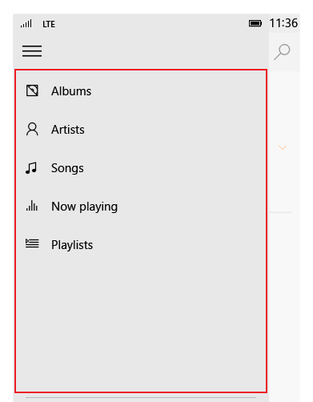

Панели навигации
=============================================================================================
Панель навигации — это шаблон, который позволяет использовать множество элементов навигации верхнего уровня, сохраняя при этом свободное пространство экрана. Панель навигации широко используется в мобильных приложениях, но также подходит и для больших экранов. При использовании как наложение панель остается свернутой и не открывается, пока пользователь не нажмет кнопку, что удобно для маленьких экранов. При использовании в режиме стыковки панель остается открытой, что обеспечивает больше возможностей, если экранного пространства достаточно.

Важные API

-   [**Класс SplitView (XAML)**](https://msdn.microsoft.com/library/windows/apps/dn864360)
-   [**Объект SplitView (HTML)**](https://msdn.microsoft.com/library/windows/apps/dn919970)

<<<<<<< HEAD

=======

>>>>>>> источник

Выбор правильного шаблона
-----------------------------------------------------------------------------------------------------------------------------------------------------------------

Панель навигации хорошо подходит:

-   для приложений с множеством элементов навигации верхнего уровня из одного класса, например для спортивного приложения с категориями «Футбол», «Бейсбол», «Баскетбол», «Регби» и т. д.;
-   для согласованного навигационного взаимодействия в приложениях, если на панели размещаются только элементы навигации;
-   для среднего и высокого количества (5-10+) категорий навигаций верхнего уровня;
-   для сохранения места на экране (в качестве наложения);
-   для навигационных элементов, к которым редко осуществляется доступ (в качестве наложения);
-   для сценариев перетаскивания (при закреплении).

Создание панели навигации
-------------------------------------------------------------------------------------------------------------------------------------

Шаблон панели навигации состоит из кнопки, панели для категорий навигации и области содержимого. Самый простой способ создать панель навигации — это использовать [элемент управления «Комбинированный режим»](split-view.md), который представляет собой пустую панель с всегда видимой областью содержимого. Панель может быть видимой или скрытой и может располагаться в левой или правой части окна приложения.

Если вы хотите создать панель навигации без элемента управления «Комбинированный режим», вам понадобятся три основных компонента: кнопка, панель и область содержимого. Кнопка позволяет пользователю открывать и закрывать панель. Панель — это контейнер для размещения элементов навигации. В области содержимого отображаются сведения из выбранного элемента навигации. Панель навигации также может работать в закрепленном состоянии, когда она всегда отображается; в этом случае кнопка не будет нужна.

### Кнопка

Кнопка панели навигации представляется по умолчанию в виде трех горизонтальных линий и обычно называется «кнопкой-гамбургером». Эта кнопка позволяет пользователю открывать и закрывать панель навигации по мере необходимости. Она не перемещается вместе с панелью. Рекомендуется размещать кнопку в верхнем левом углу приложения. Кнопка не перемещается с панелью.

Обычно кнопка связана с текстовой строкой. На верхнем уровне приложения его название может располагаться рядом с кнопкой. На более низких уровнях текстовая строка может быть связана со страницей, на которой в данный момент находится пользователь.

### Панель

Заголовки для категорий навигации отображаются на панели. Точки входа для параметров приложения и управления учетной записью, если применимо, также входят в панель. Заголовки навигации могут быть элементами верхнего уровня или вложенными элементами верхнего и второго уровня.

### Область содержимого

Область содержимого — это область, в которой отображаются сведения для выбранного расположения навигации. Она может содержать отдельные элементы или навигацию другого подуровня.

Варианты панели навигации
-------------------------------------------------------------------------------------------------------------------------------------

Панель навигации имеет два основных варианта: наложение и стыковка. Наложение сворачивается и расширяется при необходимости. Закрепленная панель остается по умолчанию открытой.

### Наложение

-   Наложение можно использовать на экране любого размера и либо в книжной, либо в альбомной ориентации. В состоянии по умолчанию (свернуто) наложение не занимает экранное пространство: отображается только кнопка.
-   Предоставляет навигацию по требованию, сохраняя при этом свободное экранное пространство. Идеально подходит для приложений на телефонах и фаблетах.
-   По умолчанию панель скрыта: видима только кнопка.
-   Нажатие кнопки панели навигации открывает и закрывает наложение.
-   Развернутое состояние временное и отменяется при выборе элемента, когда используется кнопка «Назад», или когда пользователь касается за пределами панели.
-   Наложение появляется поверх содержимого и не адаптирует содержимое.

### Закреплено

-   Панель навигации остается открытой. Этот режим лучше подходит для больших экранов (планшеты и прочее).
-   В альбомной ориентации минимальная ширина экрана, который может использовать закрепленное состояние, — 720 epx. Закрепленное состояние при таком размере может требовать особое внимание к масштабированию содержимого.
-   Поддерживает сценарии, подразумевающие перетаскивание в панель и из нее.
-   Кнопка панели навигации для этого состояния не требуется. Если кнопка используется, область содержимого выходит вперед, а содержимое внутри этой области адаптируется.
-   Выбранные элементы списка должны выделяться, чтобы пользователь ориентировался в дереве переходов.
-   Если устройство слишком узкое в книжной ориентации, чтобы отображать закрепленную панель, при повороте устройства рекомендуется приведенное ниже поведение:
    -   Из альбомной в книжную. Панель сворачивается в состояние перекрытия или в свернутое состояние.
    -   Из книжной в альбомную. Панель снова открывается.

Ссылки по теме
-----------------------------------------------

* [Элемент управления «Комбинированный режим»](split-view.md)
* [Основные и подробные данные](master-details.md)
* [Основы навигации](https://msdn.microsoft.com/library/windows/apps/dn958438)
 

 

<!--HONumber=Mar16_HO4-->

