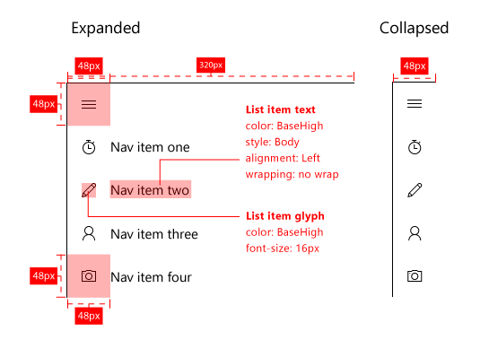

# Панели навигации

Эта статья перенесена сюда: [представление навигации](https://msdn.microsoft.com/windows/uwp/controls-and-patterns/navigationview).

Панель навигации — это шаблон, который позволяет использовать множество элементов навигации верхнего уровня, сохраняя при этом свободное пространство экрана. Панель навигации широко используется в мобильных приложениях, но также подходит и для больших экранов. При использовании как наложение панель остается свернутой и не открывается, пока пользователь не нажмет кнопку, что удобно для маленьких экранов. При использовании в режиме стыковки панель остается открытой, что обеспечивает больше возможностей, если экранного пространства достаточно.

**Важные API**

* [Класс SplitView](https://msdn.microsoft.com/library/windows/apps/dn864360)

## Выбор правильного шаблона

Панель навигации хорошо подходит:

-   Приложения с большим числом элементов навигации верхнего уровня аналогичного типа. Например, спортивное приложение с категориями "Хоккей", "Волейбол", "Баскетбол", "Футбол" и т. д.
-   Предоставление единообразия интерфейса навигации по приложениям. Панель навигации должна содержать только элементы навигации, но не действия.
-   для среднего и высокого количества (5-10+) категорий навигаций верхнего уровня;
-   для сохранения места на экране (в качестве наложения);
-   для навигационных элементов, к которым редко осуществляется доступ (в качестве наложения);

## Создание панели навигации

Шаблон панели навигации состоит из панели для категорий навигации, области содержимого и необязательной кнопки для открытия и закрытия панели. Самый простой способ создать панель навигации — это использовать [элемент управления "Комбинированный режим"](split-view.md), который представляет собой пустую панель с всегда видимой областью содержимого.

Чтобы опробовать код, реализующий этот шаблон, загрузите [Решение для навигации по XAML](https://github.com/Microsoft/Windows-universal-samples/tree/master/Samples/XamlNavigation) из центра GitHub.

### Панель

Заголовки для категорий навигации отображаются на панели. Точки входа для параметров приложения и управления учетной записью, если применимо, также входят в панель. Заголовки навигации— это, как правило, список доступных для выбора элементов.

### Область содержимого

Область содержимого — это область, в которой отображаются сведения для выбранного расположения навигации. Она может содержать отдельные элементы или навигацию другого подуровня.

### Button

Кнопка позволяет пользователю открывать и закрывать панель. Кнопка остается видимой в фиксированном месте и не перемещается вместе с панелью. Рекомендуется размещать кнопку в верхнем левом углу приложения. Кнопка панели навигации представляется по умолчанию в виде трех горизонтальных линий и обычно называется "кнопкой-гамбургером".

Обычно кнопка связана с текстовой строкой. На верхнем уровне приложения его название может располагаться рядом с кнопкой. На более низких уровнях текстовая строка может быть связана со страницей, на которой в данный момент находится пользователь.

## Варианты панели навигации

Панель навигации имеет три режима: наложение, компактный и в строке. Наложение сворачивается и расширяется при необходимости. В компактном режиме панель отображается узкой полосой, которую можно развернуть. Панель в строке остается по умолчанию открытой.

### Наложение

-   Наложение можно использовать на экране любого размера и либо в книжной, либо в альбомной ориентации. В состоянии по умолчанию (свернуто) наложение не занимает экранное пространство: отображается только кнопка.
-   Предоставляет навигацию по требованию, сохраняя при этом свободное экранное пространство. Идеально подходит для приложений на телефонах и фаблетах.
-   По умолчанию панель скрыта: видима только кнопка.
-   Нажатие кнопки панели навигации открывает и закрывает наложение.
-   Развернутое состояние временное и отменяется при выборе элемента, когда используется кнопка «Назад», или когда пользователь касается за пределами панели.
-   Наложение появляется поверх содержимого и не адаптирует содержимое.

### Компактный

-   Компактный режим можно задать как `CompactOverlay`, в котором происходит наложение содержимого при открытии, или `CompactInline`, который отодвигает содержимое. Мы рекомендуем использовать CompactOverlay.
-   Компактные панели дают представление о выбранном расположении и не занимают место на экране.
-   Этот режим хорошо подходит для средних экранов, например на планшетах.
-   По умолчанию панель закрывается только со значками навигации и видимой кнопкой.
-   Нажав кнопку на панели навигации, можно открывать и закрывать панель, которая ведет как наложение или панель в строке в зависимости от выбранного режима отображения.
-   Выбранные значки списка должны выделяться, чтобы пользователь ориентировался в дереве переходов.

### Встроенный

-   Панель навигации остается открытой. Этот режим хорошо подходит для больших экранов.
-   Поддерживает сценарии, подразумевающие перетаскивание в панель и из нее.
-   Кнопка панели навигации для этого состояния не требуется. Если кнопка используется, область содержимого выходит вперед, а содержимое внутри этой области адаптируется.
-   Выбранные элементы списка должны выделяться, чтобы пользователь ориентировался в дереве переходов.

## Адаптируемость

Для повышения удобства работы на различных устройствах рекомендуется использовать [точки прерывания](../layout/screen-sizes-and-breakpoints-for-responsive-design.md) и регулировать режим панели навигации с учетом ширины окна приложения.
-   Маленькое окно
   -   Не более 640 пикселей в ширину.
   -   Панель навигации в режиме наложения, по умолчанию закрыта.
-   Среднее окно
   -   От 640 до 1007 пикселей в ширину.
   -   Панель навигации в режиме полосы, по умолчанию закрыта.
-   Большое окно
   -   Более 1007 пикселей в ширину.
   -   Панель навигации должна находиться в закрепленном режиме, по умолчанию открыта.

## Настройка

Чтобы оптимизировать [работу на 10-дюймовых устройствах](http://go.microsoft.com/fwlink/?LinkId=760736), попробуйте скорректировать панель навигации, изменив внешний вид элементов навигации. В зависимости от контекста взаимодействия, возможно, важнее привлечь внимание пользователя к выбранному элементу навигации или элементу в фокусе. Для 10-дюймовых устройств, самым распространенным устройством ввода среди которых является игровая панель, необходимо убедиться, что пользователю легко отслеживать расположение элемента, который в настоящее время находится в фокусе, на экране.

## Еще по теме

* [Элемент управления "Комбинированный режим"](split-view.md)
* [Основные и подробные данные](master-details.md)
* [Основы навигации](https://msdn.microsoft.com/library/windows/apps/dn958438)