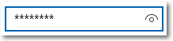

# Поле ввода пароля
Поле ввода пароля— это текстовое поле, в котором вводимые символы скрыты в целях безопасности. Поле ввода пароля внешне похоже на текстовое поле с той разницей, что в нем вместо вводимого текста отображаются подстановочные символы. Вы можете выбрать необходимый знак заполнителя.

По умолчанию поле ввода пароля предоставляет пользователю возможность просмотреть свой пароль, удерживая кнопку показа. Можно отключить кнопку показа либо предоставить альтернативный механизм отображения пароля, например флажок.

<span class="sidebar_heading" style="font-weight: bold;">Важные API</span>

-   [**Класс PasswordBox**](https://msdn.microsoft.com/library/windows/apps/xaml/windows.ui.xaml.controls.passwordbox.aspx)
-   [**Свойство Password**](https://msdn.microsoft.com/library/windows/apps/xaml/windows.ui.xaml.controls.passwordbox.password.aspx)
-   [**Свойство PasswordChar**](https://msdn.microsoft.com/library/windows/apps/xaml/windows.ui.xaml.controls.passwordbox.passwordchar.aspx)
-   [**Свойство PasswordRevealMode**](https://msdn.microsoft.com/library/windows/apps/xaml/windows.ui.xaml.controls.passwordbox.passwordrevealmode.aspx)
-   [**Событие PasswordChanged**](https://msdn.microsoft.com/library/windows/apps/xaml/windows.ui.xaml.controls.passwordbox.passwordchanged.aspx)

## Выбор правильного элемента управления

Элемент управления **PasswordBox** может использоваться для сбора паролей или других конфиденциальных данных, например номеров карт социального страхования.

Дополнительные сведения о выборе подходящего элемента управления текстом см. в статье [Элементы управления текстом](text-controls.md).

## Примеры

Поле ввода пароля может иметь несколько состояний, включая следующие состояния, которые следует отметить.

Поле ввода пароля в состоянии покоя может отображать текст подсказки, чтобы пользователь знал о предназначении этого поля:


Когда пользователь печатает в поле ввода пароля, поведением по умолчанию является отображение маркеров, за которыми скрывается вводимый текст:


Нажатие кнопки «Показать» справа позволяет посмотреть вводимый текст пароля:


## Создание поля ввода пароля

Используйте свойство [Password](https://msdn.microsoft.com/library/windows/apps/xaml/windows.ui.xaml.controls.passwordbox.password.aspx), чтобы получить или задать содержимое элемента PasswordBox. Это можно сделать в обработчике для события [PasswordChanged](https://msdn.microsoft.com/library/windows/apps/xaml/windows.ui.xaml.controls.passwordbox.passwordchanged.aspx), чтобы выполнять проверку, пока пользователь вводит пароль. Или можно использовать другое событие, например кнопку [Щелкните](https://msdn.microsoft.com/library/windows/apps/xaml/windows.ui.xaml.controls.primitives.buttonbase.click.aspx), чтобы выполнять проверку после того, как пользователь завершит ввод текста.

Ниже приведен фрагмент кода XAML для поля ввода пароля, демонстрирующий внешний вид элемента PasswordBox по умолчанию. При вводе пароля программа проверяет, не вводит ли пользователь буквально слово Password (Пароль). Если это так, то на экране будет отображено соответствующее сообщение.

```xaml
<StackPanel>  
  <PasswordBox x:Name="passwordBox" Width="200" MaxLength="16"
             PasswordChanged="passwordBox_PasswordChanged"/>
           
  <TextBlock x:Name="statusText" Margin="10" HorizontalAlignment="Center" />
</StackPanel>   
```

```csharp
private void passwordBox_PasswordChanged(object sender, RoutedEventArgs e)
{
    if (passwordBox.Password == "Password")
    {
        statusText.Text = "'Password' is not allowed as a password.";
    }
    else
    {
        statusText.Text = string.Empty;
    }
}
```
Ниже показан результат выполнения этого кода, если в качестве пароля пользователь вводит слово Password (Пароль).


### Знак пароля

Знак, используемый для маскировки пароля, можно изменить, задав свойство [PasswordChar](https://msdn.microsoft.com/library/windows/apps/xaml/windows.ui.xaml.controls.passwordbox.passwordchar.aspx). Здесь маркер по умолчанию заменяется звездочкой.

```xaml
<PasswordBox x:Name="passwordBox" Width="200" PasswordChar="*"/>
```

Результат выглядит так:



### Заголовки и подстановочный текст

Свойства [Header](https://msdn.microsoft.com/library/windows/apps/xaml/windows.ui.xaml.controls.passwordbox.header.aspx) и [PlaceholderText](https://msdn.microsoft.com/library/windows/apps/xaml/windows.ui.xaml.controls.passwordbox.placeholdertext.aspx) можно использовать, чтобы предоставить контекст для элемента PasswordBox. Это особенно полезно при наличии нескольких полей, например в форме для изменения пароля.

```xaml
<PasswordBox x:Name="passwordBox" Width="200" Header="Password" PlaceholderText="Enter your password"/>
```


### Максимальная длина

Укажите максимальное количество вводимых символов с помощью свойства [MaxLength](https://msdn.microsoft.com/library/windows/apps/xaml/windows.ui.xaml.controls.passwordbox.maxlength.aspx). Свойства для указания минимальной длины не существует, но вы можете проверить длину пароля и выполнить любую другую проверку в коде приложения.

## Режим показа пароля

Элемент управления PasswordBox имеет встроенную кнопку, нажав которую можно отобразить введенный пароль. Так выглядит результат действия пользователя. Если отпустить кнопку, пароль будет автоматически скрыт.


### Режим временного просмотра

По умолчанию кнопка показа пароля (или кнопка «Подсмотреть») отображается. Пользователь должен удерживать эту кнопку для просмотра пароля, чтобы поддерживать высокий уровень безопасности.

Значение свойства [PasswordRevealMode](https://msdn.microsoft.com/library/windows/apps/xaml/windows.ui.xaml.controls.passwordbox.passwordrevealmode.aspx) — не единственный фактор, который определяет видимость кнопки показа пароля. Среди других факторов: отображается ли элемент управления над минимальной шириной, имеет ли PasswordBox фокус и содержит ли поле ввода текста хотя бы один символ. Кнопка показа пароля отображается, только когда поле PasswordBox получает фокус в первый раз и в него вводится символ. Если PasswordBox теряет фокус, а затем вновь получает его, кнопка показа не отображается, пока пароль не очистят и не начнут вводить заново.

> 
            **Внимание!**
            &nbsp;&nbsp;До Windows 10 кнопка показа пароля не отображалась по умолчанию. Если в вашем приложении необходимо всегда скрывать пароль, установите для параметра PasswordRevealMode значение Hidden.

### Режимы Hidden и Visible

Другие значения перечисления [PasswordRevealMode](https://msdn.microsoft.com/library/windows/apps/xaml/windows.ui.xaml.controls.passwordrevealmode.aspx) — **Hidden** и **Visible** — скрывают кнопку показа пароля и позволяют программно управлять видимостью пароля.

Чтобы пароль был всегда скрыт, установите для параметра PasswordRevealMode значение Hidden. Если вам не нужно, чтобы пароль был всегда скрыт, можно предоставить настраиваемый пользовательский интерфейс, чтобы пользователь мог переключать PasswordRevealMode между Hidden и Visible.

В предыдущих версиях Windows Phone элемент PasswordBox использовал флажок для переключения видимости пароля. Можно создать аналогичный пользовательский интерфейс для своего приложения, как показано в следующем примере. Чтобы позволить пользователю переключать режимы, можно использовать и другие элементы управления, например [ToggleButton](https://msdn.microsoft.com/library/windows/apps/xaml/windows.ui.xaml.controls.primitives.togglebutton.aspx).

В этом примере показано, как использовать [CheckBox](https://msdn.microsoft.com/library/windows/apps/xaml/windows.ui.xaml.controls.checkbox.aspx), чтобы позволить пользователю переключать режим показа элемента PasswordBox.

```xaml
<StackPanel Width="200">
    <PasswordBox Name="passwordBox1" 
                 PasswordRevealMode="Hidden"/>
    <CheckBox Name="revealModeCheckBox" Content="Show password"
              IsChecked="False" 
              Checked="CheckBox_Changed" Unchecked="CheckBox_Changed"/>
</StackPanel>
```

```csharp
private void CheckBox_Changed(object sender, RoutedEventArgs e)
{
    if (revealModeCheckBox.IsChecked == true)
    {
        passwordBox1.PasswordRevealMode = PasswordRevealMode.Visible;
    }
    else
    {
        passwordBox1.PasswordRevealMode = PasswordRevealMode.Hidden;
    }
}
```

Этот элемент управления PasswordBox выглядит следующим образом.


    
## Выбор подходящей клавиатуры для элемента управления текстом

Чтобы упростить пользователям ввод данных с помощью сенсорной клавиатуры или панели функционального ввода, можно настроить тип вводимых данных элемента управления текстом, чтобы он соответствовал типу данных, которые должен вводить пользователь. PasswordBox поддерживает только значения типа вводимых данных **Password** и **NumericPin**. Любое другое значение будет проигнорировано.

Дополнительные сведения об использовании типов вводимых данных см. в разделе [Использование типа вводимых данных для изменения сенсорной клавиатуры]().

## Рекомендации

-   Используйте метку или подстановочный текст, если назначение поля ввода пароля не очевидно. Метка отображается независимо от того, указано ли значение в поле ввода. Подстановочный текст отображается внутри поля ввода текста и пропадает после ввода значения.
-   Задайте для поля ввода пароля достаточную ширину, чтобы можно было ввести ряд значений. Длина слов различается в зависимости от языков, поэтому если вы собираетесь выводить свое приложение на международный уровень, следует учитывать особенности локализации.
-   Не размещайте дополнительные элементы управления рядом с полем для ввода пароля. Поле ввода пароля имеет кнопку показа пароля, с помощью которой можно проверить введенный пароль. Поэтому размещение справа другого элемента управления может привести к тому, что пользователь случайно раскроет свой пароль, пытаясь нажать на другой элемент управления. Во избежание такой ситуации оставьте между полем и другим элементом управления достаточно места или расположите этот элемент на следующей строке.
-   Рассмотрите возможность предоставления двух полей ввода пароля для создания учетной записи: одного поля для нового пароля и второго — для подтверждения пароля.
-   Для выполнения входа отображайте только одно поле ввода пароля.
-   Когда поле ввода пароля используется для ПИН-кода, рассмотрите возможность предоставления незамедлительного ответа сразу после ввода последней цифры без использования кнопки подтверждения.


## Связанные разделы

[Элементы управления текстом](text-controls.md)

**Проектировщикам**
- [Руководство по проверке орфографии](spell-checking-and-prediction.md)
- [Добавление поиска](https://msdn.microsoft.com/library/windows/apps/hh465231)
- [Руководство по текстовому вводу](text-controls.md)

**Разработчикам (XAML)**
- [**Класс TextBox**](https://msdn.microsoft.com/library/windows/apps/br209683)
- [**Класс Windows.UI.Xaml.Controls PasswordBox**](https://msdn.microsoft.com/library/windows/apps/br227519)


**Разработчикам (прочее)**
- [Свойство String.Length](https://msdn.microsoft.com/library/system.string.length(v=vs.110).aspx)


<!--HONumber=Jun16_HO4-->


