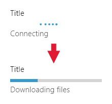
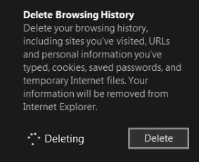

# Элементы управления "Ход выполнения"

Элемент управления "Ход выполнения" служит для уведомления пользователя о том, что выполняется длительная операция. *Определенный* индикатор выполнения показывает степень выполнения операции в процентах. *Неопределенный* индикатор выполнения (или кольцевой индикатор выполнения) показывает, что операция еще выполняется.

Элемент управления «Ход выполнения» доступен только для чтения. С ним нельзя взаимодействовать.

<span class="sidebar_heading" style="font-weight: bold;">Важные API</span>

-   [**Класс ProgressBar**](https://msdn.microsoft.com/library/windows/apps/xaml/windows.ui.xaml.controls.progressbar.aspx)
-   [**Свойство IsIndeterminate**](https://msdn.microsoft.com/library/windows/apps/xaml/windows.ui.xaml.controls.progressbar.isindeterminate.aspx)
-   [**Класс ProgressRing**](https://msdn.microsoft.com/library/windows/apps/xaml/windows.ui.xaml.controls.progressring.aspx)
-   [**Свойство IsActive**](https://msdn.microsoft.com/library/windows/apps/xaml/windows.ui.xaml.controls.progressring.isactive.aspx)


Приложение для Windows: неопределенный индикатор выполнения, кольцевой индикатор выполнения и определенный индикатор выполнения


Приложение Windows Phone: индикатор выполнения в строке состояния и индикаторы выполнения

## Примеры

Пример кольцевого индикатора выполнения на экране-заставке.


Индикатор выполнения может также использоваться для отображения состояния или положения. Индикатор выполнения, используемый применительно к звуковой дорожке, отображает шкалу времени песни: значение индикатора — это расположение в песне, состояние паузы означает, что воспроизведение приостановлено.


## Выбор правильного элемента управления

Не всегда нужно отображать индикатор хода выполнения. Иногда ход выполнения задачи и так очевиден либо задача завершается настолько быстро, что отображение хода ее выполнения лишь отвлекает пользователя. Вот несколько факторов, которые нужно учесть, чтобы определить, стоит ли отображать индикатор хода выполнения.

-   **Занимает ли выполнение этой операции до завершения больше 2 секунд?**

    В этом случае отобразите элемент управления ходом выполнения операции после ее начала. Если выполнение операции обычно занимает больше двух секунд, но иногда завершается быстрее, задержите отображение элемента управления на 500 миллисекунд, чтобы избежать мерцания.

-   **Ожидает ли операция, что пользователь завершит задачу?**

    Если да, не используйте индикатор выполнения. Индикаторы выполнения используются для отображения выполнения задач компьютером, а не пользователем.

-   **Нужно ли пользователю знать информацию о выполняемых действиях?**

    Например, если приложение скачивает что-либо в фоновом режиме, а пользователь не начинал скачивание, то ему не нужно знать о нем.

-   **Выполняется ли операция в фоновом режиме, не блокируя деятельность пользователя, и представляет ли она какой-то реальный интерес для пользователя?**

    Используйте текст и многоточия, когда ваше приложение выполняет задачи, которые не должны всегда выводиться на экран, но вам нужно отображать их состояние.

    

    Используйте многоточия для обозначения незавершенности текущей задачи. Если выполняется несколько задач или обрабатывается несколько элементов, вы можете отобразить количество оставшихся задач. Когда все задачи завершены, индикатор должен закрыться.

-   **Можете ли вы использовать содержимое, над которым производится операция, для отображения хода выполнения?**

    Если да, не отображайте индикатор хода выполнения. Например, при отображении /src/assets, загруженных с диска, /src/assets появляются на экране друг за другом по мере загрузки. Отображение индикатора хода выполнения не принесет пользы, а только перегрузит пользовательский интерфейс.

-   **Можете ли вы определить, какая часть всей работы выполнена в данный момент во время выполнения операции?**

    Если да, используйте определенный индикатор выполнения, особенно для операций, которые блокируют пользователя. В противном случае используйте неопределенный индикатор выполнения или кольцевой индикатор. Даже если пользователю будет известно только то, что что-то происходит, это уже хорошо.

## Создание элемента управления «Определенный индикатор выполнения»

Определенный индикатор выполнения показывает, какой процент задания выполнен приложением. По мере выполнения задания полоса индикатора заполняется. Если вы можете оценить оставшийся объем работы в секундах, байтах, файлах или иных измеряемых единицах, используйте определенный индикатор выполнения.

Индикатор выполнения предоставляет несколько свойств для настройки и определения хода выполнения:
- [
              **IsIndeterminate**
            ](https://msdn.microsoft.com/library/windows/apps/xaml/windows.ui.xaml.controls.progressbar.isindeterminate.aspx) — задает тип индикатора выполнения: определенный или неопределенный. Чтобы создать определенный индикатор выполнения, задайте значение **false**.
- [
              **Minimum**
            ](https://msdn.microsoft.com/library/windows/apps/xaml/windows.ui.xaml.controls.primitives.rangebase.minimum.aspx) — начало диапазона значений. Значение по умолчанию: 0.0.
- [
              **Maximum**
            ](https://msdn.microsoft.com/library/windows/apps/xaml/windows.ui.xaml.controls.primitives.rangebase.maximum.aspx) — конец диапазона значений. Значение по умолчанию: 1.0. 
- [
              **Value**
            ](https://msdn.microsoft.com/library/windows/apps/xaml/windows.ui.xaml.controls.primitives.rangebase.value.aspx) — число, определяющее текущий момент выполнения. Если нужно показать ход скачивания файла, то этим значением может быть число скачанных байтов (тогда нужно задать для свойства Maximum общее количество скачиваемых байтов).
 
В следующем примере показан определенный индикатор выполнения на основе значения. 

```xaml
<ProgressBar IsIndeterminate="False" Maximum="100" Width="200"/>
```

```csharp
ProgressBar progressBar1 = new ProgressBar();
progressBar1.IsIndeterminate = false;
progressBar1.Maximum = 100;
progressBar1.Width = 200;

// Add the button to a parent container in the visual tree.
stackPanel1.Children.Add(progressBar1);
```

Как правило, значение для индикатора выполнения в разметке не указывается. Вместо этого для обновления значения индикатора выполнения в ответ на определенные признаки выполнения задания используется код процедуры или привязка данных. Например, если ваш индикатор выполнения показывает, какое количество файлов уже скачано, то значение должно обновляться в начале скачивания каждого нового файла.

## Создание элемента управления «Неопределенный индикатор выполнения»

Если невозможно оценить, какой объем работы осталось выполнить до завершения задачи, но данная операция не мешает взаимодействию пользователя с пользовательским интерфейсом, используйте неопределенный индикатор выполнения или кольцевой индикатор выполнения. Неопределенный индикатор выполнения отображает не полосу, которая заполняется цветом по мере выполнения, а анимацию в виде точек, перемещающихся слева направо. Кольцевой индикатор выполнения отображает анимацию в виде нескольких точек, перемещающихся по кругу. 

Чтобы сделать индикатор выполнения неопределенным, установите для его свойства [**IsIndeterminate**](https://msdn.microsoft.com/library/windows/apps/xaml/windows.ui.xaml.controls.progressbar.isindeterminate.aspx) значение **true**.

```xaml
<ProgressBar IsIndeterminate="True" Width="200"/>
```

```csharp
ProgressBar progressBar1 = new ProgressBar();
progressBar1.IsIndeterminate = true;
progressBar1.Width = 200;

// Add the button to a parent container in the visual tree.
stackPanel1.Children.Add(progressBar1);
```

Для отображения кольцевого индикатора выполнения в приложении задайте для его параметра [**IsActive**](https://msdn.microsoft.com/library/windows/apps/xaml/windows.ui.xaml.controls.progressring.isactive.aspx) значение **true**.

```xaml
<ProgressRing IsActive="True"/>
```

```csharp
ProgressRing progressRing1 = new ProgressRing();
progressRing1.IsActive = true;

// Add the button to a parent container in the visual tree.
stackPanel1.Children.Add(progressRing1);
```

## Рекомендации

-   Используйте определенный индикатор выполнения, если задача определена, то есть в случае, когда ее завершение предсказуемо, а продолжительность известна. Например, если объем оставшейся работы можно измерить в единицах времени, байтах, файлах или любых других исчисляемых единицах, используйте определенный индикатор выполнения. Вот несколько примеров определенных задач:

    -   Данное приложение скачивает фото размером 500 КБ и до настоящего времени получено 100 КБ.
    -   Приложение отображает рекламное объявление в течение 15 секунд, прошло 2 секунды.

    

-   Используйте неопределенный кольцевой индикатор для неопределенных и модальных (блокирующих взаимодействие с пользователем) задач.

    

-   Используйте неопределенный индикатор для неопределенных и немодальных (не блокирующих действия пользователя) задач.

    

-   Рассматривайте частично модальные задачи как немодальные, если модальное состояние продолжается менее 2 секунд. Некоторые задачи блокируют действия пользователя до тех пор, пока не выполнится какой-то процент задачи, после чего пользователь снова может работать в приложении. Например, когда пользователь выполняет запрос поиска, его действия блокируются до тех пор, пока не будет отображен первый результат. Рассматривайте эти задачи как немодальные и используйте неопределенный индикатор хода выполнения, если модальное состояние длится менее двух секунд. Если модальное состояние длится более двух секунд, используйте неопределенный кольцевой индикатор хода выполнения во время модальной фазы задачи, а в немодальной фазе используйте неопределенный индикатор выполнения.
-   Предусмотрите возможность отмены или приостановки выполняемой операции — особенно в тех случаях, когда пользователь блокирован при ожидании ее завершения и имеет представление о том, сколько еще времени остается ждать.
-   Не применяйте «курсор ожидания» для отображения хода выполнения задач, поскольку те пользователи, которые используют сенсорный способ взаимодействия с системой, его не увидят, а те, кто использует мышь, не нуждаются в двух способах визуализации хода выполнения задач (курсоре и индикаторе выполнения).
-   Для нескольких активных связанных задач отображайте единый индикатор выполнения. Если на экране отображаются несколько связанных элементов, которые одновременно выполняют какие-либо действия, не отображайте несколько индикаторов выполнения. Вместо этого отображайте один индикатор, который заполнится после завершения последней задачи. Например, если приложение скачивает несколько фотографий, отображайте единый индикатор выполнения, а не отдельный индикатор для каждой фотографии.
-   Не изменяйте расположение или размер индикатора во время выполнения задачи.

### Правила работы с определенными задачами

-   Если операция является модальной (блокирует действия пользователя) и длится более 10 секунд, предусмотрите способ ее отмены. Возможность отмены должна быть доступна с начала выполнения операции.
-   Делайте обновления хода выполнения равномерно. Избегайте ситуаций, когда отображается более 80 % выполнения задачи, а затем индикатор надолго останавливается. Ближе к концу выполнения задачи хочется ускорить ее выполнение, а не замедлить. Избегайте резких переходов, например от 0 % к 90 %.
-   После 100-процентного выполнения задачи подождите, пока индикатор выполнения заполнится, и лишь после этого скройте его.
-   Если выполнение задачи остановлено (пользователем или в силу внешних причин) и пользователь может его возобновить, визуально отобразите, что выполнение приостановлено. В приложениях на JavaScript это достигается применением стиля CSS win-paused. В приложениях на C\#/C++/VB это можно сделать, установив значение true для свойства ShowPaused. Под индикатором хода выполнения размещайте текстовый статус, сообщающий пользователю, что происходит.
-   Если выполнение задачи остановлено и его нельзя возобновить или необходимо начать сначала, визуально отобразите, что произошла ошибка. В приложениях на JavaScript это достигается применением стиля CSS win-error. В приложениях на C\#/C++/VB это можно сделать, установив значение true для свойства ShowError. Замените текстовый статус (под индикатором) сообщением, объясняющим пользователю, что произошло и как решить проблему (если это возможно).
-   Если для определения точного времени выполнения задачи необходимо некоторое время (или выполнение какого-либо действия), вначале используйте неопределенный индикатор выполнения, а затем переключитесь на определенный индикатор. Например, если на первом шаге скачивания осуществляется соединение с сервером, вы не можете оценить, сколько это займет времени. После того, как будет установлено соединение, переключитесь на определенный индикатор хода выполнения, чтобы отобразить ход скачивания. После переключения индикатор хода выполнения должен находиться в том же месте и иметь такой же размер.

    

-   Если у вас имеется список элементов, например принтеров, и определенные действия могут запустить операции с элементами в этом списке (например, установку драйвера для одного из принтеров), отобразите определенный индикатор выполнения рядом с элементом.

    Отображайте тему (метку) задачи над индикатором выполнения, а состояние задачи — внизу. Не отображайте текст состояния, если это состояние очевидно. После завершения задачи скройте индикатор выполнения. Используйте текст состояния, чтобы сообщать о новом состоянии элемента.

    

-   Чтобы отобразить список задач, выровняйте содержимое по сетке таким образом, чтобы пользователи могли мгновенно оценить состояние. Отображайте индикаторы выполнения для всех элементов, даже для тех, работа с которыми отложена.

    Так как цель данного списка — отображение текущих операций, после завершения операций удалите их из списка.

    

-   Если пользователь запустил задачу из панели приложения, а она блокирует его действия, отобразите индикатор выполнения на панели этого приложения.

    Если понятно, ход выполнения какой задачи отображает индикатор, можно выровнять индикатор выполнения по верхнему краю панели приложения и не отображать метку задачи и состояние; в противном случае следует отобразить метку и текст состояния.

    Запретите выполнение действий во время выполнения задачи, отключив элементы управления на панели приложения и игнорируя данные, введенные в область содержимого.

-   Не уменьшайте значение хода выполнения. Всегда увеличивайте величину хода выполнения. Если вам нужно дать обратный ход операции, отобразите ход ее обратного выполнения тем же образом, как вы отобразили бы ход выполнения любого другого действия.
-   Не перезапускайте процесс (от 100 % до 0 %). Это можно сделать, если пользователь знает, что данный этап или задача не являются последними. Например, задача состоит из двух частей: скачивание некоторых данных, а затем обработка их и отображение. После завершения скачивания сбросьте индикатор выполнения до 0 % и начните отображать ход обработки данных. Если для пользователя неочевидно, что задача содержит несколько этапов, объедините ход выполнения всех задач в единую шкалу (0–100 %) и обновляйте текст состояния при переходе от одной задачи к другой.

### Руководство по модальным неопределенным задачам, использующим кольцевой индикатор выполнения

-   Отображайте кольцевой индикатор выполнения в контексте действия: рядом с местом, где пользователь запустил действие, или там, где будут отображаться полученные данные.
-   Отображайте текст состояния справа от кольцевого индикатора выполнения.
-   Кольцевой индикатор выполнения и текст состояния должны иметь одинаковый цвет.
-   Отключите элементы управления, с которыми пользователь не должен взаимодействовать во время выполнения задачи.
-   Если после выполнения задачи выдается сообщение об ошибке, скройте индикатор выполнения и на его месте отобразите сообщение об ошибке.
-   Если операция должна завершиться до перехода к следующему экрану, поместите в диалоговом окне кольцевой индикатор выполнения непосредственно над областью кнопки, выровняв его по левому краю относительно содержимого диалогового окна.

    

-   В окне приложения с элементами управления, выровненными по правому краю, поместите кольцевой индикатор выполнения слева или же сразу над элементом управления, который запустил действие. Выровняйте кольцевой индикатор выполнения по левому краю со связанным содержимым.

    

-   В окне приложения с элементами управления, выровненными по левому краю, поместите кольцевой индикатор выполнения справа или же сразу под элементом управления, который запустил действие.

    

    

-   При отображении нескольких элементов поместите кольцевой индикатор выполнения и текст состояния под названием элемента. В случае ошибки замените кольцевой индикатор выполнения и текст состояния описанием ошибки.

    

### Руководство по немодальным неопределенным задачам, использующим индикатор выполнения

-   При отображении хода выполнения во всплывающем элементе поместите неопределенный индикатор выполнения по верхнему краю всплывающего элемента и настройте его ширину так, чтобы он занимал всю ширину этого элемента. При таком размещении индикатор по-прежнему сообщает о текущей операции, но значительно меньше отвлекает пользователя. Не давайте всплывающему элементу названия, чтобы не мешать размещению индикатора выполнения по верхнему краю всплывающего элемента.

    

-   Если ход выполнения операции отображается в окне приложения, разместите неопределенный индикатор выполнения по верхнему краю окна приложения во всю ширину окна.

    

### Правила для текста состояния

-   Когда вы используете определенный индикатор выполнения, не показывайте процент выполнения в тексте состояния. Элемент управления уже предоставляет эту информацию.
-   Если для отображения операции вы используете текст без индикатора выполнения, многоточие в тексте помогает вам передать незавершенный характер текущей операции.
-   Если вы используете индикатор выполнения, многоточие в тексте состояния не требуется, поскольку индикатор выполнения уже обозначает незавершенность операции.

### Руководство по внешнему виду и разметке

-   Определенный индикатор выполнения представляет собой цветную полоску, увеличивающуюся в размере и стремящуюся заполнить серую фоновую полоску. Пропорция цветной полоски по отношению к фоновой дает приблизительное представление о том, какая часть задачи уже выполнена.
-   Неопределенный индикатор выполнения или кольцевой индикатор состоит из непрерывно движущихся цветных точек.
-   Определите расположение индикатора управления ходом выполнения и его заметность по степени его значимости.

    Важные индикаторы выполнения могут служить в качестве элементов управления действиями, приглашающими пользователя возобновить определенную операцию после того, как система выполнила свою работу. Некоторые встроенные приложения Windows Phone используют индикатор выполнения в строке состояния в верхней части экрана для важных случаев. Вы также можете сделать это, определив их как определенные или неопределенные.

    Менее критичные случаи, например скачивание файлов, отображаются мельче и ограничены одним представлением.

-   Используйте метку для отображения величины выполнения, для описания происходящего процесса или для сообщения о том, что операция прервана. Использование метки необязательно, но мы настоятельно рекомендуем делать это.

    Для описания происходящего процесса используйте существительные, образованные от глаголов, например "соединение", "скачивание" или "отправка".

    Для сообщения о том, что процесс приостановлен или возникла исключительная ситуация, используйте причастия, например "приостановлено", "скачивание прервано" или "отменено".

-   Определенный индикатор выполнения с меткой и информацией о состоянии

    

-   Несколько индикаторов выполнения

    

-   Неопределенный кольцевой индикатор выполнения с текстом состояния

    

-   Неопределенный индикатор выполнения

    

## Дополнительные рекомендации по использованию

### Дерево принятия решений для выбора стиля выполнения операции

-   **Нужно ли пользователю знать информацию о выполняемых действиях?**

    Если нет, не отображайте индикатор выполнения.

-   **Доступны ли сведения о том, сколько времени потребуется для завершения задачи?**
    -   **Да:**
            **занимает ли выполнение этой задачи до завершения больше 2 секунд?**
        -   **Да:** используйте определенный индикатор выполнения. Обеспечьте способ отмены задач, выполнение которых продолжается более 10 секунд.
        -   **Нет:** не отображайте индикатор выполнения.

    -   **Нет:**
            **блокируется ли взаимодействие с пользовательским интерфейсом до завершения задачи?**
        -   **Да:**
            **является ли данная задача частью многоступенчатого процесса, при выполнении которого пользователю необходимо получать конкретные сведения о ходе операции?**
            -   **Да:** используйте неопределенный кольцевой индикатор выполнения с текстом состояния, размещенным горизонтально по центру экрана.
            -   **Нет:** используйте неопределенный кольцевой индикатор выполнения без отображения текста по центру экрана.
        -   **Нет:**
            **является ли это действие основным?**
            -   **Да:**
            **связан ли ход выполнения с каким-либо конкретным элементом пользовательского интерфейса?**
                -   **Да:** используйте встроенный неопределенный кольцевой индикатор выполнения с текстом состояния, размещенным рядом с тем элементом пользовательского интерфейса, к которому он относится.
                -   **Нет:**
            **загружается ли в список большой объем данных?**
                    -   **Да:** используйте неопределенный индикатор выполнения, расположенный сверху, с заполнителями для входящего содержимого.
                    -   **Нет:** используйте неопределенный индикатор выполнения в верхней части экрана или поверхности устройства.
            -   **Нет:** используйте текст состояния, размещенный в верхнем углу экрана.

## Статьи по теме


- [**Класс ProgressBar**](https://msdn.microsoft.com/library/windows/apps/br227529)
- [**Класс ProgressRing**](https://msdn.microsoft.com/library/windows/apps/br227538)

**Разработчикам (XAML)**
- [Добавление индикаторов хода выполнения](https://msdn.microsoft.com/library/windows/apps/xaml/hh780651)
- [Как создать собственный неопределенный индикатор выполнения для Windows Phone](http://go.microsoft.com/fwlink/p/?LinkID=392426)


<!--HONumber=May16_HO2-->


