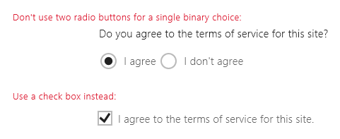

# Переключатели
Переключатели типа Radio Button позволяют пользователю выбрать один параметр из двух или более предлагаемых вариантов. Каждый параметр представлен одним переключателем, пользователь может выбрать только один переключатель из группы.

(Если вам интересно, откуда взялось название этого переключателя на английском (Radio Button) — оно происходит от названия кнопок настройки каналов на радиоприемниках.)


<span class="sidebar_heading" style="font-weight: bold;">Важные API</span>

-   [**Класс RadioButton**](https://msdn.microsoft.com/library/windows/apps/br227544)
-   [**Событие Checked**](https://msdn.microsoft.com/library/windows/apps/windows.ui.xaml.controls.primitives.togglebutton.checked.aspx)
-   [**Свойство IsChecked**](https://msdn.microsoft.com/library/windows/apps/windows.ui.xaml.controls.primitives.togglebutton.ischecked.aspx)

## Выбор правильного элемента управления

Используйте кнопки переключателей, чтобы предлагать пользователям два или более взаимоисключающих параметра, как показано здесь.


Кнопки переключателей помогают сделать более заметными и более весомыми особо важные параметры вашего приложения. Используйте переключатели, когда предлагаемые параметры достаточно важны и им нужно отвести дополнительное пространство на экране, а также тогда, когда варианты достаточны понятны и можно сделать вполне однозначный выбор.

В переключателях все предлагаемые варианты равнозначны, что может привлекать к ним больше внимания, чем они того заслуживают. Если упомянутые варианты не заслуживают специального внимания со стороны пользователя, попробуйте использовать другие элементы управления. Например, если большинству пользователей в большинстве ситуаций нужен параметр по умолчанию, лучше использовать [раскрывающийся список](lists.md).

Если есть лишь два взаимоисключающих варианта, объедините их в единый [флажок](checkbox.md) или [переключатель](toggles.md). Например, используйте флажок с надписью "Принимаю" вместо двух переключателей "Я принимаю" и "Я не принимаю".



Когда пользователь может выбрать несколько вариантов, используйте элемент управления [Checkbox](checkbox.md) или [List Box](lists.md).


Не используйте переключатели, когда к выбору предлагаются числа с фиксированной величиной шага, например: 10, 20, 30. Для этого есть элемент управления [Slider](slider.md).

При наличии более восьми вариантов используйте [раскрывающийся список](lists.md), [простой список](lists.md) или [представление списка](lists.md).

Если доступные варианты основаны на текущем контексте приложения или могут динамически варьироваться по другим причинам, используйте [простой список](lists.md).

## Пример
Переключатели в параметрах браузера Microsoft Edge.


## Создание переключателя

Переключатели работают в группах. Существует два способа группировки переключателей.
- Размещение в одном родительском контейнере.
- Установка одинакового значения свойства [**GroupName**](https://msdn.microsoft.com/library/windows/apps/windows.ui.xaml.controls.radiobutton.groupname.aspx) для всех переключателей.

> **Примечание.**
            &nbsp;&nbsp;При доступе с клавиатуры группа переключателей ведет себя как единый элемент управления. Выделение переключателя выполняется только с помощью клавиши TAB, но пользователи могут по циклу переходить по всей группе при помощи клавиш со стрелками.

В этом примере первая группа переключателей неявно группируется путем размещения в одной панели стека. Вторая группа разделена между двумя панелями стека, поэтому они явно группируются с помощью свойства GroupName.

```xaml
<StackPanel>
    <StackPanel>
        <TextBlock Text="Background" Style="{ThemeResource BaseTextBlockStyle}"/>
        <StackPanel Orientation="Horizontal">
            <RadioButton Content="Green" Tag="Green" Checked="BGRadioButton_Checked"/>
            <RadioButton Content="Yellow" Tag="Yellow" Checked="BGRadioButton_Checked"/>
            <RadioButton Content="Blue" Tag="Blue" Checked="BGRadioButton_Checked"/>
            <RadioButton Content="White" Tag="White" Checked="BGRadioButton_Checked" IsChecked="True"/>
        </StackPanel>
    </StackPanel>
    <StackPanel>
        <TextBlock Text="BorderBrush" Style="{ThemeResource BaseTextBlockStyle}"/>
        <StackPanel Orientation="Horizontal">
            <StackPanel>
                <RadioButton Content="Green" GroupName="BorderBrush" Tag="Green" Checked="BorderRadioButton_Checked"/>
                <RadioButton Content="Yellow" GroupName="BorderBrush" Tag="Yellow" Checked="BorderRadioButton_Checked" IsChecked="True"/>
            </StackPanel>
            <StackPanel>
                <RadioButton Content="Blue" GroupName="BorderBrush" Tag="Blue" Checked="BorderRadioButton_Checked"/>
                <RadioButton Content="White" GroupName="BorderBrush" Tag="White"  Checked="BorderRadioButton_Checked"/>
            </StackPanel>
        </StackPanel>
    </StackPanel>
    <Border x:Name="BorderExample1" BorderThickness="10" BorderBrush="#FFFFD700" Background="#FFFFFFFF" Height="50" Margin="0,10,0,10"/>
</StackPanel>
```

```csharp
private void BGRadioButton_Checked(object sender, RoutedEventArgs e)
{
    RadioButton rb = sender as RadioButton;

    if (rb != null && BorderExample1 != null)
    {
        string colorName = rb.Tag.ToString();
        switch (colorName)
        {
            case "Yellow":
                BorderExample1.Background = new SolidColorBrush(Colors.Yellow);
                break;
            case "Green":
                BorderExample1.Background = new SolidColorBrush(Colors.Green);
                break;
            case "Blue":
                BorderExample1.Background = new SolidColorBrush(Colors.Blue);
                break;
            case "White":
                BorderExample1.Background = new SolidColorBrush(Colors.White);
                break;
        }
    }
}

private void BorderRadioButton_Checked(object sender, RoutedEventArgs e)
{
    RadioButton rb = sender as RadioButton;

    if (rb != null && BorderExample1 != null)
    {
        string colorName = rb.Tag.ToString();
        switch (colorName)
        {
            case "Yellow":
                BorderExample1.BorderBrush = new SolidColorBrush(Colors.Gold);
                break;
            case "Green":
                BorderExample1.BorderBrush = new SolidColorBrush(Colors.DarkGreen);
                break;
            case "Blue":
                BorderExample1.BorderBrush = new SolidColorBrush(Colors.DarkBlue);
                break;
            case "White":
                BorderExample1.BorderBrush = new SolidColorBrush(Colors.White);
                break;
        }
    }
}
```

Группы переключателей выглядят следующим образом.


Переключатель может иметь два состояния: *selected* или *cleared*. Если переключатель выбран, его свойство [**IsChecked**](https://msdn.microsoft.com/library/windows/apps/windows.ui.xaml.controls.primitives.togglebutton.ischecked.aspx) имеет значение **true**. Если переключатель не выбран, его свойство **IsChecked** имеет значение **false**. Выбор переключателя можно отменить, выбрав другой переключатель в той же группе, но нельзя отменить выбор, щелкнув переключатель еще раз. Однако можно отменить выбор переключателя программным способом, установив для свойства IsChecked значение **false**.

## Рекомендации

-   Убедитесь, что назначение и текущее состояние набора переключателей ясны и понятны.
-   Нажатие переключателя пользователем всегда должно давать видимую реакцию.
-   Предоставляйте визуальную обратную связь при взаимодействии пользователя с переключателем. Примерами состояния переключателя являются нормальное, нажатое, включенное и отключенное. Пользователь нажимает переключатель для активации соответствующего параметра. Нажатие активированного параметра не отключает его, но нажатие другого параметра переносит активацию на последний.
-   Визуальные эффекты и анимации должны быть ограничены реакциями на касание и включенным состоянием; в отключенном состоянии элементы управления Radio Button должны выглядеть неиспользованными или неактивными (но не отключенными).
-   Текстовое содержимое переключателя следует ограничить одной строкой. Внешний вид переключателя можно настроить так, чтобы описание параметра отображалось более мелким шрифтом под основной строкой текста.
-   Если текстовое содержимое является динамическим, следует подумать о том, как будет изменяться размер кнопки и что произойдет с визуальными элементами вокруг нее.
-   Используйте шрифт по умолчанию, если указания для торговой марки не требуют использования другого шрифта.
-   Заключите переключатель в элемент метки, чтобы касанием метки можно было выбрать переключатель.
-   Текст подписи следует помещать после элемента управления Radio Button, а не перед ним и не сверху него.
-   Подумайте над индивидуализацией своих переключателей. По умолчанию переключатель состоит из двух концентрических кругов — заполненного внутреннего (показывается при установке переключателя) и внешнего, по которому проводит пользователь, а также определенного текстового содержимого. Но мы советуем вам проявить изобретательность. Пользователи чувствуют себя комфортно, взаимодействуя напрямую с содержимым приложения. Так что можно выбрать показ реального предлагаемого содержимого — с помощью графики или ненавязчивых текстовых кнопок-переключателей.
-   Не включайте в группу переключателей более 8 вариантов. При наличии большего числа вариантов используйте [раскрывающийся список](lists.md), [список](lists.md)или [представление списка](lists.md).
-   Не следует размещать две группы переключателей рядом друг с другом. Когда две группы переключателей находятся рядом, сложно определить, какой переключатель принадлежит к какой группе. Используйте метки групп, чтобы разделить их.

## Дополнительные рекомендации по использованию

На этой иллюстрации показано, как правильно расположить переключатели.


## Связанные разделы

**Проектировщикам**
- [Руководство по кнопкам](buttons.md)
- [Руководство по тумблерам](toggles.md)
- [Руководство по флажкам](checkbox.md)
- [Руководство по раскрывающимся спискам](lists.md)
- [Руководство по элементам управления List View и Grid View](lists.md)
- [Руководство по ползункам](slider.md)
- [Руководство по элементам управления выбором](lists.md)


**Разработчикам (XAML)**
- [**Класс переключателей Windows.UI.Xaml.Controls**](https://msdn.microsoft.com/library/windows/apps/br227544)


<!--HONumber=May16_HO2-->


