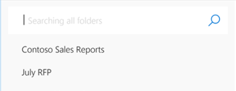
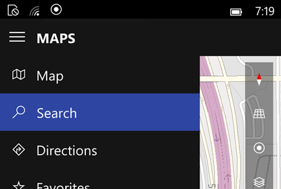
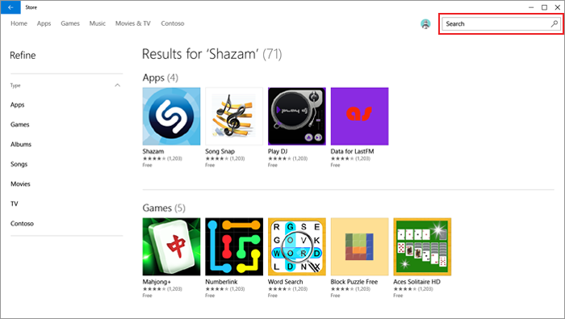
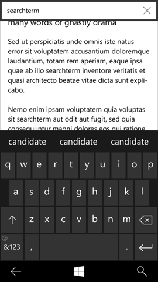
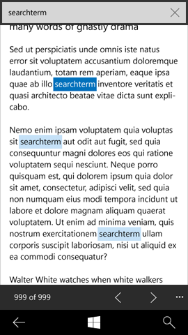
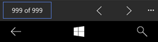

# Поиск и функция «найти на странице»

\[ Обновлено для приложений UWP в Windows 10. Статьи о Windows 8.x см. в [архиве](http://go.microsoft.com/fwlink/p/?linkid=619132) \]

**Важные API**

-   [**Класс AutoSuggestBox (XAML)**](https://msdn.microsoft.com/library/windows/apps/dn633874)

Поиск — это один из лучших способов обнаружения содержимого в вашем приложении. Рекомендации в этой статье охватывают элементы работы поиска, области поиска, реализацию и примеры поиска в контексте.

## Элементы работы поиска

**Ввод.**  Текст является самым распространенным режимом ввода данных для поиска, поэтому ему уделяется основное внимание в этом руководстве. Прочие распространенные режимы ввода задействуют голос и камеру, однако для них, как правило, требуется возможность взаимодействия с оборудованием устройства, а также дополнительные элементы управления или специальный пользовательский интерфейс в самом приложении.

**Нулевой ввод.**  Когда пользователь активировал поле ввода, но еще не ввел текст, можно отобразить то, что называется «холстом нулевого ввода». Холст нулевого ввода, как правило, отображается на холсте приложения, поэтому [автозаполнение](auto-suggest-box.md) заменяет это содержимое, когда пользователь начинает вводить свой запрос. Недавняя история поиска, самые популярные поисковые запросы, контекстуальные предложения поиска, рекомендации и подсказки — все это является хорошими кандидатами для состояния нулевого ввода.

 

**Формулировка/автозаполнение запроса.**  Формулировка запроса заменяет содержимое нулевого ввода, как только пользователь начинает ввод. По мере того, как пользователь вводит строку запроса, ему предлагается непрерывно обновляемый набор вариантов запроса или уточнений, что позволяет ускорить ввод и сформулировать наиболее точный запрос. Это поведение предложений запроса встроено в [элемент управления автозаполнения](auto-suggest-box.md)и является способом показать значок внутри поиска (например, микрофон или значок фиксации). Любая поведение вне этого обрабатывается приложением.

 

**Набор результатов.**  Результаты поиска, как правило, отображаются в поле ввода поиска. Хотя это не является требованием, размещение рядом ввода и результатов поддерживает контекст и обеспечивает пользователю мгновенный доступ к редактированию предыдущего запроса или вводу нового запроса. Эта связь может быть расширена путем замены текстовой подсказки на запрос, который создает набор результатов.

Одним из способов обеспечения эффективного доступа к редактированию предыдущего и вводу нового запроса является выделение предыдущего запроса при повторной активации поля. Таким образом любое нажатие клавиши заменит предыдущую строку, однако строка остается в поле, чтобы пользователь мог навести курсор для редактирования или добавления предыдущей строки.

Набор результатов может отображаться в любой форме, которая лучше всего передает содержимое. [Представление списка](lists.md) обеспечивает значительную гибкость и хорошо подходит для большинства поисковых запросов. Представление сетки подходит для изображений и другого мультимедиа, а карта может использоваться для выражения пространственного распределения.

## Области поиска

Поиск — это распространенная функция, и пользователи могут найти пользовательский интерфейс поиска в оболочке и во многих приложениях. Хотя точки входа в поиск визуализируются аналогичным образом, они могут предоставить доступ к результатам: от обширных (поиск в Интернете или на устройстве) до узких (поиск в списке контактов пользователя). Точка входа в поиск должна располагаться рядом с искомым содержимым.

Некоторые распространенные области поиска:

**Глобальный** и **контекстно-зависимый или уточняющий**. Поиск в нескольких источниках облачного и локального содержимого. Различные результаты включают URL-адреса, документы, мультимедиа, действия, приложения и многое другое.

**Интернет.**  Поиск в веб-индексе. Результаты включают страницы, объекты и ответы.

**Мое содержимое.**  Поиск по устройствам, в облаке, профилях социальной сети и многом другом. Результаты получаются разными, но ограничиваются подключением к учетным записям пользователей.

Используйте текст подсказок для сообщения об области поиска. Примеры:

«Поиск в Windows и Интернете»

«Поиск в списке контактов»

«Поиск в почтовом ящике»

«Поиск в настройках»

«Поиск места»

 

Эффективное сообщение об области точки входа в поиск обеспечивает соответствие вашего поиска ожиданиям пользователя и снизит степень раздражения.

## Реализация

В большинстве приложений лучше иметь поле ввода текста в качестве точки входа в поиск. Это обеспечивает визуально значимую основу. Кроме того, текст подсказки оказывает помощь с обнаружением области поиска и донесением ее до пользователя. Если поиск является второстепенным действием или если пространство ограничено, значок поиска может служить точкой входа без вспомогательного поля ввода. Если визуализация заключается в значке, убедитесь, что есть место для модального окна поиска, как показано в следующих примерах.

Перед щелчком значка поиска:

 

После щелчка поля значка поиска:

 

Точкой входа при поиске всегда используется направленный вправо глиф увеличительного стекла. Глифом является символ шрифта Segoe UI с шестнадцатеричным кодом символа 0xE0094 и размером 15 эффективных пикселей.

Точка входа в поиск может быть размещена в различных областях, а ее размещение сообщает пользователю о контексте и области поиска. Поиски, которые собирают результаты по всей среде приложения или за его пределами, как правило, размещаются в chrome приложения верхнего уровня, например на глобальных панелях команд или в навигации.

По мере того, как область поиска становится более узкой или контекстной, размещение, как правило, становится связанным напрямую с искомым содержимым, например на холсте в качестве заголовка списка или в пределах контекстных панелей команд. Во всех случаях связь между поисковым запросом и результатами или отфильтрованным содержимым должна быть четко обозначена.

В случае прокручиваемых списков введенный поисковый запрос, для удобства, должен всегда оставаться в видимой области. Мы рекомендуем закрепить введенный поисковый запрос и расположить прокручиваемое содержимое за ним.

Функции нулевого ввода и формулировки запроса являются вспомогательными для контекстного или уточняющего поиска, при котором список будет фильтроваться в режиме реального времени посредством пользовательского ввода. Исключениями являются те случаи, когда могут оказаться доступными предложения по форматированию запроса, например варианты фильтрации ящика входящих сообщений (кому: &lt;строка ввода&gt;, от: &lt;строка ввода&gt;, тема: &lt;строка ввода&gt; и т. д.).

## Пример

Примеры в этом разделе демонстрируют поиск в контексте.

Поиск как действие на панели инструментов Windows:

 

Поиск как ввод на холсте приложения:

 

Поиск на панели навигации:

 

Встроенный поиск лучше оставить для случаев, когда поиск используется нечасто или является сугубо контекстуальным:

## Руководство по поиску на странице

Функция «Найти на странице» позволяет пользователям находить совпадения текста в текущем фрагменте текста. Наиболее часто функция «Найти на странице» предоставляется в средствах просмотра и чтения документов, а также браузерах.

## Рекомендации

-   Добавьте в приложение панель команд с функцией «Найти на странице», чтобы пользователь мог выполнять поиск текста на странице. Информацию о размещении см. в разделе «Примеры».

    -   У приложений с возможностью поиска на странице на панели команд должны быть все необходимые элементы управления.
    -   Если приложение включает много других функций, помимо поиска на странице, на панели команд верхнего уровня можно предоставить кнопку **Найти** как точку входа на другую панель со всеми элементами управления функции «Найти на странице».
    -   При взаимодействии пользователя с сенсорной клавиатурой панель команд с функцией поиска на странице должна оставаться видимой. Сенсорная клавиатура появляется, когда пользователь касается поля ввода. Панель команд с функцией поиска на странице должна перемещаться вверх, чтобы ее не закрывала сенсорная клавиатура.

    -   Функция «Найти на странице» должна оставаться доступной, когда пользователи взаимодействуют с представлением. При использовании функции «Найти на странице» пользователям необходимо взаимодействовать с просматриваемым текстом. Например, пользователям может потребоваться изменить масштаб документа или панорамировать представление, чтобы прочитать текст. После начала использования функции «Найти на странице» должна оставаться доступной соответствующая панель команд с кнопкой **Закрыть** для завершения работы с данной функцией.

    -   Включите сочетание клавиш (CTRL+F). Настройте сочетание клавиш CTRL+F, чтобы позволить пользователям быстро вызвать панель команд с функцией поиска на странице.

    -   Включите основные возможности функции «Найти на странице». Есть элементы пользовательского интерфейса, необходимые для реализации функции «Найти на странице»:

        -   поле ввода,
        -   кнопки «Назад» и «Далее»,
        -   счетчик совпадений,
        -   Закрыть (только для рабочего стола)
    -   Совпадения должны выделяться в представлении, а содержимое — прокручиваться для отображения на экране следующего совпадения. Пользователи могут быстро перемещаться по документу, нажимая кнопки **Предыдущее** и **Следующее**, а также используя полосы прокрутки или прямые манипуляции касаниями.

    -   Функция «Найти и заменить» должна работать отдельно от основной функции «Найти на странице». Для приложений с функцией «Найти и заменить» убедитесь, что функции «Найти на странице» и «Найти и заменить» не мешают друг другу.

-   Включите счетчик совпадений, чтобы указать пользователю количество совпадений текста на странице.
-   Включите сочетание клавиш (CTRL+F).

## Примеры.

Предоставьте простой способ доступа к функции «Найти на странице». В этом примере мобильного интерфейса команда «Найти на странице» стоит после двух команд «Добавить в...» в раскрывающемся меню:

 

После выбора функции «Найти на странице» пользователь вводит поисковый запрос. По мере ввода поискового запроса могут отображаться текстовые предложения:

 

При отсутствии текстовых совпадений в поле результатов должна отображаться текстовая строка «Нет результатов»:

 

Если есть совпадение текста с поисковым запросом, первое соответствие должно быть выделено ярким цветом, а все последующие соответствия более блеклыми тонами той же цветовой палитры, как показано в примере:

 

Функция «Найти на странице» оснащена счетчиком совпадений:

## 

**Реализация функции «Найти на странице»**

-   Наиболее часто функция «Найти на странице» предоставляется в средствах просмотра и чтения документов, а также браузерах, т. е. приложениях с возможностью полноэкранного просмотра и чтения.
-   Функция «Найти на странице» вторична и должна находиться на панели команд.

Дополнительные сведения о добавлении команд на панель команд см. в разделе [Панель команд](app-bars.md).

## Связанные разделы

* [**Поле автозаполнения**](auto-suggest-box.md)

 

 

<!--HONumber=Mar16_HO1-->

