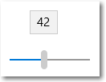
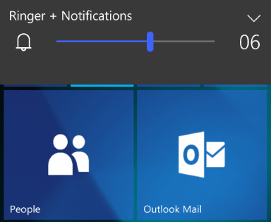
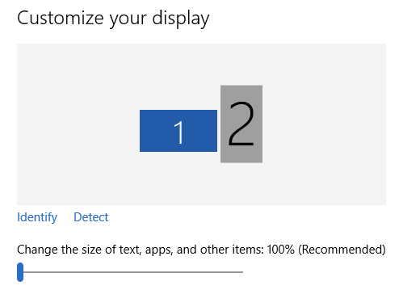

# Ползунки

Ползунок – это элемент управления, который позволяет пользователю выбирать значение из диапазона путем перемещения бегунка по дорожке.



<span class="sidebar_heading" style="font-weight: bold;">Важные API</span>

-   [**Класс Slider**](https://msdn.microsoft.com/library/windows/apps/windows.ui.xaml.controls.slider.aspx)
-   [**Свойство Value**](https://msdn.microsoft.com/library/windows/apps/windows.ui.xaml.controls.primitives.rangebase.value.aspx)
-   [**Событие ValueChanged**](https://msdn.microsoft.com/library/windows/apps/windows.ui.xaml.controls.primitives.rangebase.valuechanged.aspx)

## Выбор правильного элемента управления

Чтобы пользователи могли задавать установленные значения из непрерывного диапазона (например, громкость или яркость) или диапазона дискретных значений (например, параметры разрешения экрана), применяйте элемент управления Slider.

Ползунок рекомендуется использовать, если вы уверены, что пользователи представляют значение в виде относительной величины, а не определенного числа. Например: как правило, пользователи хотят уменьшить громкость до минимума или наполовину, а не задать значение 2 или 5.

Не используйте ползунок, если у вас всего два значения. Используйте вместо него [переключатель](toggles.md).

Следующие вопросы помогут вам определить, нужно ли использовать элемент управления "ползунок":

-   **Можно ли представить значение параметра в виде относительной величины?** Если нет — используйте [переключатели](radio-button.md) или [список](lists.md).
-   **У параметра есть точное и заранее известное числовое значение?** Если да, то используйте числовое [поле](text-box.md).
-   **Требуется ли пользователю мгновенная обратная связь при изменении значения параметра?** Если да, то используйте ползунок. Например, пользователям будет проще выбрать цвет, если они сразу увидят эффект при изменении оттенка, насыщенности или яркости.
-   **Параметр может принимать 4 и более значений?** Если нет — используйте [переключатели](radio-button.md).
-   **Может ли пользователь изменить значение?** Ползунки подразумевают взаимодействие с пользователем. Если пользователь не может изменить значение, используйте текст, доступный только для чтения.

При выборе между ползунком и числовым полем используйте числовое поле, если:

-   На экране недостаточно свободного места.
-   Пользователь, вероятнее всего, будет использовать клавиатуру.

Используйте ползунок, если:

-   Пользователям требуется мгновенный эффект при изменении значения параметра.

## Примеры.

Ползунок для управления громкостью на телефоне Windows Phone.



Ползунок для изменения размера шрифта в параметрах отображения Windows.



## Создание ползунка

Ниже приведен пример создания ползунка в XAML.

```xaml
<Slider x:Name="volumeSlider" Header="Volume" Width="200"
        ValueChanged="Slider_ValueChanged"/>
```

Ниже приведен пример создания ползунка в коде.

```csharp
Slider volumeSlider = new Slider();
volumeSlider.Header = "Volume";
volumeSlider.Width = 200;
volumeSlider.ValueChanged += Slider_ValueChanged;

// Add the slider to a parent container in the visual tree.
stackPanel1.Children.Add(volumeSlider);
```

Получить и задать значение ползунка можно из свойства [**Value**](https://msdn.microsoft.com/library/windows/apps/windows.ui.xaml.controls.primitives.rangebase.value.aspx). Обеспечить ответ на изменения значения можно путем привязки к свойству Value или обработки события [**ValueChanged**](https://msdn.microsoft.com/library/windows/apps/windows.ui.xaml.controls.primitives.rangebase.valuechanged.aspx).

```csharp
private void Slider_ValueChanged(object sender, RangeBaseValueChangedEventArgs e)
{
    Slider slider = sender as Slider;
    if (slider != null)
    {
        media.Volume = slider.Value;
    }
}
```

## Рекомендации

-   Размер элемента управления должен позволять пользователю легко выставить нужное значение. Для параметров с дискретными значениями убедитесь, что любое из значений легко выбрать с помощью мыши. Убедитесь, что конечные точки ползунка всегда помещаются в пределах представления.
-   Обеспечьте немедленное реагирование, когда пользователь что-то выбирает (если этот выбор осуществим). Например, элемент управления громкостью Windows дает гудок, чтобы указать выбранную громкость звука.
-   Используйте метки для показа диапазона значений. Исключение: если ползунок расположен по вертикали и вверху указано значение "Максимум", "Больше" и т. д., то вы можете не указывать другие метки, поскольку значение очевидно.
-   При отключении ползунка отключайте все связанные метки или визуальные индикаторы.
-   Учтите общее направление текста при установке направления текста и (или) ориентации для ползунка. В некоторых языках текст идет слева направо, а в других справа налево.
-   Не используйте ползунок в качестве индикатора хода выполнения.
-   Не изменяйте размер бегунка ползунка по умолчанию.
-   Не следует создавать непрерывные ползунки, если диапазон значений велик и пользователи, скорее всего, выберут из него одно из нескольких характерных значений. Вместо этого сделайте такие значения единственными доступными шагами. Например, если значение времени может достигать 1 месяца, но пользователям необходимо лишь выбрать из 1 минуты, 1 часа, 1 дня или 1 месяца, то стоит создать ползунок, перемещающийся между этими 4 пунктами.

## Дополнительные рекомендации по использованию

### Выбор ориентации

Ползунок можно расположить по горизонтали или по вертикали. При выборе расположения обратите внимание на следующие рекомендации.

-   Придерживайтесь естественного расположения. Например, если ползунок представляет значения, имеющие аналоги в реальном мире, которые обычно отображаются по вертикали (например, температура), то используйте вертикальную ориентацию.
-   Если ползунок используется для объектов мультимедиа, например в приложении для просмотра видео, используйте горизонтальную ориентацию.
-   Если ползунок используется на странице, которую можно прокрутить только в одном направлении (по горизонтали или по вертикали), то используйте ориентацию, отличную от направления прокрутки. В противном случае пользователи могут случайно переместить ползунок при прокрутке страницы.
-   Если вы не можете выбрать ориентацию, то рекомендуется использовать ту ориентацию, которая лучше всего подходит для макета страницы.

### Направление диапазона

Направление диапазона значений – это направление, в котором вы перемещаете ползунок, чтобы изменить значение с текущего до максимального.

-   Если ползунок расположен по вертикали, то, независимо от направления чтения, размещайте максимальное значение наверху. Например, для регулятора громкости всегда размещайте максимальное значение в верхней части ползунка. Для остальных типов значений, например дней недели, придерживайтесь направления текста на странице.
-   Если ползунок расположен горизонтально, то для макета страницы "слева направо" разместите минимальное значение слева, а для макета страницы "справа налево" — справа.
-   Предыдущее правило не относится к ползункам для объектов мультимедиа. В этом случае всегда размещайте минимальное значение слева.

### Действия и деления

-   Используйте точки, если требуется запретить выбор произвольных значений между минимальным и максимальным. Например, если ползунок используется для указания числа приобретаемых билетов в кино, запретите значения с плавающей запятой. В этом примере целесообразно установить значение шага 1.
-   Если вы задаете шаги (также называемые точками прикрепления), то убедитесь, что последний шаг диапазона значений параметра соответствует максимальному значению.
-   Используйте деления, чтобы показать пользователям расположение основных или важных значений. Например, ползунок для выбора масштаба может иметь деления 50 %, 100 % и 200 %.
-   Используйте деления, если пользователям необходимо знать приблизительное значение параметра.
-   Используйте деления и метку значения, если пользователям необходимо знать точное значение параметра без взаимодействия с элементом управления. В противном случае для отображения точного значения можно использовать подсказку.
-   Всегда используйте деления, если точки прикрепления не очевидны. Например, если ползунок имеет ширину 200 пикселей и содержит 200 точек прикрепления, можно скрыть шкалу, поскольку пользователи не заметят прикрепление. Однако если ползунок имеет только 10 точек прикрепления, то деления следует отображать.

### Метки

-   **Метки ползунка**

    Метка ползунка указывает, для чего используется ползунок.

    -   Метка не должна содержать конечных знаков препинания (это общее правило для всех меток элементов управления).
    -   Располагайте метки в верхней части ползунка, если большая часть меток расположена над элементами управления.
    -   Располагайте метки сбоку, если большая часть меток расположена сбоку от элементов управления.
    -   Не размещайте метки под ползунком, поскольку при прикосновении к ползунку палец пользователя может загородить метку.
-   **Метки диапазона**

    Метки диапазона описывают максимальное и минимальное значения, которые можно задать с помощью ползунка.

    -   Указывайте метки на обоих концах ползунка (за исключением случаев, когда это не требуется при вертикальной ориентации ползунка).
    -   По возможности используйте в метке только одно слово.
    -   Не используйте знаки препинания в конце метки.
    -   Убедитесь, что метки носят описательный характер и имеют параллельные значения. Примеры: "Максимум/минимум", "Больше/меньше", "Громко/тихо".
-   **Метки значений**

    Метка значения отображает текущее значение ползунка.

    -   Если требуется использовать метку значения, располагайте ее под ползунком.
    -   Выровняйте текст относительно элемента управления и добавьте единицы измерения (например, пиксели).
    -   Поскольку бегунок ползунка скрыт при его перемещении, стоит подумать над показом его текущего значения каким-то иным образом, с помощью метки или иного визуального представления. Ползунок, устанавливающий размер шрифта, может отображать образец текста правильного размера рядом с собой.

### Внешний вид и взаимодействие

Ползунок состоит из дорожки и бегунка. Дорожка представляет из себя полосу (на которой могут, при необходимости, отображаться шкалы различных стилей), представляющую диапазон значений, которые могут быть введены. Бегунок является селектором, который пользователь может перемещать либо нажимая на дорожку, либо проводя по ней.

У бегунка большая площадь касания. Чтобы обеспечить поддержку сенсорных специальных возможностей, бегунок должен располагаться достаточно далеко от края экрана.

При разработке собственного ползунка следует подумать о способах предоставления пользователю всей необходимой информации в наиболее ясной форме. Используйте метку значения, если пользователю нужно знать единицы измерения, чтобы разобраться в настройке; найдите интересные способы графического представления этих значений. Например, ползунок, управляющий громкостью, может отображать изображение динамика без звуковых волн на конце ползунка с минимальным значением и со звуковыми волнами на конце с максимальным значением.

## Ссылки по теме

**Проектировщикам**
- [Руководство по тумблерам](toggles.md)
            
          
            **Для разработчиков (XAML)**
- [**Класс Slider**](https://msdn.microsoft.com/library/windows/apps/br209614)


<!--HONumber=Jun16_HO4-->


