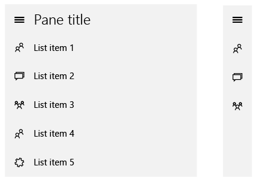

# Руководство по элементу управления "Комбинированный режим"

\[ Обновлено для приложений UWP в Windows 10. Статьи о Windows 8.x см. в [архиве](http://go.microsoft.com/fwlink/p/?linkid=619132) \]

**Важные API**

-   [**Класс SplitView (XAML)**](https://msdn.microsoft.com/library/windows/apps/dn864360)
-   [**Объект SplitView (HTML)**](https://msdn.microsoft.com/library/windows/apps/dn919970)

Элемент управления "Комбинированный режим" содержит разворачиваемую и сворачиваемую панель, а также область содержимого. Область содержимого всегда остается видимой. Панель можно развернуть или свернуть либо оставить открытой, ее можно расположить в левой или правой части окна приложения. Панель можно использовать в трех режимах.

-   **Наложение**

    Панель скрыта до тех пор, пока не будет открыта. После открытия панель перекрывает область содержимого.

-   **Встроенный**

    Панель всегда видима и не перекрывает область содержимого. Доступное пространство экрана делится между областью панели и областью содержимого.

-   **Компактный**

    Панель всегда видима в этом режиме, в котором ее ширины хватает лишь для отображения значков (обычно около 48 epx в ширину). Доступное пространство экрана делится между областью панели и областью содержимого. Хотя в стандартном компактном режиме панель не перекрывает область содержимого, этот режим можно преобразовать для отображения более широкой панели и соответственно — большего количества элементов содержимого, которые будут перекрывать область содержимого.

## Выбор правильного элемента управления

Элемент управления «Комбинированный режим» можно использовать для [шаблона меню навигации](nav-pane.md). Для создания такого шаблона к элементу управления «Комбинированный режим» необходимо добавить кнопку развертывания и свертывания («кнопку-гамбургер») и представление списка.

## Примеры

Элемент управления «Комбинированный режим» по умолчанию представляет собой базовый контейнер. С добавленными кнопкой и представлением списка элемент управления «Комбинированный режим» можно использовать как готовое меню навигации. Далее приведены примеры использования комбинированного режима в качестве меню навигации в развернутом и компактном режимах.

## Рекомендации

-   При использовании комбинированного режима для меню навигации рекомендуется разместить на панели навигации элементы управления, которые обеспечивают доступ к другим областям приложения. Использование панели для навигации обеспечивает согласованное взаимодействие с пользователем. Кроме того, такая реализация меню поможет пользователям лучше ознакомиться со всеми частями приложения, обеспечит быстрый доступ к главной странице приложения и будет стимулировать пользователей изучать другие части приложения.

\[Эта статья содержит сведения, относящиеся к приложениям универсальной платформы Windows (UWP) и Windows 10. Для получения инструкций по Windows 8.1, скачайте [рекомендации для Windows 8.1 в формате PDF](https://go.microsoft.com/fwlink/p/?linkid=258743).\]

## Ссылки по теме

* [Шаблон панели навигации](nav-pane.md)
* [Представление в виде списка](lists.md)
 

 

<!--HONumber=Mar16_HO1-->

