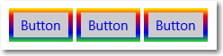

# <a name="styling-controls"></a>Настройка стиля элементов управления


Платформа XAML предоставляет множество способов настройки внешнего вида приложений. С помощью стилей можно настраивать свойства элементов управления и многократно использовать эти параметры, чтобы придать единообразный внешний вид нескольким элементам управления.

## <a name="style-basics"></a>Основные сведения о стилях


С помощью стилей можно превратить параметры визуальных элементов во многократно используемые ресурсы. В следующем примере показаны три кнопки со стилем, задающим свойства [**BorderBrush**](https://msdn.microsoft.com/library/windows/apps/br209397), [**BorderThickness**](https://msdn.microsoft.com/library/windows/apps/br209399) и [**Foreground**](https://msdn.microsoft.com/library/windows/apps/br209414). Применение стиля позволяет обеспечить единообразный вид элементов управления, не настраивая свойства каждого из них в отдельности



Стиль можно определить в качестве встроенного для элемента управления на XAML или в качестве многократно используемого ресурса. Ресурсы определяются в XAML-файле отдельной страницы, файле App.xaml или отдельном XAML-файле словаря ресурсов. Несколько приложений могут совместно использовать XAML-файл словаря ресурсов. Одна программа может использовать несколько словарей ресурсов. Область определения ресурсов определяет область их использования. Ресурсы, определенные на уровне страницы, доступны только для этой страницы. Если ресурсы с одинаковым ключом определены одновременно в файле App.xaml и в странице, ресурс страницы переопределяет ресурс в App.xaml. Если ресурс определен в отдельном файле словаря ресурсов, то область его использования зависит от того, на что ссылается словарь ресурсов.

В определении [**Style**](https://msdn.microsoft.com/library/windows/apps/br208849) требуется атрибут [**TargetType**](https://msdn.microsoft.com/library/windows/apps/br208857) и коллекция одного или нескольких элементов [**Setter**](https://msdn.microsoft.com/library/windows/apps/br208817). Атрибут **TargetType** является строкой, задающей тип [**FrameworkElement**](https://msdn.microsoft.com/library/windows/apps/br208706), к которому применяется стиль. Значение **TargetType** должно указывать производный от **FrameworkElement** тип, определенный средой выполнения Windows, или пользовательский тип, доступный в ссылаемой сборке. Если вы попытаетесь применить стиль к элементу управления, тип которого не соответствует атрибуту **TargetType** этого стиля, будет выдано исключение.

Для каждого элемента [**Setter**](https://msdn.microsoft.com/library/windows/apps/br208817) необходимы параметры [**Property**](https://msdn.microsoft.com/library/windows/apps/br208836) и [**Value**](https://msdn.microsoft.com/library/windows/apps/br208838). Эти параметры свойства показывают, к какому свойству элемента управления применяется параметр, а также значение, задаваемое для этого свойства. Параметр **Setter.Value** можно настроить с помощью синтаксиса атрибута или элемента свойства. В этом примере кода XAML показано, как применить стиль к показанным ранее кнопкам. В этом коде XAML для первых двух элементов **Setter** используется синтаксис атрибута, а в последнем элементе **Setter** (для свойства [**BorderBrush**](https://msdn.microsoft.com/library/windows/apps/br209397))–синтаксис элемента свойства. В примере не используется атрибут [x:Key](../xaml-platform/x-key-attribute.md), и поэтому стиль неявно применяется к кнопкам. Явное и неявное применение стилей поясняется в следующем разделе.

```XAML
<Page.Resources>
    <Style TargetType="Button">
        <Setter Property="BorderThickness" Value="5" />
        <Setter Property="Foreground" Value="Blue" />
        <Setter Property="BorderBrush" >
            <Setter.Value>
                <LinearGradientBrush StartPoint="0.5,0" EndPoint="0.5,1">
                    <GradientStop Color="Yellow" Offset="0.0" />
                    <GradientStop Color="Red" Offset="0.25" />
                    <GradientStop Color="Blue" Offset="0.75" />
                    <GradientStop Color="LimeGreen" Offset="1.0" />
                </LinearGradientBrush>
            </Setter.Value>
        </Setter>
    </Style>
</Page.Resources>

<StackPanel Orientation="Horizontal">
    <Button Content="Button"/>
    <Button Content="Button"/>
    <Button Content="Button"/>
</StackPanel>
```

## <a name="apply-an-implicit-or-explicit-style"></a>Применение явного или неявного стиля

Стиль, определенный как ресурс, можно применять к элементам управления двумя способами:

-   неявно, когда указывается только атрибут [**TargetType**](https://msdn.microsoft.com/library/windows/apps/br208857) для элемента [**Style**](https://msdn.microsoft.com/library/windows/apps/br208849);
-   явно, когда указываются атрибуты [**TargetType**](https://msdn.microsoft.com/library/windows/apps/br208857) и [x:Key](../xaml-platform/x-key-attribute.md) для элемента [**Style**](https://msdn.microsoft.com/library/windows/apps/br208849), а затем в свойстве [**Style**](https://msdn.microsoft.com/library/windows/apps/br208743) нужного элемента управления задается ссылка на [расширение разметки {StaticResource}](https://msdn.microsoft.com/library/windows/apps/mt185588), которая использует явный ключ.

Если стиль содержит атрибут [x:Key](../xaml-platform/x-key-attribute.md), то его можно применить к элементу управления только путем задания стиля с ключом в свойстве [**Style**](https://msdn.microsoft.com/library/windows/apps/br208743) элемента управления. Стиль, не имеющий атрибута x:Key, автоматически применяется к каждому элементу управления целевого типа, если отсутствует явно заданный стиль.

Далее показаны две кнопки с явным и неявным стилем.


В этом примере первый стиль содержит атрибут [x:Key](../xaml-platform/x-key-attribute.md) и имеет тип целевого объекта [**Button**](https://msdn.microsoft.com/library/windows/apps/br209265). Данный ключ задается в свойстве [**Style**](https://msdn.microsoft.com/library/windows/apps/br208743), и поэтому стиль применяется явным образом. Второй стиль применяется ко второй кнопке неявно, поскольку он имеет тип целевого объекта **Button**, а в стиле отсутствует атрибут x:Key.

```XAML
<Page.Resources>
    <Style x:Key="PurpleStyle" TargetType="Button">
        <Setter Property="FontFamily" Value="Lucida Sans Unicode"/>
        <Setter Property="FontStyle" Value="Italic"/>
        <Setter Property="FontSize" Value="14"/>
        <Setter Property="Foreground" Value="MediumOrchid"/>
    </Style>

    <Style TargetType="Button">
        <Setter Property="FontFamily" Value="Lucida Sans Unicode"/>
        <Setter Property="FontStyle" Value="Italic"/>
        <Setter Property="FontSize" Value="14"/>
        <Setter Property="RenderTransform">
            <Setter.Value>
                <RotateTransform Angle="25"/>
            </Setter.Value>
        </Setter>
        <Setter Property="BorderBrush" Value="Orange"/>
        <Setter Property="BorderThickness" Value="2"/>
        <Setter Property="Foreground" Value="Orange"/>
    </Style>
</Page.Resources>

<Grid x:Name="LayoutRoot">
    <Button Content="Button" Style="{StaticResource PurpleStyle}"/>
    <Button Content="Button" />
</Grid>
```

## <a name="use-based-on-styles"></a>Использование производных стилей

Для упрощения работы со стилями и оптимизации их многократного использования можно создавать стили, производные от других стилей. Для создания производных стилей служит свойство [**BasedOn**](https://msdn.microsoft.com/library/windows/apps/br208852). Производные стили должны применяться к элементу управления того же типа, к которому применяется базовый стиль, или к производному элементу управления. Например, если базовый стиль применяется к элементу [**ContentControl**](https://msdn.microsoft.com/library/windows/apps/br209365), то основанные на нем стили могут применяться к элементу **ContentControl** или к типам, производным от **ContentControl**, например [**Button**](https://msdn.microsoft.com/library/windows/apps/br209265) и [**ScrollViewer**](https://msdn.microsoft.com/library/windows/apps/br209527). Если в производном стиле не задано значение, оно наследуется от базового стиля. Чтобы изменить значение базового стиля, его следует переопределить в производном стиле. В следующем примере показаны элементы **Button** и [**CheckBox**](https://msdn.microsoft.com/library/windows/apps/br209316) со стилями, производными от одного базового стиля.


В базовом стиле целевым типом является [**ContentControl**](https://msdn.microsoft.com/library/windows/apps/br209365) и заданы свойства [**Height**](https://msdn.microsoft.com/library/windows/apps/br208718) и [**Width**](https://msdn.microsoft.com/library/windows/apps/br208751). В стилях, основанных на этом стиле, целевыми типами будут [**CheckBox**](https://msdn.microsoft.com/library/windows/apps/br209316) и [**Button**](https://msdn.microsoft.com/library/windows/apps/br209265), производные от **ContentControl**. Производные стили задают новые цвета для свойств [**BorderBrush**](https://msdn.microsoft.com/library/windows/apps/br209397) и [**Foreground**](https://msdn.microsoft.com/library/windows/apps/br209414). (Обычно вы не отображаете рамку вокруг **CheckBox**. Мы делаем это, чтобы продемонстрировать влияние на стиль.)

```XAML
<Page.Resources>
    <Style x:Key="BasicStyle" TargetType="ContentControl">
        <Setter Property="Width" Value="130" />
        <Setter Property="Height" Value="30" />
    </Style>

    <Style x:Key="ButtonStyle" TargetType="Button" 
           BasedOn="{StaticResource BasicStyle}">
        <Setter Property="BorderBrush" Value="Orange" />
        <Setter Property="BorderThickness" Value="2" />
        <Setter Property="Foreground" Value="Red" />
    </Style>

    <Style x:Key="CheckBoxStyle" TargetType="CheckBox" 
           BasedOn="{StaticResource BasicStyle}">
        <Setter Property="BorderBrush" Value="Blue" />
        <Setter Property="BorderThickness" Value="2" />
        <Setter Property="Foreground" Value="Green" />
    </Style>
</Page.Resources>

<StackPanel>
    <Button Content="Button" Style="{StaticResource ButtonStyle}" Margin="0,10"/>
    <CheckBox Content="CheckBox" Style="{StaticResource CheckBoxStyle}"/>
</StackPanel>
```

## <a name="use-tools-to-work-with-styles-easily"></a>Инструменты для удобной работы со стилями

Чтобы быстро применить стили к элементу управления, щелкните его правой кнопкой мыши в рабочей области конструирования XAML в Microsoft Visual Studio и выберите команду **Изменить стиль** или **Изменить шаблон** (в зависимости от элемента управления). Затем можно применить существующий стиль, выбрав команду **Применить ресурс**, или определить новый стиль командой **Создать пустой**. При создании пустого стиля можно определить его на странице, в файле App.xaml или в отдельном словаре ресурсов.

## <a name="modify-the-default-system-styles"></a>Изменение системных стилей, используемых по умолчанию

По возможности следует использовать стили из ресурсов XAML среды выполнения Windows, используемых по умолчанию. Если вам нужно определить собственные стили, старайтесь создавать их на базе стилей по умолчанию (используйте базовые стили, как описано выше, или измените копию исходного стиля по умолчанию).

## <a name="the-template-property"></a>Свойство Template

Вы можете использовать метод задания стиля для свойства [**Template**](https://msdn.microsoft.com/library/windows/apps/br209465) элемента [**Control**](https://msdn.microsoft.com/library/windows/apps/br209390). По сути, сюда входит большинство типовых стилей XAML и ресурсов XAML приложения. Подробные сведения см. в статье [Шаблоны элементов управления](control-templates.md).

