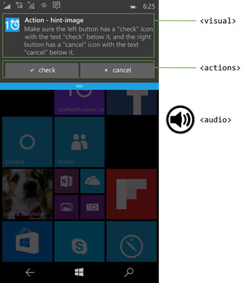

# <a name="adaptive-and-interactive-toast-notifications"></a>Адаптивные и интерактивные всплывающие уведомления

<link rel="stylesheet" href="https://az835927.vo.msecnd.net/sites/uwp/Resources/css/custom.css">

Адаптивные и Интерактивные всплывающие уведомления позволяют создавать удобные уведомления с помощью кнопки и поля ввода, текста и изображений.

> **Важные API-интерфейсы**: [пакет NuGet уведомлений набора средств сообщества UWP](https://www.nuget.org/packages/Microsoft.Toolkit.Uwp.Notifications/)

> [!NOTE]
> Традиционные шаблоны дляWindows 8.1 и Windows Phone 8.1 см. в [предыдущем каталоге шаблонов всплывающих уведомлений](https://msdn.microsoft.com/library/windows/apps/hh761494).


## <a name="getting-started"></a>Начало работы

**Установите библиотеку уведомлений.** Если вы хотите использовать C# вместо XML для создания уведомлений, установите пакет NuGet с именем [Microsoft.Toolkit.Uwp.Notifications](https://www.nuget.org/packages/Microsoft.Toolkit.Uwp.Notifications/) (выполните поиск по критерию "notifications uwp"). В примерах с C# в этой статье используется версия 1.0.0 пакета NuGet.

**Установите Визуализатор уведомлений.** Это бесплатное приложение UWP помогает проектировать интерактивные всплывающие уведомления, мгновенно отображая всплывающее уведомление при изменении, как в представлении редактора или конструирования XAML в Visual Studio. Ознакомьтесь с [этой записью блога](http://blogs.msdn.com/b/tiles_and_toasts/archive/2015/09/22/introducing-notifications-visualizer-for-windows-10.aspx), чтобы узнать больше. Скачать приложение Notifications Visualizer можно [здесь](https://www.microsoft.com/store/apps/notifications-visualizer/9nblggh5xsl1).


## <a name="sending-a-toast-notification"></a>Отправка всплывающего уведомления

Чтобы узнать, как отправлять уведомления, в разделе [отправить локального всплывающих](tiles-and-notifications-send-local-toast.md). В этой документации относится только к созданию содержимого всплывающего уведомления.


## <a name="toast-notification-structure"></a>Структура всплывающего уведомления

Всплывающие уведомления представляют собой сочетание некоторые свойства данных, например тегов или группа (который позволяют определить уведомления) и *содержимого всплывающих*.

Основные компоненты содержимого всплывающего уведомления — это...
* **Запуск**: это определяет, какие аргументы будут передаваться в ваше приложение, когда пользователь щелкает всплывающего уведомления, позволяя прямая ссылка в правильный содержимое, которое отображение всплывающего уведомления. Дополнительные сведения см. в разделе [отправить локального всплывающих](tiles-and-notifications-send-local-toast.md).
* **Visual**: visual часть всплывающего уведомления, в том числе универсальные привязку, которая содержит логотипы приложений, текста и изображений.
* **действия**: интерактивный часть всплывающего уведомления, в том числе ввода и действиями.
* **аудио**: звук воспроизводится, когда всплывающее уведомление отображается пользователю элементы управления.

В необработанных XML определен содержимого всплывающего уведомления, но вы можете использовать наши [NuGet библиотеки](https://www.nuget.org/packages/Microsoft.Toolkit.Uwp.Notifications/) получить объектной модели C# (или C++) для создания содержимого всплывающего уведомления. В этой статье описываются все, что происходит в пределах содержимого всплывающего уведомления.

```csharp
ToastContent content = new ToastContent()
{
    Launch = "app-defined-string",
 
    Visual = new ToastVisual()
    {
        BindingGeneric = new ToastBindingGeneric() { ... }
    },
 
    Actions = new ToastActionsCustom() { ... },
 
    Audio = new ToastAudio() { ... }
};
```

```xml
<toast launch="app-defined-string">

  <visual>
    <binding template="ToastGeneric">
      ...
    </binding>
  </visual>

  <actions>
    ...
  </actions>

  <audio src="ms-winsoundevent:Notification.Reminder"/>

</toast>
```

Вот визуальное представление содержимого всплывающего уведомления:




## <a name="visual"></a>Объект класса Visual

Каждый всплывающее уведомление, необходимо указать visual, где вы должны предоставить универсального всплывающих привязки, которая может содержать текст, изображения, логотипы и более. Эти элементы будут отображаться на различных устройствах Windows, включая настольные компьютеры, телефоны, планшеты и Xbox.

Информацию обо всех атрибутах, поддерживаемых в разделе визуального представления, и их дочерних элементах [см. документацию схемы](tiles-and-notifications-toast-schema.md#toastvisual).

Удостоверение приложения для всплывающего уведомления передается через значок вашего приложения. Однако если используется переопределение логотипа приложения, имя приложения будет отображаться под строками текста.

| Обычное всплывающее уведомление                                                                              | Всплывающее уведомление с appLogoOverride                                                          |
| ----------------------------------------------------------------------------------------- | ----------------------------------------------------------------------------------- |
|  |  |


## <a name="text-elements"></a>Текстовые элементы

Каждый всплывающие должен иметь по крайней мере один элемент текста и может содержать два дополнительных текстовых элементов, тип [AdaptiveText](tiles-and-notifications-toast-schema.md#adaptivetext).


Начиная с Юбилейного обновления, вы можете управлять отображаются количество строк текста, с помощью **HintMaxLines** свойство на текст. По умолчанию заголовок отображает до двух строк текста и строк описания каждого отображение до 4 строк текста.

```csharp
new ToastBindingGeneric()
{
    Children =
    {
        new AdaptiveText()
        {
            Text = "Adaptive Tiles Meeting",
            HintMaxLines = 1
        },

        new AdaptiveText()
        {
            Text = "Conf Room 2001 / Building 135"
        },

        new AdaptiveText()
        {
            Text = "10:00 AM - 10:30 AM"
        }
    }
}
```

```xml
<binding template="ToastGeneric">
    <text hint-maxLines="1">Adaptive Tiles Meeting</text>
    <text>Conf Room 2001 / Building 135</text>
    <text>10:00 AM - 10:30 AM</text>
</binding>
```


## <a name="app-logo-override"></a>Переопределение логотип приложения

По умолчанию всплывающего уведомления будет эмблему вашего приложения. Тем не менее, вы можете переопределить это логотип на свои собственные [ToastGenericAppLogo](tiles-and-notifications-toast-schema.md#toastgenericapplogo) изображения. Например если это уведомление от лица, мы рекомендуем переопределения логотипа приложения изображение этого контакта.


Вы можете использовать **HintCrop** позволяет изменить Обрезка изображения. Например *круг* результаты в образе круг обрезано. В противном случае изображением будет квадрат. Размеры изображения — 64 x 64 пикселей при масштабирования 100%.

```csharp
new ToastBindingGeneric()
{
    ...

    AppLogoOverride = new ToastGenericAppLogo()
    {
        Source = "https://unsplash.it/64?image=883",
        HintCrop = ToastGenericAppLogoCrop.Circle
    }
}
```

```xml
<binding template="ToastGeneric">
    ...
    <image placement="appLogoOverride" hint-crop="circle" src="https://unsplash.it/64?image=883"/>
</binding>
```


## <a name="hero-image"></a>Главное изображение

**Новые возможности Юбилейное обновление**: всплывающие уведомления может отображать главное изображение, который является рекомендуемые [ToastGenericHeroImage](tiles-and-notifications-toast-schema.md#toastgenericheroimage) отображаться на видном месте в заголовке всплывающего уведомления и внутри центра поддержки. Размеры изображения — 360x180 пикселей при масштабировании 100%.


```csharp
new ToastBindingGeneric()
{
    ...

    HeroImage = new ToastHeroImage()
    {
        Source = "https://unsplash.it/360/180?image=1043"
    }
}
```

```xml
<binding template="ToastGeneric">
    ...
    <image placement="hero" src="https://unsplash.it/360/180?image=1043"/>
</binding>
```


## <a name="inline-image"></a>Встроенные изображения

Вы можете предоставить полных встроенный изображение, которое отображается при развертывании всплывающего уведомления.


```csharp
new ToastBindingGeneric()
{
    Children =
    {
        ...

        new AdaptiveImage()
        {
            Source = "https://unsplash.it/360/180?image=1043"
        }
    }
}
```

```xml
<binding template="ToastGeneric">
    ...
    <image src="https://unsplash.it/360/180?image=1043" />
</binding>
```


## <a name="attribution-text"></a>Текст атрибута

**Новые возможности Юбилейное обновление**: Если возникает необходимость создать ссылку источник содержимого, вы можете использовать авторство текста. Этот текст всегда отображается в нижней части уведомления, удостоверение приложения или уведомления метку времени.

В старых версиях Windows, которые не поддерживают текст авторство текст просто отображается как другой текстовый элемент (при условии, что у вас еще нет максимально три текстовых элементов).


```csharp
new ToastBindingGeneric()
{
    ...

    Attribution = new ToastGenericAttributionText()
    {
        Text = "Via SMS"
    }
}
```

```xml
<binding template="ToastGeneric">
    ...
    <text placement="attribution">Via SMS</text>
</binding>
```


## <a name="custom-timestamp"></a>Настраиваемая отметка времени

**Новые возможности центра обновления создателям**: теперь можно переопределить предоставляется системой и метку времени с помощью собственного метка времени, точно представляет, когда был создан сообщения или сведения и содержимое. Это метка времени отображается в центре поддержки.


Дополнительные сведения об использовании пользовательских метка времени, пожалуйста, [этой записи блога в разделе](https://blogs.msdn.microsoft.com/tiles_and_toasts/2017/01/09/custom-timestamp-on-toast-notifications-windows-10-creators-update/).

```csharp
ToastContent toastContent = new ToastContent()
{
    DisplayTimestamp = new DateTime(2017, 04, 15, 19, 45, 00, DateTimeKind.Utc),
    ...
};
```

```xml
<toast displayTimestamp="2017-04-15T19:45:00Z">
  ...
</toast>
```


## <a name="adaptive-content"></a>Адаптивный содержимого

**Новые возможности Юбилейное обновление**: в дополнение к содержимому, указанном выше, вы можете отображать дополнительное адаптивных содержимое, которое отображается, если развернута всплывающего уведомления.

Это дополнительное содержимое задается с помощью адаптивных, которой вы можете больше узнать о чтения [документации адаптивных плиток](tiles-and-notifications-create-adaptive-tiles.md).

Обратите внимание, что любое содержимое, адаптивных должен находиться внутри AdaptiveGroup. В противном случае оно не будет обработан с помощью адаптивных.


### <a name="columns-and-text-elements"></a>Текстовые элементы и столбцы

Вот пример, где используются столбцов, а также некоторые дополнительные адаптивных текстовых элементов. Так как текстовые элементы внутри AdaptiveGroup, они поддерживают свойства широкие адаптивной стиля.


```csharp
new ToastBindingGeneric()
{
    Children =
    {
        ...

        new AdaptiveGroup()
        {
            Children =
            {
                new AdaptiveSubgroup()
                {
                    Children =
                    {
                        new AdaptiveText()
                        {
                            Text = "52 attendees",
                            HintStyle = AdaptiveTextStyle.Base
                        },
                        new AdaptiveText()
                        {
                            Text = "23 minute drive",
                            HintStyle = AdaptiveTextStyle.CaptionSubtle
                        }
                    }
                },
                new AdaptiveSubgroup()
                {
                    Children =
                    {
                        new AdaptiveText()
                        {
                            Text = "1 Microsoft Way",
                            HintStyle = AdaptiveTextStyle.CaptionSubtle,
                            HintAlign = AdaptiveTextAlign.Right
                        },
                        new AdaptiveText()
                        {
                            Text = "Bellevue, WA 98008",
                            HintStyle = AdaptiveTextStyle.CaptionSubtle,
                            HintAlign = AdaptiveTextAlign.Right
                        }
                    }
                }
            }
        }
    }
}
```

```xml
<binding template="ToastGeneric">
    ...
    <group>
        <subgroup>
            <text hint-style="base">52 attendees</text>
            <text hint-style="captionSubtle">23 minute drive</text>
        </subgroup>
        <subgroup>
            <text hint-style="captionSubtle" hint-align="right">1 Microsoft Way</text>
            <text hint-style="captionSubtle" hint-align="right">Bellevue, WA 98008</text>
        </subgroup>
    </group>
</binding>
```


## <a name="inputs-and-buttons"></a>Методы ввода и кнопки

Методы ввода и кнопки указываются в пределах области действий всплывающего уведомления область всплывающее уведомление, это означает, что они видны, только если развернута всплывающего уведомления.


### <a name="quick-reply-text-box"></a>Чтобы быстро ответить текстовое поле

Чтобы быстро ответить текстовое поле, для обмена сообщениями сценарии, такие как, добавьте ввод текста и кнопку и ссылки идентификатор ввода текста, чтобы кнопки отображается рядом с входных данных.


```csharp
ToastContent content = new ToastContent()
{
    ...
 
    Actions = new ToastActionsCustom()
    {
        Inputs =
        {
            new ToastTextBox("tbReply")
            {
                PlaceholderContent = "Type a reply"
            }
        },

        Buttons =
        {
            new ToastButton("Reply", "action=reply&convId=9318")
            {
                ActivationType = ToastActivationType.Background,

                // To place the button next to the text box,
                // reference the text box's Id and provide an image
                TextBoxId = "tbReply",
                ImageUri = "Assets/Reply.png"
            }
        }
    }
};
```

```xml
<toast launch="app-defined-string">

    ...

    <actions>

        <input id="textBox" type="text" placeholderContent="Type a reply"/>

        <action
            content="Send",
            arguments="action=reply&amp;convId=9318"
            activationType="background"
            hint-inputId="textBox"
            imageUri="Assets/Reply.png"/>

    </actions>

</toast>
```


### <a name="inputs-with-buttons-bar"></a>Ввод данных с помощью кнопок панели

Также может иметь одно (или более) входные данные с обычной кнопок ниже входных данных.


```csharp
ToastContent content = new ToastContent()
{
    ...
 
    Actions = new ToastActionsCustom()
    {
        Inputs =
        {
            new ToastTextBox("tbReply")
            {
                PlaceholderContent = "Type a reply"
            }
        },

        Buttons =
        {
            new ToastButton("Reply", "action=reply&threadId=9218")
            {
                ActivationType = ToastActivationType.Background
            },

            new ToastButton("Video call", "action=videocall&threadId=9218")
            {
                ActivationType = ToastActivationType.Foreground
            }
        }
    }
};
```

```xml
<toast launch="app-defined-string">

    ...

    <actions>

        <input id="textBox" type="text" placeholderContent="Type a reply"/>

        <action
            content="Reply",
            arguments="action=reply&amp;threadId=9218"
            activationType="background"/>

        <action
            content="Video call",
            arguments="action=videocall&amp;threadId=9218"
            activationType="foreground"/>

    </actions>

</toast>
```


### <a name="selection-input"></a>Выбор ввода

Помимо текстовых полей можно также использовать меню выбора.


```csharp
ToastContent content = new ToastContent()
{
    ...
 
    Actions = new ToastActionsCustom()
    {
        Inputs =
        {
            new ToastSelectionBox("time")
            {
                DefaultSelectionBoxItemId = "lunch",
                Items =
                {
                    new ToastSelectionBoxItem("breakfast", "Breakfast"),
                    new ToastSelectionBoxItem("lunch", "Lunch"),
                    new ToastSelectionBoxItem("dinner", "Dinner")
                }
            }
        },

        Buttons = { ... }
};
```

```xml
<toast launch="app-defined-string">

    ...

    <actions>

        <input id="time" type="selection" defaultInput="lunch">
            <selection id="breakfast" content="Breakfast" />
            <selection id="lunch" content="Lunch" />
            <selection id="dinner" content="Dinner" />
        </input>

        ...

    </actions>

</toast>
```


## <a name="buttons"></a>Кнопки

Кнопки сделать всплывающего уведомления интерактивной, позволяя пользователю выполнять быстрые действия на всплывающее уведомление, не прерывая их текущего рабочего процесса. Например пользователи могут ответить на сообщение непосредственно из внутри всплывающего уведомления или удалить сообщение электронной почты, даже без открытия приложения электронной почты.

Кнопки можно выполнять следующие действия различных...

-   Активация приложения на переднем плане с аргументом, который можно использовать для перехода к указанной странице или контексту.
-   Активация фоновой задачи приложения, для быстрого ответа или других сценариев.
-   Активация другого приложения через запуск протокола.
-   Выполнение действия системы, как Откладывание или закрытие уведомления.

Обратите внимание, что может быть только до пяти кнопок (в том числе элементы контекстного меню, которые мы обсудим далее).


```csharp
ToastContent content = new ToastContent()
{
    ...
 
    Actions = new ToastActionsCustom()
    {
        Buttons =
        {
            new ToastButton("See more details", "action=viewdetails&contentId=351")
            {
                ActivationType = ToastActivationType.Foreground
            },

            new ToastButton("Remind me later", "action=remindlater&contentId=351")
            {
                ActivationType = ToastActivationType.Background
            }
        }
    }
};
```

```xml
<toast launch="app-defined-string">

    ...

    <actions>

        <action
            content="See more details",
            arguments="action=viewdetails&amp;contentId=351"
            activationType="foreground"/>

        <action
            content="Remind me later",
            arguments="action=remindlater&amp;contentId=351"
            activationType="background"/>

    </actions>

</toast>
```


### <a name="snoozedismiss-buttons"></a>Кнопки "Отложить" или "Закрыть"

С помощью меню выбора и две кнопки, можно создать напоминание, использующий откладывания системы и закрыть действия. Убедитесь, что значение сценария напоминание уведомление будет действовать как напоминание.


Свяжем откладывания кнопку в меню выбора ввод с помощью *SepectionBoxId* свойство на кнопке всплывающего уведомления.

```csharp
ToastContent content = new ToastContent()
{
    Scenario = ToastScenario.Reminder,

    ...
 
    Actions = new ToastActionsCustom()
    {
        Inputs =
        {
            new ToastSelectionBox("snoozeTime")
            {
                DefaultSelectionBoxItemId = "15",
                Items =
                {
                    new ToastSelectionBoxItem("5", "5 minutes"),
                    new ToastSelectionBoxItem("15", "15 minutes"),
                    new ToastSelectionBoxItem("60", "1 hour"),
                    new ToastSelectionBoxItem("240", "4 hours"),
                    new ToastSelectionBoxItem("1440", "1 day")
                }
            }
        },

        Buttons =
        {
            new ToastButtonSnooze()
            {
                SelectionBoxId = "snoozeTime"
            },
 
            new ToastButtonDismiss()
        }
    }
};
```

```xml
<toast scenario="reminder" launch="action=viewEvent&amp;eventId=1983">
   
  ...
 
  <actions>
     
    <input id="snoozeTime" type="selection" defaultInput="15">
      <selection id="1" content="1 minute"/>
      <selection id="15" content="15 minutes"/>
      <selection id="60" content="1 hour"/>
      <selection id="240" content="4 hours"/>
      <selection id="1440" content="1 day"/>
    </input>
 
    <action activationType="system" arguments="snooze" hint-inputId="snoozeTime" content="" />
 
    <action activationType="system" arguments="dismiss" content=""/>
     
  </actions>
   
</toast>
```

Для использования системных действий откладывания и отключения выполните описанные ниже действия.

-   Укажите ToastButtonSnooze или ToastButtonDismiss
-   При необходимости задайте строку пользовательского содержимого:
    -   Если не указать строку, мы используем автоматически локализованные строки «Snooze» и «Закрыть».
-   При необходимости задать *SelectionBoxId*:
    -   Если вы не хотите, чтобы пользователь выбирал интервал откладывания, а просто хотите, чтобы уведомление было отложено только один раз на определенный системой период (одинаковый во всей операционной системе), не создавайте &lt;input&gt; совсем.
    -   Если вы хотите предоставить выбор интервала откладывания, выполните следующие действия.
        -   Укажите *SelectionBoxId* в действии откладывания
        -   Сопоставьте идентификатор ввода с *SelectionBoxId* действия откладывания
        -   Укажите *ToastSelectionBoxItem*от значения для nonNegativeInteger, которое представляет snooze интервал в минутах.


## <a name="audio"></a>Звук

Пользовательские звуковые сигналы всегда поддерживались в мобильной версии и поддерживаются в настольной версии 1511 (сборка 10586) и более поздних. На пользовательские звуковые сигналы можно ссылаться через следующие пути:

-   ms-appx:///
-   ms-appdata:///

Кроме того, можно выбирать звуковые сигналы из [списка ms-winsoundevents](https://msdn.microsoft.com/library/windows/apps/br230842), который всегда поддерживался на обеих платформах.

```csharp
ToastContent content = new ToastContent()
{
    ...

    Audio = new ToastAudio()
    {
        Src = new Uri("ms-appx:///Assets/NewMessage.mp3")
    }
}
```

```xml
<toast launch="app-defined-string">

    ...

    <audio src="ms-appx:///Assets/NewMessage.mp3"/>

</toast>
```

Сведения о звуковых сигналах во всплывающих уведомлениях см. на [странице со звуковой схемой](https://msdn.microsoft.com/library/windows/apps/br230842). Сведения о том, как отправить всплывающее уведомление с пользовательским звуковым сигналом см. в [этой записи блога](https://blogs.msdn.microsoft.com/tiles_and_toasts/2016/06/18/quickstart-sending-a-toast-notification-with-custom-audio/).


## <a name="alarms-reminders-and-incoming-calls"></a>Будильники, напоминания и входящие вызовы

Для создания будильники, напоминания и уведомления о входящих вызовах, вы просто используете со значением сценарий, присвоенный ей в обычный всплывающее уведомление. Взаимодействие с нескольких поведений для создания пользователя согласованное и унифицированное adusts сценарий.

* **Напоминание**. Всплывающее уведомление с напоминанием остается на экране, пока пользователь его не закроет или не выполнит действие. В Windows Mobile всплывающие уведомления также отображаются сразу в развернутом виде. Звук будет воспроизводиться.
* **Будильник**: помимо поведения напоминания, оповещения Кроме того цикл звук с помощью звуковой сигнал по умолчанию.
* **IncomingCall**: уведомления о входящих вызовах на устройствах Windows Mobile открываются во весь экран. В противном случае они имеют то же поведение, как будильник, за исключением того, они используют звук звонка.

```csharp
ToastContent content = new ToastContent()
{
    Scenario = ToastScenario.Reminder,

    ...
}
```

```xml
<toast scenario="reminder" launch="app-defined-string">

    ...

</toast>
```


## <a name="handling-activation"></a>Обработка активации
Чтобы узнать, как для обработки активации всплывающих уведомлений (нажатия всплывающего уведомления или кнопок на всплывающего уведомления), в разделе [отправить локального всплывающих](tiles-and-notifications-send-local-toast.md).


 
## <a name="related-topics"></a>Еще по теме:

* [Отправка локального всплывающего уведомления и обработка активации](tiles-and-notifications-send-local-toast.md)
* [Библиотека уведомлений на GitHub](https://github.com/Microsoft/UWPCommunityToolkit/tree/dev/Notifications)