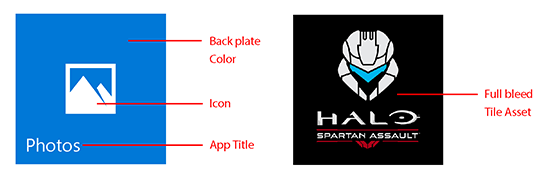
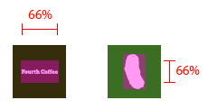
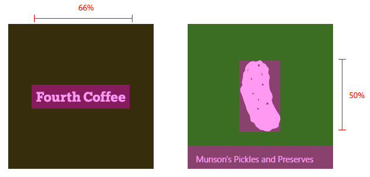
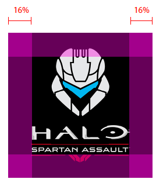
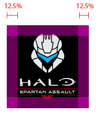
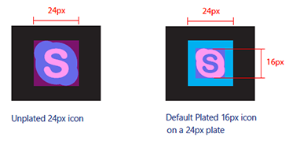
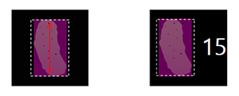

# Руководство по работе с ресурсами плиток и значков

<link rel="stylesheet" href="https://az835927.vo.msecnd.net/sites/uwp/Resources/css/custom.css"> 


Ресурсы значков приложения, присутствующие в различных формах во всевозможных разделах операционной системы Windows 10, являются картами вызова приложения универсальной платформы для Windows (UWP). В данном руководстве рассказывается, где в системе расположены ресурсы значков приложений, а также приведены подробные советы по созданию безупречных значков.


## Адаптивное масштабирование


Прежде всего кратко расскажем об адаптивном масштабировании, чтобы вы лучше поняли, как работает масштабирование для ресурсов. В Windows 10 реализована новая ступень развития существующей модели масштабирования. В дополнение к содержимому вектора масштабирования существует единый набор коэффициентов масштабирования, который обеспечивает согласованный размер для элементов пользовательского интерфейса по различным размерам экрана и разрешениям дисплея. Кроме того, коэффициенты масштабирования совместимы с коэффициентами масштабирования в других операционных системах, например в iOS и Android, что упрощает совместное использование ресурсов на этих платформах.

Магазин выбирает ресурсы для скачивания на основе разрешения экрана устройства (в точках на дюйм). Скачиваются только те ресурсы, которые лучше всего подходят для устройства.

## Элементы плиток


Основные компоненты плитки начального экрана — это основа, значок, фирменная панель, поля и название приложения.



Фирменная панель в нижней части плитки — это участок, на котором отображается имя приложения, индикатор событий и счетчик (если он используется).


Высота фирменной панели зависит от коэффициента масштабирования устройства, на котором она отображается.

| Коэффициент масштабирования | Количество пикселей |
|--------------|--------|
| 100%         | 32     |
| 125%         | 40     |
| 150%         | 48     |
| 200%         | 64     |
| 400%         | 128    |

 

Система задает поля плитки, которые невозможно изменить. Большая часть содержимого отображается внутри полей, как показано в примере ниже.


Ширина поля зависит от коэффициента масштабирования устройства, на котором оно отображается.

| Коэффициент масштабирования | Количество пикселей |
|--------------|--------|
| 100%         | 8      |
| 125%         | 10     |
| 150%         | 12     |
| 200%         | 16     |
| 400%         | 32     |

 

## Ресурсы плиток


Каждый ресурс плитки имеет такой же размер, что и плитка, на которой он размещен. Вы можете разместить ресурс с фирменной символикой своего приложения в двух различных представлениях.

1. Значок или логотип выровненные по центру с заполнением. В этом представлении будет виден цвет основы плитки:


2. Полная плитка с фирменным изображением без заполнения:


Для согласования размеров плиток на различных устройствах для плиток каждого размера (маленькая, средняя, широкая и большая) предусмотрены определенные соотношения размеров. Чтобы обеспечить согласованное размещение значков на плитках, рекомендуем придерживаться ряда правил заполнения для указанных ниже размеров плиток. Область, где пересекаются две наложенные фиолетовые полосы, представляет собой идеальное место для размещения значка. Хотя значки не всегда помещаются в это место, визуальный объем значка должен примерно соответствовать приведенным примерам.

Соотношение размеров маленькой плитки:


Соотношение размеров средней плитки:


Соотношение размеров широкой плитки:


Соотношение размеров большой плитки:


В этом примере значок слишком велик для такой плитки:


В этом примере значок слишком мал для такой плитки:


Следующие соотношения заполнения являются оптимальными для значков, расположенных горизонтально или вертикально.

Если плитка маленькая, то значок должен иметь такую ширину и высоту, чтобы его размер составлял не более 66% от размера плитки:



Если плитка средняя, то ширина значка должна составлять 66%, а высота 50% от размера плитки. Это позволит избежать наложения элементов в фирменной панели:


Если плитка широкая, то ширина значка должна составлять 66%, а высота 50% от размера плитки. Это позволит избежать наложения элементов в фирменной панели:


Если плитка большая, то значок должен иметь такую ширину и высоту, чтобы его размер составлял не более 50% от размера плитки:



Некоторые значки ориентированы горизонтально или вертикально, другие имеют более сложную форму, которая не позволяет расположить их на квадратном участке в нужном размере. Значки, которые выглядят выровненными по центру, могут быть больше с одной стороны. В этом случае часть значка может выступать за контур рекомендуемого участка размещения при условии, что визуально этот значок занимает такое же пространство, как и квадратный значок:


В случае если используются полные ресурсы без заполнения, необходимо учитывать элементы, пересекающие поля и края плиток. Поля должны занимать не менее 16% высоты или ширины плитки. Это значение представляет собой двойную ширину полей самой маленькой плитки:



В этом примере поля слишком узкие:


## Ресурсы плиток в виде списка


Плитки могут также отображаться в виде списка. Рекомендации по размерам для ресурсов плиток, отображаемых в виде списка, несколько отличаются от рекомендаций, приведенных выше. В данном разделе описаны эти особенности выбора размеров.


Ширина и высота значка должны составлять не более 75% размера плитки:


Если значки сориентированы вертикально или горизонтально, ширина и высота значка должны составлять не более 75% размера плитки:


Если на плитке располагается полный значок с важными элементами фирменной символики, поля должны составлять не менее 12,5%.



В этом примере, значок слишком велик для плитки:


В этом примере, значок слишком мал для плитки:


## Специальные ресурсы


Специальные ресурсы предназначены для значков и плиток, которые отображаются на панели задач Windows, в представлении задач, в окне, вызываемом сочетанием клавиш ALT+TAB, в Snap Assist и в правом нижнем углу плиток начального экрана. Для таких ресурсов не нужно добавлять заполнение, так как Windows добавит его при необходимости. Для этих ресурсов предусмотрено минимальное занимаемое место размером 16пикселей. Ниже приведен пример таких ресурсов в том виде, в котором они отображаются в значках на панели задач Windows.


Несмотря на то что в таких пользовательских интерфейсах специальный ресурс по умолчанию размещается на цветной основе, вы можете использовать специальные ресурсы и без основы. Ресурсы без основы необходимо создавать таким образом, чтобы они хорошо смотрелись при различных цветах фона:


Вот рекомендации по размерам для специальных ресурсов в масштабе 100%:



**Ресурсы приложения с шаблоном значка**

C помощью шаблона значка (также называемого шаблоном IconWithBadge) можно отображать небольшое изображение в центре плитки. Windows10 поддерживает этот шаблон на телефонах, планшетах и настольных компьютерах. (Дополнительные сведения о создании шаблонов значков см. в разделе [Специальные шаблоны плиток](tiles-and-notifications-special-tile-templates-catalog.md).)

В приложениях, в которых используется шаблон значков, например в приложениях Сообщения, Телефон и Магазин, предусмотрены специальные ресурсы, среди которых имеется индикатор событий (со счетчиком, работающем в режиме реального времени). Как и в случае с другими специальными ресурсами, заполнение не требуется. Ресурсы значков не являются частью манифеста приложений; они являются частью полезных данных живой плитки. Ресурсы масштабируются таким образом, чтобы они помещались по центру в контейнере с соотношением сторон 3:2.


Если ресурс квадратный, происходит его автоматическое выравнивание по центру в контейнере:


Если ресурс не квадратный, происходит его автоматическое выравнивание по горизонтали/вертикали и привязка по ширине/высоте контейнера:




## Ресурсы экрана-заставки


Изображение для экрана-заставки можно указать как в виде прямого пути к файлу изображения, так и в виде ресурса. С помощью ссылок на ресурсы вы можете предоставить изображения различных масштабов, чтобы ОС Windows смогла выбрать оптимальный размер для устройства и разрешения экрана. Кроме того, вы можете предоставить высококонтрастные изображения для обеспечения специальных возможностей и локализованные изображения для различных языков пользовательского интерфейса.

Если вы откроете файл манифеста Package.appxmanifest в текстовом редакторе, элемент [**SplashScreen**](https://msdn.microsoft.com/library/windows/apps/br211467) отобразится в качестве дочернего элемента по отношению к элементу [**VisualElements**](https://msdn.microsoft.com/library/windows/apps/br211471). Ниже показано, как разметка экрана-заставки, используемого по умолчанию, в файле манифеста выглядит в текстовом редакторе.

```XML
<uap:SplashScreen Image="Assets\SplashScreen.png" /></code></pre></td>
</tr>
</tbody>
</table>
```

Ресурс экрана-заставки выравнивается по центру на любом устройстве, на котором он отображается.


## Высококонтрастные ресурсы


В режиме высокой контрастности используются отдельные наборы ресурсов для высококонтрастного белого (белый фон с черным текстом) и высококонтрастного черного (черный фон с белым текстом). Если вы не предоставляете высококонтрастных ресурсов для своего приложения, будут использованы стандартные ресурсы.

Если стандартные ресурсы вашего приложения обеспечивают приемлемое качество отображения при переводе на черно-белый фон, то это приложение должно выглядеть удовлетворительно и в режиме высокой контрастности. Если ваши стандартные ресурсы не обеспечивают приемлемое качество отображение при переводе на черно-белый фон, рекомендуется добавить высококонтрастные ресурсы. Эти примеры показывают два типа высококонтрастных ресурсов:


Если вы решили предоставить высококонтрастные ресурсы, необходимо включить оба типа: белое изображение на черном фоне и черное изображение на белом фоне. Включая эти ресурсы в пакет, вы можете создать папку «Контрастный черный» для ресурсов с белым изображением на черном фоне и «Контрастный белый» для ресурсов с черным изображением на белом фоне.

## Таблицы размеров ресурсов


Мы настоятельно рекомендуем предоставлять ресурсы с коэффициентами масштабирования 100, 200 и 400. Предоставление ресурсов для всех коэффициентов масштабирования обеспечит оптимальную работу пользователя.

**Ресурсы на основе масштаба**

| Категория             | Имя элемента      | При масштабе 100% | При масштабе 125% | При масштабе 150% | При масштабе 200% | При масштабе 400% |
|----------------------|-------------------|---------------|---------------|---------------|---------------|---------------|
| Маленький                | Square71x71Logo   | 71 x 71         | 89 x 89         | 107 x 107       | 142 x 142       | 284 x 284       |
| Средний               | Square150x150Logo | 150 x 150       | 188 x 188       | 225 x 225       | 300 x 300       | 600 x 600       |
| Широкий                 | Square310x150Logo | 310 x 150       | 388 x 188       | 465 x 225       | 620 x 300       | 1240 x 600      |
| Большой (только для рабочего стола) | Square310x310Logo | 310 x 310       | 388 x 388       | 465 x 465       | 620 x 620       | 1240 x 1240     |
| Список приложений (значок)      | Square44x44Logo   | 44 x 44         | 55 x 55         | 66 x 66         | 88 x 88         | 176 x 176       |

 

**Примеры имен файлов для ресурсов на основе масштаба**

| Категория             | Имя элемента      | При масштабе 100%                  | При масштабе 125%                  | При масштабе 150%                  |
|----------------------|-------------------|--------------------------------|--------------------------------|--------------------------------|
| Маленький                | Square71x71Logo   | AppNameSmallTile.scale-100.png | AppNameSmallTile.scale-125.png | AppNameSmallTile.scale-150.png |
| Средний               | Square150x150Logo | AppNameMedTile.scale-100.png   | AppNameMedTile.scale-125.png   | AppNameMedTile.scale-150.png   |
| Широкий                 | Square310x150Logo | AppNameWideTile.scale-100.png  | AppNameWideTile.scale-125.png  | AppNameWideTile.scale-150.png  |
| Большой (только для настольных устройств) | Square310x310Logo | AppNameLargeTile.scale-100.png | AppNameLargeTile.scale-125.png | AppNameLargeTile.scale-150.png |
| Список приложений (значок)      | Square44x44Logo   | AppNameLargeTile.scale-100.png | AppNameLargeTile.scale-125.png | AppNameLargeTile.scale-150.png |

 

| Категория             | Имя элемента      | При масштабе 200%                  | При масштабе 400%                  |
|----------------------|-------------------|--------------------------------|--------------------------------|
| Маленький                | Square71x71Logo   | AppNameSmallTile.scale-200.png | AppNameSmallTile.scale-400.png |
| Средний               | Square150x150Logo | AppNameMedTile.scale-200.png   | AppNameMedTile.scale-400.png   |
| Широкий                 | Square310x150Logo | AppNameWideTile.scale-200.png  | AppNameWideTile.scale-400.png  |
| Большой (только для настольных устройств) | Square310x310Logo | AppNameLargeTile.scale-200.png | AppNameLargeTile.scale-400.png |
| Список приложений (значок)      | Square44x44Logo   | AppNameLargeTile.scale-200.png | AppNameLargeTile.scale-400.png |

 

**Специальные ресурсы**

Ресурсы на основе масштаба используются при различных коэффициентах масштабирования. Имя элемента ресурсов на основе масштаба: **Square44x44Logo**. Мы настоятельно рекомендуем предоставлять следующие ресурсы как абсолютный минимум:

16 x 16, 24 x 24, 32 x 32, 48 x 48, 256 x 256

В таблице ниже представлены все размеры специальных ресурсов и соответствующие примеры имен файлов:

| Размер ресурса | Пример имени файла                 |
|------------|-----------------------------------|
| 16 x 16\*    | AppNameAppList.targetsize-16.png  |
| 24 x 24\*    | AppNameAppList.targetsize-24.png  |
| 32 x 32\*    | AppNameAppList.targetsize-32.png  |
| 48 x 48\*    | AppNameAppList.targetsize-48.png  |
| 256 x 256\*  | AppNameAppList.targetsize-256.png |
| 20 x 20      | AppNameAppList.targetsize-20.png  |
| 30 x 30      | AppNameAppList.targetsize-30.png  |
| 36 x 36      | AppNameAppList.targetsize-36.png  |
| 40 x 40      | AppNameAppList.targetsize-40.png  |
| 60 x 60      | AppNameAppList.targetsize-60.png  |
| 64 x 64      | AppNameAppList.targetsize-64.png  |
| 72 x 72      | AppNameAppList.targetsize-72.png  |
| 80 x 80      | AppNameAppList.targetsize-80.png  |
| 96 x 96      | AppNameAppList.targetsize-96.png  |

 

\* Эти размеры ресурсов являются обязательными

## Типы ресурсов


Ниже перечислены все типы ресурсов, способы их использования и рекомендуемые имена файлов.

**Ресурсы плиток**

-   Выровненные по центру ресурсы обычно используются на начальном экране, чтобы продемонстрировать ваше приложение.
-   Формат имени файла: \*Tile.scale-\*.PNG
-   Затронутые приложения: все приложения UWP
-   Способы использования:
    -   плитки начального экрана по умолчанию (компьютеры и мобильные устройства)
    -   центр уведомлений (компьютеры и мобильные устройства)
    -   диспетчер задач (мобильные устройства)
    -   средство выбора «Общий доступ» (мобильные устройства)
    -   выбор (мобильные устройства)
    -   Магазин

**Масштабируемые ресурсы с основой**

-   Эти ресурсы используются на поверхностях, где запрашиваются коэффициенты масштабирования. Система добавляет ресурсам основу, либо же они предоставляются с собственным цветом фона, если это предусмотрено приложением.
-   Формат имени файлов: \*AppList.scale-\*.PNG
-   Затронутые приложения: все приложения UWP
-   Способы использования:
    -   список всех приложений в меню «Пуск» (компьютеры)
    -   список наиболее часто используемых приложений в меню «Пуск» (компьютеры)
    -   диспетчер задач (компьютеры)
    -   результаты поиска Кортаны
    -   список всех приложений начального экрана (мобильные устройства)
    -   Параметры

**Ресурсы списка целевых размеров с основой**

-   Ниже представлены фиксированные размеры ресурсов, которые не масштабируются с основами. В основном используются для поддержки устаревших функций. Ресурсы проверяются системой.
-   Формат имени файлов: \*AppList.targetsize-\*.PNG
-   Затронутые приложения: все приложения UWP
-   Способы использования:
    -   список переходов начального экрана (компьютеры)
    -   нижний угол плитки начального экрана (компьютеры)
    -   сочетания клавиш (компьютеры)
    -   панель управления (компьютеры)

**Ресурсы списка целевых размеров без основы**

-   Это ресурсы, для которых система не добавляет основу и которые не масштабируются.
-   Формат имени файлов: \*AppList.targetsize-\*\_altform-unplated.PNG
-   Затронутые приложения: все приложения UWP
-   Способы использования:
    -   Панель задач и эскиз панели задач (настольные устройства)
    -   Список переходов панели задач
    -   Представление задач
    -   ALT+TAB

**Ресурсы расширений файлов**

-   Это ресурсы, относящиеся к расширениям файлов. Они отображаются возле значков сопоставления файлов в формате Win32 в Проводнике и не должны зависеть от темы. Размеры отличаются для платформ для настольных компьютеров и мобильных платформ.
-   Формат имени файлов: \*LogoExtensions.targetsize-\*.PNG
-   Затронутые приложения: Музыка, Видео, Фото, Microsoft Edge, Microsoft Office
-   Способы использования:
    -   Проводник
    -   Кортана
    -   различные пользовательские интерфейсы (компьютеры)

**Экран-заставка**

-   Ресурс, который отображается на экране-заставке приложения. Автоматическое масштабирование на платформе для персональных компьютеров и на мобильной платформе.
-   Формат имени файлов: \*SplashScreen.screen-100.PNG
-   Затронутые приложения: все приложения UWP
-   Способы использования:
    -   экран-заставка приложения

**Ресурсы значков плиток**

-   Это ресурсы для приложений, использующих шаблон значков.
-   Формат имени файлов: неприменимо
-   Затронутые приложения: Сообщения, Телефон, Магазин и пр.
-   Способы использования:
    -   пиктограммная плитка


## Ссылки по теме


* [Специальные шаблоны плиток](tiles-and-notifications-special-tile-templates-catalog.md)
 

 


<!--HONumber=Aug16_HO3-->


