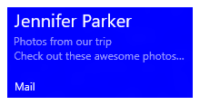
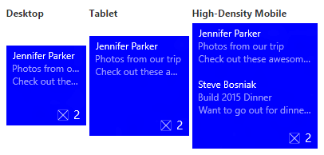
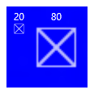
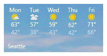
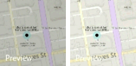
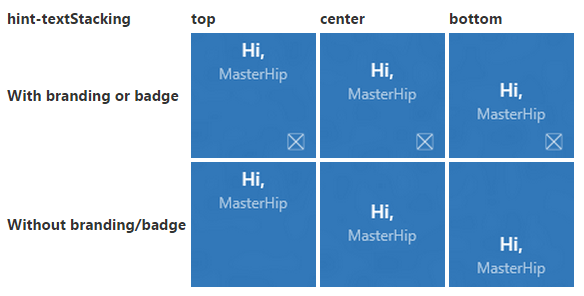

# Создание адаптивных плиток


\[ Обновлено для приложений UWP в Windows 10. Статьи о Windows 8.x см. в [архиве](http://go.microsoft.com/fwlink/p/?linkid=619132) \]


Шаблоны адаптивных плиток — это новая возможность в Windows 10, которая позволяет создавать собственные уведомления плиток с помощью простого и гибкого языка разметки, который адаптируется к различной плотности экрана. В этой статье рассказывается, как создать адаптивные живые плитки для вашего приложения универсальной платформы Windows (UWP). Полный список адаптивных элементов и атрибутов см. в разделе [Схема адаптивных плиток](tiles-and-notifications-adaptive-tiles-schema.md).

(При желании вы можете по-прежнему использовать стандартные шаблоны из [каталога шаблонов плиток Windows 8](https://msdn.microsoft.com/library/windows/apps/hh761491) при создании уведомлений для Windows 10.)

## <span id="Getting_started"></span><span id="getting_started"></span><span id="GETTING_STARTED"></span>Начало работы


**Установите NotificationsExtensions.** Если вы хотите использовать C# вместо XML для создания уведомлений, установите пакет NuGet с именем [NotificationsExtensions](https://github.com/WindowsNotifications/NotificationsExtensions/wiki). В примерах на C#, приведенных в этой статье, используется пакет NotificationsExtensions.

**Установите Визуализатор уведомлений.** Это бесплатное приложение UWP помогает проектировать адаптивные живые плитки, мгновенно отображая плитку при ее изменении, как в представлении редактора или конструирования XAML в Visual Studio. Ознакомьтесь с [этой записью блога](http://blogs.msdn.com/b/tiles_and_toasts/archive/2015/09/22/introducing-notifications-visualizer-for-windows-10.aspx), чтобы узнать больше. Скачать приложение Notifications Visualizer можно [здесь](https://www.microsoft.com/store/apps/notifications-visualizer/9nblggh5xsl1).

## <span id="Usage_guidance"></span><span id="usage_guidance"></span><span id="USAGE_GUIDANCE"></span>Руководство по использованию


Адаптивные шаблоны предназначены для работы с различными форм-факторами устройств и типами уведомлений. Такие элементы, как группы и подгруппы, связывают содержимое и не подразумевают определенного самостоятельного визуального поведения. Окончательный вид уведомления должен зависеть от конкретного устройства, на котором оно появляется, будь то телефон, планшет, настольный компьютер или другое устройство.

Подсказки — это дополнительные атрибуты, которые можно добавлять к элементам, чтобы добиться определенного визуального поведения. Подсказки могут зависеть от устройства или уведомления.

## <span id="A_basic_example"></span><span id="a_basic_example"></span><span id="A_BASIC_EXAMPLE"></span>Базовый пример


В этом примере показано, чего можно добиться с помощью шаблонов адаптивных плиток.

```XML
<tile>
  <visual>
  
    <binding template="TileMedium">
      ...
    </binding>
  
    <binding template="TileWide">
      <text hint-style="subtitle">Jennifer Parker</text>
      <text hint-style="captionSubtle">Photos from our trip</text>
      <text hint-style="captionSubtle">Check out these awesome photos I took while in New Zealand!</text>
    </binding>
  
    <binding template="TileLarge">
      ...
    </binding>
  
  </visual>
</tile>
```

```CSharp
TileContent content = new TileContent()
{
    Visual = new TileVisual()
    {
        TileMedium = ...
  
        TileWide = new TileBinding()
        {
            Content = new TileBindingContentAdaptive()
            {
                Children =
                {
                    new TileText()
                    {
                        Text = "Jennifer Parker",
                        Style = TileTextStyle.Subtitle
                    },
  
                    new TileText()
                    {
                        Text = "Photos from our trip",
                        Style = TileTextStyle.CaptionSubtle
                    },
  
                    new TileText()
                    {
                        Text = "Check out these awesome photos I took while in New Zealand!",
                        Style = TileTextStyle.CaptionSubtle
                    }
                }
            }
        },
  
        TileLarge = ...
    }
};
```

**Результат:**



## <span id="Tile_sizes"></span><span id="tile_sizes"></span><span id="TILE_SIZES"></span>Размеры плиток


Содержимое для плитки каждого размера указывается в отдельных элементах [&lt;binding&gt;](tiles-and-notifications-adaptive-tiles-schema.md) в полезных данных XML. Выберите целевой размер, задав для атрибута шаблона одно из следующих значений:

-   TileSmall
-   TileMedium
-   TileWide
-   TileLarge (только для настольных компьютеров)

Для полезных данных XML уведомления одной плитки предоставьте элементы &lt;binding&gt; для каждого размера плитки, который вы хотите поддерживать, как показано в следующем примере.

```XML
<tile>
  <visual>
  
    <binding template="TileSmall">
      <text>Small</text>
    </binding>
  
    <binding template="TileMedium">
      <text>Medium</text>
    </binding>
  
    <binding template="TileWide">
      <text>Wide</text>
    </binding>
  
    <binding template="TileLarge">
      <text>Large</text>
    </binding>
  
  </visual>
</tile>
```

```CSharp
TileContent content = new TileContent()
{
    Visual = new TileVisual()
    {
        TileSmall = new TileBinding()
        {
            Content = new TileBindingContentAdaptive()
            {
                Children =
                {
                    new TileText() { Text = "Small" }
                }
            }
        },
  
        TileMedium = new TileBinding()
        {
            Content = new TileBindingContentAdaptive()
            {
                Children =
                {
                    new TileText() { Text = "Medium" }
                }
            }
        },
  
        TileWide = new TileBinding()
        {
            Content = new TileBindingContentAdaptive()
            {
                Children =
                {
                    new TileText() { Text = "Wide" }
                }
            }
        },
  
        TileLarge = new TileBinding()
        {
            Content = new TileBindingContentAdaptive()
            {
                Children =
                {
                    new TileText() { Text = "Large" }
                }
            }
        }
    }
};
```

**Результат:**


## <span id="Branding"></span><span id="branding"></span><span id="BRANDING"></span>Фирменная символика


Вы можете контролировать фирменную символику в нижней части живой плитки (отображаемое имя и угловой логотип) с помощью атрибута branding в полезных данных уведомления. Доступные значения: none (нет), name (только имя), logo (только логотип) или nameAndLogo (имя и логотип).

**Примечание**. Windows Phone не поддерживает угловой логотип, поэтому по умолчанию для "logo" и "nameAndLogo" используется значение name.

 

```XML
<visual branding="logo">
  ...
</visual>
```

```CSharp
new TileVisual()
{
    Branding = TileBranding.Logo,
    ...
}

new TileVisual()
{
    Branding = TileBranding.Logo,
    ...
}
```

**Результат:**


Фирменная символика можно применяться к определенным размерам плиток одним из двух способов:

1. Применение атрибута к элементу [&lt;binding&gt;](tiles-and-notifications-adaptive-tiles-schema.md)
2. Применение атрибута к элементу [&lt;visual&gt;](tiles-and-notifications-adaptive-tiles-schema.md), что влияет на все полезные данные уведомления
Если не указать атрибут branding для элемента binding, будет использоваться фирменная символика визуального элемента.

```XML
<tile>
  <visual branding="nameAndLogo">
 
    <binding template="TileMedium" branding="logo">
      ...
    </binding>
 
    <!--Inherits branding from visual-->
    <binding template="TileWide">
      ...
    </binding>
 
  </visual>
</tile>
```

```CSharp
TileContent content = new TileContent()
{
    Visual = new TileVisual()
    {
        Branding = TileBranding.NameAndLogo,
 
        TileMedium = new TileBinding()
        {
            Branding = TileBranding.Logo,
            ...
        },
 
        // Inherits branding from Visual
        TileWide = new TileBinding()
        {
            ...
        }
    }
};
```

**Результат фирменной символики по умолчанию:**


Если не указать фирменную символику в полезных данных уведомления, она определяется свойствами базовой плитки. Если базовая плитка показывает отображаемое имя, по умолчанию используется значение name. В противном случае применяется значение none, если отображаемое имя не показано.

**Примечание**. В Windows 8.x в по умолчанию использовалось значение "logo".

 

## <span id="Display_name"></span><span id="display_name"></span><span id="DISPLAY_NAME"></span>Отображаемое имя


Вы можете переопределить отображаемое имя уведомления, введя собственную текстовую строку в атрибуте **displayName**. Как и для фирменной символики, вы можете указать это в элементе [&lt;visual&gt;](tiles-and-notifications-adaptive-tiles-schema.md), который влияет на все полезные данные уведомления, или в элементе [&lt;binding&gt;](tiles-and-notifications-adaptive-tiles-schema.md), который затрагивает только отдельные плитки.

```XML
<tile>
  <visual branding="nameAndLogo" displayName="Wednesday 22">
 
    <binding template="TileMedium" displayName="Wed. 22">
      ...
    </binding>
 
    <!--Inherits displayName from visual-->
    <binding template="TileWide">
      ...
    </binding>
 
  </visual>
</tile>
```

```CSharp
TileContent content = new TileContent()
{
    Visual = new TileVisual()
    {
        Branding = TileBranding.NameAndLogo,
        DisplayName = "Wednesday 22",
 
        TileMedium = new TileBinding()
        {
            DisplayName = "Wed. 22",
            ...
        },
 
        // Inherits DisplayName from Visual
        TileWide = new TileBinding()
        {
            ...
        }
    }
};
```

**Результат:**


## <span id="Text"></span><span id="text"></span><span id="TEXT"></span>Текст


Элемент [&lt;text&gt;](tiles-and-notifications-adaptive-tiles-schema.md) используется для отображения текста. Можно использовать подсказки, чтобы изменить способ отображения текста.

```XML
<text>This is a line of text</text></code></pre></td>
</tr>
</tbody>
</table>
```

<span codelanguage="CSharp"></span>
```CSharp
<colgroup>
<col width="100%" />
</colgroup>
<thead>
<tr class="header">
<th align="left">C#</th>
</tr>
</thead>
<tbody>
<tr class="odd">
new TileText()
{
    Text = "This is a line of text"
};
```

**Результат:**


## <span id="Text_wrapping"></span><span id="text_wrapping"></span><span id="TEXT_WRAPPING"></span>Обтекание текстом


По умолчанию текст не переносится и продолжается после края плитки. Используйте **hint-wrap** для настройки обтекания текстом для текстового элемента. Вы также можете задать минимальное и максимальное число строк с помощью атрибутов **hint-minLines** и **hint-maxLines**, которые принимают положительные целые числа.

```XML
<text hint-wrap="true">This is a line of wrapping text</text></code></pre></td>
</tr>
</tbody>
</table>
```

<span codelanguage="CSharp"></span>
```CSharp
<colgroup>
<col width="100%" />
</colgroup>
<thead>
<tr class="header">
<th align="left">C#</th>
</tr>
</thead>
<tbody>
<tr class="odd">
new TileText()
{
    Text = "This is a line of wrapping text",
    Wrap = true
};
```

**Результат:**


## <span id="Text_styles"></span><span id="text_styles"></span><span id="TEXT_STYLES"></span>Стили текста


Стили определяют размер и цвет шрифта, а также насыщенность текстовых элементов. Доступно несколько стилей, включая «утонченную» версию каждого стиля с прозрачностью 60 %, отчего цвет текста обычно становится светло-серым.

```XML
<text hint-style="base">Header content</text>
<text hint-style="captionSubtle">Subheader content</text>
```

```CSharp
new TileText()
{
    Text = "Header content",
    Style = TileTextStyle.Base
},
 
new TileText()
{
    Text = "Subheader content",
    Style = TileTextStyle.CaptionSubtle
}
```

**Результат:**


**Примечание**. Если hint-style не указан, по умолчанию используется стиль caption.

 

**Базовые стили текста**

|                                |                           |             |
|--------------------------------|---------------------------|-------------|
| &lt;text hint-style="\*" /&gt; | Высота шрифта               | Насыщенность шрифта |
| caption                        | 12 эффективных пикселей (epx) | Обычный     |
| body                           | 15 epx                    | Обычный     |
| base                           | 15 epx                    | Плотный    |
| subtitle                       | 20 epx                    | Обычный     |
| title                          | 24 epx                    | Полусветлый   |
| subheader                      | 34 epx                    | Светлый       |
| header                         | 46 epx                    | Светлый       |

 

**Числовые варианты стилей текста**

Эти варианты уменьшают высоту строки, чтобы содержимое сверху и снизу находилось намного ближе к тексту.

|                  |
|------------------|
| titleNumeral     |
| subheaderNumeral |
| headerNumeral    |

 

**Утонченные варианты стилей текста**

У каждого стиля есть утонченный вариант с прозрачностью текста 60 %, из-за чего цвет текста обычно становится светло-серым.

|                        |
|------------------------|
| captionSubtle          |
| bodySubtle             |
| baseSubtle             |
| subtitleSubtle         |
| titleSubtle            |
| titleNumeralSubtle     |
| subheaderSubtle        |
| subheaderNumeralSubtle |
| headerSubtle           |
| headerNumeralSubtle    |

 

## <span id="Text_alignment"></span><span id="text_alignment"></span><span id="TEXT_ALIGNMENT"></span>Выравнивание текста


Текст может быть выровнен по левому краю, центру или правому краю. В языках с написанием слева направо языках, таких как английский, по умолчанию текст выравнивается по левому краю. В языках с написанием справа налево, таких как арабский, по умолчанию текст выравнивается по правому краю. Можно вручную задать выравнивание с помощью атрибута элементов **hint-align**.

```XML
<text hint-align="center">Hello</text></code></pre></td>
</tr>
</tbody>
</table>
```

<span codelanguage="CSharp"></span>
```CSharp
<colgroup>
<col width="100%" />
</colgroup>
<thead>
<tr class="header">
<th align="left">C#</th>
</tr>
</thead>
<tbody>
<tr class="odd">
new TileText()
{
    Text = "Hello",
    Align = TileTextAlign.Center
};
```

**Результат:**


## <span id="Groups_and_subgroups"></span><span id="groups_and_subgroups"></span><span id="GROUPS_AND_SUBGROUPS"></span>Группы и подгруппы


Группы позволяют семантически объявить, что содержимое в группе взаимосвязано и должно отображаться согласованно. Например, у вас может быть два текстовых элемента, заголовок и подзаголовок, поэтому не имеет смысла отображать только заголовок. Если объединить эти элементы в подгруппу, они или будут отображаться все вместе (если помещаются), или не будут отображаться вовсе (если не помещаются).

Для оптимальной работы на разных устройствах и экранах создайте несколько групп. Несколько групп также позволяют плитке адаптироваться к большим экранам.

**Примечание**. Единственный допустимый дочерний элемент группы — это подгруппа.

 

```XML
...
<binding template="TileWide" branding="nameAndLogo">
  <group>
    <subgroup>
      <text hint-style="subtitle">Jennifer Parker</text>
      <text hint-style="captionSubtle">Photos from our trip</text>
      <text hint-style="captionSubtle">Check out these awesome photos I took while in New Zealand!</text>
    </subgroup>
  </group>
 
  <text />
 
  <group>
    <subgroup>
      <text hint-style="subtitle">Steve Bosniak</text>
      <text hint-style="captionSubtle">Build 2015 Dinner</text>
      <text hint-style="captionSubtle">Want to go out for dinner after Build tonight?</text>
    </subgroup>
  </group>
</binding>
...
```

```CSharp
...
 
TileWide = new TileBinding()
{
    Branding = TileBranding.NameAndLogo,
    Content = new TileBindingContentAdaptive()
    {
        Children =
        {
            CreateGroup(
                from: "Jennifer Parker",
                subject: "Photos from our trip",
                body: "Check out these awesome photos I took while in New Zealand!"),
 
            // For spacing
            new TileText(),
 
            CreateGroup(
                from: "Steve Bosniak",
                subject: "Build 2015 Dinner",
                body: "Want to go out for dinner after Build tonight?")
        }
    }
}
 
...
 
 
private static TileGroup CreateGroup(string from, string subject, string body)
{
    return new TileGroup()
    {
        Children =
        {
            new TileSubgroup()
            {
                Children =
                {
                    new TileText()
                    {
                        Text = from,
                        Style = TileTextStyle.Subtitle
                    },
 
                    new TileText()
                    {
                        Text = subject,
                        Style = TileTextStyle.CaptionSubtle
                    },
 
                    new TileText()
                    {
                        Text = body,
                        Style = TileTextStyle.CaptionSubtle
                    }
                }
            }
        }
    };
}
```

**Результат:**



## <span id="Subgroups__columns_"></span><span id="subgroups__columns_"></span><span id="SUBGROUPS__COLUMNS_"></span>Подгруппы (столбцы)


Подгруппы также позволяют разбить данные на семантические разделы в группе. Для живых плиток визуально это соответствует столбцам.

Атрибут **hint-weight** позволяет указать ширину столбцов. Значение **hint-weight** выражается как взвешенная доля доступного пространства, что аналогично поведению **GridUnitType.Star**. Для столбцов равной ширины присвойте каждому из них вес 1.

<table>
<colgroup>
<col width="50%" />
<col width="50%" />
</colgroup>
<tbody>
<tr class="odd">
<td align="left">hint-weight</td>
<td align="left">Доля ширины в процентах</td>
</tr>
<tr class="even">
<td align="left">1</td>
<td align="left">25%</td>
</tr>
<tr class="odd">
<td align="left">1</td>
<td align="left">25%</td>
</tr>
<tr class="even">
<td align="left">1</td>
<td align="left">25%</td>
</tr>
<tr class="odd">
<td align="left">1</td>
<td align="left">25%</td>
</tr>
<tr class="even">
<td align="left">Общий вес: 4</td>
<td align="left"></td>
</tr>
</tbody>
</table>

 


Чтобы сделать один столбец в два раза шире другого, назначьте меньшему столбцу вес 1, а большему — вес 2.

<table>
<colgroup>
<col width="50%" />
<col width="50%" />
</colgroup>
<tbody>
<tr class="odd">
<td align="left">hint-weight</td>
<td align="left">Доля ширины в процентах</td>
</tr>
<tr class="even">
<td align="left">1</td>
<td align="left">33,3%</td>
</tr>
<tr class="odd">
<td align="left">2</td>
<td align="left">66,7%</td>
</tr>
<tr class="even">
<td align="left">Общий вес: 3</td>
<td align="left"></td>
</tr>
</tbody>
</table>

 


Чтобы первый столбец занимал 20% от общей ширины, а второй — 80% от общей ширины, назначьте первый вес равный 20, а второй вес равный 80. Если общий вес равен 100, то веса соответствуют процентам.

<table>
<colgroup>
<col width="50%" />
<col width="50%" />
</colgroup>
<tbody>
<tr class="odd">
<td align="left">hint-weight</td>
<td align="left">Доля ширины в процентах</td>
</tr>
<tr class="even">
<td align="left">20</td>
<td align="left">20%</td>
</tr>
<tr class="odd">
<td align="left">80</td>
<td align="left">80%</td>
</tr>
<tr class="even">
<td align="left">Общий вес: 100</td>
<td align="left"></td>
</tr>
</tbody>
</table>

 



**Примечание**. Между столбцами автоматически добавляется поле в 8 пикселей.

 

Если подгрупп больше двух, следует указать атрибут **hint-weight**, который принимает только целые положительные числа. Если не указать атрибут hint-weight для первой подгруппы, ей будет назначен вес 50. Следующей подгруппе, для которой не задан атрибут hint-weight, будет назначен вес, равный 100 минус сумма предшествующих весов или 1, если результат равен нулю. Оставшимся подгруппам, для которых не заданы атрибуты hint-weight, будет назначен вес 1.

Вот пример кода для плитки погоды, в котором показано, как получить плитку с пятью одинаковыми столбцами.

```XML
...
<binding template="TileWide" displayName="Seattle" branding="name">
  <group>
    <subgroup hint-weight="1">
      <text hint-align="center">Mon</text>
      <image src="Assets\Weather\Mostly Cloudy.png" hint-removeMargin="true"/>
      <text hint-align="center">63°</text>
      <text hint-align="center" hint-style="captionsubtle">42°</text>
    </subgroup>
    <subgroup hint-weight="1">
      <text hint-align="center">Tue</text>
      <image src="Assets\Weather\Cloudy.png" hint-removeMargin="true"/>
      <text hint-align="center">57°</text>
      <text hint-align="center" hint-style="captionsubtle">38°</text>
    </subgroup>
    <subgroup hint-weight="1">
      <text hint-align="center">Wed</text>
      <image src="Assets\Weather\Sunny.png" hint-removeMargin="true"/>
      <text hint-align="center">59°</text>
      <text hint-align="center" hint-style="captionsubtle">43°</text>
    </subgroup>
    <subgroup hint-weight="1">
      <text hint-align="center">Thu</text>
      <image src="Assets\Weather\Sunny.png" hint-removeMargin="true"/>
      <text hint-align="center">62°</text>
      <text hint-align="center" hint-style="captionsubtle">42°</text>
    </subgroup>
    <subgroup hint-weight="1">
      <text hint-align="center">Fri</text>
      <image src="Assets\Weather\Sunny.png" hint-removeMargin="true"/>
      <text hint-align="center">71°</text>
      <text hint-align="center" hint-style="captionsubtle">66°</text>
    </subgroup>
  </group>
</binding>
...
```

```CSharp
...
TileWide = new TileBinding()
{
    DisplayName = "Seattle",
    Branding = TileBranding.Name,
    Content = new TileBindingContentAdaptive()
    {
        Children =
        {
            new TileGroup()
            {
                Children =
                {
                    CreateSubgroup("Mon", "Mostly Cloudy.png", "63°", "42°"),
 
                    CreateSubgroup("Tue", "Cloudy.png", "57°", "38°"),
 
                    CreateSubgroup("Wed", "Sunny.png", "59°", "43°"),
 
                    CreateSubgroup("Thu", "Sunny.png", "62°", "42°"),
 
                    CreateSubgroup("Fri", "Sunny.png", "71°", "66°")
                }
            }
        }
    }
}
...
 
 
private static TileSubgroup CreateSubgroup(string day, string image, string highTemp, string lowTemp)
{
    return new TileSubgroup()
    {
        Weight = 1,
 
        Children =
        {
            new TileText()
            {
                Text = day,
                Align = TileTextAlign.Center
            },
 
            new TileImage()
            {
                Source = new TileImageSource("Assets/Weather/" + image),
                RemoveMargin = true
            },
 
            new TileText()
            {
                Text = highTemp,
                Align = TileTextAlign.Center
            },
 
            new TileText()
            {
                Text = lowTemp,
                Align = TileTextAlign.Center,
                Style = TileTextStyle.CaptionSubtle
            }
        }
    };
}
```

**Результат:**


## <span id="Images"></span><span id="images"></span><span id="IMAGES"></span>Изображения


Элемент &lt;image&gt; используется для показа изображений на уведомлении плитки. Изображения можно разместить вместе с содержимым плитки (по умолчанию), как фоновое изображение за содержимым или как всплывающее изображение, которое анимируется в верхней части уведомления.

**Примечание**. Существуют [ограничения на размер файла и изображений](https://msdn.microsoft.com/library/windows/apps/hh781198).

 

Если дополнительные аспекты поведения не определены, изображения будут равномерно сжиматься или увеличиваться для заполнения доступной ширины. В примере ниже показана плитка, использующая два столбца и встроенные изображения. Встроенные изображения растягивается, заполняя всю ширину столбца.

```XML
...
<binding template="TileMedium" displayName="Seattle" branding="name">
  <group>
    <subgroup>
      <text hint-align="center">Mon</text>
      <image src="Assets\Apps\Weather\Mostly Cloudy.png" hint-removeMargin="true"/>
      <text hint-align="center">63°</text>
      <text hint-style="captionsubtle" hint-align="center">42°</text>
    </subgroup>
    <subgroup>
      <text hint-align="center">Tue</text>
      <image src="Assets\Apps\Weather\Cloudy.png" hint-removeMargin="true"/>
      <text hint-align="center">57°</text>
      <text hint-style="captionSubtle" hint-align="center">38°</text>
    </subgroup>
  </group>
</binding>
...
```

```CSharp
...
TileMedium = new TileBinding()
{
    DisplayName = "Seattle",
    Branding = TileBranding.Name,
    Content = new TileBindingContentAdaptive()
    {
        Children =
        {
            new TileGroup()
            {
                Children =
                {
                    CreateSubgroup("Mon", "Mostly Cloudy.png", "63°", "42°"),
 
                    CreateSubgroup("Tue", "Cloudy.png", "57°", "38°")
                }
            }
        }
    }
}
...
 
 
private static TileSubgroup CreateSubgroup(string day, string image, string highTemp, string lowTemp)
{
    return new TileSubgroup()
    {
        Children =
        {
            new TileText()
            {
                Text = day,
                Align = TileTextAlign.Center
            },
 
            new TileImage()
            {
                Source = new TileImageSource("Assets/Weather/" + image),
                RemoveMargin = true
            },
 
            new TileText()
            {
                Text = highTemp,
                Align = TileTextAlign.Center
            },
 
            new TileText()
            {
                Text = lowTemp,
                Align = TileTextAlign.Center,
                Style = TileTextStyle.CaptionSubtle
            }
        }
    };
}
```

**Результат:**


Изображения, размещенные в корневом элементе &lt;binding&gt; или в первой группе, также растягиваются по всей доступной высоте.

### <span id="Image_alignment"></span><span id="image_alignment"></span><span id="IMAGE_ALIGNMENT"></span>Выравнивание изображений

Изображения можно выравнивать по левому краю, центру или правому краю с помощью атрибута **hint-align**. Также при этом изображения будут показываться в исходном разрешении, а не растягиваться на всю ширину.

```XML
...
<binding template="TileLarge">
  <image src="Assets/fable.jpg" hint-align="center"/>
</binding>
...
```

```CSharp
...
TileLarge = new TileBinding()
{
    Content = new TileBindingContentAdaptive()
    {
        Children =
        {
            new TileImage()
            {
                Source = new TileImageSource("Assets/fable.jpg"),
                Align = TileImageAlign.Center
            }
        }
    }
}
...
```

**Результат:**


### <span id="Image_margins"></span><span id="image_margins"></span><span id="IMAGE_MARGINS"></span>Поля изображений

По умолчанию для встроенных изображений применяется поле в 8 пикселей между любым содержимым над или под изображением. Это поле можно удалить с помощью атрибута изображения **hint-removeMargin**. Однако для изображений всегда сохраняется 8-пиксельное поле от края плитки, а для подгрупп (столбцов) всегда сохраняется 8-пиксельная отбивка между столбцами.

```XML
...
<binding template="TileMedium" branding="none">
  <group>
    <subgroup>
      <text hint-align="center">Mon</text>
      <image src="Assets\Numbers\4.jpg" hint-removeMargin="true"/>
      <text hint-align="center">63°</text>
      <text hint-style="captionsubtle" hint-align="center">42°</text>
    </subgroup>
    <subgroup>
      <text hint-align="center">Tue</text>
      <image src="Assets\Numbers\3.jpg" hint-removeMargin="true"/>
      <text hint-align="center">57°</text>
      <text hint-style="captionsubtle" hint-align="center">38°</text>
    </subgroup>
  </group>
</binding>
...
```

```CSharp
...
 
TileMedium = new TileBinding()
{
    Branding = TileBranding.None,
    Content = new TileBindingContentAdaptive()
    {
        Children =
        {
            new TileGroup()
            {
                Children =
                {
                    CreateSubgroup("Mon", "4.jpg", "63°", "42°"),
 
                    CreateSubgroup("Tue", "3.jpg", "57°", "38°")
                }
            }
        }
    }
}
 
...
 
 
private static TileSubgroup CreateSubgroup(string day, string image, string highTemp, string lowTemp)
{
    return new TileSubgroup()
    {
        Weight = 1,
 
        Children =
        {
            new TileText()
            {
                Text = day,
                Align = TileTextAlign.Center
            },
 
            new TileImage()
            {
                Source = new TileImageSource("Assets/Numbers/" + image),
                RemoveMargin = true
            },
 
            new TileText()
            {
                Text = highTemp,
                Align = TileTextAlign.Center
            },
 
            new TileText()
            {
                Text = lowTemp,
                Align = TileTextAlign.Center,
                Style = TileTextStyle.CaptionSubtle
            }
        }
    };
}
```


### <span id="Image_cropping"></span><span id="image_cropping"></span><span id="IMAGE_CROPPING"></span>Кадрирование изображения

Изображения можно обрезать в форме круга с помощью атрибута **hint-crop**, который в настоящий момент поддерживает только значения "none" (по умолчанию) или "circle".

```XML
...
<binding template="TileLarge" hint-textStacking="center">
  <group>
    <subgroup hint-weight="1"/>
    <subgroup hint-weight="2">
      <image src="Assets/Apps/Hipstame/hipster.jpg" hint-crop="circle"/>
    </subgroup>
    <subgroup hint-weight="1"/>
  </group>
 
  <text hint-style="title" hint-align="center">Hi,</text>
  <text hint-style="subtitleSubtle" hint-align="center">MasterHip</text>
</binding>
...
```

```CSharp
...
TileLarge = new TileBinding()
{
    Content = new TileBindingContentAdaptive()
    {
        TextStacking = TileTextStacking.Center,
 
        Children =
        {
            new TileGroup()
            {
                Children =
                {
                    new TileSubgroup() { Weight = 1 },
 
                    new TileSubgroup()
                    {
                        Weight = 2,
                        Children =
                        {
                            new TileImage()
                            {
                                Source = new TileImageSource("Assets/Apps/Hipstame/hipster.jpg"),
                                Crop = TileImageCrop.Circle
                            }
                        }
                    },
 
                    new TileSubgroup() { Weight = 1 }
                }
            },
 
 
            new TileText()
            {
                Text = "Hi,",
                Style = TileTextStyle.Title,
                Align = TileTextAlign.Center
            },
 
            new TileText()
            {
                Text = "MasterHip",
                Style = TileTextStyle.SubtitleSubtle,
                Align = TileTextAlign.Center
            }
        }
    }
}
...
```

**Результат:**


### <span id="Background_image"></span><span id="background_image"></span><span id="BACKGROUND_IMAGE"></span>Фоновое изображение

Чтобы задать фоновое изображение, разместите элемент изображения в корневом элементе &lt;binding&gt; и задайте для атрибута placement значение "background".

```XML
...
<binding template="TileWide">
  <image src="Assets\Mostly Cloudy-Background.jpg" placement="background"/>
  <group>
    <subgroup hint-weight="1">
      <text hint-align="center">Mon</text>
      <image src="Assets\Weather\Mostly Cloudy.png" hint-removeMargin="true"/>
      <text hint-align="center">63°</text>
      <text hint-align="center" hint-style="captionsubtle">42°</text>
    </subgroup>
    ...
  </group>
</binding>
...
```

```CSharp
...
TileWide = new TileBinding()
{
    Content = new TileBindingContentAdaptive()
    {
        BackgroundImage = new TileBackgroundImage()
        {
            Source = new TileImageSource("Assets/Mostly Cloudy-Background.jpg")
        },
 
        Children =
        {
            new TileGroup()
            {
                Children =
                {
                    CreateSubgroup("Mon", "Mostly Cloudy.png", "63°", "42°")
                    ...
                }
            }
        }
    }
}
...
 
 
private static TileSubgroup CreateSubgroup(string day, string image, string highTemp, string lowTemp)
{
    return new TileSubgroup()
    {
        Weight = 1,
 
        Children =
        {
            new TileText()
            {
                Text = day,
                Align = TileTextAlign.Center
            },
 
            new TileImage()
            {
                Source = new TileImageSource("Assets/Weather/" + image),
                RemoveMargin = true
            },
 
            new TileText()
            {
                Text = highTemp,
                Align = TileTextAlign.Center
            },
 
            new TileText()
            {
                Text = lowTemp,
                Align = TileTextAlign.Center,
                Style = TileTextStyle.CaptionSubtle
            }
        }
    };
}
```

**Результат:**



Кроме того, можно включить черное наложение на фоновое изображение с помощью атрибута **hint-overlay**, который принимает целые числа от 0 до 100, где 0 означает отсутствие наложения, а 100 — полное наложение черного цвета. Значение по умолчанию — 20.

```XML
...
<binding template="TileWide" hint-overlay="60">
  <image src="Assets\Mostly Cloudy-Background.jpg" placement="background"/>
  ...
</binding>
...
```

```CSharp
...
 
TileWide = new TileBinding()
{
    Content = new TileBindingContentAdaptive()
    {
        BackgroundImage = new TileBackgroundImage()
        {
            Source = new TileImageSource("Assets/Mostly Cloudy-Background.jpg"),
            Overlay = 60
        },
 
        ...
    }
}
 
...
```

**Результат hint-overlay:**


### <span id="Peek_image"></span><span id="peek_image"></span><span id="PEEK_IMAGE"></span>Всплывающее изображение

Вы можете указать изображение, которое «выглядывает» из-за верхней границы плитки. Такое изображение использует анимацию для скольжения вниз и вверх в верхней части плитки, отображаясь полностью и затем скрываясь, чтобы показать основное содержимое плитки. Чтобы задать всплывающее изображение, разместите элемент изображения в корневом элементе &lt;binding&gt; и задайте для атрибута placement значение "peek".

```XML
...
<binding template="TileMedium" branding="name">
  <image placement="peek" src="Assets/Apps/Hipstame/hipster.jpg"/>
  <text>New Message</text>
  <text hint-style="captionsubtle" hint-wrap="true">Hey, have you tried Windows 10 yet?</text>
</binding>
...
```

```CSharp
...
 
TileWide = new TileBinding()
{
    Branding = TileBranding.Name,
 
    Content = new TileBindingContentAdaptive()
    {
        PeekImage = new TilePeekImage()
        {
            Source = new TileImageSource("Assets/Apps/Hipstame/hipster.jpg")
        },
 
        Children =
        {
            new TileText()
            {
                Text = "New Message"
            },
 
            new TileText()
            {
                Text = "Hey, have you tried Windows 10 yet?",
                Style = TileTextStyle.CaptionSubtle,
                Wrap = true
            }
        }
    }
}
 
...
```


**Обрезка по кругу для обзорных и фоновых изображений**

Используйте следующий атрибут на обзорных и фоновых изображениях для выполнения обрезки по кругу:

hint-crop="circle"

Результат будет выглядеть так:


**Использование обзорного и фонового изображения**

Чтобы использовать обзорное и фоновое изображение в уведомлении на плитке, укажите обзорное и фоновое изображение в полезных данных уведомления.

Результат будет выглядеть так:


**Использование наложения подсказки на обзорном изображении**

Вы можете использовать **hint-overlay** на обзорном изображении для добавления непрозрачности и повышения удобства чтения отображаемого имени плитки. Если указать **hint-overlay** на элементе &lt;binding&gt;, наложение будет применяться к фоновому и обзорному изображениям.

Вы можете также применить **hint-overlay** к элементу &lt;image&gt;, которое имеет значение placement="peek" или placement="background", чтобы иметь разные уровни непрозрачности для каждого изображения. Если вы не укажите наложение, непрозрачность фонового изображения будет по умолчанию иметь значение 20%, а непрозрачность обзорного изображения — значение 0%.

В этом примере показано фоновое изображение с уровнем непрозрачности 20% (слева) и с непрозрачностью 0% (справа):



## <span id="Vertical_alignment__text_stacking_"></span><span id="vertical_alignment__text_stacking_"></span><span id="VERTICAL_ALIGNMENT__TEXT_STACKING_"></span>Вертикальное выравнивание (размещение текста)


Вы можете контролировать вертикальное выравнивание содержимого на плитке с помощью атрибута **hint-textStacking** в элементе [&lt;binding&gt;](tiles-and-notifications-adaptive-tiles-schema.md) и элементе [&lt;subgroup&gt;](tiles-and-notifications-adaptive-tiles-schema.md). По умолчанию все содержимое вертикально выравнивается по верхней границе, но также можно выравнивать его по нижней границе или центру.

### <span id="Text_stacking_on_binding_element"></span><span id="text_stacking_on_binding_element"></span><span id="TEXT_STACKING_ON_BINDING_ELEMENT"></span>Размещение текста в элементе binding

Если размещение текста применяется на уровне элемента [&lt;binding&gt;](tiles-and-notifications-adaptive-tiles-schema.md), вертикальное выравнивание задается для содержимого уведомления в целом, при этом используется доступное вертикальное пространство над областью фирменной символики или индикатора событий.

```XML
...
<binding template="TileMedium" hint-textStacking="center" branding="logo">
  <text hint-style="base" hint-align="center">Hi,</text>
  <text hint-style="captionSubtle" hint-align="center">MasterHip</text>
</binding>
...
```

```CSharp
...
 
TileMedium = new TileBinding()
{
    Branding = TileBranding.Logo,
 
    Content = new TileBindingContentAdaptive()
    {
        TextStacking = TileTextStacking.Center,
 
        Children =
        {
            new TileText()
            {
                Text = "Hi,",
                Style = TileTextStyle.Base,
                Align = TileTextAlign.Center
            },
 
            new TileText()
            {
                Text = "MasterHip",
                Style = TileTextStyle.CaptionSubtle,
                Align = TileTextAlign.Center
            }
        }
    }
}
 
...
```



### <span id="Text_stacking_on_subgroup_element"></span><span id="text_stacking_on_subgroup_element"></span><span id="TEXT_STACKING_ON_SUBGROUP_ELEMENT"></span>Размещение текста в элементе subgroup

Если размещение текста применяется на уровне элемента [&lt;subgroup&gt;](tiles-and-notifications-adaptive-tiles-schema.md), вертикальное выравнивание задается для содержимого подгруппы (столбца) с использованием доступного вертикального пространства всей группы.

```XML
...
<binding template="TileWide" branding="nameAndLogo">
  <group>
    <subgroup hint-weight="33">
      <image src="Assets/Apps/Hipstame/hipster.jpg" hint-crop="circle"/>
    </subgroup>
    <subgroup hint-textStacking="center">
      <text hint-style="subtitle">Hi,</text>
      <text hint-style="bodySubtle">MasterHip</text>
    </subgroup>
  </group>
</binding>
...
```

```CSharp
...
 
TileWide = new TileBinding()
{
    Branding = TileBranding.NameAndLogo,
 
    Content = new TileBindingContentAdaptive()
    {
        Children =
        {
            new TileGroup()
            {
                Children =
                {
                    // Image column
                    new TileSubgroup()
                    {
                        Weight = 33,
                        Children =
                        {
                            new TileImage()
                            {
                                Source = new TileImageSource("Assets/Apps/Hipstame/hipster.jpg"),
                                Crop = TileImageCrop.Circle
                            }
                        }
                    },
 
                    // Text column
                    new TileSubgroup()
                    {
                        // Vertical align its contents
                        TextStacking = TileTextStacking.Center,
 
                        Children =
                        {
                            new TileText()
                            {
                                Text = "Hi,",
                                Style = TileTextStyle.Subtitle
                            },
 
                            new TileText()
                            {
                                Text = "MasterHip",
                                Style = TileTextStyle.BodySubtle
                            }
                        }
                    }
                }
            }
        }
    }
}
 
...
```

## <span id="related_topics"></span>Ссылки по теме


* [Схема адаптивных плиток](tiles-and-notifications-adaptive-tiles-schema.md)
* [NotificationsExtensions на GitHub](https://github.com/WindowsNotifications/NotificationsExtensions/wiki)
* [Каталог специальных шаблонов плиток](tiles-and-notifications-special-tile-templates-catalog.md)
 

 


<!--HONumber=Mar16_HO1-->


