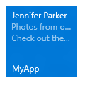

# Отправка локального уведомления на плитке


Основные плитки приложений в Windows 10 определяются в манифесте приложения, а вспомогательные плитки создаются программно и определяются кодом приложения. В этой статье описывается, как с помощью шаблонов адаптивных плиток отправлять локальное уведомление на плитке на основную и вспомогательную плитку. (Локальное уведомление — это уведомление, отправляемое из кода приложения, тогда как уведомление другого типа отправляется принудительно (push-уведомление) или поступает с веб-сервера).


            **Примечание**. Подробнее о [создании адаптивных плиток](tiles-and-notifications-create-adaptive-tiles.md) и [схеме шаблонов адаптивных плиток](tiles-and-notifications-adaptive-tiles-schema.md).

 

## <span id="Install_the_NuGet_package"></span><span id="install_the_nuget_package"></span><span id="INSTALL_THE_NUGET_PACKAGE"></span>Установка пакета NuGet


Мы рекомендуем устанавливать [пакет NuGet NotificationsExtensions](https://www.nuget.org/packages/NotificationsExtensions.Win10/), который упрощает процесс за счет создания полезных данных плитки с объектами вместо необработанных XML-данных.

Примеры встроенного кода в этой статье приведены для языка C# с установленным пакетом [NotificationsExtensions](https://github.com/WindowsNotifications/NotificationsExtensions/wiki) NuGet. (Описание процесса создания собственного кода XML с его примерами без [NotificationsExtensions](https://github.com/WindowsNotifications/NotificationsExtensions/wiki) см. в конце статьи).

## <span id="Add_namespace_declarations"></span><span id="add_namespace_declarations"></span><span id="ADD_NAMESPACE_DECLARATIONS"></span>Добавление объявлений пространств имен


Чтобы получить доступ к API для работы с плитками, добавьте пространство имен [**Windows.UI.Notifications**](https://msdn.microsoft.com/library/windows/apps/br208661). Мы также рекомендуем добавлять пространство имен **NotificationsExtensions.Tiles**, чтобы можно было использовать вспомогательные API для работы с плитками (чтобы получить доступ к этим API, необходимо установить пакет NuGet [NotificationsExtensions](https://github.com/WindowsNotifications/NotificationsExtensions/wiki)).

```
using Windows.UI.Notifications;
using NotificationsExtensions.Tiles; // NotificationsExtensions.Win10
```

## <span id="Create_the_notification_content"></span><span id="create_the_notification_content"></span><span id="CREATE_THE_NOTIFICATION_CONTENT"></span>Создание содержимого уведомления


В Windows 10 полезные данные плитки определяются с помощью шаблонов адаптивных плиток, которые позволяют создавать собственные визуальные макеты для уведомлений. (Дополнительные сведения об операциях, которые можно выполнять с адаптивными плитками, см. в статьях [Создание адаптивных плиток](tiles-and-notifications-create-adaptive-tiles.md) и [Шаблоны адаптивных плиток](tiles-and-notifications-adaptive-tiles-schema.md)).

В этом примере кода создается содержимое адаптивной плитки для средних и широких плиток.

```
// In a real app, these would be initialized with actual data
string from = "Jennifer Parker";
string subject = "Photos from our trip";
string body = "Check out these awesome photos I took while in New Zealand!";
 
 
// Construct the tile content
TileContent content = new TileContent()
{
    Visual = new TileVisual()
    {
        TileMedium = new TileBinding()
        {
            Content = new TileBindingContentAdaptive()
            {
                Children =
                {
                    new TileText()
                    {
                        Text = from
                    },
 
                    new TileText()
                    {
                        Text = subject,
                        Style = TileTextStyle.CaptionSubtle
                    },
 
                    new TileText()
                    {
                        Text = body,
                        Style = TileTextStyle.CaptionSubtle
                    }
                }
            }
        },
 
        TileWide = new TileBinding()
        {
            Content = new TileBindingContentAdaptive()
            {
                Children =
                {
                    new TileText()
                    {
                        Text = from,
                        Style = TileTextStyle.Subtitle
                    },
 
                    new TileText()
                    {
                        Text = subject,
                        Style = TileTextStyle.CaptionSubtle
                    },
 
                    new TileText()
                    {
                        Text = body,
                        Style = TileTextStyle.CaptionSubtle
                    }
                }
            }
        }
    }
};
```

При отображении на средней плитке содержимое уведомления выглядит следующим образом:



## <span id="Create_the_notification"></span><span id="create_the_notification"></span><span id="CREATE_THE_NOTIFICATION"></span>Создание уведомления на плитке


После создания содержимого уведомления необходимо создать новое уведомление [**TileNotification**](https://msdn.microsoft.com/library/windows/apps/br208616). Конструктор **TileNotification** принимает объект [**XmlDocument**](https://msdn.microsoft.com/library/windows/apps/br208620) среды выполнения Windows, который можно получить из метода **TileContent.GetXml** с использованием [NotificationsExtensions](https://github.com/WindowsNotifications/NotificationsExtensions/wiki).

В этом примере кода создается уведомление для новой плитки.

```
// Create the tile notification
var notification = new TileNotification(content.GetXml());
```

## <span id="Set_an_expiration_time_for_the_notification__optional_"></span><span id="set_an_expiration_time_for_the_notification__optional_"></span><span id="SET_AN_EXPIRATION_TIME_FOR_THE_NOTIFICATION__OPTIONAL_"></span>Задание времени окончания срока действия уведомления (необязательно)


По умолчанию локальные уведомления на плитках и индикаторах событий не истекают, тогда как запланированные, периодические и push-уведомления истекают через три дня. Так как содержание плитки не должно сохраняться дольше, чем нужно, рекомендуется установить срок действия на все уведомления на плитках и индикаторах событий, используя время, значимое для вашего приложения.

В этом примере кода создается уведомление, срок действия которого истекает через десять минут, после чего оно удаляется из плитки.

```
tileNotification.ExpirationTime = DateTimeOffset.UtcNow.AddMinutes(10);</code></pre></td>
</tr>
</tbody>
</table>
```

## <span id="Send_the_notification"></span><span id="send_the_notification"></span><span id="SEND_THE_NOTIFICATION"></span>Отправка уведомления


Несмотря на то, что локальная отправка уведомления плитки является простым процессом, отправка уведомления на основную или вспомогательную плитку выполняется несколько иначе.

**Основная плитка**

Чтобы отправить уведомление на основную плитку, используйте [**TileUpdateManager**](https://msdn.microsoft.com/library/windows/apps/br208622) для создания средства обновления основной плитки и отправьте уведомление, вызвав метод «Update». Независимо от того, отображается основная плитка приложения или нет, она всегда существует, таким образом на нее можно отправлять уведомления, даже если она не закреплена. Когда пользователь закрепит основную плитку, тогда и отобразятся отправленные вами уведомления.

В этом примере кода уведомление отправляется на основную плитку.

<span codelanguage=""></span>
```
<colgroup>
<col width="100%" />
</colgroup>
<tbody>
<tr class="odd">
// And send the notification
TileUpdateManager.CreateTileUpdaterForApplication().Update(notification);
```

**Вспомогательная плитка**

Чтобы отправить уведомление на вспомогательную плитку, сначала убедитесь, что вспомогательная плитка существует. Если создать средство обновления плитки для вспомогательной плитки, которой не существует (например, если пользователь открепил вспомогательную плитку), будет выдано исключение. Вы можете использовать [**SecondaryTile.Exists**](https://msdn.microsoft.com/library/windows/apps/br242205)(tileId), чтобы определить, закреплена ли вспомогательная плитка, а затем создать средство обновления плитки для вспомогательной плитки и отправить уведомление.

В этом примере кода уведомление отправляется на вспомогательную плитку.

```
// If the secondary tile is pinned
if (SecondaryTile.Exists("MySecondaryTile"))
{
    // Get its updater
    var updater = TileUpdateManager.CreateTileUpdaterForSecondaryTile("MySecondaryTile");
 
    // And send the notification
    updater.Update(notification);
}
```


## <span id="Clear_notifications_on_the_tile__optional_"></span><span id="clear_notifications_on_the_tile__optional_"></span><span id="CLEAR_NOTIFICATIONS_ON_THE_TILE__OPTIONAL_"></span>Очистка уведомлений на плитке (необязательно)


В большинстве случаев после взаимодействия пользователя с этим содержимым уведомление необходимо очистить. Например, когда пользователь запускает ваше приложение, может потребоваться удалить все уведомления с плитки. Если уведомления зависят от времени, рекомендуется задать время окончания срока действия уведомления, а не выполнять непосредственно очистку уведомления.

В этом примере кода выполняется очистка уведомления плитки.

```
TileUpdateManager.CreateTileUpdaterForApplication().Clear();</code></pre></td>
</tr>
</tbody>
</table>
```

Если для плитки включена очередь уведомлений, в которой имеются элементы, вызов метода Clear приводит к очистке очереди. Тем не менее уведомление нельзя очистить с помощью сервера приложений; уведомления может очищать только локальный код приложения.

Периодические или push-уведомления могут только добавлять новые уведомления или заменять существующие уведомления. Локальный вызов метода Clear очистит плитку независимо от типа уведомлений (push-уведомления, периодические или локальные уведомления). Запланированные уведомления, которые еще не появлялись, не очищаются с помощью этого метода.


## <span id="Next_steps"></span><span id="next_steps"></span><span id="NEXT_STEPS"></span>Следующие этапы


**Использование очереди уведомлений**

Теперь, когда вы выполнили первое обновление плитки, вы можете расширить функциональность своей плитки, включив [очередь уведомлений](https://msdn.microsoft.com/library/windows/apps/xaml/hh868234).

**Другие методы доставки уведомлений**

В этой статье описывается процесс отправки обновления плитки в виде уведомления. Чтобы изучить другие методы доставки уведомлений, включая запланированные, периодические и push-уведомления, см. раздел [Доставка уведомлений](tiles-and-notifications-choosing-a-notification-delivery-method.md).

**Метод доставки XmlEncode**

Если вы не используете [NotificationsExtensions](https://github.com/WindowsNotifications/NotificationsExtensions/wiki), этот метод доставки уведомлений является альтернативным решением.

<span codelanguage=""></span>
```
<colgroup>
<col width="100%" />
</colgroup>
<tbody>
<tr class="odd">
public string XmlEncode(string text)
{
    StringBuilder builder = new StringBuilder();
    using (var writer = XmlWriter.Create(builder))
    {
        writer.WriteString(text);
    }

    return builder.ToString();
}
```

## <span id="Code_examples_without_NotificationsExtensions"></span><span id="code_examples_without_notificationsextensions"></span><span id="CODE_EXAMPLES_WITHOUT_NOTIFICATIONSEXTENSIONS"></span>Примеры кода без NotificationsExtensions


Если вы предпочитаете работать с необработанным кодом XML, а не с пакетом NuGet [NotificationsExtensions](https://github.com/WindowsNotifications/NotificationsExtensions/wiki), вместо первых трех примеров кода, приведенных в этой статье, используйте следующие альтернативные примеры кода. Остальные примеры кода можно использовать с [NotificationsExtensions](https://github.com/WindowsNotifications/NotificationsExtensions/wiki) или с необработанным кодом XML.

Добавление объявлений пространств имен

```
using Windows.UI.Notifications;
using Windows.Data.Xml.Dom;
```

Создание содержимого уведомления

```
// In a real app, these would be initialized with actual data
string from = "Jennifer Parker";
string subject = "Photos from our trip";
string body = "Check out these awesome photos I took while in New Zealand!";
 
 
// TODO - all values need to be XML escaped
 
 
// Construct the tile content as a string
string content = $@"
<tile>
    <visual>
 
        <binding template=&#39;TileMedium&#39;>
            <text>{from}</text>
            <text hint-style=&#39;captionSubtle&#39;>{subject}</text>
            <text hint-style=&#39;captionSubtle&#39;>{body}</text>
        </binding>
 
        <binding template=&#39;TileWide&#39;>
            <text hint-style=&#39;subtitle&#39;>{from}</text>
            <text hint-style=&#39;captionSubtle&#39;>{subject}</text>
            <text hint-style=&#39;captionSubtle&#39;>{body}</text>
        </binding>
 
    </visual>
</tile>";
```

Создание уведомления на плитке

```
// Load the string into an XmlDocument
XmlDocument doc = new XmlDocument();
doc.LoadXml(content);
 
// Then create the tile notification
var notification = new TileNotification(doc);
```

## <span id="related_topics"></span>Ссылки по теме


* [Создание адаптивных плиток](tiles-and-notifications-create-adaptive-tiles.md)
* [Шаблоны адаптивных плиток: схема и документация](tiles-and-notifications-adaptive-tiles-schema.md)
* [NotificationsExtensions.Win10 (пакет NuGet)](https://www.nuget.org/packages/NotificationsExtensions.Win10/)
* [NotificationsExtensions на GitHub](https://github.com/WindowsNotifications/NotificationsExtensions/wiki)
* [Полный пример кода на GitHub](https://github.com/WindowsNotifications/quickstart-sending-local-tile-win10)
* [**Пространство имен Windows.UI.Notifications**](https://msdn.microsoft.com/library/windows/apps/br208661)
* [Использование очереди уведомлений (XAML)](https://msdn.microsoft.com/library/windows/apps/xaml/hh868234)
* [Доставка уведомлений](tiles-and-notifications-choosing-a-notification-delivery-method.md)
 

 


<!--HONumber=Jun16_HO4-->


