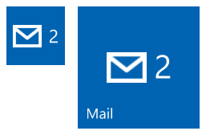
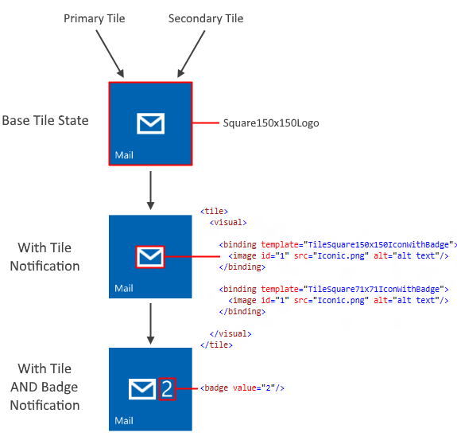
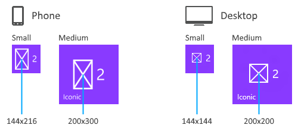
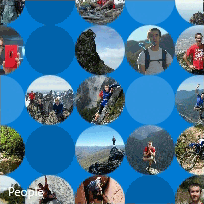

# Специальные шаблоны плиток


\[ Обновлено для приложений UWP в Windows 10. Статьи о Windows 8.x см. в [архиве](http://go.microsoft.com/fwlink/p/?linkid=619132) \]


Специальные шаблоны плиток — это уникальные шаблоны, которые могут быть либо анимированными, либо предоставляют возможности, не поддерживаемые адаптивными плитками. Каждый специальный шаблон плитки был специально создан для Windows 10, за исключением пиктографического шаблона плитки, классического специального шаблона, который был обновлен для Windows 10. Эта статья посвящена трем специальным шаблонам плитки: Iconic (Пиктографический шаблон), Photos (Фотографии) и People (Люди).

## <span id="Iconic_tile_template"></span><span id="iconic_tile_template"></span><span id="ICONIC_TILE_TEMPLATE"></span>Пиктографический шаблон плитки


C помощью пиктографического шаблона (также известного как шаблон «IconWithBadge») можно отображать небольшое изображение в центре плитки. Windows 10 поддерживает этот шаблон на телефонах, планшетах и настольных компьютерах.



### <span id="How_to_create_an_iconic_tile"></span><span id="how_to_create_an_iconic_tile"></span><span id="HOW_TO_CREATE_AN_ICONIC_TILE"></span>Создание пиктографической плитки

Далее приведены все необходимые инструкции по созданию пиктографической плитки для Windows 10. Если рассматривать обобщенно, вам необходимо иметь в наличии ресурс пиктографических изображений, затем отправить уведомление на плитку, используя пиктографический шаблон, и наконец отправить уведомление на индикаторе событий, содержащее число, которое будет отображаться на плитке.



**Шаг 1. Создание ресурсов изображений в формате PNG**

Создайте ресурсы значков для плитки и добавьте их к остальным ресурсам проекта. Создайте значок размером не менее чем 200x200 пикселей, который можно использовать как для маленьких плиток, так и для средних на телефоне и настольном компьютере. Чтобы обеспечить наилучшее удобство взаимодействия пользователя с интерфейсом, создайте значок для каждого размера. На рисунке ниже представлены особенности изменения размера значка.

Сохраните ресурсы значков в формате PNG, применив эффект прозрачности. В Windows Phone любой непрозрачный пиксель отображается в белом цвете (RGB 255, 255, 255). Для обеспечения совместимости и удобства при создании значков для настольного компьютера также используйте белый цвет.

Windows 10 на планшетах, ноутбуках и настольных компьютерах поддерживает только квадратные ресурсы значков. Телефон поддерживает как квадратные ресурсы, так и ресурсы, высота которых превышает их ширину (соотношение ширины к высоте 2:3), что упрощает работу с такими изображениями, как значок телефона.



**Шаг 2. Создание базовой плитки**

Пиктографический шаблон можно использовать для работы как с основными, так и со вспомогательными плитками. Если вы используете этот шаблон со вспомогательной плиткой, сначала необходимо создать вспомогательную плитку или использовать уже закрепленную вспомогательную плитку. Основные плитки закрепляются по умолчанию и на них всегда можно отправлять уведомления.

**Шаг 3. Отправка уведомления на плитку**

Несмотря на то, что ход выполнения этого шага зависит от способа отправки уведомления — локально или по инициативе сервера — отправляемые вами полезные данные XML остаются прежними. Чтобы отправить локальное уведомление на плитке, создайте [**TileUpdater**](https://msdn.microsoft.com/library/windows/apps/br208628) для плитки (основной или вспомогательной), а затем отправьте уведомление на плитку, для которой используется пиктографический шаблон плитки, как показано ниже. В идеальном случае также необходимо добавить привязки для плиток маленьких и больших размеров с помощью [шаблонов адаптивных плиток](tiles-and-notifications-adaptive-tiles-schema.md).

Пример кода для полезных данных XML:

```XML
<tile>
  <visual>

    <binding template="TileSquare150x150IconWithBadge">
      <image id="1" src="Iconic.png" alt="alt text"/>
    </binding>
    
    <binding template="TileSquare71x71IconWithBadge">
      <image id="1" src="Iconic.png" alt="alt text"/>
    </binding>

  </visual>
</tile>
```

В полезных данных XML пиктографического шаблона плитки используется элемент изображения, указывающий на изображение, созданное в ходе шага 1. Теперь плитка будет отображать индикатор событий рядом со значком; остается только отправить уведомлений на индикаторе событий.

**Шаг 4. Отправка уведомления индикатора событий на плитку**

По аналогии с шагом 3 ход выполнения этого шага зависит от способа отправки уведомления — локально или по инициативе сервера. Тем не менее отправляемые вами полезные данные XML будут оставаться прежними. Чтобы отправить локальное уведомление на индикаторе событий, создайте [**BadgeUpdater**](https://msdn.microsoft.com/library/windows/apps/br208537) для плитки (основной или вспомогательной), а затем отправьте уведомление на индикаторе с необходимым значением (или очистите индикатор событий).

Пример кода для полезных данных XML:

```XML
<badge value="2"/></code></pre></td>
</tr>
</tbody>
</table>
```

Индикатор событий на плитке обновится соответствующим образом.

**Шаг. Сбор воедино**

На следующем рисунке представлены особенности связей различных API-интерфейсов и полезных данных с каждым аспектом пиктографического шаблона плитки. [Уведомление на плитке](https://msdn.microsoft.com/library/windows/apps/hh779724) (содержащее эти элементы <binding>) используется для задания пиктографического шаблона и ресурса изображения; [уведомление на индикаторе событий](https://msdn.microsoft.com/library/windows/apps/hh779719) задает числовое значение; свойства плитки используются для управления отображаемым именем плитки, цветом и др.


## <span id="Photos_tile_template"></span><span id="photos_tile_template"></span><span id="PHOTOS_TILE_TEMPLATE"></span>Шаблон плитки Photos (Фотографии)


Шаблон плитки Photos позволяет показывать слайд-шоу из фотографий на живой плитке. Шаблон поддерживается всеми размерами плиток, включая маленькие, и работает одинаково с любым размером плитки. В примере ниже представлены пять кадров средней плитки, для которой использовался шаблон Photos. Шаблон позволяет изменять размер плитки и создавать эффект плавного перехода. Эта анимация чередуется по выбранным фотографиям и воспроизводится бесконечное количество раз.


### <span id="How_to_use_the_photos_template"></span><span id="how_to_use_the_photos_template"></span><span id="HOW_TO_USE_THE_PHOTOS_TEMPLATE"></span>Использование шаблона Photos

Работать с шаблоном Photos несложно, если установить [версию NotificationExtensions для Windows 10](http://blogs.msdn.com/b/tiles_and_toasts/archive/2015/08/20/introducing-notificationsextensions-for-windows-10.aspx). Несмотря на то, что можно использовать необработанные XML-данные, мы настоятельно рекомендуем установить новую версию NotificationExtensions, чтобы вам не пришлось беспокоиться о создании допустимого кода XML или его экранировании в содержимом.

Windows Phone отображает до 9 фотографий в виде слайд-шоу; на планшете, ноутбуке и настольном компьютере отображается до 12 фотографий.

Сведения об отправке уведомления на плитке см. в статье [Отправка уведомлений](tiles-badges-notifications.md).

<span codelanguage="XML"></span>
```XML
<colgroup>
<col width="100%" />
</colgroup>
<thead>
<tr class="header">
<th align="left">XML</th>
</tr>
</thead>
<tbody>
<tr class="odd">
<!--
 
To use the Photos template...
 
 - On any adaptive tile binding (like TileMedium or TileWide)
   - Set the hint-presentation attribute to "photos"
   - Add up to 12 images as children of the binding.
    
-->
 
<tile>
  <visual>
     
    <binding template="TileMedium" hint-presentation="photos">
       
      <image src="Assets/1.jpg" />
      <image src="ms-appdata:///local/Images/2.jpg"/>
      <image src="http://msn.com/images/3.jpg"/>
       
      <!--TODO: Can have 12 images total-->
       
    </binding>
     
    <!--TODO: Add bindings for other tile sizes-->
     
  </visual>
</tile>
```

```CSharp
/*
 
To use the Photos template...
 
 - On any TileBinding object
   - Set Content property to new instance of TileBindingContentPhotos
   - Add up to 12 images to Images property of TileBindingContentPhotos.
 
*/
 
TileContent content = new TileContent()
{
    Visual = new TileVisual()
    {
        TileMedium = new TileBinding()
        {
            Content = new TileBindingContentPhotos()
            {
                Images =
                {
                    new TileImageSource("Assets/1.jpg"),
                    new TileImageSource("ms-appdata:///local/Images/2.jpg"),
                    new TileImageSource("http://msn.com/images/3.jpg")
 
                    // TODO: Can have 12 images total
                }
            }
        }
 
        // TODO: Add other tile sizes
    }
};
```

## <span id="People_tile_template"></span><span id="people_tile_template"></span><span id="PEOPLE_TILE_TEMPLATE"></span>Шаблон плитки People (Люди)


В приложении «Люди» для Windows 10 используется специальный шаблон плитки, который отображает коллекцию изображений по кругу, перемещающихся по горизонтали или по вертикали на плитке. Этот шаблон доступен, начиная со сборки 10572 для Windows 10, и использовать его в своих приложениях могут все.

Шаблон плитки People работает с плитками следующих размеров:

**Средняя плитка** (TileMedium)


 

**Широкая плитка** (TileWide)


 

**Большая плитка (только для настольного компьютера)** (TileLarge)



 

Если вы используете [NotificationExtensions](http://blogs.msdn.com/b/tiles_and_toasts/archive/2015/08/20/introducing-notificationsextensions-for-windows-10.aspx) и хотите начать работать с шаблоном плитки People, необходимо всего лишь создать новый объект *TileBindingContentPeople* для вашего содержимого *TileBinding*. У класса *TileBindingContentPeople* есть свойство Images, в которое добавляются изображения.

При использовании необработанных XML-данных задайте *представлению подсказки (hint-presentation)* значение «people» и добавьте изображения в качестве дочерних элементов элемента привязки.

В следующем примере кода на языке C# предполагается, что вы используете [NotificationExtensions](http://blogs.msdn.com/b/tiles_and_toasts/archive/2015/08/20/introducing-notificationsextensions-for-windows-10.aspx).

```CSharp
TileContent content = new TileContent()
{
    Visual = new TileVisual()
    {
        TileMedium = new TileBinding()
        {
            Content = new TileBindingContentPeople()
            {
                Images =
                {
                    new TileImageSource("Assets/ProfilePics/1.jpg"),
                    new TileImageSource("Assets/ProfilePics/2.jpg"),
                    new TileImageSource("Assets/ProfilePics/3.jpg"),
                    new TileImageSource("Assets/ProfilePics/4.jpg"),
                    new TileImageSource("Assets/ProfilePics/5.jpg"),
                    new TileImageSource("Assets/ProfilePics/6.jpg"),
                    new TileImageSource("Assets/ProfilePics/7.jpg"),
                    new TileImageSource("Assets/ProfilePics/8.jpg"),
                    new TileImageSource("Assets/ProfilePics/9.jpg")
                }
            }
        }
    }
};
```

```XML
<tile>
  <visual>
 
    <binding template=&#39;TileMedium&#39; hint-presentation=&#39;people&#39;>
      <image src=&#39;Assets/ProfilePics/1.jpg&#39;/>
      <image src=&#39;Assets/ProfilePics/2.jpg&#39;/>
      <image src=&#39;Assets/ProfilePics/3.jpg&#39;/>
      <image src=&#39;Assets/ProfilePics/4.jpg&#39;/>
      <image src=&#39;Assets/ProfilePics/5.jpg&#39;/>
      <image src=&#39;Assets/ProfilePics/6.jpg&#39;/>
      <image src=&#39;Assets/ProfilePics/7.jpg&#39;/>
      <image src=&#39;Assets/ProfilePics/8.jpg&#39;/>
      <image src=&#39;Assets/ProfilePics/9.jpg&#39;/>
    </binding>
 
  </visual>
</tile>
```

Для обеспечения максимального удобства пользователей каждому размеру плитки должно соответствовать следующее число фотографий:

-   Средняя плитка: 9 фотографий
-   Широкая плитка: 15 фотографий
-   Большая плитка: 20 фотографий

При использовании указанного количества фотографий будет оставаться несколько незаполненных кругов и плитка не будет слишком визуально загружена. Вы можете изменить количество фотографий, чтобы получить желаемый вид.

Описание процесса отправки уведомления см. в разделе [Выбор метода доставки уведомлений](tiles-and-notifications-choosing-a-notification-delivery-method.md).

## <span id="related_topics"></span>Связанные разделы


* [Полный пример кода на GitHub](https://github.com/WindowsNotifications/quickstart-people-tile-template)
* [NotificationsExtensions на GitHub](https://github.com/WindowsNotifications/NotificationsExtensions/wiki)
* [Плитки, индикаторы событий и уведомления](tiles-badges-notifications.md)
* [Создание адаптивных плиток](tiles-and-notifications-create-adaptive-tiles.md)
* [Шаблоны адаптивных плиток: схема и документация](tiles-and-notifications-adaptive-tiles-schema.md)
 

 


<!--HONumber=Mar16_HO1-->


