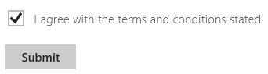
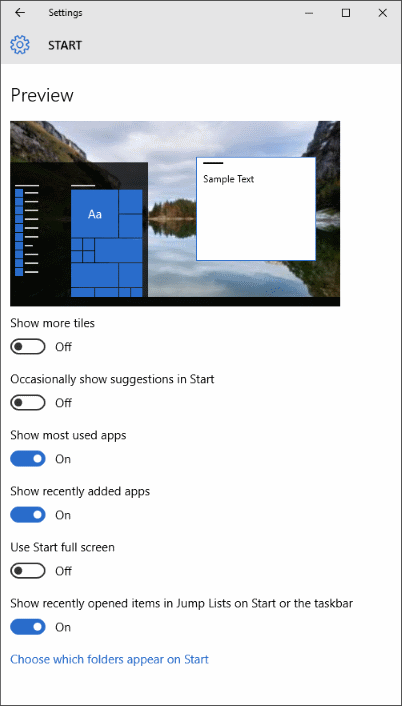

# <a name="toggle-switches"></a>Тумблеры
<link rel="stylesheet" href="https://az835927.vo.msecnd.net/sites/uwp/Resources/css/custom.css"> 


Элемент управления Toggle Switch имитирует физический переключатель, позволяющий пользователям включать и выключать что-либо. С помощью элементов управления **ToggleSwitch** пользователи могут выбрать один из взаимоисключающих вариантов выбора (например, "включено/выключено"). Результат выбора применяется сразу же.

<div class="important-apis" >
<b>Важные API</b><br/>
<ul>
<li>[**ToggleSwitch class**](https://msdn.microsoft.com/library/windows/apps/windows.ui.xaml.controls.toggleswitch.aspx)</li>
<li>[**Свойство IsOn**](https://msdn.microsoft.com/library/windows/apps/windows.ui.xaml.controls.toggleswitch.ison.aspx)</li>
<li>[**Событие Toggled**](https://msdn.microsoft.com/library/windows/apps/windows.ui.xaml.controls.toggleswitch.toggled.aspx)</li>
</ul>
</div>

## <a name="is-this-the-right-control"></a>Выбор правильного элемента управления

Используйте переключатель для бинарных операций, выполняющихся сразу после изменения состояния переключателя. Например, используйте переключатель, чтобы включать или отключать службы или компоненты оборудования, например Wi-Fi.


Если для действия подошел бы физический переключатель, то лучше использовать элемент управления "Тумблер".

Когда пользователь изменяет положение переключателя, рекомендуется немедленно выполнить соответствующее действие.

### <a name="choosing-between-toggle-switch-and-check-box"></a>Выбор между переключателем и флажком

Для некоторых действий можно использовать и переключатель, и флажок. Чтобы выбрать наиболее подходящий элемент управления, следуйте указанным ниже советам.

-   Используйте переключатель для параметров с двумя значениями, когда изменения сразу вступают в силу.

    

    В примере выше (в котором использован тумблер) понятно, что беспроводная связь включена. При использовании флажка пользователю придется задуматься, включена ли беспроводная связь или необходимо установить флажок, чтобы включить ее.

-   Используйте флажок, когда пользователю необходимо выполнить дополнительные действия, чтобы изменения вступили в силу. Например, если пользователю необходимо нажать кнопку "Отправить" или "Далее", чтобы применить изменения, используйте флажок.

    

-   Если у пользователя имеется возможность выбрать несколько элементов, используйте флажки или [список](lists.md).

    

## <a name="examples"></a>Примеры.

Тумблеры в общих параметрах новостного приложения.


Тумблеры в параметрах меню "Пуск" в Windows.



## <a name="create-a-toggle-switch"></a>Создание тумблера

Ниже описано, как создать простой тумблер. Этот код XAML создает тумблер для функции Wi-Fi, показанный выше.

```xaml
<ToggleSwitch x:Name="wiFiToggle" Header="Wifi"/>
```
Ниже описано, как создать такой же тумблер в коде.

```csharp
ToggleSwitch wiFiToggle = new ToggleSwitch();
wiFiToggle.Header = "WiFi";

// Add the toggle switch to a parent container in the visual tree.
stackPanel1.Children.Add(wiFiToggle);
```

### <a name="ison"></a>IsOn

Переключатель может быть в состоянии "включено" или "выключено". Используйте свойство [**IsOn**](https://msdn.microsoft.com/library/windows/apps/windows.ui.xaml.controls.toggleswitch.ison.aspx) для определения состояния переключателя. Если переключатель используется для управления другим двоичным свойством, можно использовать привязку, как показано ниже.

```
<StackPanel Orientation="Horizontal">
    <ToggleSwitch x:Name="ToggleSwitch1" IsOn="True"/>
    <ProgressRing IsActive="{x:Bind ToggleSwitch1.IsOn, Mode=OneWay}" Width="130"/>
</StackPanel>
```

### <a name="toggled"></a>Toggled

В других случаях можно обработать событие [**Toggled**](https://msdn.microsoft.com/library/windows/apps/windows.ui.xaml.controls.toggleswitch.toggled.aspx), чтобы оно реагировало на изменения в состоянии.

В данном примере показано, как добавить обработчик события Toggled в XAML и в коде. Событие Toggled обрабатывается, чтобы включить или выключить кольцевой индикатор выполнения и изменить его видимость.

```xaml
<ToggleSwitch x:Name="toggleSwitch1" IsOn="True" 
              Toggled="ToggleSwitch_Toggled"/>
```

Ниже описано, как создать такой же тумблер в коде.

```csharp
// Create a new toggle switch and add a Toggled event handler.
ToggleSwitch toggleSwitch1 = new ToggleSwitch();
toggleSwitch1.Toggled += ToggleSwitch_Toggled;

// Add the toggle switch to a parent container in the visual tree.
stackPanel1.Children.Add(toggleSwitch1);
```

Обработчик для события Toggled.

```csharp
private void ToggleSwitch_Toggled(object sender, RoutedEventArgs e)
{
    ToggleSwitch toggleSwitch = sender as ToggleSwitch;
    if (toggleSwitch != null)
    {
        if (toggleSwitch.IsOn == true)
        {
            progress1.IsActive = true;
            progress1.Visibility = Visibility.Visible;
        }
        else
        {
            progress1.IsActive = false;
            progress1.Visibility = Visibility.Collapsed;
        }
    }
}
```

### <a name="onoff-labels"></a>Метки "Вкл."/"Выкл."

По умолчанию тумблер включает буквальные метки "Вкл."/"Выкл.", которые локализуются автоматически. Вы можете изменить эти метки, установив свойства [**OnContent**](https://msdn.microsoft.com/library/windows/apps/windows.ui.xaml.controls.toggleswitch.oncontent.aspx) и [**OffContent**](https://msdn.microsoft.com/library/windows/apps/windows.ui.xaml.controls.toggleswitch.offcontent.aspx).

В этом примере показано, как заменить метки "Вкл."/"Выкл." на метки "Показать"/"Скрыть".  

```xaml
<ToggleSwitch x:Name="imageToggle" Header="Show images"
              OffContent="Show" OnContent="Hide" 
              Toggled="ToggleSwitch_Toggled"/>
```

Вы также можете использовать более сложное содержимое, установив свойства [**OnContentTemplate**](https://msdn.microsoft.com/library/windows/apps/windows.ui.xaml.controls.toggleswitch.oncontenttemplate.aspx) и [**OffContentTemplate**](https://msdn.microsoft.com/library/windows/apps/windows.ui.xaml.controls.toggleswitch.offcontenttemplate.aspx).

## <a name="recommendations"></a>Рекомендации

-   Заменяйте метки "Вкл." и "Выкл.", если есть более подходящие метки для параметра. Если есть короткие (3-4 символа) метки, представляющие противоположные состояния, которые больше подходят для конкретного параметра, используйте их. Например, можно использовать метки "Показать"/"Скрыть", если создается тумблер для параметра "Показать изображения". Используйте более конкретные метки. Это помогает при локализации пользовательского интерфейса.
-   Не заменяйте метки "Вкл." и "Выкл." без необходимости; оставьте метки по умолчанию, если ситуация не требует пользовательских меток.
-   Метки должны быть не длиннее 4 символов.

## <a name="related-articles"></a>Связанные статьи

- [**Класс ToggleSwitch**](https://msdn.microsoft.com/library/windows/apps/hh701411)
- [Переключатели](radio-button.md)
- [Тумблеры](toggles.md)
- [Флажки](checkbox.md)
