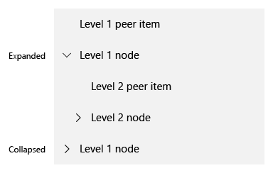
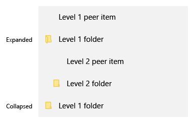

# <a name="hierarchical-layout-with-treeview"></a>Иерархический макет с TreeView
<link rel="stylesheet" href="https://az835927.vo.msecnd.net/sites/uwp/Resources/css/custom.css"> 

<div class="microsoft-internal-note">
Красные указатели для TreeView находятся в центре ресурсов проектирования Design Depot: http://designdepotweb1/DesignDepot.FrontEnd/#/Dashboard/856
</div>

TreeView— это шаблон иерархического списка с разворачиваемыми и сворачиваемыми узлами, содержащими вложенные элементы. Вложенные элементы могут быть дополнительными узлами или рядовыми элементами списка. Вы можете использовать [ListView](https://msdn.microsoft.com/library/windows/apps/windows.ui.xaml.controls.listview.aspx) для построения древовидного представления, чтобы показать структуру папок или дочерние связи в пользовательском интерфейсе.

[Пример TreeView](http://go.microsoft.com/fwlink/?LinkId=785018) — образцовая реализация, созданная с использованием **ListView**. Не является самостоятельным элементом управления. Элемент TreeView, который можно увидеть на панели избранного в браузере Microsoft Edge, основан на этой образцовой реализации.

Пример поддерживает следующие возможности.
- Многоуровневые вложения
- Разворачивание и сворачивание узлов
- Перетаскивание узлов внутри TreeView
- Встроенные специальные возможности

 | 
-- | --
Образцовый пример TreeView | TreeView в браузере Edge

## <a name="is-this-the-right-pattern"></a>Выбор правильного шаблона

- Используйте TreeView, когда ваши объекты имеют вложенные списочные элементы, и если важно показать иерархическую связь элементов с другими элементами на одном и вышестоящих уровнях.

- Не рекомендуется использовать TreeView, если отображение иерархических связей элементов не имеет высокого значения. Для большинства стандартных ситуаций подходит обычное представление списка

## <a name="treeview-ui-structure"></a>Структура пользовательского интерфейса TreeView

Для представления узлов в TreeView можно использовать значки. Сочетание отступа и значков можно использовать для представления иерархических связей между папкой или родительским узлом и дочерними узлами и объектами, не являющимися папками. Здесь приводятся рекомендации по этим вопросам.

### <a name="icons"></a>Значки

Используйте значки для указания того, что элемент является узлом, а также для индикации состояния узла (развернут или свернут).

#### <a name="chevron"></a>Шеврон

Для единообразия на свернутых узлах следует использовать указывающий вправо шеврон, а на развернутых — шеврон, указывающий вниз.



#### <a name="folder"></a>Папка

Используйте значок папки только для буквальных представлений папок.



#### <a name="chevron-and-folder"></a>Шевроны и папки

Сочетание шеврона и папки следует использовать, только если не являющиеся узловыми элементы списка в TreeView также отображаются в виде значков.


#### <a name="redlines-for-indentation-of-folders-and-non-folder-nodes"></a>Красные линии для отступа папок и не являющихся папками узлов

Используйте приведенные на иллюстрации красные линии для отступа папок и других узлов.


## <a name="building-a-treeview"></a>Построение TreeView

TreeView имеет следующие основные классы. Все они определены и включены в образцовой реализации.

> **Примечание.**&nbsp;&nbsp;TreeView реализуется как [компонент среды выполнения Windows](https://msdn.microsoft.com/windows/uwp/winrt-components/index), написанный на C++, поэтому на него могут ссылаться приложения UWP на любом языке. В этом примере код TreeView находится в папке *cpp/Control*. Для C# соответствующей папки *cs/Control* не существует.

- Класс `TreeNode` реализует иерархический макет для TreeView. Он также содержит данные, которые будут привязаны к нему в шаблоне элементов.
- Класс `TreeView` реализует события для ItemClick, разворачивания и сворачивания папок и начала перетаскивания.
- Класс `TreeViewItem` реализует события для операции отпускания объекта при перетаскивании.
- Класс `ViewModel` складывает список TreeViewItems, так что такие операции, как навигация с помощью клавиатуры и перетаскивание , могут быть унаследованы из ListView.

## <a name="create-a-data-template-for-your-treeviewitem"></a>Создание шаблона данных для TreeViewItem

Ниже приводится фрагмент кода XAML, который создает шаблон данных для папок и других элементов.
- Для определения ListViewItem как папки необходимо явно задать свойству [AllowDrop](https://msdn.microsoft.com/library/windows/apps/windows.ui.xaml.uielement.allowdrop.aspx) этого ListViewItem значение **true**. Этот код XAML демонстрирует один из способов для этого.
- Для определения ListViewItem как отличного от папки элемента не требуется задавать какое-либо свойство самого ListViewItem. Просто задайте свойству AllowDrop значение true в ListView.
- Можно использовать развернутые и свернутые значки папок или шевроны для визуальной индикации свернутого или развернутого состояния папки.
- Можно также использовать преобразователи, чтобы выбирать различные значки, необходимые для отображения развернутого или свернутого состояния, как показано в этом примере.

```xaml
<!-- MainPage.xaml -->
<DataTemplate x:Key="TreeViewItemDataTemplate">
    <StackPanel Orientation="Horizontal" Height="40" Margin="{Binding Depth, Converter={StaticResource IntToIndConverter}}" AllowDrop="{Binding Data.IsFolder}">
        <FontIcon x:Name="expandCollapseChevron"
                  Glyph="{Binding IsExpanded, Converter={StaticResource expandCollapseGlyphConverter}}"
                  Visibility="{Binding Data.IsFolder, Converter={StaticResource booleanToVisibilityConverter}}"                           
                  FontSize="12"
                  Margin="12,8,12,8"
                  FontFamily="Segoe MDL2 Assets"                          
                  />
        <Grid>
            <FontIcon x:Name ="expandCollapseFolder"
                      Glyph="{Binding IsExpanded, Converter={StaticResource folderGlyphConverter}}"
                      Foreground="#FFFFE793"
                      FontSize="16"
                      Margin="0,8,12,8"
                      FontFamily="Segoe MDL2 Assets"
                      Visibility="{Binding Data.IsFolder, Converter={StaticResource booleanToVisibilityConverter}}"
                      />

            <FontIcon x:Name ="nonFolderIcon"
                      Glyph="&#xE160;"
                      Foreground="{ThemeResource SystemControlForegroundBaseLowBrush}"
                      FontSize="12"
                      Margin="20,8,12,8"
                      FontFamily="Segoe MDL2 Assets"
                      Visibility="{Binding Data.IsFolder, Converter={StaticResource inverseBooleanToVisibilityConverter}}"
                      />

            <FontIcon x:Name ="expandCollapseFolderOutline"
                      Glyph="{Binding IsExpanded, Converter={StaticResource folderOutlineGlyphConverter}}"
                      Foreground="#FFECC849"
                      FontSize="16"
                      Margin="0,8,12,8"
                      FontFamily="Segoe MDL2 Assets"
                      Visibility="{Binding Data.IsFolder, Converter={StaticResource booleanToVisibilityConverter}}"/>
        </Grid>

        <TextBlock Text="{Binding Data.Name}"
                   HorizontalAlignment="Stretch"
                   VerticalAlignment="Center"  
                   FontWeight="Medium"
                   FontFamily="Segoe MDL2 Assests"                           
                   Style="{ThemeResource BodyTextBlockStyle}"/>
    </StackPanel>
</DataTemplate>
```

## <a name="set-up-the-data-in-your-treeview"></a>Настройка данных в TreeView

Здесь приводится код, настраивающий данные в примере TreeView.

```csharp
 public MainPage()
 {
     this.InitializeComponent();

     TreeNode workFolder = CreateFolderNode("Work Documents");
     workFolder.Add(CreateFileNode("Feature Functional Spec"));
     workFolder.Add(CreateFileNode("Feature Schedule"));
     workFolder.Add(CreateFileNode("Overall Project Plan"));
     workFolder.Add(CreateFileNode("Feature Resource allocation"));
     sampleTreeView.RootNode.Add(workFolder);

     TreeNode remodelFolder = CreateFolderNode("Home Remodel");
     remodelFolder.IsExpanded = true;
     remodelFolder.Add(CreateFileNode("Contactor Contact Information"));
     remodelFolder.Add(CreateFileNode("Paint Color Scheme"));
     remodelFolder.Add(CreateFileNode("Flooring woodgrain types"));
     remodelFolder.Add(CreateFileNode("Kitchen cabinet styles"));

     TreeNode personalFolder = CreateFolderNode("Personal Documents");
     personalFolder.IsExpanded = true;
     personalFolder.Add(remodelFolder);

     sampleTreeView.RootNode.Add(personalFolder);
 }

 private static TreeNode CreateFileNode(string name)
 {
     return new TreeNode() { Data = new FileSystemData(name) };
 }

 private static TreeNode CreateFolderNode(string name)
 {
     return new TreeNode() { Data = new FileSystemData(name) { IsFolder = true } };
 }
```

После выполнения описанных выше действий у вас будет полностью заполненный иерархический макет TreeView с многоуровневым вложением, поддержкой разворачивания и сворачивания папок, перетаскивания между папками и встроенным набором специальных возможностей.

Чтобы предоставить пользователю возможность добавления и удаления элементов из TreeView, рекомендуется добавить контекстное меню для отображения этих функций пользователю.


## <a name="related-articles"></a>Еще по теме

- [Пример TreeView](http://go.microsoft.com/fwlink/?LinkId=785018)
- [**ListView**](https://msdn.microsoft.com/library/windows/apps/windows.ui.xaml.controls.listview.aspx)
- [ListView и GridView](listview-and-gridview.md)
