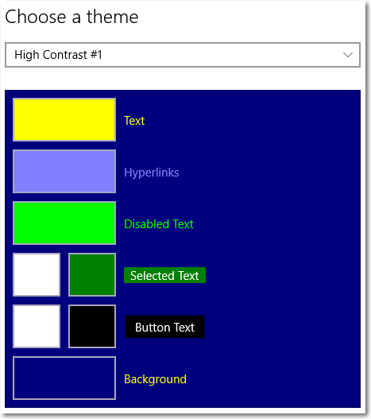
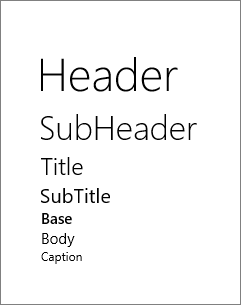
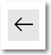

# Ресурсы темы XAML

Ресурсы темы XAML представляют собой набор ресурсов, применяющих различные значения в зависимости от того, какая тема системы активна. Платформа XAML поддерживает 3 темы: Light, Dark и HighContrast.

**Необходимые условия**

Предполагается, что вы уже прочитали раздел [Справочники по ResourceDictionary и ресурсу XAML](resourcedictionary-and-xaml-resource-references.md).

## Отличие ресурсов темы от статических ресурсов

Существует два расширения разметки XAML, которые могут ссылаться на ресурс XAML из существующего словаря ресурсов XAML: [расширение разметки {StaticResource}](../xaml-platform/staticresource-markup-extension.md) и [расширение разметки {ThemeResource}](../xaml-platform/themeresource-markup-extension.md).

Анализ [расширения разметки {ThemeResource}](../xaml-platform/themeresource-markup-extension.md) происходит при загрузке приложения и затем при каждом изменении темы во время выполнения. Это, как правило, является результатом изменения пользователем параметров устройства или программных изменений текущей темы в приложении.

А анализ [расширения разметки {StaticResource}](../xaml-platform/staticresource-markup-extension.md) происходит только при первой загрузке XAML приложением. Обновление при этом не выполняется. Этот процесс похож на функцию поиска и замены в XAML с фактическим значением выполнения при запуске приложения.

## Ресурсы темы и их место в структуре словаря ресурсов


Каждый ресурс темы является частью XAML-файла themeresources.xaml. Для целей проектирования файл themeresources.xaml находится в папке \\(Program Files)\\Windows Kits\\10\\DesignTime\\CommonConfiguration\\Neutral\\UAP\\&lt;SDK version&gt;\\Generic, созданной при установке пакета средств разработки программного обеспечения для Windows (SDK). Словари ресурсов в themeresources.xaml также воспроизведены в generic.xaml в том же каталоге.

> **Примечание.**
            &nbsp;&nbsp;Среда выполнения Windows не использует эти физические файлы для поиска во время выполнения. Поэтому они специально находятся в папке DesignTime и не копируются в приложения по умолчанию. Вместо этого такие словари ресурсов существуют в памяти как часть самой среды выполнения Windows, и ссылки на ресурсы XAML приложения — на ресурсы темы (или системные ресурсы) — разрешаются там во время выполнения.

 ## Рекомендации по использованию ресурсов темы

Следуйте данным рекомендациям, чтобы определить и использовать собственные настраиваемые ресурсы темы.

РЕКОМЕНДУЕТСЯ

-   Определить словари для тем Light и Dark в дополнение к словарю HighContrast. Хотя можно создать словарь [**ResourceDictionary**](https://msdn.microsoft.com/library/windows/apps/br208794) с основным значением Default, предпочтительнее использовать явные параметры Light, Dark и HighContrast.
-   Использовать [расширение разметки {ThemeResource}](../xaml-platform/themeresource-markup-extension.md) в стилях, методах установки, шаблонах элементов управления, методах определения свойств и анимациях.

НЕ РЕКОМЕНДУЕТСЯ

-   Использовать [расширение разметки {ThemeResource}](../xaml-platform/themeresource-markup-extension.md) в определениях ресурсов в словарях [**ThemeDictionaries**](https://msdn.microsoft.com/library/windows/apps/br208807). Вместо этого используйте [расширение разметки {StaticResource}](../xaml-platform/staticresource-markup-extension.md).

    ИСКЛЮЧЕНИЕ. Можно использовать [расширение разметки {ThemeResource}](../xaml-platform/themeresource-markup-extension.md) для ссылки на ресурсы, которые не зависят от темы приложения в словарях [**ThemeDictionaries**](https://msdn.microsoft.com/library/windows/apps/br208807). Примерами таких ресурсов являются ресурсы цветов элементов, такие как `SystemAccentColor`, или ресурсы системных цветов, которые обычно имеют префиксы SystemColor, такие как `SystemColorButtonFaceColor`.

**Внимание!** В случае несоблюдения этих рекомендаций вы можете столкнуться с непредвиденным поведением, связанным с темами в приложении. Дополнительные сведения см. в разделе [Устранение неполадок с ресурсами тем](#troubleshooting_theme_resources).
 

## Кисти, зависимые от темы, и линейно изменяющийся цветовой шаблон XAML

Комбинированный набор цветов для тем Light, Dark и HighContrast составляет *Линейно изменяющийся цветовой шаблон Windows* в XAML. Если вы хотите изменить тему системы или применить тему системы к вашим собственным элементам XAML, важно понять структуру ресурсов цвета.

### Цвета светлой и темной тем

Платформа XAML предоставляет набор именованных ресурсов [**Color**](https://msdn.microsoft.com/library/windows/apps/hh673723) со значениями, подобранными для тем Light и Dark. Разделы, используемые для ссылки, должны иметь следующий формат имени: `System[Simple Light/Dark Name]Color`.

В этой таблице перечислены раздел, простое имя и строковое представление цвета (в формате \#aarrggbb) для ресурсов Light и Dark, предоставляемых платформой XAML. Этот раздел используется для ссылки на ресурс в приложении. "Простое имя Light/Dark" используется в рамках соглашения об именовании кистей, о котором будет рассказано позже.

| Раздел                             | Простое имя Light/Dark | Light      | Dark       |
|---------------------------------|------------------------|------------|------------|
| SystemAltHighColor              | AltHigh                | \#FFFFFFFF | \#FF000000 |
| SystemAltLowColor               | AltLow                 | \#33FFFFFF | \#33000000 |
| SystemAltMediumColor            | AltMedium              | \#99FFFFFF | \#99000000 |
| SystemAltMediumHighColor        | AltMediumHigh          | \#CCFFFFFF | \#CC000000 |
| SystemAltMediumLowColor         | AltMediumLow           | \#66FFFFFF | \#66000000 |
| SystemBaseHighColor             | BaseHigh               | \#FF000000 | \#FFFFFFFF |
| SystemBaseLowColor              | BaseLow                | \#33000000 | \#33FFFFFF |
| SystemBaseMediumColor           | BaseMedium             | \#99000000 | \#99FFFFFF |
| SystemBaseMediumHighColor       | BaseMediumHigh         | \#CC000000 | \#CCFFFFFF |
| SystemBaseMediumLowColor        | BaseMediumLow          | \#66000000 | \#66FFFFFF |
| SystemChromeAltLowColor         | ChromeAltLow           | \#FF171717 | \#FFF2F2F2 |
| SystemChromeBlackHighColor      | ChromeBlackHigh        | \#FF000000 | \#FF000000 |
| SystemChromeBlackLowColor       | ChromeBlackLow         | \#33000000 | \#33000000 |
| SystemChromeBlackMediumLowColor | ChromeBlackMediumLow   | \#66000000 | \#66000000 |
| SystemChromeBlackMediumColor    | ChromeBlackMedium      | \#CC000000 | \#CC000000 |
| SystemChromeDisabledHighColor   | ChromeDisabledHigh     | \#FFCCCCCC | \#FF333333 |
| SystemChromeDisabledLowColor    | ChromeDisabledLow      | \#FF7A7A7A | \#FF858585 |
| SystemChromeHighColor           | ChromeHigh             | \#FFCCCCCC | \#FF767676 |
| SystemChromeLowColor            | ChromeLow              | \#FFF2F2F2 | \#FF171717 |
| SystemChromeMediumColor         | ChromeMedium           | \#FFE6E6E6 | \#FF1F1F1F |
| SystemChromeMediumLowColor      | ChromeMediumLow        | \#FFF2F2F2 | \#FF2B2B2B |
| SystemChromeWhiteColor          | ChromeWhite            | \#FFFFFFFF | \#FFFFFFFF |
| SystemListLowColor              | ListLow                | \#19000000 | \#19FFFFFF |
| SystemListMediumColor           | ListMedium             | \#33000000 | \#33FFFFFF |


### Высококонтрастные цвета системы Windows

В дополнение к набору ресурсов, предоставляемых платформой XAML, существует набор значений цвета, полученных из палитры Windows. Эти цвета не привязаны к среде выполнения Windows или приложений универсальной платформы Windows (UWP). Однако многие из ресурсов [**Brush**](https://msdn.microsoft.com/library/windows/apps/br228076) XAML используют эти цвета, когда система работает (и приложение выполняется) с темой HighContrast. Платформа XAML предоставляет эти системные цвета как ключевые ресурсы. Разделы должны иметь следующий формат имени: `SystemColor[name]Color`.

В этой таблице перечислены системные цвета, предоставляемые XAML в форме объектов ресурса, полученных из палитры Windows. В столбце "Имя специальной возможности" указана метка цвета в пользовательском интерфейсе параметров Windows. В столбце "Простое имя HighContrast" указано слово-описание того, как данный цвет применяется к общим элементам управления XAML. Оно используется в рамках соглашения о наименовании кистей, о котором мы расскажем позже. В столбце "Первоначальное стандартное значение" указаны значения, которые вы получите, если система вообще не работает с высокой контрастностью.

| Раздел                           | Имя специальной возможности            | Простое имя HighContrast | Первоначальное стандартное значение |
|-------------------------------|--------------------------------|--------------------------|-----------------|
| SystemColorButtonFaceColor    | **Текст на кнопке** (фон)   | Фон               | \#FFF0F0F0      |
| SystemColorButtonTextColor    | **Текст на кнопке** (передний план)   | Передний план               | \#FF000000      |
| SystemColorGrayTextColor      | **Отключенный текст**              | Отключено                 | \#FF6D6D6D      |
| SystemColorHighlightColor     | **Выделенный текст** (фон) | Выделить                | \#FF3399FF      |
| SystemColorHighlightTextColor | **Выделенный текст** (передний план) | HighlightAlt             | \#FFFFFFFF      |
| SystemColorHotlightColor      | **Гиперссылки**                 | Гиперссылка                | \#FF0066CC      |
| SystemColorWindowColor        | **Фон**                 | PageBackground           | \#FFFFFFFF      |
| SystemColorWindowTextColor    | **Текст**                       | PageText                 | \#FF000000      |


Windows предоставляет разные тем с высокой контрастностью и позволяет пользователю задавать определенные цвета для параметров высокой контрастности в Центре специальных возможностей, как показано ниже. Поэтому предоставить окончательный список значений высококонтрастных цветов невозможно.



Дополнительные сведения о поддержке тем с высокой контрастностью см. в разделе [Темы с высокой контрастностью](https://msdn.microsoft.com/library/windows/apps/mt244346).

### Цветовая тема системы

В дополнение к цветам тем с высокой контрастностью цветовая тема системы предоставляется в форме особого ресурса цвета с использованием раздела `SystemAccentColor`. Во время выполнения этот ресурс получает цвет, который пользователь выбрал в качестве цветовой схемы в параметрах персонализации Windows.

> **Примечание.**
            &nbsp;&nbsp;Можно переопределить ресурсы системных цветов для использования высококонтрастного цвета и цветовой схемы, создав ресурс с таким же именем, но рекомендуется придерживаться заданных пользователем вариантов использования цвета, особенно для параметров высокой контрастности.

### Кисти, зависимые от темы

Ресурсы цвета, рассмотренные в предыдущих разделах, используются для определения свойства [**Color**](https://msdn.microsoft.com/library/windows/apps/br242963) ресурсов [**SolidColorBrush**](https://msdn.microsoft.com/library/windows/apps/br242962) в словарях ресурсов темы системы. Ресурсы кисти используются для применения цвета к элементам XAML. Разделы ресурсов кисти должны иметь следующий формат имени: `SystemControl[Simple HighContrast name][Simple light/dark name]Brush`. Например, `SystemControlBackroundAltHighBrush`.

Рассмотрим, как определяется значение цвета для этой кисти во время выполнения. В словарях ресурсов Light и Dark эта кисть определена следующим образом:

`<SolidColorBrush x:Key="SystemControlBackgroundAltHighBrush" Color="{StaticResource SystemAltHighColor}"/>`

В словаре ресурсов HighContrast эта кисть определена так:

`<SolidColorBrush x:Key="SystemControlBackgroundAltHighBrush" Color="{ThemeResource SystemColorButtonFaceColor}"/>`

Когда кисть применяется к элементу XAML, во время выполнения ее цвет определяется текущей темой, как показано в следующей таблице.

| Тема        | Простое имя цвета | Ресурс цвета             | Значение выполнения                                              |
|--------------|-------------------|----------------------------|------------------------------------------------------------|
| Light        | AltHigh           | SystemAltHighColor         | \#FFFFFFFF                                                 |
| Dark         | AltHigh           | SystemAltHighColor         | \#FF000000                                                 |
| HighContrast | Фон        | SystemColorButtonFaceColor | Цвет, указанный в параметрах для фона кнопки. |

Можно использовать схему имен `SystemControl[Simple HighContrast name][Simple light/dark name]Brush`, чтобы определить, какую кисть применить к вашим собственным элементам XAML. 

<!--
For many examples of how the brushes are used in the XAML control templates, see the [Default control styles and templates](default-control-styles-and-templates.md).
-->

> **Примечание.**
            &nbsp;&nbsp;Не все сочетания \[*Простого имени HighContrast*\]\[*Простого имени Light/Dark\*] предоставляются как ресурсы кисти.

## Набор шрифтов XAML

Файл themeresources.xaml определяет несколько ресурсов, определяющих стиль [**Style**](https://msdn.microsoft.com/library/windows/apps/br208849), который можно применить к контейнерам текста в вашем пользовательском интерфейсе, в частности для [**TextBlock**](https://msdn.microsoft.com/library/windows/apps/br209652) или [**RichTextBlock**](https://msdn.microsoft.com/library/windows/apps/br227565). Эти стили не являются неявными стандартными стилями. Они предоставляются, чтобы упростить создание определений пользовательского интерфейса XAML, соответствующих *набору шрифтов Windows*, указанному в документе [Руководство по шрифтам](https://msdn.microsoft.com/library/windows/apps/hh700394).

Эти стили предназначены для атрибутов текста, которые вы хотите применить ко всему контейнеру текста. Если вам нужно, чтобы стили применялись только к отдельным частям текста, следует задать атрибуты для элементов текста в контейнере, например [**Run**](https://msdn.microsoft.com/library/windows/apps/br209959) в [**TextBlock.Inlines**](https://msdn.microsoft.com/library/windows/apps/br209668) или [**Paragraph**](https://msdn.microsoft.com/library/windows/apps/br244503) в [**RichTextBlock.Blocks**](https://msdn.microsoft.com/library/windows/apps/br244347).

При применении к [**TextBlock**](https://msdn.microsoft.com/library/windows/apps/br209652) стили выглядят таким образом:



### BaseTextBlockStyle

**TargetType**: [**TextBlock**](https://msdn.microsoft.com/library/windows/apps/br209652)

Предоставляет общие свойства для всех других стилей контейнеров [**TextBlock**](https://msdn.microsoft.com/library/windows/apps/br209652).

```XAML
<!-- Usage -->
<TextBlock Text="Base" Style="{ThemeResource BaseTextBlockStyle}"/>

<!-- Style definition -->
<Style x:Key="BaseTextBlockStyle" TargetType="TextBlock">
    <Setter Property="FontFamily" Value="Segoe UI"/>
    <Setter Property="FontWeight" Value="SemiBold"/>
    <Setter Property="FontSize" Value="15"/>
    <Setter Property="TextTrimming" Value="None"/>
    <Setter Property="TextWrapping" Value="Wrap"/>
    <Setter Property="LineStackingStrategy" Value="MaxHeight"/>
    <Setter Property="TextLineBounds" Value="Full"/>
</Style>
```

### HeaderTextBlockStyle

```XAML
<!-- Usage -->
<TextBlock Text="Header" Style="{ThemeResource HeaderTextBlockStyle}"/>

<!-- Style definition -->
<Style x:Key="HeaderTextBlockStyle" TargetType="TextBlock"
       BasedOn="{StaticResource BaseTextBlockStyle}">
    <Setter Property="FontSize" Value="46"/>
    <Setter Property="FontWeight" Value="Light"/>
    <Setter Property="OpticalMarginAlignment" Value="TrimSideBearings"/>
</Style>
```

### SubheaderTextBlockStyle

```XAML
<!-- Usage -->
<TextBlock Text="SubHeader" Style="{ThemeResource SubheaderTextBlockStyle}"/>

<!-- Style definition -->
<Style x:Key="SubheaderTextBlockStyle" TargetType="TextBlock" 
       BasedOn="{StaticResource BaseTextBlockStyle}">
    <Setter Property="FontSize" Value="34"/>
    <Setter Property="FontWeight" Value="Light"/>
    <Setter Property="OpticalMarginAlignment" Value="TrimSideBearings"/>
</Style>
```

### TitleTextBlockStyle

```XAML
<!-- Usage -->
<TextBlock Text="Title" Style="{StaticResource TitleTextBlockStyle}"/>

<!-- Style definition -->
<Style x:Key="TitleTextBlockStyle" TargetType="TextBlock" 
       BasedOn="{StaticResource BaseTextBlockStyle}">
    <Setter Property="FontWeight" Value="SemiLight"/>
    <Setter Property="FontSize" Value="24"/>
    <Setter Property="OpticalMarginAlignment" Value="TrimSideBearings"/>
</Style>
```

### SubtitleTextBlockStyle

```XAML
<!-- Usage -->
<TextBlock Text="SubTitle" Style="{StaticResource SubtitleTextBlockStyle}"/>

<!-- Style definition -->
<Style x:Key="SubtitleTextBlockStyle" TargetType="TextBlock" 
       BasedOn="{StaticResource BaseTextBlockStyle}">
    <Setter Property="FontWeight" Value="Normal"/>
    <Setter Property="FontSize" Value="20"/>
    <Setter Property="OpticalMarginAlignment" Value="TrimSideBearings"/>
</Style>
```

### BodyTextBlockStyle

```XAML
<!-- Usage -->
<TextBlock Text="Body" Style="{ThemeResource BodyTextBlockStyle}"/>

<!-- Style definition -->
<Style x:Key="BodyTextBlockStyle" TargetType="TextBlock" 
       BasedOn="{StaticResource BaseTextBlockStyle}">
    <Setter Property="FontWeight" Value="Normal"/>
    <Setter Property="FontSize" Value="15"/>
</Style>
```

### CaptionTextBlockStyle

```XAML
<!-- Usage -->
<TextBlock Text="Caption" Style="{ThemeResource CaptionTextBlockStyle}"/>

<!-- Style definition -->
<Style x:Key="CaptionTextBlockStyle" TargetType="TextBlock" 
       BasedOn="{StaticResource BaseTextBlockStyle}">
    <Setter Property="FontSize" Value="12"/>
    <Setter Property="FontWeight" Value="Normal"/>
</Style>
```

### BaseRichTextBlockStyle

**TargetType**: [**RichTextBlock**](https://msdn.microsoft.com/library/windows/apps/br227565)

Предоставляет общие свойства для всех других стилей контейнеров [**RichTextBlock**](https://msdn.microsoft.com/library/windows/apps/br227565).

```XAML
<!-- Usage -->
<RichTextBlock Style="{ThemeResource BaseRichTextBlockStyle}">
    <Paragraph>Rich text.</Paragraph>
</RichTextBlock>

<!-- Style definition -->
<Style x:Key="BaseRichTextBlockStyle" TargetType="RichTextBlock">
    <Setter Property="FontFamily" Value="Segoe UI"/>
    <Setter Property="FontWeight" Value="SemiBold"/>
    <Setter Property="FontSize" Value="15"/>
    <Setter Property="TextTrimming" Value="None"/>
    <Setter Property="TextWrapping" Value="Wrap"/>
    <Setter Property="LineStackingStrategy" Value="MaxHeight"/>
    <Setter Property="TextLineBounds" Value="Full"/>
    <Setter Property="OpticalMarginAlignment" Value="TrimSideBearings"/>
</Style>
```

### BodyRichTextBlockStyle

```XAML
<!-- Usage -->
<RichTextBlock Style="{ThemeResource BodyRichTextBlockStyle}">
    <Paragraph>Rich text.</Paragraph>
</RichTextBlock>

<!-- Style definition -->
<Style x:Key="BodyRichTextBlockStyle" TargetType="RichTextBlock" BasedOn="{StaticResource BaseRichTextBlockStyle}">
    <Setter Property="FontWeight" Value="Normal"/>
</Style>
```

> **Примечание.**
            &nbsp;&nbsp;  Стили [**RichTextBlock**](https://msdn.microsoft.com/library/windows/apps/br227565) не содержат всех стилей таблицы шрифтов, которые содержит стиль [**TextBlock**](https://msdn.microsoft.com/library/windows/apps/br209652), главным образом потому, что блочная объектная модель документа для **RichTextBlock** упрощает настройку атрибутов в отдельных элементах текста. Кроме того, параметр [**TextBlock.Text**](https://msdn.microsoft.com/library/windows/apps/br209676), использующий свойство XAML-содержимого, описывает ситуацию, где отсутствуют элементы текста, к которым нужно применить стиль, поэтому стиль необходимо применить к контейнеру. Это не является проблемой для **RichTextBlock**, так как его текстовое содержимое всегда должно находиться в определенных элементах текста, таких как [**Paragraph**](https://msdn.microsoft.com/library/windows/apps/br244503). Именно в них вы можете применить стили XAML для заголовка страницы, подзаголовка страницы и аналогичных определений из таблицы шрифтов.

## Различные именованные стили

Существует дополнительный набор определений [**Style**](https://msdn.microsoft.com/library/windows/apps/br208849) с ключами, которые можно применить, чтобы стиль кнопки [**Button**](https://msdn.microsoft.com/library/windows/apps/br209265) отличался от стандартного неявного стиля.

### TextBlockButtonStyle

**TargetType**: [**ButtonBase**](https://msdn.microsoft.com/library/windows/apps/br227736)

Примените этот стиль к [**Button**](https://msdn.microsoft.com/library/windows/apps/br209265), если необходимо отобразить текст, который должен нажать пользователь для выполнения действия. Стиль текста будет соответствовать цветовой схеме и выделять его как интерактивный элемент. Кроме того, для удобной работы текстом будут доступны прямоугольники фокуса. В отличие от неявного стиля [**HyperlinkButton**](https://msdn.microsoft.com/library/windows/apps/br242739), при использовании **TextBlockButtonStyle** текст не подчеркивается.

Кроме того, этот шаблон определяет, что стиль представленного текста должен использовать **SystemControlHyperlinkBaseMediumBrush** (для состояния PointerOver), **SystemControlHighlightBaseMediumLowBrush** (для состояния Pressed) и **SystemControlDisabledBaseLowBrush** (для состояния Disabled).

Вот пример кнопки [**Button**](https://msdn.microsoft.com/library/windows/apps/br209265) с примененным к ней ресурсом **TextBlockButtonStyle**.

```XAML
<Button Content="Clickable text" Style="{ThemeResource TextBlockButtonStyle}" 
        Click="Button_Click"/>
```

Он выглядит следующим образом:


### NavigationBackButtonNormalStyle

**TargetType**: [**Button**](https://msdn.microsoft.com/library/windows/apps/br209265)

Этот стиль [**Style**](https://msdn.microsoft.com/library/windows/apps/br208849) предоставляет полный шаблон для элемента управления [**Button**](https://msdn.microsoft.com/library/windows/apps/br209265), который может использоваться как кнопка навигации "Назад" для приложения навигации. Он содержит ссылки на ресурсы темы, которые применяют к этой кнопке символьный шрифт Segoe MDL2 Assets, поэтому в качестве содержимого следует использовать значение [**Symbol**](https://msdn.microsoft.com/library/windows/apps/dn252842), а не текст. Размер по умолчанию: 40 x 40 пикселей. Для настройки стиля можно либо явным образом задать [**Height**](https://msdn.microsoft.com/library/windows/apps/br208718), [**Width**](https://msdn.microsoft.com/library/windows/apps/br208751), [**FontSize**](https://msdn.microsoft.com/library/windows/apps/br209406) и другие свойства кнопки **Button**, либо создать производный стиль, используя [**BasedOn**](https://msdn.microsoft.com/library/windows/apps/br208852).

Вот пример кнопки [**Button**](https://msdn.microsoft.com/library/windows/apps/br209265) с примененным к ней ресурсом **NavigationBackButtonNormalStyle**.

```XAML
<Button Content="&amp;#xE830;" Style="{ThemeResource NavigationBackButtonNormalStyle}" 
        Click="Button_Click"/>
```

Он выглядит следующим образом:



### NavigationBackButtonSmallStyle

**TargetType**: [**Button**](https://msdn.microsoft.com/library/windows/apps/br209265)

Этот стиль [**Style**](https://msdn.microsoft.com/library/windows/apps/br208849) предоставляет полный шаблон для элемента управления [**Button**](https://msdn.microsoft.com/library/windows/apps/br209265), который может использоваться как кнопка навигации "Назад" для приложения навигации. Он похож на стиль **NavigationBackButtonNormalStyle**, но его размер составляет 30 x 30 пикселей.

Вот пример кнопки [**Button**](https://msdn.microsoft.com/library/windows/apps/br209265) с примененным к ней ресурсом **NavigationBackButtonSmallStyle**.

```XAML
<Button Content="&amp;#xE830;" Style="{ThemeResource NavigationBackButtonSmallStyle}" 
        Click="Button_Click"/>
```

## Устранение неполадок с ресурсами тем


Если вы не будете следовать [рекомендациям по использованию ресурсов темы](#guidelines_for_using_theme_resources), вы можете столкнуться с непредвиденным поведением, связанным с темами в приложении.

Например, при открытии всплывающего элемента, для которого используется светлая тема, элементы приложения, использующего темную тему, также изменятся, как если бы для них была задана светлая тема. Или если осуществляется переход к странице со светлой темой, а затем назад, оригинальная страница с темной темой (полностью или частично) будет выглядеть так, будто для нее используется светлая тема.

Обычно проблемы такого типа происходят, если для поддержки сценариев с высокой контрастностью задается тема Default и HighContrast, а затем в разных частях приложения используются как тема Light, так и тема Dark.

Например, рассмотрим следующее определение словаря темы.

```XAML
<!-- DO NOT USE. THIS XAML DEMONSTRATES AN ERROR. -->
<ResourceDictionary>
  <ResourceDictionary.ThemeDictionaries>
    <ResourceDictionary x:Key="Default">
      <SolidColorBrush x:Key="myBrush" Color="{ThemeResource SystemBaseHighColor}"/>
    </ResourceDictionary>
    <ResourceDictionary x:Key="HighContrast">
      <SolidColorBrush x:Key="myBrush" Color="{ThemeResource SystemColorButtonFaceColor}"/>
    </ResourceDictionary>
  </ResourceDictionary.ThemeDictionaries>
</ResourceDictionary>
```

Интуитивно всё выглядит правильно. Необходимо изменить цвет, на который указывает `myBrush`, при использовании высокой контрастности, но для случаев, когда высокая контрастность не используется, применяйте [расширение разметки {ThemeResource}](../xaml-platform/themeresource-markup-extension.md), чтобы убедиться, что точки `myBrush` используют правильный цвет темы. Если в приложении никогда не устанавливается [**FrameworkElement.RequestedTheme**](https://msdn.microsoft.com/library/windows/apps/dn298515) для элементов в визуальном дереве темы, все должно работать правильно. Однако в приложении сразу возникнут проблемы, если вы начнете изменять темы различных частей визуального дерева.

Проблема возникает, поскольку кисти являются общими ресурсами, в отличие от большинства других типов XAML. Если у вас есть 2 элемента в поддеревьях XAML с разными темами, но которые ссылаются на один и тот же ресурс кисти, то когда платформа проходит по каждому поддереву, чтобы обновить выражения [расширения разметки {ThemeResource}](../xaml-platform/themeresource-markup-extension.md), изменения, которые вы внесли в общий ресурс кисти, отображаются и в другом поддереве, хотя это не было запланированным результатом ваших действий.

Чтобы это исправить, замените словарь Default отдельными словарями для тем Light и Dark и используйте также HighContrast:

```XAML
<!-- DO NOT USE. THIS XAML DEMONSTRATES AN ERROR. -->
<ResourceDictionary>
  <ResourceDictionary.ThemeDictionaries>
    <ResourceDictionary x:Key="Light">
      <SolidColorBrush x:Key="myBrush" Color="{ThemeResource SystemBaseHighColor}"/>
    </ResourceDictionary>    
    <ResourceDictionary x:Key="Dark">
      <SolidColorBrush x:Key="myBrush" Color="{ThemeResource SystemBaseHighColor}"/>
    </ResourceDictionary>
    <ResourceDictionary x:Key="HighContrast">
      <SolidColorBrush x:Key="myBrush" Color="{ThemeResource SystemColorButtonFaceColor}"/>
    </ResourceDictionary>
  </ResourceDictionary.ThemeDictionaries>
</ResourceDictionary>
```

Однако проблема повторится в случае ссылок на эти ресурсы в унаследованных свойствах, например [**Foreground**](https://msdn.microsoft.com/library/windows/apps/br209414). Ваш шаблон пользовательского элемента управления может задать цвет переднего плана элемента, используя [расширение разметки {ThemeResource}](../xaml-platform/themeresource-markup-extension.md), но когда платформа будет передавать значение унаследованного элемента дочерним элементам, она предоставит прямую ссылку на ресурс, который был разрешен выражением расширения разметки {ThemeResource}. Это приводит к возникновению проблем, когда платформа обрабатывает изменения темы, проходя по визуальному дереву элемента управления. Она заново анализирует выражение расширения разметки {ThemeResource}, чтобы получить новый ресурс кисти, но еще не передает ссылку на него дочерним элементам элемента управления; это происходит позже, например во время следующего измерения.

В результате после прохода визуального дерева элемента управления в ответ на изменение темы платформа проходит дочерние элементы и обновляет все выражения [расширения разметки {ThemeResource}](../xaml-platform/themeresource-markup-extension.md), установленные для них или для объектов, заданных в их свойствах. Именно в этот момент возникает проблема. Платформа проходит ресурс кисти и, поскольку цвет ее задается с помощью расширения разметки {ThemeResource}, происходит повторный анализ.

На этом этапе кажется, что платформа загрязняет словарь темы, поскольку теперь в нем содержится ресурс из одного словаря, цвет в котором задается из другого словаря.

Чтобы устранить эту проблему, используйте [расширение разметки {StaticResource}](../xaml-platform/staticresource-markup-extension.md) вместо [расширения разметки {ThemeResource}](../xaml-platform/themeresource-markup-extension.md). В результате выполнения этих рекомендаций словари темы теперь выглядят следующим образом:

```XAML
<ResourceDictionary>
  <ResourceDictionary.ThemeDictionaries>
    <ResourceDictionary x:Key="Light">
      <SolidColorBrush x:Key="myBrush" Color="{StaticResource SystemBaseHighColor}"/>
    </ResourceDictionary>    
    <ResourceDictionary x:Key="Dark">
      <SolidColorBrush x:Key="myBrush" Color="{StaticResource SystemBaseHighColor}"/>
    </ResourceDictionary>
    <ResourceDictionary x:Key="HighContrast">
      <SolidColorBrush x:Key="myBrush" Color="{ThemeResource SystemColorButtonFaceColor}"/>
    </ResourceDictionary>
  </ResourceDictionary.ThemeDictionaries>
</ResourceDictionary>
```

Обратите внимание, что [расширение разметки {ThemeResource}](../xaml-platform/themeresource-markup-extension.md) по-прежнему используется в словаре HighContrast вместо [расширения разметки {StaticResource}](../xaml-platform/staticresource-markup-extension.md). Данная ситуация относится к исключению, которое было описано выше в этих рекомендациях. Большинство значений кистей в теме HighContrast используют варианты цветов, которые глобально контролируются системой, но представляются в XAML в виде специально именованных ресурсов (с префиксом SystemColor в имени). Система предоставляет пользователю возможность задать определенные цвета, которые будут использоваться для настройки схем высокой контрастности в Центре специальных возможностей. Эти варианты цвета применяются к специально именованным ресурсам. Платформа XAML использует одно и то же событие изменения темы, чтобы также обновить кисти, если обнаружится, что они были изменены на системном уровне. Поэтому здесь используется расширение разметки {ThemeResource}.


<!--HONumber=May16_HO2-->


