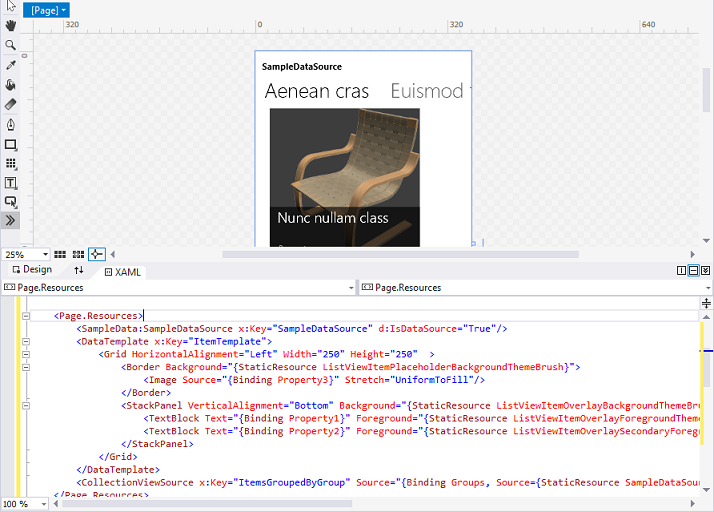

Демонстрационные данные в рабочей области конструирования и для создания прототипов
=============================================================================================

\[ Обновлено для приложений UWP в Windows 10. Статьи о Windows 8.x см. в [архиве](http://go.microsoft.com/fwlink/p/?linkid=619132) \]


**Примечание.** Необходимость демонстрационных данных и их полезность зависят от того, что используют ваши привязки [расширение разметки {Binding}](https://msdn.microsoft.com/library/windows/apps/Mt204782) или [расширение разметки {x:Bind}](https://msdn.microsoft.com/library/windows/apps/Mt204783). Приемы, описанные в этом разделе, основаны на использовании [**DataContext**](https://msdn.microsoft.com/library/windows/apps/BR208713), поэтому они подходят только для **{Binding}**. Но если вы используете **{x:Bind}**, ваши привязки как минимум показывают значения заполнителей в рабочей области конструирования (даже для элементов управления элементами), поэтому демонстрационные данные уже не так нужны.

Для вашего приложения может быть невозможно или нежелательно (например, по соображениям конфиденциальности или производительности) отображать динамические данные в рабочей области конструирования в Microsoft Visual Studio или Blend для Visual Studio. Для заполнения элементов управления данными (чтобы можно было работать над макетом, шаблонами и другими визуальными свойствами приложения) есть различные способы, в которых можно использовать демонстрационные данные времени разработки. Демонстрационные данные также могут быть очень полезны и экономить время при создании эскиза (или прототипа) приложения. Демонстрационные данные можно использовать в эскизе или прототипе во время выполнения для иллюстрации идей, не доходя до подключения к реальным динамическим данным.

Задание DataContext в разметке
-----------------------------

Довольно частая практика у разработчиков — использовать императивный код (в коде программной части), чтобы задать [**DataContext**](https://msdn.microsoft.com/library/windows/apps/BR208713) элемента управления страницы или пользовательского элемента управления как экземпляр модели представления.

``` csharp
public MainPage()
{
    InitializeComponent();
    this.DataContext = new BookstoreViewModel();
}
```

Но если это сделать, ваша страница не будет поддаваться проектированию так, как могла бы. Причина заключается в том, что когда страница XAML открыта в Visual Studio или Blend для Visual Studio, императивный код, который назначает значение **DataContext**, никогда не запускается (по сути, не выполняется ни один из кодов программной части). Конечно, средства XAML анализируют разметку и создают экземпляры всех объектов, объявленных в ней, но они не создают экземпляр самого типа страницы. В результате в ваших элементах управления или в диалоговом окне **Создание привязки данных** будут отображаться не все данные, и будет сложнее оформить страницу и создать ее макет.


Первый способ, который можно попробовать, — это закомментировать данное назначение **DataContext** и задать **DataContext** в разметке страницы. Таким образом, ваши динамические данные будут отображаться как во время разработки, так и во время выполнения. Для этого сначала откройте страницу XAML. Затем в окне **Структура документа** щелкните корневой проектируемый элемент (обычно с меткой **\[Страница\]**), чтобы выбрать его. В окне **Свойства** найдите свойство **DataContext** (в категории «Общие»), а затем щелкните **Создать**. Выберите свой тип модели представления в диалоговом окне **Выбор объекта**, а затем нажмите кнопку **ОК**.


Вот как выглядит конечная разметка.

``` xml
<Page ... >
    <Page.DataContext>
        <local:BookstoreViewModel/>
    </Page.DataContext>
```

А вот как выглядит рабочая область конструирования теперь, когда ваши привязки могут разрешать. Обратите внимание, что элемент выбора **Путь** в диалоговом окне **Создание привязки данных** теперь заполнен на основе типа **DataContext** и свойств, к которым можно выполнить привязку.


Диалоговому окну **Создание привязки данных** для работы нужен только тип, но привязкам для инициализации со значениями необходимы свойства. Если вы не хотите обращаться к своей облачной службе во время разработки (из-за производительности, платы за передачу данных, проблем конфиденциальности и т.п.), ваш код инициализации может проверить, запущено ли ваше приложение в средстве разработки (например, в Visual Studio или Blend для Visual Studio), и в этом случае загрузить демонстрационные данные для использования только во время разработки.

``` csharp
if (Windows.ApplicationModel.DesignMode.DesignModeEnabled)
{
    // Load design-time books.
}
else
{
    // Load books from a cloud service.
}
```

Если вам нужно передать параметры в свой код инициализации, можно использовать локатор моделей представлений. Локатор моделей представлений — это класс, который можно поместить в ресурсы приложения. У него есть свойство, которое выводит модель представления, и **DataContext** вашей страницы привязывается к этому свойству. Другой шаблон, который локатор или модель представления может использовать, — это внедрение зависимостей, которое может создать поставщика данных времени разработки или времени выполнения (каждый из которых реализует общий интерфейс) в зависимости от того, что применимо.

«Демонстрационные данные из класса» и атрибуты времени разработки
---------------------------------------------------------------------------------------

Если по какой-либо причине ни один из параметров в предыдущем разделе вам не подходит, множество вариантов данных времени разработки все еще доступно через функции и атрибуты времени разработки средств XAML. Один хороший вариант — это функция **Создать демонстрационные данные из класса** в Blend для Visual Studio. Эту команду можно найти на одной из кнопок в верхней части панели **Данные**.

Вам нужно лишь указать класс, который команда будет использовать. Команда затем выполняет два важных действия. Во-первых, она создает файл XAML, который содержит демонстрационные данные, подходящие для рекурсивной расконсервации экземпляра выбранного класса и всех его элементов (по сути, средства работают одинаково хорошо с файлами XAML и JSON). Во-вторых, она заполняет панель **Данные** схемой выбранного класса. Затем можно перетащить элементы с панели **Данные** в рабочую область конструирования для выполнения различных задач. В зависимости от того, что перетаскивается и куда, можно добавить привязки к существующим элементам управления (с помощью **{Binding}**) или создать новые элементы управления и одновременно привязать их. В любом случае операция также задает контекст данных времени разработки (**d:DataContext**) за вас (если он еще не задан) в корневой части макета страницы. Этот контекст данных времени разработки использует атрибут **d:DesignData**, чтобы получить свои демонстрационные данные из созданного файла XAML (который вы, кстати, можете найти в своем проекте и отредактировать, чтобы он содержал нужные вам демонстрационные данные).

``` xml
<Page ...
    xmlns:d="http://schemas.microsoft.com/expression/blend/2008"
    xmlns:mc="http://schemas.openxmlformats.org/markup-compatibility/2006"
    mc:Ignorable="d">
    <Grid ... d:DataContext="{d:DesignData /SampleData/RecordingViewModelSampleData.xaml}"/>
        <ListView ItemsSource="{Binding Recordings}" ... />
        ...
    </Grid>
</Page>
```

Различные объявления xmlns означают, что атрибуты с префиксом **d:** интерпретируются только во время разработки и игнорируются во время выполнения. Поэтому атрибут **d:DataContext** влияет на значение свойства [**DataContext**](https://msdn.microsoft.com/library/windows/apps/BR208713) только во времени разработки; он не действует во время выполнения. При желании в разметке можно задать и **d:DataContext**, и **DataContext**. **d:DataContext** будет переопределять во времени разработки, а **DataContext** — во время выполнения. Эти же правила переопределения применяются ко всем атрибутам времени разработки и времени выполнения.

Атрибут **d:DataContext** и все остальные атрибуты времени разработки задокументированы в разделе [Атрибуты времени разработки](http://go.microsoft.com/fwlink/p/?LinkId=272504), который по-прежнему доступен для приложений универсальной платформы Windows (UWP).

[
							У **CollectionViewSource**](https://msdn.microsoft.com/library/windows/apps/BR209833) нет свойства **DataContext**, но есть свойство **Source**. Следовательно, есть свойство **d:Source**, которое можно использовать, чтобы задать демонстрационные данные, отображаемые только во время разработки, в **CollectionViewSource**.

``` xml
    <Page.Resources>
        <CollectionViewSource x:Name="RecordingsCollection" Source="{Binding Recordings}"
            d:Source="{d:DesignData /SampleData/RecordingsSampleData.xaml}"/>
    </Page.Resources>

    ...

        <ListView ItemsSource="{Binding Source={StaticResource RecordingsCollection}}" ... />
    ...
```

Для того чтобы такой способ работал, необходим класс с именем `Recordings : ObservableCollection<Recording>`, а также необходимо отредактировать файл XAML с демонстрационными данными, чтобы он содержал только объект **Recordings** (с объектами **Recording** внутри), как показано ниже.

``` xml
<Quickstart:Recordings xmlns:Quickstart="using:Quickstart">
    <Quickstart:Recording ArtistName="Mollis massa" CompositionName="Cubilia metus"
        OneLineSummary="Morbi adipiscing sed" ReleaseDateTime="01/01/1800 15:53:17"/>
    <Quickstart:Recording ArtistName="Vulputate nunc" CompositionName="Parturient vestibulum"
        OneLineSummary="Dapibus praesent netus amet vestibulum" ReleaseDateTime="01/01/1800 15:53:17"/>
    <Quickstart:Recording ArtistName="Phasellus accumsan" CompositionName="Sit bibendum"
        OneLineSummary="Vestibulum egestas montes dictumst" ReleaseDateTime="01/01/1800 15:53:17"/>
</Quickstart:Recordings>
```

Если вместо XAML используется файл с демонстрационными данными JSON, необходимо задать свойство **Type**.

``` xml
    d:Source="{d:DesignData /SampleData/RecordingsSampleData.json, Type=local:Recordings}"
```

До сих пор для загрузки демонстрационных данных времени разработки из файла XAML или JSON мы использовали **d:DesignData**. Альтернатива этому — расширение разметки **d:DesignInstance**, которое указывает, что источник времени разработки основан на классе, заданном свойством **Type**. Пример:

``` xml
    <CollectionViewSource x:Name="RecordingsCollection" Source="{Binding Recordings}"
        d:Source="{d:DesignInstance Type=local:Recordings, IsDesignTimeCreatable=True}"/>
        ```

The **IsDesignTimeCreatable** property indicates that the design tool should actually create an instance of the class, which implies that the class has a public default constructor, and that it populates itself with data (either real or sample). If you don't set **IsDesignTimeCreatable** (or if you set it to **False**) then you won't get sample data displayed on the design surface. All the design tool does in that case is to parse the class for its bindable properties and display these in the the **Data** panel and in the **Create Data Binding** dialog.

Sample data for prototyping
--------------------------------------------------------

For prototyping, you want sample data at both design-time and at run-time. For that use case, Blend for Visual Studio has the **New Sample Data** feature. You can find that command on one of the buttons at the top of the **Data** panel.

Instead of specifying a class, you can actually design the schema of your sample data source right in the **Data** panel. You can also edit sample data values in the **Data** panel: there's no need to open and edit a file (although, you can still do that if you prefer).

The **New Sample Data** feature uses [**DataContext**](https://msdn.microsoft.com/library/windows/apps/BR208713), and not **d:DataContext**, so that the sample data is available when you run your sketch or prototype as well as while you're designing it. And the **Data** panel really speeds up your designing and binding tasks. For example, simply dragging a collection property from the **Data** panel onto the design surface generates a data-bound items control and the necessary templates, all ready to build and run.



 

 


<!--HONumber=Mar16_HO1-->


