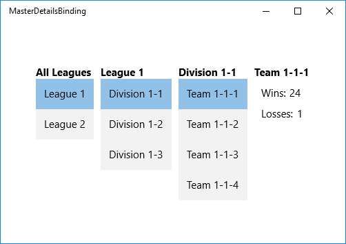

# <a name="bind-hierarchical-data-and-create-a-masterdetails-view"></a>Привязка к иерархическим данным и создание представления основных и подробных данных


> **Примечание**также см. [Пример подробных данных](http://go.microsoft.com/fwlink/p/?linkid=619991).

Вы можете создать многоуровневое представление основных и подробных иерархических данных (также известное как "список/подробности") с помощью привязки элементов управления к экземплярам [**CollectionViewSource**](https://msdn.microsoft.com/library/windows/apps/BR209833), связанным друг с другом в цепочку. В этом разделе мы используем [расширение разметки {x:Bind}](https://msdn.microsoft.com/library/windows/apps/Mt204783) где возможно, и более гибкое (но менее производительное) [расширение разметки {Binding}](https://msdn.microsoft.com/library/windows/apps/Mt204782) там, где необходимо.

Общая структура приложений универсальной платформы Windows (UWP) такова, что при выборе элемента в основном списке происходит переход на другие страницы с более подробной информацией. Это удобно, если вы хотите обеспечить информативное визуальное представление каждого элемента на каждом уровне иерархии. Другой вариант— отображение нескольких уровней данных на одной странице. Это полезно, если вы хотите отобразить несколько простых списков, позволяющих пользователям быстро найти интересующий их элемент. В этом разделе описано, как применить это взаимодействие. Экземпляры [**CollectionViewSource**](https://msdn.microsoft.com/library/windows/apps/BR209833) отслеживают текущие выделенные фрагменты на каждом уровне иерархии.

Создадим представление иерархии спортивных команд, организованной в списки по лигам, дивизионам и командам, включающее в себя просмотр подробных сведений о каждой команде. При выборе элемента из любого списка происходит автоматическое обновление последующих представлений.



## <a name="prerequisites"></a>Необходимые условия

Материал этого раздела предполагает, что вы умеете создавать простые приложения UWP. Инструкции по созданию первого приложения UWP см. в [статье о создании первого приложения UWP на C# или Visual Basic](https://msdn.microsoft.com/library/windows/apps/Hh974581).

## <a name="create-the-project"></a>Создание проекта

Создайте проект **пустого приложения (Windows Universal)**. Назовите его "MasterDetailsBinding".

## <a name="create-the-data-model"></a>Создание модели данных

Добавьте новый класс в свой проект, назовите его ViewModel.cs и добавьте к нему следующий код. Это будет вашим классом источника привязки.

```cs
using System;
using System.Collections.Generic;
using System.Linq;
using System.Text;
using System.Threading.Tasks;

namespace MasterDetailsBinding
{
    public class Team
    {
        public string Name { get; set; }
        public int Wins { get; set; }
        public int Losses { get; set; }
    }

    public class Division
    {
        public string Name { get; set; }
        public IEnumerable<Team> Teams { get; set; }
    }

    public class League
    {
        public string Name { get; set; }
        public IEnumerable<Division> Divisions { get; set; }
    }

    public class LeagueList : List<League>
    {
        public LeagueList()
        {
            this.AddRange(GetLeague().ToList());
        }

        public IEnumerable<League> GetLeague()
        {
            return from x in Enumerable.Range(1, 2)
                   select new League
                   {
                       Name = "League " + x,
                       Divisions = GetDivisions(x).ToList()
                   };
        }

        public IEnumerable<Division> GetDivisions(int x)
        {
            return from y in Enumerable.Range(1, 3)
                   select new Division
                   {
                       Name = String.Format("Division {0}-{1}", x, y),
                       Teams = GetTeams(x, y).ToList()
                   };
        }

        public IEnumerable<Team> GetTeams(int x, int y)
        {
            return from z in Enumerable.Range(1, 4)
                   select new Team
                   {
                       Name = String.Format("Team {0}-{1}-{2}", x, y, z),
                       Wins = 25 - (x * y * z),
                       Losses = x * y * z
                   };
        }
    }
}
```

## <a name="create-the-view"></a>Создание представления

После этого предоставьте класс источника привязки из класса, представляющего страницу разметки. Сделаем это, добавив свойство типа **LeagueList** к **MainPage**.

```cs
namespace MasterDetailsBinding
{
    /// <summary>
    /// An empty page that can be used on its own or navigated to within a Frame.
    /// </summary>
    public sealed partial class MainPage : Page
    {
        public MainPage()
        {
            this.InitializeComponent();
            this.ViewModel = new LeagueList();
        }
        public LeagueList ViewModel { get; set; }
    }
}
```

Наконец замените содержимое файла MainPage.xaml следующей разметкой, в которой объявляются три экземпляра [**CollectionViewSource**](https://msdn.microsoft.com/library/windows/apps/BR209833) и связываются друг с другом в цепочку. После этого можно привязывать другие элементы управления к соответствующему экземпляру **CollectionViewSource** в зависимости от его уровня в иерархии.

```xml
<Page
    x:Class="MasterDetailsBinding.MainPage"
    xmlns="http://schemas.microsoft.com/winfx/2006/xaml/presentation"
    xmlns:x="http://schemas.microsoft.com/winfx/2006/xaml"
    xmlns:local="using:MasterDetailsBinding"
    xmlns:d="http://schemas.microsoft.com/expression/blend/2008"
    xmlns:mc="http://schemas.openxmlformats.org/markup-compatibility/2006"
    mc:Ignorable="d">

    <Page.Resources>
        <CollectionViewSource x:Name="Leagues"
            Source="{x:Bind ViewModel}"/>
        <CollectionViewSource x:Name="Divisions"
            Source="{Binding Divisions, Source={StaticResource Leagues}}"/>
        <CollectionViewSource x:Name="Teams"
            Source="{Binding Teams, Source={StaticResource Divisions}}"/>

        <Style TargetType="TextBlock">
            <Setter Property="FontSize" Value="15"/>
            <Setter Property="FontWeight" Value="Bold"/>
        </Style>

        <Style TargetType="ListBox">
            <Setter Property="FontSize" Value="15"/>
        </Style>

        <Style TargetType="ContentControl">
            <Setter Property="FontSize" Value="15"/>
        </Style>

    </Page.Resources>

    <Grid Background="{ThemeResource ApplicationPageBackgroundThemeBrush}">

        <StackPanel Orientation="Horizontal">

            <!-- All Leagues view -->

            <StackPanel Margin="5">
                <TextBlock Text="All Leagues"/>
                <ListBox ItemsSource="{Binding Source={StaticResource Leagues}}" 
                    DisplayMemberPath="Name"/>
            </StackPanel>

            <!-- League/Divisions view -->

            <StackPanel Margin="5">
                <TextBlock Text="{Binding Name, Source={StaticResource Leagues}}"/>
                <ListBox ItemsSource="{Binding Source={StaticResource Divisions}}" 
                    DisplayMemberPath="Name"/>
            </StackPanel>

            <!-- Division/Teams view -->

            <StackPanel Margin="5">
                <TextBlock Text="{Binding Name, Source={StaticResource Divisions}}"/>
                <ListBox ItemsSource="{Binding Source={StaticResource Teams}}" 
                    DisplayMemberPath="Name"/>
            </StackPanel>

            <!-- Team view -->

            <ContentControl Content="{Binding Source={StaticResource Teams}}">
                <ContentControl.ContentTemplate>
                    <DataTemplate>
                        <StackPanel Margin="5">
                            <TextBlock Text="{Binding Name}" 
                                FontSize="15" FontWeight="Bold"/>
                            <StackPanel Orientation="Horizontal" Margin="10,10">
                                <TextBlock Text="Wins:" Margin="0,0,5,0"/>
                                <TextBlock Text="{Binding Wins}"/>
                            </StackPanel>
                            <StackPanel Orientation="Horizontal" Margin="10,0">
                                <TextBlock Text="Losses:" Margin="0,0,5,0"/>
                                <TextBlock Text="{Binding Losses}"/>
                            </StackPanel>
                        </StackPanel>
                    </DataTemplate>
                </ContentControl.ContentTemplate>
            </ContentControl>

        </StackPanel>

    </Grid>
</Page>
```

Обратите внимание, что при привязке представления подробностей непосредственно к [**CollectionViewSource**](https://msdn.microsoft.com/library/windows/apps/BR209833) подразумевается, что вы хотите выполнить привязку к текущему элементу в привязках, если невозможно найти путь в самой коллекции. Нет необходимости указывать свойство **CurrentItem** в качестве пути для привязки, хотя это можно сделать, если присутствует некая неоднозначность. Например, элемент [**ContentControl**](https://msdn.microsoft.com/library/windows/apps/BR209365), отображающий представление команды, обладает свойством [**Content**](https://msdn.microsoft.com/library/windows/apps/windows.ui.xaml.controls.contentcontrol.content), привязанным к `Teams`**CollectionViewSource**. Однако элементы управления в [**DataTemplate**](https://msdn.microsoft.com/library/windows/apps/BR242348) привязаны к свойствам класса `Team`, так как при необходимости **CollectionViewSource** автоматически отображает выбранную на данный момент команду из списка.

 

 

