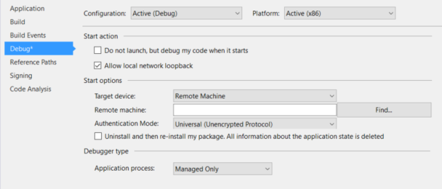
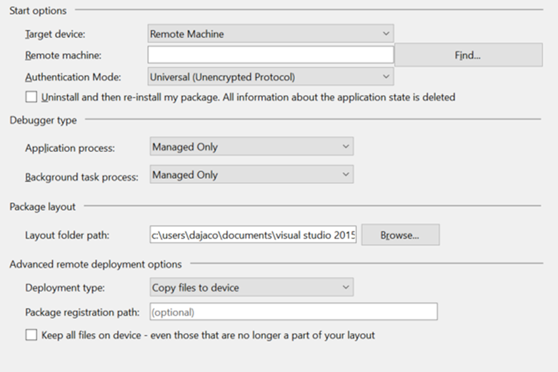

# <a name="deploying-and-debugging-uwp-apps"></a>Развертывание и отладка приложений UWP

В этой статье описываются действия, которые необходимо выполнить, чтобы выбрать то или иное целевое устройство развертывания и отладки.

Microsoft Visual Studio предоставляет возможность развертывания и отладки приложений универсальной платформы Windows (UWP) на различных устройствах Windows 10. Visual Studio самостоятельно создает и регистрирует приложения на целевых устройствах.

## <a name="picking-a-deployment-target"></a>Выбор цели развертывания

Чтобы выбрать целевое устройство развертывания, перейдите к раскрывающемуся меню выбора цели отладки, которое располагается рядом с кнопкой **Начать отладку**, и выберите устройство, на котором вы хотите развернуть свое приложение. Выбрав целевое устройство, нажмите **Начать отладку (F5)**, чтобы выполнить на нем развертывание и отладку, или **Ctrl+F5**, чтобы выполнить только развертывание.


- **Симулятор.** Позволяет развернуть приложение в среде моделирования на компьютере, на котором в настоящее время выполняется разработка. Этот параметр доступен только в том случае если ваше приложение **Минимальная версия целевой. Версия** меньше или равно операционной системы на компьютере разработки.
- **Локальный компьютер**. Позволяет развернуть приложение на компьютере, на котором в настоящее время выполняется разработка. Этот параметр доступен только в том случае если ваше приложение **Минимальная версия целевой. Версия** меньше или равно операционной системы на компьютере разработки.
- **Удаленный компьютер.** Позволяет указать удаленное целевое устройство для развертывания приложения. Дополнительные сведения о развертывании на удаленном компьютере см. в разделе [Определение удаленного устройства](#specifying-a-remote-device).
- **Устройство.** Позволяет развернуть приложение на устройстве, подключенном с помощью USB. На устройстве должен быть включен режим разработчика, а его экран должен быть разблокирован.
- **Эмулятор.** Позволяет загрузить и развернуть приложение на эмуляторе, конфигурация которого указана в его названии. Эмуляторы являются только для доступных на Hyper-V включена компьютеров под управлением Windows 8.1 или позже.

## <a name="debugging-deployed-apps"></a>Отладка развернутых приложений

Visual Studio можно также прикреплять к любому запущенному процессу приложения UWP путем последовательного выбора пунктов **Отладка** > **Присоединиться к процессу**. К запущенному процессу необязательно присоединять исходный проект Visual Studio, однако загрузка файла [symbols](#symbols) процесса значительно упростит процедуру отладки процесса, исходного кода которого у вас нет.  

Кроме того, любой установленный пакет приложения можно прикрепить и выполнить его отладку, последовательно выбрав пункты **Отладка** > **Другое** > **Отладка установленных пакетов приложения**.


Если установить флажок **Не запускать, но выполнить отладку кода при его запуске**, отладчик Visual Studio будет прикреплен к вашему приложению UWP при его запуске. Это эффективный способ отладки путей элементов управления с помощью [разных вариантов запуска приложений UWP](../xbox-apps/automate-launching-uwp-apps.md), таких как активация протокола с пользовательскими параметрами.  

Разработку и компилирование приложений UWP можно выполнять в среде Windows 8.1 или более поздней версии, однако выполняться они могут только в среде Windows 10. Если вы разрабатываете приложение UWP на компьютере под управлением Windows 8.1, можно выполнить удаленную отладку приложения UWP на другом устройстве с Windows 10 при условии, что главный и целевой компьютеры находятся в одной локальной сети. Чтобы это сделать, скачайте и установите [Инструменты удаленной отладки для Visual Studio](https://www.visualstudio.com/downloads/) на обоих компьютерах. Устанавливаемая версия этих инструментов должна соответствовать установленной версии Visual Studio, как и указываемая вами архитектура (x86, x64), которая должна соответствовать архитектуре, использующейся в вашем приложении.

## <a name="package-layout"></a>Макет пакета

Начиная с Visual Studio 2015 с обновлением 3 мы добавили параметр для разработчиков указать пути макета для своих приложений универсальной платформы Windows. Таким образом определяется расположение на диске, куда копируется макет пакета при сборке приложения. По умолчанию значение этого свойства соответствует корневому каталогу проекта. Если не изменить это свойство, поведение останется идентичным предыдущим версиям Visual Studio.

Это свойство можно изменить на вкладке **Отладка** в проекте.

Если при создании пакета для приложения вам требуется включить в него все файлы макета, необходимо добавить свойство проекта `<IncludeLayoutFilesInPackage>true</IncludeLayoutFilesInPackage>`.

Чтобы добавить это свойство, сделайте следующее.

1. Щелкните проект правой кнопкой мыши и выберите пункт **Выгрузить проект**.
2. Щелкните проект правой кнопкой мыши и выберите **Редактировать [имяпроекта].xxproj** (расширение .xxproj изменяется в зависимости от языка проекта).
3. Добавьте свойство и повторно загрузите проект.

## <a name="specifying-a-remote-device"></a>Определение удаленного устройства

### <a name="c-and-microsoft-visual-basic"></a>C# и Microsoft Visual Basic

Чтобы указать удаленный компьютер для развертывания приложения на C# или Microsoft Visual Basic, выберите пункт **Удаленный компьютер** в раскрывающемся меню выбора целевого объекта отладки. Появится диалоговое окно **Удаленные подключения**, которое позволяет указать IP-адрес или выбрать обнаруженное устройство. По умолчанию выбран **универсальный** режим проверки подлинности. Чтобы определить, какой режим проверки подлинности следует использовать, см. раздел [Режимы проверки подлинности](#authentication-modes).


Чтобы вернуться к этому диалоговому окну, вы можете открыть свойства проекта и перейти на вкладку **Отладка**. После этого нажмите **Найти** рядом с **Удаленный компьютер**.



Чтобы развернуть приложение на удаленном компьютере с обновлением ниже Creators Update, вам также понадобится загрузить и установить инструменты удаленной отладки Visual Studio на целевом компьютере. Подробные инструкции см. в разделе [Инструкции для удаленных компьютеров](#remote-pc-instructions).  Однако ПК с обновлением Creators Update и выше также поддерживают удаленное развертывание.  

### <a name="c-and-javascript"></a>C++ и JavaScript

Чтобы указать удаленный компьютер целевой объект для приложения C++ или JavaScript UWP:

1. В **обозревателе решений** щелкните правой кнопкой мыши проект и выберите пункт **Свойства**.
2. Перейдите в раздел параметров **Отладка** и в подразделе **Загружаемый отладчик** выберите **Удаленный компьютер**.
3. Введите **Имя компьютера** (или нажмите **Найти**, чтобы найти его) и укажите **Тип проверки подлинности**.


Указав компьютер, выберите **Удаленный компьютер** в раскрывающемся меню выбора цели отладки, чтобы вернуться к указанной машине. Одновременно можно выбрать только один удаленный компьютер.

### <a name="remote-pc-instructions"></a>Инструкции для удаленных компьютеров

> [!NOTE]
> Эти инструкции необходимы только для более старых версий Windows 10.  Начиная с обновления Creators Update ПК можно рассматривать как Xbox.  То есть можно включить обнаружение устройств в меню ПК "Режим разработчика" и использовать универсальную проверку подлинности для образования пар PIN-кодов и установки связи с ПК.

Чтобы выполнить развертывание на удаленном компьютере с версией обновления ниже Creators Update, на целевой компьютер необходимо установить инструменты удаленной отладки Visual Studio. Удаленный Компьютере также должна быть установлена версия Windows, которое больше или равно к приложениям **Минимальная версия целевой. Версия** свойство. После установки инструментов удаленной отладки необходимо запустить удаленный отладчик на целевом компьютере.

Для этого найдите **Удаленный отладчик** в меню **Пуск** и откройте его. При появлении запроса разрешите отладчику настроить параметры брандмауэра. По умолчанию при запуске отладчика открывается окно проверки подлинности Windows. Если вход на двух компьютерах выполнен от лица разных пользователей, то для прохождения проверки потребуются учетные данные пользователя.

Чтобы изменить его, чтобы **без проверки подлинности**в **удаленный отладчик**, перейдите в меню **средства**  - &gt; **параметры**, и Установите его в **без проверки подлинности**. После настройки удаленного отладчика необходимо также убедиться, что вы перевели главное устройство в [Режим разработчика](https://msdn.microsoft.com/windows/uwp/get-started/enable-your-device-for-development). После этого вы можете выполнить развертывание с компьютера для разработки.

Дополнительные сведения см. на странице [Центр загрузки Visual studio](https://www.visualstudio.com/downloads/).

## <a name="passing-command-line-debug-arguments"></a>Передача аргументов отладки командной строки

В Visual Studio 2017 можно передать аргументы отладки командной строки при запуске откладки приложений UWP. Можно получить доступ к аргументам отладки командной строки из параметра *args* метода **OnLaunched** класса [**Application**](https://docs.microsoft.com/en-us/uwp/api/windows.ui.xaml.application). Чтобы указать аргументы отладки командной строки, откройте свойства проекта и перейдите к вкладке **Отладка**.

> [!NOTE]
> Эта функция доступна в Visual Studio 2017 (версия 15.1) для C#, VB и C++. JavaScript доступен в более поздних версиях Visual Studio 2017. Аргументы отладки командной строки доступны для всех типов развертывания, кроме симулятора.

Для проектов C# и VB UWP поле **Аргументы командной строки:** будет расположено под разделом **Параметры запуска**.


Для проектов C++ и JS UWP поле **Аргументы командной строки** отобразится в разделе **Свойства отладки**.


Задав аргументы командной строки, можно получить доступ к значению аргумента в методе **OnLaunched** приложения. Объект [**LaunchActivatedEventArgs**](https://docs.microsoft.com/en-us/uwp/api/windows.applicationmodel.activation.launchactivatedeventargs)*args* будет иметь свойство **Arguments** со значением, заданным для текста в поле **Аргументы командной строки**.


## <a name="authentication-modes"></a>Режимы проверки подлинности

Имеется три режима проверки подлинности для развертывания на удаленном компьютере.

- **Универсальный (незашифрованный протокол)**: Используйте этот режим проверки подлинности, каждый раз, когда вы развертываете к удаленному устройству. На данный момент он используется для устройств IoT, Xbox и HoloLens, а также для ПК с Creators Update или новее. Универсальный (незашифрованный протокол) следует использовать только в доверенных сетях. Подключение для отладки уязвимо для злонамеренных пользователей, которые могут перехватывать и изменить данные, передаваемые между компьютером разработчика и удаленным компьютером.
- **Windows**: Этот режим проверки подлинности предназначено только для удаленным ПК (персональном компьютере или ноутбуке) под управлением удаленные средства Visual Studio. Используйте этот режим проверки подлинности при наличии доступа к учетным данным пользователя, от лица которого выполнен вход на целевом компьютере. Это наиболее безопасный режим удаленного развертывания.
- **Нет**. Этот режим проверки подлинности предназначено только для удаленным ПК (персональном компьютере или ноутбуке) под управлением удаленные средства Visual Studio. Используйте этот режим проверки подлинности, если тестовый компьютер работает в среде, в которой вход выполнен под тестовой учетной записью, и если вы не можете ввести учетные данные. Убедитесь, что параметры удаленного отладчика позволяют отказаться от проверки подлинности.

## <a name="advanced-remote-deployment-options"></a>Расширенные параметры удаленного развертывания

Выпуска Visual Studio 2015 с обновлением 3 и Юбилейное обновление Windows 10, существует новый расширенного удаленного развертывания для определенных параметров устройств Windows 10. Эти расширенные параметры удаленного развертывания можно найти в меню **Отладка** со свойствами проекта.

Новые свойства включают следующие:

- Тип развертывания
- Путь регистрации пакета
- Сохранить все файлы на устройстве, включая те, которые больше не входят в состав макета

### <a name="requirements"></a>Требования

Для использования расширенных параметров удаленного развертывания необходимо выполнить следующие требования:

- Visual Studio 2015 с обновлением 3 или некоторые более поздней версии выпуска Visual Studio установлен с помощью средств Windows 10 1.4.1 или более поздней версии (которая включает пакет SDK Windows 10 Anniversary Update) мы рекомендуем использовать последнюю версию Visual Studio с обновлениями, чтобы получить все новые возможности разработки и обеспечения безопасности.
- Ориентироваться на удаленное устройство Xbox с юбилейным обновлением Windows 10 или ПК с обновлением Windows 10 Creators Update
- Использование режима универсальной проверки подлинности

### <a name="properties-pages"></a>Страницы свойств

Страница свойств для приложения UWP на языке C# или Visual Basic выглядит следующим образом.



Страница свойств для приложения UWP на языке C++ выглядит следующим образом.


### <a name="copy-files-to-device"></a>Копирование файлов на устройство

При **копировании файлов на устройство** файлы физически переносятся на удаленное устройство по сети. При этом будет скопирован и зарегистрирован макет пакета, встроенный в **путь к папке макета**. Visual Studio сохранит файлы, скопированные на устройство, синхронизированное с файлами в проекте Visual Studio. Но также можно **сохранить все файлы на устройстве, включая те, которые больше не входят в состав макета**. Если выбрать этот параметр, все файлы, ранее скопированные на удаленное устройство, но больше не входящие в состав проекта, останутся на удаленном устройстве.

**Путь регистрации пакета**, указанный при **копировании файлов на устройство**, — это физическое расположение на удаленном устройстве, куда копируются файлы. В качестве этого пути можно указать любой относительный путь. Расположение развертывания файлов будет относительно к корневому каталогу файлов для разработки, который зависит от целевого устройства. Этот путь следует указать, если несколько разработчиков пользуются одним устройством и работают над пакетами с некоторыми различиями в сборках.

> [!NOTE]
> Функция **копирования файлов на устройство** на данный момент поддерживается на Xbox с юбилейным обновлением Windows 10 и ПК с Windows 10 Creators Update.

На удаленном устройстве макет копируется в следующее расположение по умолчанию: `\\MY-DEVKIT\DevelopmentFiles\PACKAGE-REGISTRATION-PATH`

### <a name="register-layout-from-network"></a>Регистрация макета из сети

Выбрав регистрацию макета из сети, вы можете встроить макет пакета в сетевую папку, после чего зарегистрировать макет на удаленном устройстве напрямую через сеть. Для этого потребуется указать путь к папке макета (сетевой папке), доступной с удаленного устройства. Свойство **Путь к папке макета** — это путь, установленный относительно компьютера с запущенным Visual Studio, а свойство **Путь регистрации пакета** — это тот же путь, указанный относительно удаленного устройства.

Чтобы успешно зарегистрировать макет через сеть, сначала потребуется сделать **Путь к папке макета** общей сетевой папкой. Для этого щелкните правой кнопкой мыши папку в проводнике, выберите **Поделиться > Конкретные пользователи**, а затем выберите пользователей, с которыми хотите поделиться папкой. При попытке зарегистрировать макет через сеть отобразится запрос учетных данных, чтобы убедиться, что регистрацию выполняет пользователь с доступом к общей папке.

Чтобы упростить задачу, ознакомьтесь со следующими примерами:

- Пример 1 (локальная папка макета, доступная как сетевая папка):
  - **Путь к папке макета** = `D:\Layouts\App1`
  - **Путь регистрации пакета** = `\\NETWORK-SHARE\Layouts\App1`

- Пример 2 (сетевая папка макета):
  - **Путь к папке макета** = `\\NETWORK-SHARE\Layouts\App1`
  - **Путь регистрации пакета** = `\\NETWORK-SHARE\Layouts\App1`

При первой регистрации макета из сети ваши учетные данные будут сохранены в кэш на целевом устройстве, чтобы вам не приходилось выполнять вход многократно. Чтобы удалить кэшированные учетные данные, вы можете воспользоваться [средством WinAppDeployCmd.exe](https://msdn.microsoft.com/windows/uwp/packaging/install-universal-windows-apps-with-the-winappdeploycmd-tool) из пакета SDK Windows 10 с командой **deletecreds**.

При регистрации макета через сеть нельзя выбрать параметр **сохранить все файлы на устройстве**, так как файлы не копируются физически на удаленное устройство.

> [!NOTE]
> Функция **регистрации макета из сети** на данный момент поддерживается на Xbox с юбилейным обновлением Windows 10 и ПК с Windows 10 Creators Update.

На удаленном устройстве, макет регистрируется в следующее расположение по умолчанию, в зависимости от семейства устройств: `Xbox: \\MY-DEVKIT\DevelopmentFiles\XrfsFiles` -это представляет собой символическую ссылку **путь регистрации пакета** ПК не использует символическую ссылку и вместо этого непосредственно Регистрирует **путь регистрации пакета**

## <a name="debugging-options"></a>Параметры отладки

В Windows 10, повышена производительность при запуске приложений универсальной платформы Windows, запустив заранее и затем приостановке приложения в метод с именем [предварительный запуск](https://msdn.microsoft.com/library/windows/apps/Mt593297). Многие приложения не выполняют никаких действий в этом режиме, однако другие могут использовать его для регулировки своей работы. Чтобы облегчить отладку проблем, связанных с этими ветвями кода, вы можете начать работу с приложением в Visual Studio в режиме предварительного запуска.

Поддерживается отладка из проекта Visual Studio (**Отладка**  - &gt; **другие целевые объекты отладки**  - &gt; **отладка универсальных Предварительный запуск приложения Windows**) и приложения, уже установленные на компьютере (**Отладка**  - &gt; **другие целевые объекты отладки**  - &gt; **Отлаживать установленный пакет приложения** , выбрав **активировать приложение с помощью предварительный** флажок). Подробнее см. в разделе [Отладка предварительного запуска приложений UWP](https://go.microsoft.com/fwlink/p/?LinkId=717245).

Вы можете установить следующие параметры развертывания на странице свойств **Отладка** запускаемого проекта.

- **Разрешение на использование локального петлевого адреса**

  Из соображений безопасности приложению UWP, установленному стандартным образом, запрещено выполнять сетевые вызовы того устройства, на котором оно установлено. По умолчанию при развертывании с помощью Visual Studio для разворачиваемого приложения создается исключение. Это исключение позволяет тестировать процедуры связи на одном компьютере. Перед отправкой приложения в Microsoft Store, необходимо протестировать приложение без этого исключения.

  Чтобы удалить из приложения исключение, связанное с использованием петлевого адреса, выполните следующие действия.

  - На C# и Visual Basic **Отладка** страницу свойств, снимите флажок **разрешить замыкание на себя в локальной сети** "флажок".
  - На странице свойств **Отладка** проектов JavaScript и C++ установите для параметра **Разрешить локальный петлевой адрес** значение **Нет**.

- **Не запускать, а отлаживать мой код при открытии / Запустить приложение**

  Чтобы настроить автоматическое начало сеанса отладки при запуске приложения во время развертывания, выполните следующие действия.

  - На C# и Visual Basic **Отладка** страницу свойств, выберите **не запускать, а отлаживать мой код при открытии** "флажок".
  - На странице свойств **Отладка** проектов JavaScript и C++ установите для параметра **Запустить приложение** значение **Да**.

## <a name="symbols"></a>символы.

Файлы символов содержат разнообразные и очень полезные данные, которые можно использовать при отладке кода, например переменные, имена функций и адреса точек входа. Эти данные позволяют лучше понимать характер исключений и порядок выполнения стека вызовов. Файлы символов для большинства версий Windows доступны на [сервере символов Майкрософт](https://msdl.microsoft.com/download/symbols). Также, чтобы ускорить поиск необходимых данных в автономном режиме эти файлы можно скачать на странице [Скачивания пакетов символов Windows](https://aka.ms/winsymbols).

Чтобы задать параметры символов для Visual Studio, выберите **Сервис > Параметры**, а затем перейдите в раздел **Отладка > Символы** в открывшемся диалоговом окне.


Чтобы загрузить символы во время сеанса отладки, выполняемой с помощью отладчика [WinDbg](#windbg), укажите для переменной **sympath** путь к пакету символов. Например, выполнение следующей команды приведет к загрузке символов с сервера символов (Майкрософт) с их последующим кэшированием в каталог C:\Symbols:

```cmd
.sympath SRV*C:\Symbols*http://msdl.microsoft.com/download/symbols
.reload
```

Чтобы добавить дополнительные пути, используйте разделитель `‘;’` или команду `.sympath+`. Описание более сложных операций с символами, в ходе которых используется отладчик WinDbg, см. в разделе [Общедоступные и закрытые символы](https://msdn.microsoft.com/library/windows/hardware/ff553493).

## <a name="windbg"></a>Отладчик WinDbg

Программа WinDbg — это мощный отладчик, входящий в состав пакета средств отладки для Windows, которые включены в пакет [Windows SDK](https://go.microsoft.com/fwlink/p/?LinkID=271979). При установке Windows SDK средства отладки для Windows можно установить в качестве отдельного продукта. Несмотря на то, что это средство очень полезно использовать для отладки машинного кода, WinDbg не рекомендуется использовать применительно к приложениям, в основе которых лежит управляемый код или HTML5.

Чтобы использовать WinDbg с приложениями UWP, сначала потребуется отключить управление жизненным циклом процесса (PLM) для пакета приложения с помощью PLMDebug, как описано в разделе [Средства тестирования и отладки для управления жизненным циклом процесса (PLM)](testing-debugging-plm.md).

```cmd
plmdebug /enableDebug [PackageFullName] ""C:\Program Files\Debugging Tools for Windows (x64)\WinDbg.exe\" -server npipe:pipe=test"
```

В отличие от Visual Studio большинство основных возможностей отладчика WinDbg реализуется при вводе команд в окне командной строки. Вводя различные команды, можно просматривать состояние выполнения, изучать аварийные дампы пользовательского режима, а также выполнять отладку в разных режимах.

Одной из самых распространенных команд WinDbg является `!analyze -v`, которая используется для получения подробной информации о текущем исключении, в том числе следующих данных:

- FAULTING_IP: указатель инструкции в момент сбоя
- EXCEPTION_RECORD: адрес, код и флаги текущего исключения
- STACK_TEXT: трассировка стека до возникновения исключения

Полный список всех команд WinDbg см. в разделе [Команды отладчика](https://msdn.microsoft.com/library/ff540507).

## <a name="related-topics"></a>См. также

- [Средства тестирования и отладки для управления жизненным циклом процесса (PLM)](testing-debugging-plm.md)
- [Отладка, тестирование и производительность](index.md)
