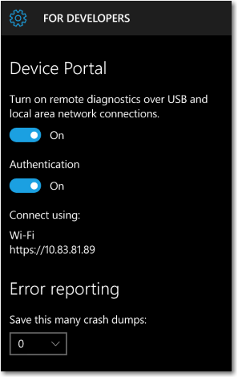

# Портал устройств для мобильных устройств

Начиная c Windows 10 версии 1511, для семейства мобильных устройств доступны дополнительные функции разработчика. Эти функции доступны, только когда на устройстве включен режим разработчика.

Сведения о том, как включить режим разработчика, см. в разделе[Включение устройства для разработки](../get-started/enable-your-device-for-development.md).

## Настройка портала устройства на Windows Phone

### Включите обнаружение и связывание устройств

Для подключения к Порталу устройства необходимо включить функцию обнаружения устройств. Это позволит связать ваш телефон с компьютером или другим устройством с Windows 10. Оба устройства должны быть подключены к одной подсети с помощью проводного или беспроводного подключения или соединены друг с другом через USB.

При первом подключении к Порталу устройства потребуется ввести шестизначный код безопасности (с учетом регистра символов). Это обеспечит вам доступ к телефону и защитит ваши устройства от атак. Нажмите кнопку «Связать» на телефоне, чтобы создать и отобразить код, а затем введите 6 символов в текстовое поле в браузере.

Вы можете подключиться к Порталу устройства тремя способами: через кабель USB, через локальный узел и по локальной сети (включая VPN и привязку).

**Подключение к Порталу устройства**

1. В браузере введите адрес, указанный ниже для используемого вами типа подключения.

    - USB: `http://127.0.0.1:10080`

    Воспользуйтесь этим адресом, если телефон подключен к компьютеру через кабель USB. Оба устройства должны работать под управлением Windows 10 версии 1511 или более поздней.
    
    - Localhost: `http://127.0.0.1`

    Воспользуйтесь этим адресом, чтобы локально открыть портал устройства на телефоне в браузере Microsoft Edge для Windows 10 Mobile.
    
    - Локальная сеть: `https://<The IP address of the phone>`

    Воспользуйтесь этим адресом для подключения по локальной сети.

    IP-адрес телефона отображается в параметрах Портала устройства на телефоне. Для проверки подлинности и безопасного обмена данными необходима поддержка протокола HTTPS. Имя узла (можно изменить в меню «Параметры > Система > О системе» также может использоваться для доступа к Порталу устройства в локальной сети (например, http://Phone360), что может быть полезным для тех устройств, которые могут часто менять сети или IP-адреса или к которым нужно обеспечить доступ. 

2. Нажмите кнопку «Связать» на телефоне, чтобы создать и отобразить код безопасности.

3. Введите шестизначный код безопасности в поле пароля на Портале устройства в браузере.

4. (Необязательно) Установите флажок Запомнить мой компьютер в браузере, чтобы запомнить это связывание для использования в будущем.

Ниже показана страница параметров разработчика на Портале устройства в Windows Phone.

Если вы используете Портал устройства в защищенной среде, например лаборатории тестирования, в которой вы доверяете всем пользователям в локальной сети, на устройстве нет личных сведений и у вас имеются особые требования, вы можете отключить проверку подлинности. В этом случае шифрование связи будет отключено, и любой пользователь сможет управлять вашим телефоном, зная его IP-адрес.

## Заметки по средствам

## Страницы Портала устройств
### Процессы

Возможность прекращения произвольных процессов не включена на портале устройств Windows Mobile. 

Портал устройства на мобильных устройствах обеспечивает стандартный набор страниц. Подробные описания см. в разделе [Обзор портала устройств Windows](device-portal.md).

- Приложения
- Процессы
- Производительность
- Трассировка событий Windows (ETW)
- Трассировка производительности
- Устройства
- Сеть

<!--HONumber=Mar16_HO5-->

