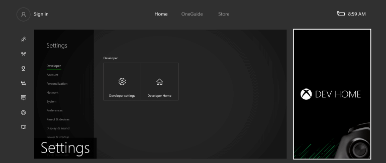

# Портал устройств для Xbox

## Настройка портала устройства для Xbox

### Включение портала устройств

**Включение портала устройств**

1. Выберите плитку главной страницы разработки на главном экране (см. изображение)  

2. В инструменте Dev Home перейдите к средству **Удаленное управление** 
3. Выберите **Управление порталом устройства Windows** и нажмите **A**
4. Включите параметр **Включить портал устройств Windows**
5. Введите имя пользователя и пароль, которые следует использовать для проверки подлинности для доступа к комплекту разработчика в браузере, затем сохраните эти настройки.
6. Закройте страницу параметров и обратите внимание на URL-адрес, приведенный для средства удаленного управления, который следует использовать для подключения.
7. Введите URL-адрес в своем браузере, затем выполните вход, используя настроенные учетные данные.
8. Появится оповещение о предоставленном сертификате, аналогичное приведенному на изображении ниже. Необходимо щелкнуть **Перейти к этому веб-сайту**, чтобы открыть предварительный просмотр портала устройств Windows.

## Страницы Портала устройств

Портал устройств на Xbox предоставляет набор стандартных страниц. Подробные описания см. в разделе [Обзор портала устройств Windows](device-portal.md).

- Приложения
- Производительность
- Сеть

<!--HONumber=Jun16_HO4-->

