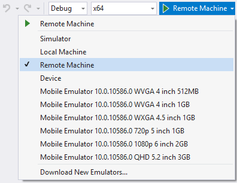

# <a name="test-surface-hub-apps-using-visual-studio"></a>Проверка приложений Surface Hub с использованием Visual Studio
Имитатор Visual Studio предоставляет среду для проектирования, разработки, отладки и тестирования приложений универсальной платформы Windows (UWP), включая приложения, созданные для Microsoft Surface Hub. Имитатор не использует тот же пользовательский интерфейс в качестве Surface Hub, но он полезен для тестирования внешнего вида и поведения с Surface Hub размер и разрешение экрана приложения.

Дополнительные сведения о средстве имитатор в целом, см. в разделе [Запуск приложений UWP в симуляторе](https://docs.microsoft.com/visualstudio/debugger/run-windows-store-apps-in-the-simulator).

## <a name="add-surface-hub-resolutions-to-the-simulator"></a>Добавление разрешений Surface Hub в имитатор
Чтобы добавить разрешения Surface Hub в имитатор, выполните указанные ниже действия.

1. Создайте конфигурацию для 55-дюймовом устройстве Surface Hub, сохранив следующий код XML в файл с именем *HardwareConfigurations-SurfaceHub55.xml*.  

    ```xml
    <?xml version="1.0" encoding="UTF-8"?>
    <ArrayOfHardwareConfiguration xmlns:xsd="http://www.w3.org/2001/XMLSchema"
                                  xmlns:xsi="http://www.w3.org/2001/XMLSchema-instance">
        <HardwareConfiguration>
            <Name>SurfaceHub55</Name>
            <DisplayName>Surface Hub 55"</DisplayName>
            <Resolution>
                <Height>1080</Height>
                <Width>1920</Width>
            </Resolution>
            <DeviceSize>55</DeviceSize>
            <DeviceScaleFactor>100</DeviceScaleFactor>
        </HardwareConfiguration>
    </ArrayOfHardwareConfiguration>
    ```

2. Создайте конфигурацию для 84-дюймовом устройстве Surface Hub, сохранив следующий код XML в файл с именем *HardwareConfigurations-SurfaceHub84.xml*.

    ```xml
    <?xml version="1.0" encoding="UTF-8"?>
    <ArrayOfHardwareConfiguration xmlns:xsd="http://www.w3.org/2001/XMLSchema"
                                  xmlns:xsi="http://www.w3.org/2001/XMLSchema-instance">
        <HardwareConfiguration>
            <Name>SurfaceHub84</Name>
            <DisplayName>Surface Hub 84"</DisplayName>
            <Resolution>
                <Height>2160</Height>
                <Width>3840</Width>
            </Resolution>
            <DeviceSize>84</DeviceSize>
            <DeviceScaleFactor>150</DeviceScaleFactor>
        </HardwareConfiguration>
    </ArrayOfHardwareConfiguration>
    ```

3. Скопируйте два XML-файла в папку *C:\Program Files (x86)\Common Files\Microsoft Shared\Windows Simulator\\&lt;version number&gt;\HardwareConfigurations*.

   > [!NOTE]
   > Для сохранения файлов в эту папку требуются права администратора.

4. Запустите приложение в имитаторе Visual Studio. Нажмите кнопку **Изменить разрешение** на палитре и выберите конфигурацию Surface Hub из списка.

    

   > [!TIP]
   > [Включите режим планшета](http://windows.microsoft.com/windows-10/getstarted-like-a-tablet) , чтобы лучше имитировать Surface Hub.

## <a name="deploy-apps-to-a-surface-hub-device-from-visual-studio"></a>Развертывание приложений на устройстве Surface Hub из Visual Studio
Развертывание приложения на Surface Hub вручную является простым процессом.

### <a name="enable-developer-mode"></a>Включение режима разработчика
По умолчанию Surface Hub устанавливает только приложения из Microsoft Store. Для установки приложений, подписанных другими источниками, необходимо включить режим разработчика.

> [!NOTE]
> После включения режима разработчика необходимо будет сбросить Surface Hub, если вы хотите его повторного выключения. Сброс устройства удаляет все локальные файлы пользователя и конфигурации, а затем переустанавливает Windows.

1. В меню **Пуск** Surface Hub откройте приложение "Параметры".

   > [!NOTE]
   > Для получения доступа к приложение "Параметры" на Surface Hub требуются права администратора.

2. Перейдите к **обновление и безопасность \ > для разработчиков**.

3. Выберите пункт **Режим разработчика** и примите подсказку.

### <a name="deploy-your-app-from-visual-studio"></a>Развертывание приложения из Visual Studio
Дополнительные сведения о процессе развертывания в целом, см. в разделе [Развертывание и отладка приложений UWP](https://msdn.microsoft.com/windows/uwp/debug-test-perf/deploying-and-debugging-uwp-apps).

   > [!NOTE]
   > Для этой функции требуется Visual Studio 2015 с обновлением 1 или более поздней версии, но мы рекомендуем использовать наиболее в актуальном состоянии последнюю версию Visual Studio. Экземпляр Visual Studio в актуальном состоянии будет gibe вы все последние разработки и обновлений для системы безопасности.

1. Перейдите к раскрывающемуся списку цели отладки рядом с кнопкой **Начать отладку** и выберите элемент **Удаленный компьютер**.

    <!--lcap: in your screenshot, you have local machine selected-->

   

2. Введите IP-адрес Surface Hub. Убедитесь, что выбран режим **Универсальный** проверки подлинности.

   > [!TIP] 
   > После включения режима разработчика IP-адрес Surface Hub можно найти на экране приветствия.

3. Выберите **Начать отладку (F5)** для развертывания и отладки приложения на Surface Hub или нажмите сочетание клавиш Ctrl + F5, чтобы просто развернуть приложение.

   > [!TIP]
   > Если Surface Hub отображает экран приветствия, закройте его, нажав любую кнопку.
