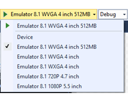
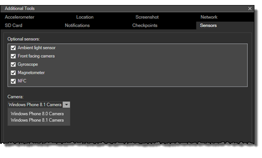

# <a name="test-with-the-microsoft-emulator-for-windows-10-mobile"></a>Тестирование с помощью эмулятора устройства с Windows 10 Mobile (Майкрософт)

Вы можете имитировать взаимодействие с устройством в реальных условиях и проверить возможности своего приложения с помощью средств эмулятора устройства с Windows10Mobile (Майкрософт). Эмулятор— это классическое приложение, которое имитирует мобильное устройство под управлением Windows 10. Он предоставляет виртуализированную среду, в которой можно выполнять отладку и тестирование приложений для Windows без физического устройства. Он также обеспечивает изолированную среду для ваших прототипов приложения.

Эмулятор разработан для предоставления показателей, сравнимых с реальным устройством. Но мы все же рекомендуем протестировать приложение на физическом устройстве перед его публикацией в Microsoft Store.

Вы можете протестировать свое универсальное приложение с помощью уникального образа эмулятора для Windows 10 Mobile с разным разрешением и размером экрана. Имитируйте взаимодействие с реальным устройством и проверьте различные возможности своего приложения с помощью средств, включенных в эмулятор Microsoft.

## <a name="system-requirements"></a>Требования к системе

Компьютер должен отвечать следующим требованиям:

ЦП (эти параметры, если они доступны, можно включить в BIOS)

-   Аппаратная виртуализация ([Проверка совместимости](https://www.microsoft.com/download/details.aspx?id=592)).
-   Преобразование адресов второго уровня (SLAT).
-   Аппаратное предотвращение выполнения данных (DEP).

ОЗУ

-   4 ГБ или больше.

Операционная система

-   Windows 8 или более поздняя версия (настоятельно рекомендуется Windows 10)
-   64-разрядная версия
-   Выпуск Профессиональная или старше

Сведения о требованиях к BIOS см. в разделе [Включение Hyper-V для эмулятора Windows Phone 8](https://msdn.microsoft.com/library/windows/apps/xaml/jj863509.aspx).

Чтобы получить сведения о требованиях к ОЗУ и операционной системе, на панели управления щелкните **Система и безопасность** и выберите **Система**.

Эмулятор Microsoft для Windows 10 Mobile требуется Visual Studio 2015 или более поздней версии; Это не совместимы с более ранних версиях Visual Studio.

Эмулятор устройства с Windows 10 Mobile (Майкрософт) не может загружать приложения, предназначенные для версии ОС Windows Phone, предшествующей Windows Phone 7.1.

## <a name="installing-uninstalling-and-running-the-emulator"></a>Установка, удаление и запуск эмулятора

### <a name="installing"></a>Установка
Эмулятор устройства с Windows 10 Mobile (Майкрософт) поставляется в составе Windows 10 SDK. Windows 10 SDK и эмулятор можно установить как часть Visual Studio. См. [страницу скачивания Visual Studio](https://go.microsoft.com/fwlink/p/?LinkId=534785).

Вы также можете установить эмулятор устройства с Windows 10 Mobile (Майкрософт) с помощью [программы установки эмулятора](https://go.microsoft.com/fwlink/p/?LinkID=615095).

### <a name="uninstalling"></a>Удаление

Вы можете удалить эмулятор устройства с Windows 10 Mobile (Майкрософт) с помощью программы установки Visual Studio. Или можно использовать раздел **Программы и компоненты** в **панели управления**.

При удалении эмулятора устройства с Windows 10 Mobile (Майкрософт) виртуальный адаптер Ethernet Hyper-V, который был создан для эмулятора, не удаляется автоматически. Вы можете вручную удалить этот адаптер в разделе **Сетевые подключения****панели управления**.

### <a name="running"></a>Running

Чтобы запустить приложение в эмуляторе, просто выберите эмулированных устройство из раскрывающегося меню **выполнить** в Visual Studio.



## <a name="whats-new-in-microsoft-emulator-for-windows-10-mobile"></a>Новые возможности эмулятора устройства с Windows 10 Mobile (Майкрософт)

Помимо поддержки универсальной платформы Windows (UWP), эмулятор предоставляет следующие возможности:

-   Поддержка режима ввода с помощью мыши.
-   Поддержка NFC. Эмулятор позволяет имитировать NFC, а также тестировать и разрабатывать универсальные приложения с технологией NFC/Proximity.
-   Собственные средства аппаратного ускорения повышают производительность графики в эмуляторе с помощью локальной графической карты. Чтобы использовать ускорение, на компьютере должна быть установлена поддерживаемая графическая карта. Кроме того, необходимо включить функцию ускорения на вкладке **Датчики** пользовательского интерфейса параметров **Дополнительные средства** в эмуляторе.

## <a name="features-that-you-can-test-in-the-emulator"></a>Функции, которые можно протестировать в эмуляторе

Кроме новых функций, упомянутых в предыдущем разделе, с помощью эмулятора устройства с Windows 10 Mobile (Майкрософт) можно тестировать следующие часто используемые функции.

-   **Разрешение экрана, размер экрана и память**. Обеспечьте своему приложению максимально широкий рынок, тестируя его на различных образах эмуляторов для имитации различных разрешений экрана, физических размеров и ограничений памяти.


-   **Конфигурация экрана**. Смените в эмуляторе книжный режим на альбомный. Измените настройку масштабирования эмулятора под размер экрана своего компьютера.

-   **Сеть**. В эмуляторе Windows Phone поддержка работы с сетью интегрирована. Сеть включена по умолчанию. Эмулятор Windows Phone не требует установки драйверов сети, в большинстве сред также нет нужды настраивать параметры сети вручную.

    Эмулятор использует сетевое подключение компьютера, на котором размещен. Он не появляется в сети как отдельное устройство. Это устраняет некоторые из проблем с конфигурацией, которые встречались пользователям в эмуляторе SDK Windows Phone 8.0.

-   **Параметры языка и региона**. Подготовьте свое приложение к выходу на международный рынок, изменяя параметры языка и региона в эмуляторе Windows Phone.

    В работающем эмуляторе перейдите к приложению **Параметры** , выберите параметры **системы** , после чего выберите **язык** или **регион**. Измените параметры, которые хотите протестировать. Если будет выведено соответствующее напоминание, щелкните **перезапустить телефон**, чтобы применить новые параметры и запустить эмулятор.

-   **Жизненный цикл приложения и полное удаление**. Протестируйте приложение, когда оно деактивировано или полностью удалено, изменив значение параметра **Полностью удалить при деактивации во время отладки** на странице **Отладка** свойств проекта.

-   **Хранилище локальных папок (ранее известное как изолированное хранилище)**. Данные в изолированном хранилище сохраняются во время работы эмулятора, но теряются после его закрытия.

-   **Микрофон**. Требует и использует микрофон на главном компьютере.

-   **Клавиатура телефона**. Эмулятор поддерживает сопоставление аппаратной клавиатуры на компьютере разработчика с клавиатурой Windows Phone. Поведение клавиш соответствует поведению клавиш на устройстве Windows Phone

-   **Экран блокировки**. Когда эмулятор открыт, дважды нажмите F12 на клавиатуре своего компьютера. Клавиша F12 имитирует кнопку питания на телефоне. Первое нажатие клавиши отключает экран. Второе нажатие клавиши включает экран снова с включенным экраном блокировки. Разблокируйте экран, использовав мышь для перетаскивания экрана блокировки вверх.

## <a name="features-that-you-cant-test-in-the-emulator"></a>Функции, которые нельзя протестировать в эмуляторе

Тестируйте следующие функции только на реальном устройстве.

-   Компас
-   Гироскоп
-   Устройство вибрации
-   Яркость. Уровень яркости эмулятора всегда высокий.
-   Видео высокого разрешения. Видео с разрешением выше VGA (640 x 480) не всегда отображается корректно, особенно в образах эмулятора с объемом памяти только 512 МБ.

## <a name="mouse-input"></a>Ввод с помощью мыши

Имитируйте ввод с помощью мыши, используя физическую мышь или сенсорную панель на компьютере под управлением Windows и кнопки мыши на панели инструментов эмулятора. Эта функция полезна, если ваше приложение предоставляет пользователю работать с мышью, сопряженной с устройством Windows 10.

Коснитесь кнопки ввода с помощь мыши на панели инструментов эмулятора, чтобы включить ввод с мыши. Любые события нажатия в эмуляторе передаются в ОС Windows 10 Mobile, работающую на виртуальной машине эмулятора, как события мыши.


Экран эмулятора с включенным вводом с мыши.


Кнопка ввода с мыши на панели инструментов эмулятора.

## <a name="keyboard-input"></a>Ввод с клавиатуры

Эмулятор поддерживает сопоставление аппаратной клавиатуры на компьютере разработчика с клавиатурой Windows Phone. Поведение клавиш соответствует поведению клавиш на устройстве Windows Phone. 

По умолчанию аппаратная клавиатура выключена. Эта реализация аналогична выдвижной клавиатуре, которую необходимо выдвинуть перед использованием. До включения аппаратной клавиатуры эмулятор принимает ввод только от клавиш управления.

Специальные символы на локализованной клавиатуре компьютера разработчика под управлением Windows не поддерживаются эмулятором. Чтобы ввести специальные символы, имеющиеся на локализованной клавиатуре, используйте программную панель ввода (SIP). 

Для использования клавиатуры компьютера в эмуляторе нажмите клавишу F4.

Чтобы прекратить использование клавиатуры компьютера в эмуляторе, нажмите клавишу F4.

В следующей таблице перечислены клавиши аппаратной клавиатуры, которые вы можете использовать для эмуляции кнопок и другие элементы управления Windows Phone.

Обратите внимание, что в сборке эмулятора 10.0.14332 сопоставление аппаратных клавиш было изменено. Значения во втором столбце таблицы соответствуют новым клавишам. 

Аппаратные клавиши компьютера (сборка эмулятора 10.0.14295 и более ранние) | Аппаратные клавиши компьютера (сборка эмулятора 10.0.14332 и более новые) | Аппаратная кнопка Windows Phone | Примечания
--------------------- | ------------------------- | ----------------------------- | -----
F1 | WIN + ESC | НАЗАД | Длинные нажатия работают должным образом.
F2 | WIN + F2 | СТАРТ | Длинные нажатия работают должным образом.
F3 | WIN + F3 | ПОИСК |  
F4 | F4 (без изменений) | Включение и отключение использования клавиатуры локального компьютера. | 
F6 | WIN + F6 | КАМЕРА (ЧАСТИЧНО) | Частичное нажатие специальной кнопки камеры.
F7 | WIN + F7 | КАМЕРА (ПОЛНОСТЬЮ) | Специальная кнопка камеры.
F9 | WIN + F9 | УВЕЛИЧЕНИЕ ГРОМКОСТИ | 
F10 | WIN + F10 | УМЕНЬШЕНИЕ ГРОМКОСТИ | 
F12 | WIN + F12 | ПИТАНИЕ | Нажмите клавишу F12 дважды, чтобы включить экран блокировки. Длинные нажатия работают должным образом.
ESC | WIN + ESC | НАЗАД | Длинные нажатия работают должным образом.
 


## <a name="near-field-communications-nfc"></a>Связь ближнего действия (NFC)

Создавайте и тестируйте приложения, которые используют возможности NFC в Windows 10 Mobile, с помощью вкладки **NFC** в меню **Дополнительные средства** эмулятора. Технология NFC полезна в различных ситуациях, начиная от сценариев близкого взаимодействия (например, коснуться и передать) и заканчивая эмуляцией карты (например, оплатить касанием).

Вы можете проверить приложение, имитируя касание телефонов с помощью двумя эмуляторами или имитируя касание в метке. Также в Windows 10 мобильные устройства поддерживают функцию HCE (эмуляции карты узла), а с помощью эмулятора телефона вы можете имитировать касание устройства к терминалу оплаты для передачи трафика «команда-ответ» APDU.

Вкладка NFC поддерживает три режима.

-   Режим близкого взаимодействия
-   Режим HCE
-   Режим устройства чтения смарт-карт

Во всех режимах окно эмулятора содержит три области.

-   Верхний левый раздел связан с выбранным режимом. Функции данного раздела зависят от режима и подробно описаны далее.
-   В верхнем правом разделе перечисляются журналы. Если два устройства соприкоснутся (или устройство коснется POS-терминала), события касания записывается в журнал, а когда контакт прекращается, в журнал записывается события прекращения касания. В этом разделе также указывается, ответило ли ваше приложение перед прерыванием подключения, а также другие действия, выполненные в интерфейсе эмулятора с метками времени. Журналы сохраняются после переключения режимов, и вы можете очистить их в любой момент, нажав кнопку **Очистить** над экраном **Журналы**.
-   В нижней половине экрана представлен журнал сообщений и отображаются все сообщения, отправленные или полученные по выбранному подключению в зависимости от заданного режима.

> **Важные**когда вы впервые запустите средство tapper, появится брандмауэра Windows в режиме запрос. Вам НЕОБХОДИМО установить ВСЕ 3 флажка и разрешить средство в брандмауэре или же оно не будет запущено без какого-либо уведомления.

После запуска установщика убедитесь, что в запросе брандмауэра установлены все 3 флажка. Кроме того, средство tapper необходимо установить и использовать на том же физическом хост-компьютере, где работает эмулятор.

### <a name="proximity-mode"></a>Режим близкого взаимодействия

Для имитации пары телефонов, которые прикасаются друг к другу, потребуется запустить два эмулятора Windows Phone 8. Так как Visual Studio не поддерживает одновременную работу двух идентичных эмуляторов, вам потребуется выбрать различные разрешения для каждого из эмуляторов.


Если установить флажок **Включить обнаружение одноранговых устройств** , в раскрывающемся окне **Одноранговое устройство** появятся эмуляторы Microsoft (работающие на том же физическом хост-компьютере или в локальной сети), а также компьютеры под управлением Windows, на которых запущен драйвер симулятора (работает на том же компьютере или в локальной сети).

После запуска двух эмуляторов:

-   Выберите эмулятор в списке **Одноранговое устройство**.
-   Выберите переключатель **Отправить на одноранговое устройство**.
-   Нажмите кнопку **Касание**. Это имитирует касание двух устройств, и вы услышите звук уведомления касания NFC
-   Чтобы рассоединить 2 устройства, просто нажмите кнопку **Отмена касания**.

Также вы можете установить флажок **Автоматически отменить касание через (секунды)** и задать время в секундах, после которого касание устройств автоматически будет прекращено (это имитирует то, что происходит в реальности — устройства соприкасаются только короткое время). Но обратите внимание, что сейчас журнал сообщений недоступен отмены касания.

Имитация чтения сообщений от метки или получение сообщения от другого устройства:

-   Выберите переключатель **Отправлять себе**, чтобы протестировать сценарии, в которых требуется только одно устройство NFC.
-   Нажмите кнопку **Касание**. Это имитирует касание устройства с меткой, и вы услышите звук уведомления касания NFC
-   Чтобы отключиться, просто нажмите кнопку **Отменить касание**.

В режиме близкого взаимодействия можно вставлять сообщения так, будто они получены от метки или другого однорангового устройства. Это средство позволяет отправлять сообщения следующих типов.

-   WindowsURI
-   WindowsMime
-   WritableTag
-   Pairing:Bluetooth
-   NDEF
-   NDEF:MIME
-   NDEF:URI
-   NDEF:wkt.U

Вы можете создать эти сообщения, изменив данные в окнах **Полезные данные**, или указать их в файле. Чтобы узнать больше об этих типах и способах их использования, изучите раздел «Примечания»[**ProximityDevice.PublishBinaryMessage**](https://msdn.microsoft.com/library/windows/apps/Hh701129) справочной страницы.

Комплект драйверов для Windows 8 (WDK) содержит пример драйвера, который предоставляет такой же протокол, как и эмулятор Windows Phone 8. Скачайте DDK, выполните сборку примера драйвера, установите его на устройство Windows 8, а затем добавьте IP-адрес или имя узла устройства Windows 8 в список устройств и коснитесь его другим устройством Windows 8 или воспользуйтесь эмулятором Windows Phone 8.

### <a name="host-card-emulation-hce-mode"></a>Режим HCE

В режиме HCE вы можете протестировать приложение на основе HCE, создав собственные скрипты для имитации устройства чтения смарт-карт, например POS-терминала. Средство предполагает, что вы знакомы с парами «команда-ответ» (соответствует стандарту ISO-7816-4), которые передаются между терминалом (например, POS-терминалом, устройством чтение пропусков или карт общественного транспорта) и смарт-картой (которая эмулируется в вашем приложении).


-   Создайте скрипт, нажав кнопку **Добавить** в разделе редактора скриптов. Вы можете указать имя скрипта, а затем, после завершения работы над ним, сохраните его, нажав кнопку **Сохранить**.
-   Сохраненные скрипты будут доступны при следующем включении эмуляторе.
-   Выполните скрипты, нажав кнопку **Воспроизведение** в окне редактора скриптов. Это действие приводит к имитации касания телефона к терминалу и отправке команд, записанных в вашем скрипте. Кроме того, вы можете нажать кнопку **Касание** и кнопку **Воспроизведение** (скрипт будет выполнен только после того, как вы нажмете кнопку **Воспроизведение**).
-   Чтобы остановить отправку команд, нажмите кнопку **Остановить**, но при этом устройства по-прежнему будут соприкасаться, пока не нажать кнопку **Отменить касание**.
-   Удалите скрипты, выбрав их в раскрывающемся меню и нажав кнопку **Удалить**.
-   Эмулятор не проверяет синтаксис скриптов, пока вы не нажмете кнопку **Воспроизведение**. Сообщения, отправленные в скриптом, зависят от вашей реализации приложения эмуляции карты.

Можно также использовать средство симулятора имитатора компании MasterCard ([https://www.terminalsimulator.com/](https://www.terminalsimulator.com/ )) для тестирования платежного приложения.

-   Установите флажок **Включить прослушиватель MasterCard** под окнами редактора скриптов и запустите симулятор MasterCard.
-   С помощью средства можно формировать команды, которые передаются в приложение, запущенное в эмуляторе, с помощью средства NFC.

Чтобы узнать больше о поддержке HCE и разработке приложений HCE в Windows 10 Mobile, изучите [блог группы разработчиков NFC Microsoft](http://go.microsoft.com/fwlink/?LinkId=534749).

### <a name="how-to-create-scripts-for-hce-testing"></a>Создание скриптов для тестирования HCE

Скрипты пишутся как код C#, при этом метод Run скрипта вызывается, когда вы нажимаете кнопку **Воспроизведение**. Этот метод принимает интерфейс IScriptProcessor, используемый в командах передачи APDU, выводит данные в окно журнала и отслеживает время ожидания ответа APDU с телефона.

Ниже представлена информация о доступных функциях.

```csharp     
        public interface IScriptProcessor
        {
            // Sends an APDU command given as a hex-encoded string, and returns the APDU response
            string Send(string s);

            // Sends an APDU command given as a byte array, and returns the APDU response
            byte[] Send(byte[] s);

            // Logs a string to the log window
            void Log(string s);

            // Logs a byte array to the log window
            void Log(byte[] s);

            // Sets the amount of time the Send functions will wait for an APDU response, after which
            // the function will fail
            void SetResponseTimeout(double seconds);
        }
```

### <a name="smart-card-reader-mode"></a>Режим устройства чтения смарт-карт

Эмулятор можно подключить к устройству чтения смарт-карт на хост-компьютере, чтобы сообщать приложению телефона об установке или касании смарт-карт и обеспечить взаимодействие с ними с помощью блоков данных APDU, использующих класс [**Windows.Devices.SmartCards.SmartCardConnection**](https://msdn.microsoft.com/library/windows/apps/Dn608002). Для этого требуется совместимое устройство чтения смарт-карт, подключенное к компьютеру. USB-устройства чтения смарт-карт (бесконтактные NFC или контактные вставные) широко доступны. Чтобы эмулятор работал с подключенным устройством чтения смарт-карт, выберите режим **Устройство чтения карт**, после чего появится раскрывающееся меню с перечнем всех совместимых устройств чтения смарт-карт, подключенных к ведущей системе, а затем выберите нужное устройство.

Обратите внимание, что некоторые устройства чтения смарт-карт NFC не поддерживают определенные типы карт NFC и стандартные команды APDU карт памяти PC/SC.

## <a name="multi-point-input"></a>Мультиточечный ввод

Имитируйте мультиточечный ввод для сжатия, увеличения, вращения и сдвига объектов, используя кнопку **Мультиточечный ввод** на панели инструментов эмулятора. Эта функция полезна, если ваше приложение отображает фотографии, карты или иные визуальные элементы, которые пользователи могут сжимать и увеличивать, вращать или сдвигать.

1.  Коснитесь кнопки **Мультиточечный ввод** на панели инструментов эмулятора, чтобы включить мультиточечный ввод. На экране эмулятора появятся две точки касания, расположенные вокруг центральной точки.
2.  Щелкните правой кнопкой мыши и перетащите одну из этих точек, чтобы разместить их, не касаясь экрана.
3.  Щелкните левой кнопкой мыши и перетащите одну из точек, чтобы имитировать сжатие и увеличение, вращение или сдвиг.
4.  Коснитесь кнопки **Одноточечный ввод** на панели инструментов эмулятора, чтобы включить одноточечный ввод.

Многоточечный ввод показан на следующем снимке экрана.

1.  Маленькое изображение слева показывает кнопку **Многоточечный ввод** на панели инструментов эмулятора.
2.  Среднее изображение показывает экран эмулятора после нажатия кнопки **Многоточечный ввод** для отображения точек касания.
3.  Правое изображение показывает экран эмулятора после перетаскивания точек касания для увеличения изображения.


## <a name="accelerometer"></a>Акселерометр

Приложения, которые отслеживают перемещение телефона, можно тестировать с помощью вкладки **Акселерометр** в **Дополнительных инструментах** эмулятора.

Датчик акселерометра можно протестировать с помощью непосредственного или предварительно записанного ввода. Единственный доступный тип записанных данных имитирует встряхивание телефона. Для акселерометра нельзя записать или сохранить свои собственные имитации.

1.  Выберите нужную начальную операцию в раскрывающемся списке **Ориентация**.

2.  -   Выберите тип ввода.

        **Выполнение имитации с непосредственным вводом**

        Перетащите цветную точку в центре имитатора акселерометра, чтобы имитировать движение устройства в трехмерной плоскости.

        Перемещение точки по горизонтальной оси вращает имитатор из стороны в сторону. Перемещение точки по вертикальной оси вращает имитатор вперед и назад вокруг оси х. По мере перетаскивания точки координаты X, Y и Z меняются на основе расчетов вращения. Точку нельзя вывести за пределы ограничивающего круга в области сенсорной панели.

        Также можно щелкнуть **Сброс**, чтобы восстановить начальную операцию.

    -   **Выполнение имитации с записанным вводом**

        В разделе **Записанные данные** нажмите кнопку **Воспроизведение**, чтобы начать воспроизведение данных имитации. В списке **Записанные данные** доступен лишь один параметр— встряхивание. Имитатор не перемещается на экране во время воспроизведения данных.


## <a name="location-and-driving"></a>Местонахождение и вождение

Приложения, которые используют навигацию или настройку геозон, можно тестировать с помощью вкладки **Расположение** в **Дополнительных инструментах** эмулятора. Эта функция полезна для имитации вождения, перемещения на велосипеде или пешком в условиях, близких к реальному миру.

Вы можете тестировать свое приложение, имитируя перемещение между различными расположениями с различными скоростями и различными профилями точности. Имитатор расположений может помочь найти такие изменения в вашем использовании API расположения, которые улучшат взаимодействие с пользователем. Например, средство может помочь вам определить необходимость настройки параметров геозон, таких как размер или время пребывания, для успешного определения геозон в различных сценариях.

Вкладка **Расположение** поддерживает три режима. Во всех режимах, при получении эмулятором нового положения, это положение будет доступно для инициации события [**PositionChanged**](https://msdn.microsoft.com/library/windows/apps/BR225540) или для ответа на вызов [**GetGeopositionAsync**](https://msdn.microsoft.com/library/windows/apps/Hh973536) в учитывающем расположение приложении.

-   В режиме **Закрепление** вы размещаете вешки на карте. При нажатии **Воспроизвести все точки** имитатор расположения отправляет эмулятору положение каждой вешки, одной за другой, через интервал, определенный в текстовом окне **Секунд на вешку**.

-   В режиме **Динамический** вы размещаете вешки на карте. Имитатор расположения отправляет эмулятору положение каждой вешки немедленно после размещения ее на карте.

-   В режиме **Маршрут** вы размещаете вешки на карте для указания пунктов маршрута и имитатор расположения автоматически рассчитывает маршрут. Маршрут включает невидимые вешки, расположенные по маршруту с интервалом в одну секунду. Например, если вы выбрали профиль скорости **Ходьба**, предполагающий скорость 5 км/ч, то невидимые вешки будут создаваться через каждые 1,39м. При нажатии **Воспроизвести все точки** имитатор расположения отправляет эмулятору положение каждой вешки, одной за другой, через интервал, определенный профилем скорости, выбранным из раскрывающегося списка.

Во всех режимах имитатора расположения можно выполнить следующие действия.

-   Можно выполнить поиск расположения, использовав окно **Поиск**.

-   Можно **Увеличить масштаб** и **Уменьшить масштаб** на карте.

-   Можно сохранить текущий набор точек данных в файл XML и перезагрузить этот файл позже, чтобы использовать те же точки данных повторно.

-   Можно **Включить или отключить режим вешек** и **Очистить все точки**.

В режимах закрепления и маршрута можно также выполнить следующие действия.

-   Сохранить созданный маршрут для последующего использования.

-   Загрузить ранее созданный маршрут. Вы можете даже загрузить маршрут, созданный в предыдущих версиях этого средства.

-   Изменить маршрут, удаляя вешки (в режиме закрепления) или пункты маршрута (в режиме маршрута).

**Профили точности**

Во всех режимах имитатора расположения можно выбрать один из следующих профилей точности в раскрывающемся списке **Профиль точности**.

| Профиль  | Описание                                        |
|----------|----------------------------------------------------|
| Точное расположение | Предполагает идеально точное считывание расположения. Эта настройка нереалистична, но полезна для тестирования логики приложения.  |
| Городской    | Предполагает, что строения ограничивают число спутников, с которыми возможна связь, но вероятно присутствие высокой плотности башен сотовой связи и точек доступа Wi-Fi, которые можно использовать для позиционирования. |
| Пригородный | Предполагает, что спутниковое позиционирование относительно эффективно и плотность башен сотовой связи достаточна, но плотность точек доступа Wi-Fi невысока.  |
| Деревенский    | Предполагает, что спутниковое позиционирование эффективно, но плотность башен сотовой связи невысока, а точки доступа Wi-Fi, которые можно было бы использовать для позиционирования, практически отсутствуют. |

**Профили скорости**

В режиме **Маршрут** можно выбрать один из следующих профилей скорости из раскрывающегося списка.

| Профиль | Скорость в час               | Скорость в секунду | Описание | 
|---------|------------------------------|------------------|-------------|
| Ограничение скорости | Ограничение скорости маршрута | Неприменимо   | Проход по маршруту на указанной предельной скорости. |
| Ходьба     | 5 км/ч                   | 1,39 м           | Проход по маршруту на нормальной скорости пешехода 5 км/ч. |
| Велосипед      | 25 км/ч                  | 6,94 м           | Проход по маршруту на нормальной скорости велосипедиста 25 км/ч. |
| Быстрое        |                          |                  |Проход по маршруту на скорости, превышающей указанную предельную скорость. | 

**Режим маршрута**

Режим маршрута включает следующие функции и ограничения.

-   Режим маршрута требует подключения к Интернету.

-   При выборе профиля точности "Городской", "Пригородный" или "Деревенский" имитатор расположения рассчитывает расположение на основе имитирования спутникового позиционирования, позиционирования по Wi-Fi или по сотовой связи для каждой точки. Ваше приложение получит лишь одну из этих позиций. Три набора координат текущего расположения отображаются различными цветами на карте и в списке **Текущее расположение**.

-   Точность расположения вешек вдоль маршрута неодинакова. Некоторые из них используют спутниковую точность, некоторые точность Wi-Fi, а некоторые сотовую точность.

-   Для маршрута нельзя выбрать более 20 пунктов маршрута.

-   Позиции видимых и невидимых вешек на карте создаются однократно при выборе нового профиля точности. Если маршрут воспроизводится более одного раза с тем же профилем точности в течение одного сеанса эмулятора, то используются ранее созданные позиции.

Режим маршрута показан на следующем снимке экрана. Оранжевая линия указывает маршрут. Синяя точка указывает точное расположение автомобиля, определенное спутниковым позиционированием. Красная и зеленая точки указывают менее точные расположения, рассчитанные с помощью позиционирования Wi-Fi и сотового позиционирования, при использовании профиля точности "Пригородный". Три рассчитанных расположения также отображаются в списке **Текущее расположение**.


**Дополнительные сведения об имитаторе расположения**

-   Вы можете запросить расположение при установке точности по умолчанию. В версии имитатора расположения для Windows Phone 8 существовало ограничение, требовавшее устанавливать высокую точность при запросе позиции. Теперь оно устранено.

-   Приступая к настройке геозон в эмуляторе, создайте эмуляцию, предоставляющую механизму настройки геозон период "разгона", позволяющий обнаружить схемы движения и приспособиться к ним.

-   Из свойств позиции имитируются только широта, долгота, точность и источник позиции. Имитатор расположения не имитирует другие свойства, такие как скорость, направление и т.д.

## <a name="network"></a>Сеть

Проверьте работу своего приложения при различной скорости сети и силе сигнала, используя вкладку **Сеть** на странице **Дополнительные средства** эмулятора. Эта функция полезна, если ваше приложение вызывает веб-службы или передает данные.

Возможность имитации сети позволяет проверить, будет ли приложение хорошо работать в реальном мире. Эмулятор Windows Phone работает на компьютере, у которого обычно имеется быстрое соединение (Wi-Fi или Ethernet). Но ваше приложение будет работать на телефонах, обычно использующих куда более медленное сотовое соединение.

1.  Установите флажок **Включить сетевую симуляцию**, чтобы проверить работу вашего приложения при различной скорости сети и силе сигнала.
2.  В раскрывающемся списке **Скорость сети** выберите один из следующих параметров.
    -   Отсутствует сеть
    -   2G
    -   3G
    -   4G

3.  В раскрывающемся списке **Сила сигнала** выберите один из следующих параметров.
    -   Хорошая
    -   Средняя
    -   Низкая

4.  Снимите флажок **Включить сетевую симуляцию**, чтобы восстановить поведение по умолчанию, использующее параметры сети компьютера, на котором ведется разработка.

Также можно просмотреть текущие настройки сети на вкладке **Сеть**.


## <a name="sd-card"></a>SD-карта

Протестируйте свое приложение с помощью имитации съемной SD-карты, используя вкладку **SD-карта** на странице **Дополнительные средства** эмулятора. Эта функция полезна, если ваше приложение выполняет чтение или запись файлов.


Вкладка **SD-карта** использует папку на компьютере разработчика для имитации съемной SD-карты в телефоне.

1.  **Выбор папки**.

    Щелкните **Обзор**, чтобы выбрать на своем компьютере папку, в которой будет находиться содержимое имитируемой SD-карты.

2.  **Вставка SD-карты**.

    После выбора папки щелкните **Вставить SD-карту**. После вставки SD-карты произойдет следующее.

    -   Если папка не указана или недопустима, произойдет ошибка.
    -   Файлы в указанной папке на компьютере разработчика копируются в корневую папку имитируемой SD-карты на эмуляторе. Индикатор выполнения указывает ход операции синхронизации.
    -   Кнопка **Вставить SD-карту** меняется на **Извлечь SD-карту**.
    -   Если щелкнуть **Извлечь SD-карту** в процессе выполнения операции синхронизации, операция будет отменена.

3.  При желании можно установить или снять флажок **Синхронизировать обновленные файлы с локальной папкой при извлечении SD-карты**.

    Этот параметр включен по умолчанию. Когда этот параметр включен, файлы на эмуляторе синхронизируются обратно с папкой на компьютере разработчика при извлечении SD-карты.

4.  **Извлечение SD-карты**.

    Щелкните **Извлечь SD-карту**. После извлечения SD-карты произойдет следующее.

    -   Если установлен флажок **Синхронизировать обновленные файлы с локальной папкой при извлечении SD-карты**, то произойдет следующее.
        -   Файлы на имитированной SD-карте на эмуляторе копируются в указанную папку на компьютере разработчика. Индикатор выполнения указывает ход операции синхронизации.
        -   Кнопка **Извлечь SD-карту** меняется на **Отменить синхронизацию**.
        -   Если нажать **Отменить синхронизацию** во время операции синхронизации, карта извлекается и операция синхронизации остается незавершенной.
    -   Кнопка **Извлечь SD-карту** меняется обратно на **Вставить SD-карту**.

> **Примечание**с момента SD-карты, используемых на телефон отформатированный в файловой системе FAT32, 32 ГБ — максимальный размер.

Скорость чтения с имитированной SD-карты и записи на нее подстраивается под скорости реальных карт. Доступ к SD-карте происходит медленнее, чем к жесткому диску компьютера.

## <a name="notifications"></a>Уведомления

Отправляйте своему приложению push-уведомления, используя вкладку **Уведомления** на странице **Дополнительные средства** эмулятора. Эта функция полезна, если ваше приложение получает push-уведомления.

Push-уведомления несложно протестировать без создания работающей облачной службы, которая будет необходима после публикации приложения.

1.  **Включите имитацию.**

    Когда вы выберете **Включить**, все приложения, развернутые на эмуляторе, начнут использовать механизм имитации вместо службы WNS или MPN, пока вы не отключите имитацию.

2.  **Выберите приложение, которое будет получать уведомления.**

    Список **AppId** автоматически заполняется всеми приложениями, развернутыми на эмуляторе, для которых включено получение push-уведомлений. Выберите приложение в раскрывающемся списке.

    В случае развертывания нового приложения с поддержкой push-уведомлений после включения имитации щелкните **Обновить**, чтобы добавить его в список.

3.  **Выберите канал уведомлений.**

    После выбора приложения в списке **AppId** список **URI** автоматически заполняется всеми каналами. Выберите канал уведомлений в раскрывающемся списке.

4.  **Выбор типа уведомлений**

    После выбора канала уведомлений в списке **URI** список **Тип уведомлений** автоматически заполняется всеми типами, доступными в службе уведомлений. Выберите тип уведомлений в раскрывающемся списке.

    Имитатор использует формат URI канала уведомлений, чтобы определить, использует ли приложение push-уведомления WNS или MPN.

    Имитация поддерживает все типы уведомлений. Типом уведомлений по умолчанию является **Плитка**.

    -   Поддерживаются следующие типы уведомлений WNS.

        -   Необработанное
        -   Всплывающее

            Когда приложение использует уведомления WNS, а вы выбираете тип уведомлений **Всплывающее**, вкладка имитации отображает поля **Тег** и **Группа**. Вы можете выбрать эти значения и ввести параметры **Тег** и **Группа** для управления всплывающими уведомлениями в центре уведомлений.

        -   Плитка
        -   Индикатор событий

    -   Поддерживаются следующие типы уведомлений MPN.

        -   Необработанное
        -   Всплывающее
        -   Плитка

5.  **Выберите шаблон уведомлений.**

    После выбора типа уведомлений в списке **Тип уведомлений** список **Шаблоны** автоматически заполняется всеми шаблонами, доступными для типа уведомлений. Выберите шаблон в раскрывающемся списке.

    Имитация поддерживает все типы шаблонов.

6.  **При желании можно изменить полезные данные уведомления.**

    После выбора шаблона в списке **Шаблоны** текстовое окно **Полезные данные уведомления** автоматически заполняется образцом полезных данных для этого шаблона. Просмотрите образец полезных данных в текстовом окне **Полезные данные уведомления**.

    -   Для отправки образца полезных данных не обязательно вносить в него изменения.

    -   Образец полезных данных можно отредактировать в текстовом окне.

    -   Можно щелкнуть **Загрузить** для загрузки полезных данных из текстового файла или файла XML.

    -   Можно щелкнуть **Сохранить**, чтобы сохранить текст XML полезных данных для последующего использования.

    Имитатор не проверяет текст XML полезных данных.

7.  **Отправьте push-уведомление.**

    Щелкните **Отправить** для доставки push-уведомления выбранному приложению.

    На экране отобразится сообщение, указывающее на успех или неудачу.


## <a name="sensors"></a>Датчики

Проверьте, как приложение будет работать на дешевых телефонах, где отсутствуют дополнительные датчики или возможности камеры, используя вкладку **Датчики** на странице **Дополнительные средства** эмулятора. Эта возможность полезна, если ваше приложение использует камеру или датчики телефона и если вы хотите, чтобы ваше приложение добилось максимального распространения на рынке.

-   По умолчанию все датчики в списке **Дополнительные датчики** включены. Устанавливайте или снимайте отдельные флажки для включения или отключения отдельных датчиков.
-   После изменения выбранного, щелкните **Применить**. После этого эмулятор будет необходимо перезапустить.
-   Если вы внесли изменения, а затем перешли с одной вкладки на другую или закрыли окно **Дополнительные средства**, не щелкнув перед этим **Применить**, ваши изменения будут сброшены.
-   Ваши настройки сохраняются в течение сеанса эмулятора, пока вы не измените или не сбросите их. Если вы зафиксируете контрольную точку, настройки сохраняются с контрольной точкой. Настройки сохраняются только для конкретного используемого эмулятора, например **Эмулятора 8.1 WVGA 4" 512 МБ**.



**Параметры датчиков**

Можно включить или отключить следующие необязательные аппаратные датчики:

-   Датчик внешнего освещения
-   Фронтальная камера
-   Гироскоп
-   Компас (магнитометр)
-   NFC
-   Программные кнопки (только на некоторых образах эмулятора с высоким разрешением)

**Параметры камеры**

Дополнительную фронтальную камеру можно включить или выключить, установив или сняв флажок в списке **Необязательные датчики**.

Также можно выбрать один из следующих профилей камеры в раскрывающемся списке **Камера**.

-   Камера Windows Phone 8.0.
-   Камера Windows Phone 8.1.

Ниже приведен список возможностей камеры, поддерживаемых каждым из профилей.

| Функция            | Камера Windows Phone 8.0 | Камера Windows Phone 8.1  |
|--------------------|--------------------------|---------------------------|
| Решение         | 640 x 480 (VGA)          | 640 x 480 (VGA) или лучше |
| Автоматическая фокусировка          | Да                      | Да                       |
| Вспышка              | Нет                       | Да                       |
| Масштаб               | 2x (цифровая или оптическая)  | 2x (цифровая или оптическая)   |
| Разрешение видео   | 640 x 480 (VGA)          | 640 x 480 (VGA) или лучше |
| Разрешение предварительного просмотра | 640 x 480 (VGA)          | 640 x 480 (VGA)           |

## <a name="frame-rate-counters"></a>Счетчики частоты кадров

Используйте счетчики частоты кадров в эмуляторе Windows Phone для отслеживания производительности работающего приложения.


**Описания счетчиков частоты кадров**

В следующей таблице описан каждый из счетчиков частоты кадров

| Счетчик частоты кадров                           | Описание        |
|----------------------------------------------|--------------------|
| Частота кадров потока композиции (преобразования) (кадр/с) | Частота обновления экрана.  |
| Частота кадров потока пользовательского интерфейса (кадр/с)       | Частота работы потока пользовательского интерфейса.    |
| Использование памяти текстурами                         | Копии текстур, используемых приложением, в видеопамяти и памяти системы.    |
| Счетчик поверхностей                              | Число явно заданных поверхностей, передаваемых графическому процессору для обработки.     |
| Счетчик промежуточных поверхностей                 | Число неявно заданных поверхностей, созданных как следствие кэшированных поверхностей.    |
| Счетчик скорости заполнения экрана                     | Число пикселей, рисуемых на кадр, в плане экранов. Число 1 представляет текущее разрешение экрана— например, 480 x 800 пикселей. |

**Включение и отключение счетчиков частоты кадров**

Счетчики частоты кадров можно включать и отключать в своем коде. При создании проекта Windows Phone в Visual Studio следующий код для включения счетчиков частоты кадров добавляется по умолчанию в файл App.xaml.cs. Для отключения счетчиков частоты кадров задайте для свойства **EnableFrameRateCounter** значение **false** или закомментируйте строку кода.

> [!div class="tabbedCodeSnippets"]
>```csharp
>// Show graphics profiling information while debugging.
>if (System.Diagnostics.Debugger.IsAttached)
>{
>    // Display the current frame rate counters.
>    Application.Current.Host.Settings.EnableFrameRateCounter = true;
>    
>    // other code…
>}
>```
>```vb
>' Show graphics profiling information while debugging.
>If System.Diagnostics.Debugger.IsAttached Then
>
>    ' Display the current frame rate counters.
>    Application.Current.Host.Settings.EnableFrameRateCounter = True
>
>    ' other code...
>End If
>```

## <a name="known-issues"></a>Известные проблемы

Ниже представлены известные проблемы с эмулятором, а также рекомендуемые обходные решения.

### <a name="error-message-failed-while-removing-virtual-ethernet-switch"></a>Сообщение об ошибке: «Сбой при удалении виртуального коммутатора Ethernet»

В некоторых ситуациях, в том числе после обновления до новой тестируемой возможности Windows10 виртуальный сетевой коммутатор, связанный с эмулятором можно получить в состояние, когда его невозможно удалить через пользовательский интерфейс.

Чтобы исправить эту ситуацию, запустите команду «netcfg -d» в командной строке администратора: `C:\Program Files (x86)\Microsoft XDE\<version>\XdeCleanup.exe`. Когда выполнение команды завершится, перезагрузите компьютер, чтобы завершить восстановление.

**Примечание**эта команда удалит все сетевые устройства, не только связанные с эмулятором. При следующем запуске компьютера все аппаратные сетевые устройства будут обнаружены автоматически.
 
### <a name="unable-to-launch-the-emulators"></a>Не удается запустить эмуляторы

Эмулятор Майкрософт включает XDECleanup.exe, программу для удаления всех виртуальных машин, дисков и сетевых коммутаторов, связанных с эмулятором, и поставляется с библиотеками эмулятора (XDE-файлами). С помощью этой программы можно удалить виртуальные машины эмулятора в плохом состоянии. Запустите эту программу из командной строки администратора:`C:\Program Files (x86)\Microsoft XDE\<version>\XdeCleanup.exe`

> **Примечание**XDECleanup.exe удаляет все эмулятора определенных виртуальных машин Hyper-V, а также все контрольные точки виртуальной Машины и сохраненных состояний.

### <a name="uninstall-windows-10-for-mobile-image"></a>Удаление образа Windows 10 Mobile

При установке эмулятора устанавливается VHD-образ Windows 10 Mobile, который добавляется в список **Программы и компоненты** панели управления. Чтобы удалить образ, найдите **Образ Windows 10 для Mobile Image — <version>** в списке установленных программ, щелкните его правой кнопкой мыши и выберите пункт **Удалить**.

В текущем выпуске после этого необходимо удалить VHD-файл для эмулятора вручную. Если эмулятор установлен в папке по умолчанию, то VHD-файл находится в папке C:\\Program Files (x86)\\Windows Kits\\10\\Emulation\\Mobile\\<version>\\flash.vhd.

### <a name="how-to-disable-hardware-accelerated-graphics"></a>Отключение графики с аппаратным ускорением

По умолчанию эмулятор Windows 10 Mobile использует графику с аппаратным ускорением. Если возникают проблемы при запуске эмулятора с включенным аппаратным ускорением, его можно отключить, установив значение реестра.

Отключение аппаратного ускорения:

1. Запустите редактор реестра.
2. Создайте следующий подраздел реестра, если он еще не существует: HKEY_LOCAL_MACHINE\SOFTWARE\Wow6432Node\Microsoft\Xde\10.0
3. Щелкните правой кнопкой мыши папку 10.0 folder, наведите курсор на пункт **Создать**, а затем щелкните **Значение DWORD**.
4. Введите **DisableRemoteFx** и нажмите клавишу ВВОД.
5. Дважды щелкните элемент **DisableRemoteFx**, введите 1 в поле данных **Значение**, выберите параметр **Десятичный**, а затем нажмите кнопку **OK**.
6. Закройте редактор реестра.

**Примечание.** Установив это значение реестра, необходимо удалить виртуальную машину в диспетчере Hyper-V для конфигурации, запущенной в Visual Studio, а затем повторно запустить эмулятор с графикой с программной отрисовкой.

## <a name="support-resources"></a>Ресурсы поддержки

Ответы на возможные вопросы и способы устранения проблем со средствами Windows 10 см. на [форуме, посвященном средствам Windows 10](http://go.microsoft.com/fwlink/?LinkId=534765). Чтобы просмотреть все форумы, посвященные разработке для Windows 10, перейдите по [этой ссылке](http://go.microsoft.com/fwlink/?LinkId=535000).

## <a name="related-topics"></a>Ссылки по теме

* [Выполнение приложений Windows Phone в эмуляторе](https://msdn.microsoft.com/library/windows/apps/xaml/dn632391.aspx)
* [Архив пакетов SDK для Windows и Windows Phone](https://dev.windows.com/downloads/sdk-archive)
 

