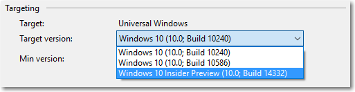

# <a name="version-adaptive-apps-use-new-apis-while-maintaining-compatibility-with-previous-versions"></a>Адаптивные к версии приложения: используйте новые API, сохраняя совместимость с предыдущими версиями

В каждом выпуске Windows 10 SDK добавляются новые возможности, которыми вы наверняка захотите воспользоваться. Однако не все ваши пользователи обновляют свои устройства до последней версии Windows 10 одновременно, при этом вам нужно, чтобы ваше приложение работала на максимальном количестве устройств. В этой статье мы покажем вам, как спроектировать приложение так, чтобы оно работало в предыдущих версиях Windows 10, но также могло использовать новые возможности, если оно запущено на устройстве с последним обновлением.

Чтобы приложение поддерживало максимальное количество устройств с Windows 10, необходимо выполнить три действия.

- Во-первых, укажите в качестве цели для проекта Visual Studio новейшие API. Это повлияет на то, что происходит, когда вы компилируете приложение.
- Во-вторых, выполните проверки времени выполнения, чтобы можно было вызывать только API-интерфейсы, доступные на устройстве, где запущено приложение.
- В-третьих, протестируйте свое приложение в минимальной и целевой версиях Windows 10.

## <a name="configure-your-visual-studio-project"></a>Настройка проекта Visual Studio

Первый шаг для поддержки нескольких версий Windows 10 — указание *целевой* и *минимальной* поддерживаемых версий ОС и SDK в проекте Visual Studio.

- *Целевая версия*: версия SDK, для которой Visual Studio компилирует код приложения и запускает все инструменты. Все API и ресурсы в этой версии SDK доступны в коде приложения во время компиляции.
- *Минимальная версия*: версия SDK, которая поддерживает самую раннюю версию ОС, в которой может работать приложение (и для которой оно будет развернуто Магазином), а также версия, для которой Visual Studio компилирует код разметки приложения. 

Во время выполнения приложение запускается для версии ОС, в которой оно развернуто, поэтому приложение будет вызывать исключения при использовании ресурсов или API-интерфейсов, которые недоступны в этой версии. Мы покажем, как использовать проверки времени выполнения для вызова правильных API, далее в этой статье.

Целевая и минимальная версии указывают границы диапазона версий ОС и SDK. Однако если вы тестируете приложение в минимальной версии, оно будет работать во всех версиях между минимальной и целевой.

> [!TIP]
> Visual Studio не предупреждает вас о совместимости API. Именно вы должны убедиться, что ваше приложение работает, как ожидается, на всех версиях в диапазоне, включая минимальную и целевую версии.

При создании проекта в Visual Studio 2015 с обновление 2 или более поздней версии вам будет предложено установить целевую и минимальную версии, которые поддерживает ваше приложение. По умолчанию целевая версия — это самая старшая установленная версия SDK, а минимальная версия — это наименьшая установленная версия SDK. В качестве целевой и минимальной версии можно выбрать только те версии SDK, которые установлены на компьютере. 


Обычно мы рекомендуем оставить значения по умолчанию. Однако если у вас установлена предварительная версия SDK и вы пишете рабочий код, вам придется изменить целевую версию на последнюю официальную версию SDK. 

Чтобы изменить минимальную и целевую версию для проекта, который уже создан в Visual Studio, перейдите в меню "Проект -> Свойства -> вкладка «Приложения» > Нацеливание".



В следующей таблице для справки представлены номера сборки для каждого SDK.

| Понятное имя | Версия | Сборка ОС/SDK |
| ---- | ---- | ---- |
| RTM | 1507 | 10240 |
| Ноябрьское обновление | 1511 | 10586 |
| Юбилейное обновление | 1607 | 14393 |
| Creators Update | 1703 | 15063 |
| Fall Creators Update | 1709 | 16299 |
| Обновление за апрель 2018 г. | 1803 | 17134 |
| Обновление октября 2018 г. | 1809 | _Insider Preview_ |

Вы можете скачать все выпущенные версии SDK из [архива Windows SDK и эмулятора](https://developer.microsoft.com/downloads/sdk-archive). Последнюю версию Windows Insider Preview SDK можно скачать в разделе для разработчиков сайта [Windows Insider](https://insider.windows.com/Home/BuildWithWindows).

 Дополнительные сведения об обновлениях Windows 10 см. [сведения о выпуске Windows 10](https://technet.microsoft.com/windows/release-info). Важные сведения о Windows 10 поддерживает жизненного цикла, [Windows жизненного цикла справочные материалы](https://support.microsoft.com/help/13853/windows-lifecycle-fact-sheet).

## <a name="perform-api-checks"></a>Проверки API

В основе приложений с адаптивным к версии кодом— сочетание контрактов API и класса [ApiInformation](https://docs.microsoft.com/uwp/api/windows.foundation.metadata.apiinformation). Этот класс позволяет обнаруживать присутствие указанного контракта API, типа или участника, чтобы можно было безопасно выполнять вызовы API на разных устройствах и в разных версиях ОС.

### <a name="api-contracts"></a>Контракты API

Набор API-интерфейсов в семействе устройств разбивается на промежуточные разделы, известные как контракты API. Вы можете использовать метод **ApiInformation.IsApiContractPresent**, чтобы проверить наличие контракта API. Это полезно, если вы хотите протестировать наличие большого количества API-интерфейсов, которые существуют в той же версии контракта API.

```csharp
    bool isScannerDeviceContract_1_Present =
        Windows.Foundation.Metadata.ApiInformation.IsApiContractPresent
            ("Windows.Devices.Scanners.ScannerDeviceContract", 1);
```

Что такое контракт API? По существу, контракт API представляет компонент — набор соответствующих интерфейсов API, которые в совокупности обеспечивают определенную функциональность. Гипотетический контракт API мог бы представлять набор API, содержащих два класса, пять интерфейсов, одну структуру, два перечисления и т. д.

Логически связанные типы группируются в контракт API, а начиная с Windows 10, каждый API среды выполнения Windows является участником определенного контракта API. Работая с контрактами API, вы проверяете доступность определенной функции или API на устройстве, тем самым, по сути, проверяя возможности устройства, а не наличия определенного устройства или ОС. Платформа, которая реализует любой API-интерфейс в контракте API, необходима для реализации каждого API в этом контракте API. Это означает, что можно проверить, поддерживает ли используемая ОС определенный контракт API, и если да, то вызвать любые эти API в соответствующем контракте API, не проверяя каждый по отдельности.

Самый крупный и распространенный контракт API— **Windows.Foundation.UniversalApiContract**. Он содержит большинство API универсальной платформы Windows. В документации [по SDK расширений семейства устройств](https://docs.microsoft.com/uwp/extension-sdks/) описаны разнообразные доступные контракты API. Вы увидите, что большинство из них представляют набор функционально связанных API-интерфейсов.

> [!NOTE]
> Если установлена предварительная версия SDK для Windows, которая еще не отражена в документах, найти информацию о поддержке контракта API можно в файле Platform.xml, который находится в установочной папке SDK по пути \(Program Files (x86))\Windows Kits\10\Platforms\<платформа>\<версия SDK>\Platform.xml.

### <a name="version-adaptive-code-and-conditional-xaml"></a>Адаптивный к версии код и условный XAML

Во всех версиях Windows 10 можно использовать класс ApiInformation в своем коде в условном выражении, чтобы проверить наличие API-интерфейса, который вы хотите вызвать. В адаптивном коде можно использовать различные методы класса, включая IsTypePresent, IsEventPresent, IsMethodPresent и IsPropertyPresent, чтобы проверить API с нужным уровнем детализации.

Дополнительные сведения и примеры см. в разделе **[Адаптивный к версии код](version-adaptive-code.md)**.

Если минимальная версия ваших приложений— сборка 15063 (Creators Update) или выше, для задания свойств и создания экземпляров объектов в разметке без использования кода программной части можно использовать *условный XAML*. Условный XAML обеспечивает возможность использовать метод ApiInformation.IsApiContractPresent в разметке XAML.

Дополнительные сведения и примеры см. в разделе **[Условный XAML](conditional-xaml.md)**.

## <a name="test-your-version-adaptive-app"></a>Проверка адаптивного к версии приложения

При использовании адаптивного к версии кода или условного XAML для создания адаптивного к версии приложения необходимо протестировать его на устройстве с минимальной версией и на устройстве с целевой версией Windows 10.

Невозможно протестировать все пути к условному коду на одном устройстве. Чтобы гарантировать тестирование всех путей к коду, необходимо развернуть и протестировать приложение на удаленном устройстве (или виртуальной машине) с минимальной поддерживаемой версией ОС.
Дополнительные сведения об удаленной отладке см. в разделе [Развертывание и отладка приложений UWP](deploying-and-debugging-uwp-apps.md).

## <a name="related-articles"></a>Связанные разделы

- [Что такое приложение UWP?](https://docs.microsoft.com/windows/uwp/get-started/universal-application-platform-guide)
- [Динамическое обнаружение компонентов с контрактами API](https://blogs.windows.com/buildingapps/2015/09/15/dynamically-detecting-features-with-api-contracts-10-by-10/)
- [Контракты API](https://channel9.msdn.com/Events/Build/2015/3-733) (видео с конференции Build 2015)