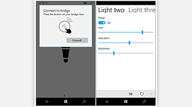

<link rel="stylesheet" href="https://az835927.vo.msecnd.net/sites/uwp/Resources/css/custom.css"> 

# Загружаемые файлы проектирования для приложений UWP

Этот раздел содержит скачиваемые файлы для приложений UWP, связанные с пользовательским интерфейсом и проектированием. Дополнительные средства, такие как Visual Studio, можно найти [на главной странице скачиваемых файлов](https://developer.microsoft.com/downloads). 

## Шаблоны оформления

  

    
<b>PowerPoint</b> 
В этот набор входит все необходимое для быстрого создания каркасов приложений UWP, в том числе элементы управления и макеты. [Скачать шаблоны оформления для PowerPoint](https://go.microsoft.com/fwlink/p/?LinkId=534632)

  

  

  

  

            
<b>Adobe Illustrator</b> 
Эти шаблоны Adobe Illustrator предоставляют элементы управления и макеты для проектирования приложений UWP. [Скачать шаблоны проектирования для Adobe Illustrator](https://go.microsoft.com/fwlink/p/?LinkId=534634)
    
  

  

  

  

            
<b>Adobe Photoshop</b> 
Элементы управления и макеты для проектирования приложений UWP в Adobe Photoshop. [Скачать шаблоны проектирования для Adobe Photoshop](http://go.microsoft.com/fwlink/p/?LinkId=626453)
    
  

  

  

## Средства

  

            
<b>Генератор плиток и значков для Adobe Photoshop</b> 
Этот набор действий для Adobe Photoshop позволяет сгенерировать 68 рекомендуемых ресурсов плиток и значков всего из семи файлов.  [Скачать генератор плиток и значков](http://go.microsoft.com/fwlink/p/?LinkId=760394)
    
  

  

  

  

            
<b>Средство красной линии для Adobe Illustrator</b> 
Удобное создание красных линий на основе прототипов Illustrator  [Скачать средство красной линии для Adobe Illustrator](https://go.microsoft.com/fwlink/p/?LinkId=534641)
    
  

  

  

## Примеры

  

            
<b>Приложение для обмена фотографиями</b>  
Этот пример приложения демонстрирует возможности обмена фотографиями в существующих социальных сетях. В нем показан отзывчивый дизайн, покупки из приложений, службы Azure, push-уведомления и так далее.  [Скачать пример приложения для обмена фотографиями](http://go.microsoft.com/fwlink/p/?LinkId=760402) [Дополнительные сведения о приложении для обмена фотографиями](http://go.microsoft.com/fwlink/p/?LinkId=760401)
    
  

  

  

  

            
<b>Hue Lights </b> 
В этом примере функции Windows интегрируются с интеллектуальной системой домашней автоматики. В частности, в нем показано, как вы можете использовать Кортану и технологию Bluetooth с низким энергопотреблением (Bluetooth LE) для интерактивного использования Phillips Hue Lights (системы освещения с поддержкой Wi-Fi).  [Скачать пример Hue Lights](https://github.com/Microsoft/Windows-appsample-huelightcontroller/archive/master.zip) [Подробнее о примере Hue Lights](https://github.com/Microsoft/Windows-appsample-huelightcontroller)
    
  

  

  

<b>Вам нужно больше примеров кода?</b> Полный список всех наших примеров приложений UWP вы можете найти на странице примеров Windows. [Перейти на портал примеров](https://developer.microsoft.com/samples)

<!--HONumber=Jul16_HO1-->

