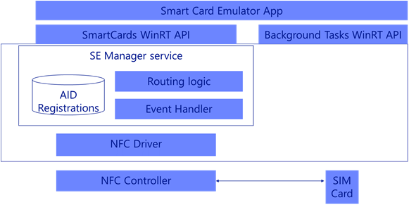

# Создание приложения для смарт-карты NFC

\[ Обновлено для приложений UWP в Windows 10. Статьи, касающиеся Windows 8.x, см. в разделе [Архив](http://go.microsoft.com/fwlink/p/?linkid=619132) \]

**Важно!**  Этот раздел относится только к Windows 10 Mobile.

ОС Windows Phone 8.1 поддерживала приложения эмуляции карты NFC с помощью защищенного элемента на основе SIM-карты, но для этой модели требовалось, чтобы приложения для безопасной оплаты были тесно связаны с операторами мобильных сетей (ОМС). Это ограничивало выбор возможных способов оплаты для продавцов и разработчиков, не связанных с ОМС. В ОС Windows 10 Mobile мы внедрили новую технологию эмуляции карты под названием HCE (Host Card Emulation – эмуляция карты узла). Технология HCE позволяет вашему приложению устанавливать прямую связь с устройством чтения карт NFC. В этом разделе показано, как технология HCE работает на устройствах под управлением Windows 10 Mobile и как можно разрабатывать приложение с поддержкой HCE, чтобы клиенты могли получать доступ к вашим службам с помощью телефона, а не физической карты, и без обязательной связи с ОМС.

## Необходимые условия для разработки приложения с поддержкой HCE


Для разработки приложения эмуляции карты на основе HCE для Windows 10 Mobile нужно настроить среду разработки. Выполнить настройку можно, установив программное обеспечение Microsoft Visual Studio 2015. В нем содержатся средства разработчика Windows и эмулятор Windows 10 Mobile с поддержкой эмуляции NFC. Подробнее о настройке см. в разделе [Настройка](https://msdn.microsoft.com/library/windows/apps/Dn726766)

Если же вы хотите выполнить тестирование на реальном устройстве под управлением Windows 10 Mobile, а не с помощью включенного в ПО эмулятора Windows 10 Mobile, вам также потребуются следующие элементы.

-   Устройство под управлением Windows 10 Mobile с поддержкой HCE NFC. В настоящее время приложения для NFC на основе HCE поддерживаются на телефонах Lumia 730, 830, 640 и 640 XL.
-   Терминал устройства считывания, поддерживающий протоколы ISO/IEC 14443-4 и ISO/IEC 7816-4

В Windows 10 Mobile реализована служба HCE, предоставляющая следующие функциональные возможности.

-   Приложения могут регистрировать идентификаторы приложений (AID) для карт, которые они собираются эмулировать.
-   Устранение конфликтов и маршрутизация команды и ответа APDU связываются с одним из зарегистрированных приложений, исходя из выбора внешней карты устройства считывания и настройки пользователя.
-   Обработка событий и уведомлений приложений как результата действий пользователя.

Windows 10 поддерживает эмуляцию смарт-карт, основанных на протоколе ISO-DEP (ISO-IEC 14443-4), и передает данные с помощью APDU согласно определению в спецификации протокола ISO-IEC 7816-4. Windows 10 поддерживает технологию ISO/IEC 14443-4 типа A для приложений с HCE. Технологии типов B и F, а также технологии, отличные от ISO-DEP (например, MIFARE), по умолчанию направляются на SIM-карту.

Функция эмуляции карты работает только на устройствах под управлением Windows 10 Mobile. Эмуляция карты на основе SIM-карты и HCE недоступна в других версиях Windows 10.

Архитектура для эмуляции карты на основе SIM-карты и HCE показана на схеме ниже. 



## Выбор приложения и маршрутизация AID

Для разработки приложения с HCE необходимо понимать, как устройства под управлением Windows 10 Mobile перенаправляют AID конкретному приложению, так как пользователи могут устанавливать много разных приложений с HCE. Каждое приложение может регистрировать несколько карт на основе HCE и SIM-карты. Традиционные приложения для Windows Phone 8.1, основанные на SIM-карте, будут и дальше работать в Windows 10 Mobile при условии, что пользователь выберет параметр "SIM-карта" в качестве карты для оплаты по умолчанию в меню "Параметры NFC". Этот параметр устанавливается по умолчанию во время первого включения устройства.

Когда пользователь коснется терминала своим устройством под управлением Windows 10 Mobile, данные будут автоматически перенаправлены соответствующему приложению, установленному на устройстве. Эта маршрутизация основана на идентификаторах приложения (AID), состоящих из 5–16 байт. Во время касания внешний терминал передает команду SELECT APDU, чтобы указать идентификатор AID, на который следует перенаправлять все последующие команды APDU. Последующие команды SELECT снова изменят маршрутизацию. Исходя из идентификаторов AID, зарегистрированных приложениями, и параметров пользователя, трафик APDU перенаправляется на конкретное приложение, которое будет направлять ответ APDU. Следует помнить о том, что терминал может связываться с несколькими разными приложениями во время одного касания. Поэтому необходимо обеспечить скорейший выход фоновой задачи приложения во время деактивации, чтобы освободить пространство для фоновой задачи другого приложения для ответа APDU. Фоновые задачи описаны далее в этом разделе.

Чтобы получить APDU для идентификатора AID, приложения с HCE должны самостоятельно зарегистрироваться с определенными идентификаторами AID, которые они могут обработать. Приложения декларируют идентификаторы AID с помощью групп AID. Группа AID концептуально эквивалентна отдельной физической карте. Например, одна кредитная карта декларируется с помощью группы AID, а вторая кредитная карта из другого банка декларируется с помощью другой, второй группы AID, при этом обе карты могут иметь один и тот же AID.

## Устранение конфликтов для групп AID оплаты

Когда приложение регистрирует физические карты (группы AID), оно может задекларировать категорию группы AID как "Оплата" или "Другая". Одновременно могут существовать несколько групп AID оплаты, зарегистрированных в какой-либо момент времени, однако только для одной из этих групп может быть одновременно включена функция оплаты касанием. Этот выбор определяет пользователь. Такое поведение обусловлено тем, что пользователь желает контролировать ситуацию, сознательно выбирая для использования один платеж, одну кредитную или дебетную карту, чтобы не платить другой непредусмотренной картой во время касания устройством терминала.

Однако при этом одновременно могут быть включены несколько групп AID, зарегистрированных как «Другая», без взаимодействия с пользователем. Такое поведение обусловлено тем, что другие типы карт, в частности скидочные карты, купоны или проездные карты, должны просто работать без лишних действий или подсказок во время касания телефона.

Все группы AID, зарегистрированные как "Оплата", отображаются в списке карт на странице параметров NFC, на которой пользователь может выбрать карту для оплаты по умолчанию. Если карта для оплаты по умолчанию выбрана, приложение, которое зарегистрировало эту группу AID оплаты, станет приложением для оплаты по умолчанию. Приложения для оплаты по умолчанию могут включать или отключать любые из своих групп AID без взаимодействия с пользователем. Если пользователь отклонит запрос относительно приложения для оплаты по умолчанию, текущее приложение для оплаты по умолчанию (если имеется) останется приложением по умолчанию. На следующем снимке экрана показана страница параметров NFC.


В этом примере (на снимке экрана выше) в случае изменения пользователем карты для оплаты по умолчанию на карту, которая не зарегистрирована приложением "HCE Application 1", система создаст запрос подтверждения согласия пользователя. Если же пользователь изменит свою карту для оплаты по умолчанию на карту, которая зарегистрирована приложением "HCE Application 1", система не создаст запрос подтверждения для пользователя, так как "HCE Application 1" уже является приложением для оплаты по умолчанию.

## Устранение конфликтов для групп AID, не предназначенных для оплаты

Карты, не предназначенные для оплаты, отнесенные к категории "Другая", не отображаются на странице параметров NFC.

Ваше приложение может создавать, регистрировать и включать группы AID, не предназначенные для оплаты, так же, как и группы оплаты AID. Основное отличие состоит в том, что для групп AID, не предназначенных для оплаты, категория эмуляции имеет значение "Другая", а не "Оплата". После регистрации группы AID в системе необходимо включить группу AID для получения трафика NFC. При попытке включить группу AID, не предназначенную для оплаты, для получения трафика получатель не получает запрос подтверждения, если отсутствует конфликт с каким-либо AID, который уже зарегистрирован в системе другим приложением. При наличии конфликта пользователь получит запрос со сведениями о том, какая карта и связанное с ней приложение будут отключены, если пользователь решит включить вновь зарегистрированную группу AID.

**Сосуществование с приложениями NFC основе SIM-карты**

В Windows 10 Mobile система настраивает таблицу маршрутизации контроллера NFC, которая используется для принятия решений относительно маршрутизации на уровне контроллера. Эта таблица содержит сведения о маршрутизации для перечисленных ниже элементов.

-   Отдельные маршруты AID.
-   Маршрут на основе протокола (ISO-DEP).
-   Маршрутизация на основе технологий (NFC-A/B/F).

Если внешнее устройство считывания отправляет команду "SELECT AID", контроллер NFC сначала проверяет маршруты AID в таблице маршрутизации на наличие совпадений. При отсутствии совпадений будет использоваться маршрут на основе протокола как маршрут по умолчанию для трафика ISO-DEP (14443-4-A). Для любого другого трафика, отличного от ISO-DEP, будет использоваться маршрутизация на основе технологий.

В Windows 10 Mobile на странице параметров NFC есть параметр меню "SIM-карта", позволяющий продолжить использование традиционных приложений для Windows Phone 8.1 на основе SIM-карты, которые не регистрируют свои AID в системе. Если пользователь выберет параметр "SIM-карта" в качестве карты для оплаты по умолчанию, маршрут ISO-DEP получит значение UICC. В случае всех остальных вариантов выбора в раскрывающемся меню маршрут ISO-DEP будет указывать на узел.

Маршрут ISO-DEP получает значение "SIM-карта" для устройств с SIM-картой с поддержкой SE, когда устройство загружается впервые с Windows 10 Mobile. Если пользователь установит приложение, поддерживающее HCE, и это приложение включит какие-либо регистрации группы AID с HCE, маршрут ISO-DEP будет указывать на узел. Новым приложениям на основе SIM-карты необходимо зарегистрировать идентификаторы AID на SIM-карте, чтобы в таблицу маршрутизации контроллера были включены конкретные маршруты AID.

## Создание приложения на основе HCE

Приложение с HCE состоит из двух частей.

-   Главное приложение переднего плана для взаимодействия с пользователем.
-   Фоновая задача, которая вызывается системой для обработки APDU для данного AID.

Из-за слишком строгих требований к производительности для загрузки вашей фоновой задачи в ответ на касание NFC рекомендуется, чтобы вся фоновая задача была реализована в собственном коде C++/CX (включая все зависимости, ссылки или библиотеки, от которых вы зависите), а не в C# или управляемом коде. Хотя C# и управляемый код обычно работают хорошо, существует дополнительная нагрузка, в частности загрузка .NET CLR, которой можно избежать вписав ее в C++/CX.
## Создание и регистрация фоновой задачи

Вам необходимо создать фоновую задачу в своем приложении с HCE для обработки и ответа на объекты APDU, направленные системой. При первом запуске приложения передний план регистрирует фоновую задачу HCE, в которой реализован интерфейс [**IBackgroundTaskRegistration**](https://msdn.microsoft.com/library/windows/apps/BR224803), как показано в следующем коде.

```csharp
var taskBuilder = new BackgroundTaskBuilder();
taskBuilder.Name = bgTaskName;
taskBuilder.TaskEntryPoint = taskEntryPoint;
taskBuilder.SetTrigger(new SmartCardTrigger(SmartCardTriggerType.EmulatorHostApplicationActivated));
bgTask = taskBuilder.Register();
```

Обратите внимание, что для триггера задачи устанавливается значение [**SmartCardTriggerType**](https://msdn.microsoft.com/library/windows/apps/Dn608017). **EmulatorHostApplicationActivated**. Это означает, что при получении команды SELECT AID объекта APDU операционной системой, разрешаемой в ваше приложение, будет запущена ваша фоновая задача.

## Получение APDU и ответ на них

При наличии APDU, нацеленного на ваше приложение, система запустит вашу фоновую задачу. Ваша фоновая задача получает объект APDU, проходящий через свойство [**CommandApdu**](https://msdn.microsoft.com/en-us/library/windows/apps/windows.devices.smartcards.smartcardemulatorapdureceivedeventargs.commandapdu.aspx) объекта [**SmartCardEmulatorApduReceivedEventArgs**](https://msdn.microsoft.com/library/windows/apps/Dn894640), и отвечает на APDU с помощью метода [**TryRespondAsync**](https://msdn.microsoft.com/en-us/library/windows/apps/mt634299.aspx) того же объекта. Возможно, вашу фоновую задачу следует приберечь для легких операций в целях повышения производительности. Например, чтобы отвечать на APDU немедленно и закрывать фоновую задачу после завершения обработки. Из-за характера транзакций NFC пользователи все чаще удерживают свое устройство возле устройства для считывания в течение очень короткого периода времени. Фоновая задача будет по-прежнему принимать трафик от устройства для считывания, пока ваше подключение не будет остановлено. В таком случае вы получите объект [**SmartCardEmulatorConnectionDeactivatedEventArgs**](https://msdn.microsoft.com/library/windows/apps/Dn894644). Подключение может быть остановлено по причинам, указанным в свойстве [**SmartCardEmulatorConnectionDeactivatedEventArgs.Reason**](https://msdn.microsoft.com/library/windows/apps/windows.devices.smartcards.smartcardemulatorconnectiondeactivatedeventargs.reason).

-   Если подключение останавливается со значением **ConnectionLost**, это означает, что пользователь отвел свое устройство от устройства для считывания. Если вашему приложению требуется, чтобы пользователь касался терминала в течение большего времени, можно показать соответствующий запрос. Вы должны завершить фоновую задачу быстро (завершив отсрочку), чтобы при повторном касании не было задержки из-за ожидания завершения предыдущей фоновой задачи.
-   Если подключение остановлено со значением **ConnectionRedirected**, это означает, что терминал отправил новую команду SELECT AID APDU, направленную на другой идентификатор AID. В таком случае приложению следует немедленно завершить фоновую задачу (завершив отсрочку), чтобы сделать возможным запуск другой фоновой задачи.

Фоновая задача также должна регистрировать событие [**Canceled event**](https://msdn.microsoft.com/library/windows/apps/BR224798) в [**IBackgroundTaskInstance interface**](https://msdn.microsoft.com/library/windows/apps/BR224797) и быстро завершать фоновую задачу (завершив отсрочку), так как это событие запускается системой после завершения выполнения фоновой задачи. Ниже приведен код, демонстрирующий фоновую задачу приложения с HCE.

```csharp
void BgTask::Run(
    IBackgroundTaskInstance^ taskInstance)
{
    m_triggerDetails = static_cast<SmartCardTriggerDetails^>(taskInstance->TriggerDetails);
    if (m_triggerDetails == nullptr)
    {
        // May be not a smart card event that triggered us
        return;
    }

    m_emulator = m_triggerDetails->Emulator;
    m_taskInstance = taskInstance;

    switch (m_triggerDetails->TriggerType)
    {
    case SmartCardTriggerType::EmulatorHostApplicationActivated:
        HandleHceActivation();
        break;

    case SmartCardTriggerType::EmulatorAppletIdGroupRegistrationChanged:
        HandleRegistrationChange();
        break;

    default:
        break;
    }
}

void BgTask::HandleHceActivation()
{
 try
 {
        auto lock = m_srwLock.LockShared();
        // Take a deferral to keep this background task alive even after this "Run" method returns
        // You must complete this deferal immediately after you have done processing the current transaction
        m_deferral = m_taskInstance->GetDeferral();

        DebugLog(L"*** HCE Activation Background Task Started ***");

        // Set up a handler for if the background task is cancelled, we must immediately complete our deferral
        m_taskInstance->Canceled += ref new Windows::ApplicationModel::Background::BackgroundTaskCanceledEventHandler(
            [this](
            IBackgroundTaskInstance^ sender,
            BackgroundTaskCancellationReason reason)
        {
            DebugLog(L"Cancelled");
            DebugLog(reason.ToString()->Data());
            EndTask();
        });

        if (Windows::Phone::System::SystemProtection::ScreenLocked)
        {
            auto denyIfLocked = Windows::Storage::ApplicationData::Current->RoamingSettings->Values->Lookup("DenyIfPhoneLocked");
            if (denyIfLocked != nullptr &amp;&amp; (bool)denyIfLocked == true)
            {
                // The phone is locked, and our current user setting is to deny transactions while locked so let the user know
                // Denied
                DoLaunch(Denied, L"Phone was locked at the time of tap");

                // We still need to respond to APDUs in a timely manner, even though we will just return failure
                m_fDenyTransactions = true;
            }
        }
        else
        {
            m_fDenyTransactions = false;
        }

        m_emulator->ApduReceived += ref new TypedEventHandler<SmartCardEmulator^, SmartCardEmulatorApduReceivedEventArgs^>(
            this, &amp;BgTask::ApduReceived);

        m_emulator->ConnectionDeactivated += ref new TypedEventHandler<SmartCardEmulator^, SmartCardEmulatorConnectionDeactivatedEventArgs^>(
                [this](
                SmartCardEmulator^ emulator,
                SmartCardEmulatorConnectionDeactivatedEventArgs^ eventArgs)
            {
                DebugLog(L"Connection deactivated");
                EndTask();
            });

  m_emulator->Start();
        DebugLog(L"Emulator started");
 }
 catch (Exception^ e)
 {
        DebugLog(("Exception in Run: " + e->ToString())->Data());
        EndTask();
 }
}
```
## Создание и регистрация группы AID

Во время первого запуска приложения при подготовке карты вы создаете и регистрируете группы AID в системе. Система определяет приложение, с которым свяжется внешнее устройство для считывания, и перенаправляет объекты APDU соответствующим образом, исходя из зарегистрированных AID и параметров пользователя.

Большинство карт для оплаты регистрируются с одним и тем же идентификатором AID (который является идентификатором AID PPSE) вместе с конкретными идентификаторами AID дополнительной карты сети для оплаты. Каждая группа AID представляет карту, и когда пользователь активирует карту, активируются все идентификаторы AID в группе. Аналогично, когда пользователь отключает карту, отключаются все идентификаторы AID в группе.

Чтобы зарегистрировать группу AID, необходимо создать объект [**SmartCardAppletIdGroup**](https://msdn.microsoft.com/library/windows/apps/Dn910955) и настроить его свойства, чтобы указать, что это — карта для оплаты на основе HCE. Отображаемое имя должно описывать вас пользователю, поскольку оно будет отображаться в меню параметров NFC, а также в запросах для пользователей. В случае карт с HCE, предназначенных для оплаты, свойство [**SmartCardEmulationCategory**](https://msdn.microsoft.com/en-us/library/windows/apps/windows.devices.smartcards.smartcardappletidgroup.smartcardemulationcategory.aspx) должно иметь значение **Payment**, а свойство [**SmartCardEmulationType**](https://msdn.microsoft.com/library/windows/apps/windows.devices.smartcards.smartcardappletidgroup.smartcardemulationtype) — значение **Host**.

```csharp
public static byte[] AID_PPSE =
        {
            // File name "2PAY.SYS.DDF01" (14 bytes)
            (byte)'2', (byte)'P', (byte)'A', (byte)'Y',
            (byte)'.', (byte)'S', (byte)'Y', (byte)'S',
            (byte)'.', (byte)'D', (byte)'D', (byte)'F', (byte)'0', (byte)'1'
        };

var appletIdGroup = new SmartCardAppletIdGroup(
                        "Example DisplayName", 
                                new List<IBuffer> {AID_PPSE.AsBuffer()},
                                SmartCardEmulationCategory.Payment,
                                SmartCardEmulationType.Host);
```

В случае карт с HCE, не предназначенных для оплаты, свойство [**SmartCardEmulationCategory**](https://msdn.microsoft.com/en-us/library/windows/apps/windows.devices.smartcards.smartcardappletidgroup.smartcardemulationcategory.aspx) должно иметь значение **Other**, а свойство [**SmartCardEmulationType**](https://msdn.microsoft.com/library/windows/apps/windows.devices.smartcards.smartcardappletidgroup.smartcardemulationtype) — значение **Host**.

```csharp
public static byte[] AID_OTHER =
        {
            (byte)'1', (byte)'2', (byte)'3', (byte)'4',
            (byte)'5', (byte)'6', (byte)'7', (byte)'8',
            (byte)'O', (byte)'T', (byte)'H', (byte)'E', (byte)'R’
        };

var appletIdGroup = new SmartCardAppletIdGroup(
                        "Example DisplayName", 
                                new List<IBuffer> {AID_OTHER.AsBuffer()},
                                SmartCardEmulationCategory.Other,
                                SmartCardEmulationType.Host);
```

Вы можете включить до 9 идентификаторов AID (длиной 5–16 байт каждый) в каждую группу идентификаторов AID.

Используйте метод [**RegisterAppletIdGroupAsync**](https://msdn.microsoft.com/library/windows/apps/Dn894656), чтобы зарегистрировать свою группу AID в системе. При этом будет возвращен объект [**SmartCardAppletIdGroupRegistration**](https://msdn.microsoft.com/library/windows/apps/Dn910955registration). По умолчанию для свойства [**ActivationPolicy**](https://msdn.microsoft.com/library/windows/apps/Dn910955registration_activationpolicy) объекта регистрации устанавливается значение **Disabled**. Это означает, что даже если ваши идентификаторы AID зарегистрированы в системе, они еще не включены и не будут получать трафик.

```csharp
reg = await SmartCardEmulator.RegisterAppletIdGroupAsync(appletIdGroup);
```

Вы можете включать свои зарегистрированные карты (группы AID) с помощью метода [**RequestActivationPolicyChangeAsync**](https://msdn.microsoft.com/library/windows/apps/Dn910955registration_requestactivationpolicychangeasync) класса [**SmartCardAppletIdGroupRegistration**](https://msdn.microsoft.com/library/windows/apps/Dn910955registration), как показано ниже. Так как в системе можно одновременно активировать одну карту для оплаты, установка для параметра [**ActivationPolicy**](https://msdn.microsoft.com/library/windows/apps/Dn910955registration_activationpolicy) группы AID оплаты значения **Enabled** полностью соответствует настройке карты для оплаты по умолчанию. Пользователю будет предложено разрешить применение этой карты в качестве карты для оплаты по умолчанию независимо от того, была ли уже выбрана карта для оплаты по умолчанию. Это утверждение является неверным, если приложение уже назначено приложением для оплаты по умолчанию и просто переходит между собственными группами AID. Вы можете зарегистрировать до 10 групп AID для каждого приложения.

```csharp
reg.RequestActivationPolicyChangeAsync(AppletIdGroupActivationPolicy.Enabled);
```

Вы можете запросить зарегистрированные группы AID в ОС и проверить их политику активации с помощью метода [**GetAppletIdGroupRegistrationsAsync**](https://msdn.microsoft.com/library/windows/apps/Dn894654).

Пользователи получат уведомление, когда вы переведете политику активации карты для оплаты из состояния **Disabled** в **Enabled**, только если приложение уже не было назначено приложением для оплаты по умолчанию. Если же вы переведете политику активации карты, не предназначенной для оплаты, из состояния **Disabled** в **Enabled**, пользователи получат уведомление только при наличии конфликта AID.

```csharp
var registrations = await SmartCardEmulator.GetAppletIdGroupRegistrationsAsync();
    foreach (var registration in registrations)
    {
registration.RequestActivationPolicyChangeAsync (AppletIdGroupActivationPolicy.Enabled);
    }
```

**Уведомление о событии при изменении политики активации**

В случае фоновой задачи можно зарегистрироваться для получения событий, связанных с изменением политики активации одной из зарегистрированных групп AID, когда такое изменение происходит за пределами приложения. Например, пользователь может изменить приложение для оплаты по умолчанию в меню параметров NFC, сменив при этом одну из ваших карт на карту, размещенную в другом приложении. Если вашему приложению необходимо знать об этом изменении в целях внутренней настройки, например для обновления живых плиток, вы можете получать уведомления о таких событиях и выполнять соответствующие действия в приложении.

```csharp
var taskBuilder = new BackgroundTaskBuilder();
taskBuilder.Name = bgTaskName;
taskBuilder.TaskEntryPoint = taskEntryPoint;
taskBuilder.SetTrigger(new SmartCardTrigger(SmartCardTriggerType.EmulatorAppletIdGroupRegistrationChanged));
bgTask = taskBuilder.Register();
```

## Переопределение переднего плана

Вы можете изменить [**ActivationPolicy**](https://msdn.microsoft.com/library/windows/apps/Dn910955registration_activationpolicy) для любой из зарегистрированных групп AID на **ForegroundOverride** в то время, когда ваше приложение находится на переднем плане, не уведомляя при этом пользователя. Когда пользователь касается устройством терминала во время работы приложения на переднем плане, трафик направляется вашему приложению, даже если ни одна из ваших карт для оплаты не была выбрана пользователем в качестве карты для оплаты по умолчанию. В случае изменения политики активации карты на **ForegroundOverride** это изменение носит временный характер и действует до тех пор, пока ваше приложение не выйдет из переднего плана. Оно не изменит текущую карту для оплаты по умолчанию, установленную пользователем. Вы можете изменить параметр **ActivationPolicy** карт для оплаты или карт, не предназначенных для оплаты, из приложения переднего плана следующим образом. Обратите внимание, что метод [**RequestActivationPolicyChangeAsync**](https://msdn.microsoft.com/library/windows/apps/Dn910955registration_requestactivationpolicychangeasync) можно вызывать только из приложения переднего плана. Его невозможно вызвать из фоновой задачи.

```csharp
reg.RequestActivationPolicyChangeAsync(AppletIdGroupActivationPolicy.ForegroundOverride);
```

Кроме того, вы можете зарегистрировать группу AID, состоящую из одного AID длиной 0 байт, вследствие чего система будет перенаправлять все APDU независимо от AID, включая все команды APDU, отправленные до получения команды SELECT AID. Однако такая группа AID работает только во время работы приложения на переднем плане, так как для нее можно настроить только **ForegroundOverride** и ее нельзя включить на постоянной основе. Кроме того, этот механизм работает и при значении **Host**, и при значении **UICC** перечисления [**SmartCardEmulationType**](https://msdn.microsoft.com/library/windows/apps/Dn894639), перенаправляя при этом весь трафик либо в фоновую задачу HCE, либо на SIM-карту.

```csharp
public static byte[] AID_Foreground =
        {};

var appletIdGroup = new SmartCardAppletIdGroup(
                        "Example DisplayName", 
                                new List<IBuffer> {AID_Foreground.AsBuffer()},
                                SmartCardEmulationCategory.Other,
                                SmartCardEmulationType.Host);
reg = await SmartCardEmulator.RegisterAppletIdGroupAsync(appletIdGroup);
reg.RequestActivationPolicyChangeAsync(AppletIdGroupActivationPolicy.ForegroundOverride);
```

## Проверка поддержки NFC и HCE

Ваше приложение должно проверять, имеет ли устройство оборудование NFC, поддерживает ли функцию эмуляции карты и поддерживает ли эмуляцию карты узла, прежде чем предлагать эти функции пользователю.

Функция эмуляции смарт-карты NFC работает только в Windows 10 Mobile. Поэтому попытка использовать API эмулятора смарт-карты в любых других версиях Windows 10 приведет к ошибкам. Вы можете проверить поддержку API смарт-карты в следующем фрагменте кода.

```csharp
Windows.Foundation.Metadata.ApiInformation.IsTypePresent("Windows.Devices.SmartCards.SmartCardEmulator");
```

Вы можете дополнительно проверить, поддерживает ли оборудование NFC некоторые формы эмуляции карты, проверив, возвращает ли метод [**SmartCardEmulator.GetDefaultAsync**](https://msdn.microsoft.com/library/windows/apps/Dn608008) значение NULL. Если возвращает, то устройство не поддерживает эмуляцию карты NFC.

```csharp
var smartcardemulator = await SmartCardEmulator.GetDefaultAsync();<
```

Поддержка маршрутизации UICC на основе HCE и AID доступна только на недавно появившихся устройствах, в частности на Lumia 730, 830, 640 и 640 XL. Все новые устройства с поддержкой NFC под управлением Windows 10 Mobile и более новых версий ОС, как правило, поддерживают HCE. Ваше приложение может проверить наличие поддержки HCE следующим образом.

```csharp
Smartcardemulator.IsHostCardEmulationSupported();
```

## Экран блокировки и выключение экрана

Windows 10 Mobile содержит параметры эмуляции карты на уровне устройства, которые могут настраиваться оператором мобильной связи или изготовителем устройства. По умолчанию переключатель оплаты касанием отключен, а для параметра "политика включения на уровне устройства" устанавливается значение "Всегда", если оператор мобильной связи или изготовитель оборудования не перезапишут эти значения.

Приложение может запросить значение [**EnablementPolicy**](https://msdn.microsoft.com/library/windows/apps/Dn608006) на уровне устройства и предпринять действие для каждого случая в зависимости от требуемого поведения приложения в каждом состоянии.

```csharp
SmartCardEmulator emulator = await SmartCardEmulator.GetDefaultAsync();

switch (emulator.EnablementPolicy)
{
case Never:
// you can take the user to the NFC settings to turn "tap and pay" on
await Windows.System.Launcher.LaunchUriAsync(new Uri("ms-settings-nfctransactions:"));
break;
 
 case Always: 
return "Card emulation always on";

 case ScreenOn:
 return "Card emulation on only when screen is on";

 case ScreenUnlocked:
 return "Card emulation on only when screen unlocked"; 
}
```

Фоновая задача приложения будет запущена, даже когда телефон заблокирован и (или) экран выключен, но только если внешнее устройство для считывания выберет AID, который разрешается в ваше приложение. Вы можете реагировать на команды от устройства для считывания в фоновой задаче, но если вам необходим ввод каких-либо данных от пользователя или если вы хотите показать сообщение пользователю, можно запустить приложение переднего плана с некоторыми аргументами. Фоновая задача может запустить приложение переднего плана со следующим поведением.

-   Под экраном блокировки устройства (пользователь будет видеть ваше приложение переднего плана только после того, как разблокирует устройство)
-   Над экраном блокировки устройства (после закрытия приложения пользователем устройство по-прежнему находится в заблокированном состоянии)

```csharp
        if (Windows::Phone::System::SystemProtection::ScreenLocked)
        {
            // Launch above the lock with some arguments
            var result = await eventDetails.TryLaunchSelfAsync("app-specific arguments", SmartCardLaunchBehavior.AboveLock);
        } 
```

## Регистрация AID и другие обновления для приложений на основе SIM-карты

Приложения эмуляции карты, использующие SIM-карту в качестве защищенного элемента, могут регистрироваться в службе Windows для декларирования AID, поддерживаемых на SIM-карте. Эта регистрация очень похожа на регистрацию приложения на основе HCE. Единственным различием является параметр [**SmartCardEmulationType**](https://msdn.microsoft.com/library/windows/apps/Dn894639), для которого необходимо задать значение UICC для приложений на основе SIM-карты. В результате регистрации карты для оплаты отображаемое имя карты также будет внесено в меню настройки NFC.

```csharp
var appletIdGroup = new SmartCardAppletIdGroup(
                        "Example DisplayName", 
                                new List<IBuffer> {AID_PPSE.AsBuffer()},
                                SmartCardEmulationCategory.Payment,
                                SmartCardEmulationType.Uicc);
```

**Важно! **  
Поддержка традиционного двоичного перехвата SMS в Windows Phone 8.1 была удалена и заменена новой, более широкой поддержкой SMS в Windows 10 Mobile, но любые традиционные приложения для Windows Phone 8.1, основанные на этом, необходимо обновить для использования новых API SMS Windows 10 Mobile.


<!--HONumber=Mar16_HO1-->


