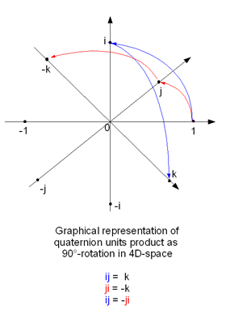

# Датчики

Датчики позволяют приложению получить информацию о взаимодействии устройства с физическим миром, который его окружает. Датчики могут сообщить приложению о направлении движения, положении в пространстве и перемещении устройства. Датчики помогут вам сделать игру, приложение дополненной реальности или приложение общего назначения более удобными и интерактивными. Они предоставляют уникальную форму ввода, например используют движения устройства для упорядочения символов на экране или для имитации нахождения в кабине пилота (при этом устройство выполняет функции штурвала).

Как правило, сначала необходимо решить, будет ли приложение строиться исключительно на использовании датчиков или датчики будут выполнять только функции вспомогательного механизма управления. Например, в симуляторе вождения, в котором устройство используется в качестве виртуального рулевого колеса, игрой можно было бы также управлять с помощью экранного графического интерфейса— в этом случае приложение работает независимо от наличия датчиков в системе. С другой стороны, наклонный лабиринт можно создать только для систем, имеющих соответствующие датчики. Вам нужно принять стратегическое решение, то есть определить, будет ли приложение полностью зависеть от датчиков. Учтите, что схема управления при помощи мыши или касаний обеспечивает лучший контроль, но не дает ощущения полной погруженности в игру.

| Статья                                                       | Описание  |
|-------------------------------------------------------------|--------------|
| [Калибровка датчиков](calibrate-sensors.md)                   | Датчикам устройства, которые работают на основе магнитометра (компас, датчик наклона и датчик ориентации), может потребоваться калибровка из-за воздействия на них факторов окружающей среды. Перечисление [<strong>MagnetometerAccuracy</strong>](https://msdn.microsoft.com/library/windows/apps/Dn297552) может помочь определить необходимые действия, когда устройство требует калибровки. |
| [Положение датчиков в пространстве](sensor-orientation.md)                 | Данные датчиков классов [<strong>OrientationSensor</strong>](https://msdn.microsoft.com/library/windows/apps/BR206371) определяются их опорными осями. Эти оси определяются альбомной ориентацией устройства и поворачиваются вместе с ним. |
| [Использование акселерометра](use-the-accelerometer.md)           | Научитесь использовать акселерометр для реагирования на движения пользователя. |
| [Использование компаса](use-the-compass.md)                       | Узнайте, как с помощью компаса можно определить текущее направление движения. |
| [Использование гирометра](use-the-gyrometer.md)                   | Узнайте, как использовать гирометр для отслеживания изменений в движениях пользователя. | 
| [Использование инклинометра](use-the-inclinometer.md)             | Узнайте, как использовать инклинометр для определения поворотов относительно поперечной, продольной и вертикальной осей. |
| [Использование датчика освещенности](use-the-light-sensor.md)             | Узнайте, как использовать датчик освещенности, чтобы обнаруживать изменения уровня освещенности. |
| [Использование датчика положения в пространстве](use-the-orientation-sensor.md) | Узнайте, как использовать датчики положения в пространстве для определения ориентации устройства.|

## Пакетная обработка датчика

Некоторые датчики поддерживают пакетную обработку. Это зависит от отдельного доступного датчика. Когда датчик реализует пакетную обработку, он собирает несколько точек данных за определенный интервал времени, а затем передает все эти данные одновременно. Этот принцип работы отличается от обычного поведения, когда датчик сообщает результаты, как только выполнит считывание. Рассмотрим следующую схему, в которой показано, как данные собираются и доставляются: сначала при обычной доставке, а затем при пакетной.

Главное преимущество пакетной обработки датчика — увеличение времени работы батареи. Если данные не отправляются сразу, экономится питание процессора и отпадает необходимость немедленной обработки данных. Компоненты системы могут находиться в спящем режиме до тех пор, пока они не понадобятся, что обеспечивает существенное энергосбережение.

Вы можете влиять на то, как часто датчик отправляет пакеты, регулируя задержку. Например, датчик [**Акселерометр**](https://msdn.microsoft.com/library/windows/apps/BR225687) имеет свойство [**ReportLatency**](https://msdn.microsoft.com/library/windows/apps/windows.devices.sensors.accelerometer.reportlatency). Если для приложения установлено это свойство, датчик будет отправлять данные по истечении указанного промежутка времени. Вы можете управлять объемом данных, накапливаемых за эту задержку, установив свойство [**ReportInterval**](https://msdn.microsoft.com/library/windows/apps/windows.devices.sensors.accelerometer.reportinterval).

Есть несколько предупреждений относительно установки задержки, которые необходимо помнить. Во-первых, каждый датчик имеет свойство [**MaxBatchSize**](https://msdn.microsoft.com/library/windows/apps/windows.devices.sensors.accelerometer.maxbatchsize.aspx), которое он может поддерживать в зависимости от самого датчика. Это число событий, которые датчик может кэшировать, прежде чем он будет вынужден их отправить. Если умножить **MaxBatchSize** на [**ReportInterval**](https://msdn.microsoft.com/library/windows/apps/windows.devices.sensors.accelerometer.reportinterval), будет определено максимальное значение [**ReportLatency**](https://msdn.microsoft.com/library/windows/apps/windows.devices.sensors.accelerometer.reportlatency). Если указать значение выше этого, будет использоваться максимальная задержка, чтобы избежать потери данных. Кроме того, нужную задержку можно установить для нескольких приложений отдельно. Для соответствия требованиям всех приложений будет использоваться самый короткий период задержки. В связи с перечисленными выше фактами задержка, которую вы установили в приложении, может не соответствовать наблюдаемой задержке.

Если датчик использует пакетное создание отчетов, в результате вызова [**GetCurrentReading**](https://msdn.microsoft.com/library/windows/apps/windows.devices.sensors.accelerometer.getcurrentreading) будет удален текущий пакет данных и запущен новый период задержки.

## Акселерометр

Датчик [**Акселерометр**](https://msdn.microsoft.com/library/windows/apps/BR225687) измеряет величину ускорения силы тяжести по осям X, Y и Z для устройства и идеально подходит для простых приложений, основанных на движениях. Обратите внимание, что величина "ускорение силы тяжести" включает ускорение под действием силы притяжения. Если устройство находится в ориентации [**SimpleOrientation**](https://msdn.microsoft.com/library/windows/apps/BR206399) в состоянии **FaceUp** на поверхности стола, то показание акселерометра по оси Z будет равно -1G. Таким образом акселерометр не обязательно измеряет только ускорение по координатам, то есть темп изменения скорости. При использовании акселерометра необходимо понимать разницу между вектором ускорения силы тяжести (тяготение) и вектором линейного ускорения (движение). Обратите внимание, что для неподвижного устройства вектор ускорения силы тяжести следует привести к1.

На следующих схемах показаны:

-   V1 = Вектор 1 = сила под действием земного тяготения
-   V2 = Вектор 2 = ось –Z корпуса устройства (направлена вовне от задней поверхности)
-   Θi = Угол наклона = угол между осью –Z корпуса устройства и вектором ускорения силы тяжести

Пример приложения, использующего акселерометр — игра, в которой шарик на экране перекатывается в сторону, в которую наклоняется устройство (вектор ускорения силы тяжести). Такой принцип работы очень напоминает функциональность датчика [**Инклинометр**](https://msdn.microsoft.com/library/windows/apps/BR225766). Действие может выполняться при помощи этого датчика с использованием комбинации поворотов по оси X и по оси Y. Использование вектора ускорения силы тяжести акселерометра облегчает задачу, так как предоставляет простой математически управляемый вектор для наклона устройства. Еще один пример — приложение, которое издает звук удара хлыстом, когда пользователь резко встряхивает устройство (линейный вектор ускорения).

См. пример внедрения в [примере с акселерометром](https://github.com/Microsoft/Windows-universal-samples/tree/master/Samples/Accelerometer).

## Датчик действия

[**Датчик действия**](https://msdn.microsoft.com/library/windows/apps/Dn785096) определяет текущее состояние подключенного к нему устройства. Этот датчик часто используются в приложениях для занятий фитнесом, которые определяют, когда пользователь бежит или идет с устройством. Список возможных действий, которые могут быть обнаружены с помощью API этого датчика, см. в разделе [**ActivityType**](https://msdn.microsoft.com/library/windows/apps/Dn785128).

См. пример внедрения в [примере с датчиком действия](https://github.com/Microsoft/Windows-universal-samples/tree/master/Samples/ActivitySensor).

## Высотометр

Датчик [**Высотометр**](https://msdn.microsoft.com/library/windows/apps/Dn858893) возвращает значение, которое указывает высоту датчика. Этот датчик позволяет отслеживать изменения высоты в метрах над уровнем моря. Примером приложения, которое могло бы использовать эту функцию, может послужить приложение для занятий бегом, которое отслеживает изменения высоты во время бега для расчета сожженных калорий. В этом случае данные этого датчика могут быть объединены с показаниями [**датчика действия**](https://msdn.microsoft.com/library/windows/apps/Dn785096) для повышения точности отслеживаемых данных.

См. пример внедрения в [примере с высотометром](https://github.com/Microsoft/Windows-universal-samples/tree/master/Samples/Altimeter).

## Барометр

[**Барометр**](https://msdn.microsoft.com/library/windows/apps/Dn872405) позволяет приложению получать барометрические показания. Эти данные могут использоваться погодным приложением для определения текущего атмосферного давления. Этот датчик можно использовать и для получения более подробной информации, например прогноза погоды.

См. пример внедрения в [примере с барометром](https://github.com/Microsoft/Windows-universal-samples/tree/master/Samples/Barometer).

## Компас

[**Компас**](https://msdn.microsoft.com/library/windows/apps/BR225705) показывает значение двухмерного направления относительно северного магнитного полюса в горизонтальной плоскости земли. Датчик Compass не следует использовать для определения конкретного положения устройства в пространстве или для представления чего-либо в трехмерном пространстве. Географические объекты могут стать причиной естественного уклонения от направления, поэтому некоторые системы поддерживают одновременно [**HeadingMagneticNorth**](https://msdn.microsoft.com/library/windows/apps/windows.devices.sensors.compassreading.headingmagneticnorth.aspx) и [**HeadingTrueNorth**](https://msdn.microsoft.com/library/windows/apps/windows.devices.sensors.compassreading.headingtruenorth.aspx). Подумайте о том, какое значение лучше использовать в вашем приложении, но не забывайте, что не все системы могут сообщить значение географического севера. Направление по компасу определяется путем объединения данных датчиков гирометра и магнитометра (устройство, измеряющее величину напряженности магнитного поля), что в результате стабилизирует данные (величина напряженности магнитного поля очень нестабильна из-за компонентов электрической системы).

Датчик компаса обычно используется в приложениях, в которых отображается роза ветров или выполняется навигация по карте.

См. пример внедрения в [примере с компасом](https://github.com/Microsoft/Windows-universal-samples/tree/master/Samples/Compass).

## Гирометр

[**Гирометр**](https://msdn.microsoft.com/library/windows/apps/BR225718) измеряет угловую скорость по осям X, Y и Z. Его функции можно использовать в простых приложениях на основе движений, принцип действия которых основан не на определении положения устройства в пространстве, а на его вращении с различной скоростью. Данные гирометра могут искажаться при зашумленности данных или при постоянном смещении по одной или нескольким осям. Необходимо запросить данные акселерометра, чтобы проверить, находится ли устройство в движении, и определить, искажаются ли данные гирометра в результате смещения, а затем внести поправку в приложении.

Пример приложения, использующего гирометр — игра, в которой колесо рулетки приводится в движение резким вращением устройства.

См. пример внедрения в [примере с гирометром](https://github.com/Microsoft/Windows-universal-samples/tree/master/Samples/Gyrometer).

## Инклинометр

Датчик [**Инклинометр**](https://msdn.microsoft.com/library/windows/apps/BR225766) определяет угол поворота устройства по осям X, Y и Z и лучше всего подходит для приложений, которые используют данные о положении устройства в пространстве. Значения углов поворота по осям X и Y определяются по вектору ускорения силы тяжести акселерометра и данным гирометра. Значение поворота по оси Z устанавливается по данным магнитометра и гирометра (как направление по компасу). Инклинометры предоставляют расширенные данные о положении устройства в пространстве понятным способом. Если вам нужны данные о положении устройства в пространстве, но не требуется обработка данных датчиков, используйте инклинометры.

Датчики инклинометров могут использоваться приложениями, которые изменяют свое представление в зависимости от ориентации устройства. Приложение, отображающее на экране устройства самолет, вид которого меняется в соответствии с поворотом устройства по трем осям, будет также использовать показания инклинометра.

См. Пример внедрения в примере инклинометра [https://github.com/Microsoft/Windows-universal-samples/tree/master/Samples/Inclinometer](https://github.com/Microsoft/Windows-universal-samples/tree/master/Samples/Inclinometer).

## Датчик света

[**Датчик света**](https://msdn.microsoft.com/library/windows/apps/BR225790) может определять степень окружающего освещения. Он позволяет приложению отслеживать изменения условий освещенности, в которых находится устройство. Например, пользователь может выйти с планшетом из помещения на улицу в солнечный день. Интеллектуальное приложение может использовать полученное от датчика значение для увеличения контрастности между фоном и отображаемым шрифтом. Благодаря этому содержимое на экране отчетливо видно не только в помещении, но и при более ярком дневном свете.

См. пример внедрения в [примере с датчиком света](https://github.com/Microsoft/Windows-universal-samples/tree/master/Samples/LightSensor).

## Датчик положения в пространстве

Положение устройства в пространстве выражается через кватернион и матрицу преобразования поворота. [**Датчик положения в пространстве**](https://msdn.microsoft.com/library/windows/apps/BR206371) с высокой точностью определяет расположение устройства в пространстве относительно абсолютного направления. Данные **датчика положения в пространстве** являются производными данными датчиков акселерометра, гирометра и магнитометра. Значения датчиков инклинометра и компаса могут быть получены из значений кватерниона. Кватернионы и матрицы преобразования поворота хорошо подходят для сложных математических преобразований и часто используются в графическом программировании. Для приложений, в которых используются сложные преобразования, следует выбирать датчики положения в пространстве, так как многие преобразования основываются на кватернионах и матрицах преобразования поворота.

Датчики положения в пространстве часто используются в приложениях дополненной реальности, которые выполняют наложение цифровых данных на изображение окружающих предметов в направлении, на которое указывает задняя поверхность устройства.

См. пример внедрения в [примере с датчиком положения в пространстве](https://github.com/Microsoft/Windows-universal-samples/tree/master/Samples/OrientationSensor).

## Шагомер

Датчик [**Шагомер**](https://msdn.microsoft.com/library/windows/apps/Dn878203) отслеживает количество шагов, сделанных пользователем с подключенным устройством. Датчик отслеживает количество шагов за определенный период времени. Некоторые приложения для занятий фитнесом отслеживают количество сделанных шагов, чтобы помочь пользователю в постановке и достижении различных целей. Затем эти данные могут собираться и храниться, чтобы отображать прогресс с течением времени.

См. пример внедрения в [примере с шагомером](https://github.com/Microsoft/Windows-universal-samples/tree/master/Samples/Pedometer).

## Бесконтактный датчик

[**Бесконтактный датчик**](https://msdn.microsoft.com/library/windows/apps/Dn872427) может использоваться для определения близости объектов. Помимо определения нахождения объекта в зоне действия устройства, бесконтактный датчик также можете указать расстояние к обнаруженному объекту. Например, эта функция может использоваться приложением, которое должно выйти из режима сна при появлении пользователя в пределах определенного диапазона. Устройство может находиться в энергосберегающем спящем режиме, пока бесконтактный датчик не обнаружит объект. После этого устройство может войти в более активное состояние.

См. пример внедрения в [примере с бесконтактным датчиком](https://github.com/Microsoft/Windows-universal-samples/tree/master/Samples/ProximitySensor).

## Датчик простого положения в пространстве

Датчик [**SimpleOrientationSensor**](https://msdn.microsoft.com/library/windows/apps/windows.devices.sensors.simpleorientationsensor.aspx) отслеживает положение определенного устройства (или его лицевой или задней поверхности) в текущем квадранте. Он Имеет шесть возможных состояний [**SimpleOrientation**](https://msdn.microsoft.com/library/windows/apps/BR206399) (**NotRotated**, **Rotated90**, **Rotated180**, **Rotated270**, **FaceUp** и **FaceDown**).

Приложение для чтения, которое изменяет изображение на экране в зависимости от того, как пользователь держит устройство— параллельно или перпендикулярно земной поверхности,— будет использовать значения, полученные от датчика SimpleOrientationSensor, чтобы определить, как именно пользователь держит устройство.

См. пример внедрения в [примере с датчиком простого положения в пространстве](https://github.com/Microsoft/Windows-universal-samples/tree/master/Samples/SimpleOrientationSensor).
