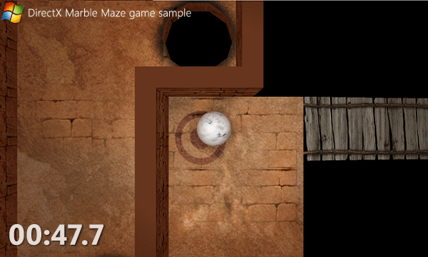

# Разработка Marble Maze— игры UWP— на C++ и DirectX

\[ Обновлено для приложений UWP в Windows10. Статьи о Windows 8.x см. в [архиве](http://go.microsoft.com/fwlink/p/?linkid=619132) \]

В этом разделе документации описывается, как использовать DirectX и Visual C++ для создания трехмерной игры универсальной платформы Windows (UWP). В этом документе показано, как создать трехмерную игру под названием Marble Maze, которая поддерживает новые форм-факторы, в частности планшеты, а также работает на традиционных настольных компьютерах и ноутбуках.

> **Примечание.** Скачать исходный код игры Marble Maze можно на [странице игры Marble Maze для DirectX на сайте MSDN](http://go.microsoft.com/fwlink/?LinkId=624011).

 

> **Важно!** Marble Maze иллюстрирует шаблоны проектирования, которые мы считаем оптимальными для создания игр UWP. Многие особенности этой реализации вы сможете приспособить к собственной практике и требованиям той игры, которую вы разрабатываете. Вы можете без колебаний пользоваться другими методиками или библиотеками, если они лучше отвечают вашим потребностям. (Но обязательно позаботьтесь о том, чтобы ваш код успешно проходил тестирование с использованием комплекта сертификации приложений для Windows.) Когда мы полагаем, что реализация тех или иных аспектов в игре Marble Maze имеет первостепенное значение для успешной разработки игр, мы подчеркиваем это в руководстве.

 

## Знакомство с игрой Marble Maze

Мы выбрали игру Marble Maze, потому что она относительно простая, но при этом демонстрирует весь диапазон возможностей, присутствующих в большинстве игр. Она показывает работу с графикой, обработку ввода и воспроизведение звука. Кроме того, она демонстрирует игровую механику, в частности правила и цели.

Marble Maze напоминает настольную игру-лабиринт, которая обычно состоит из коробки с отверстиями и стального или стеклянного шарика. Цель игры Marble Maze та же, что и в настольной версии: наклоняя лабиринт, нужно провести шарик от его начала к концу за кратчайшее время, не давая ему упасть в отверстия. В Marble Maze также вводится понятие контрольных точек. Если шарик падает в отверстие, игра перезапускается из последней контрольной точки, над которой прошел шарик.

Marble Maze предусматривает несколько способов взаимодействия пользователя с игровой доской. Если у вас имеется устройство с сенсорным экраном или акселерометром, вы можете пользоваться ими для перемещения игровой доски. Можно управлять игрой при помощи контроллера Xbox 360 или мыши.

## Необходимые условия

-   Windows 10
-   Microsoft Visual Studio 2015
-   Умение программировать на C++
-   Знание основ и терминологии DirectX
-   Знание основ COM

## Для кого предназначено это руководство?

Если вы интересуетесь созданием трехмерных игр или других приложений для Windows10 с интенсивным использованием графики, этот документ для вас. Надеемся, что вы воспользуетесь изложенными здесь принципами и методиками для создания собственной игры UWP. Опыт программирования на C++ с использованием DirectX или сильный интерес к этой тематике поможет вам понять большую часть этого руководства. Даже если у вас нет опыта работы с DirectX, вам все равно пригодится это руководство, если вы уже имели дело с подобными языками программирования трехмерной графики.

В документе [Пошаговое руководство: создание простой игры UWP с использованием DirectX](tutorial--create-your-first-metro-style-directx-game.md) описан другой пример, в котором реализуется простая трехмерная игра-стрелялка с использованием DirectX и C++.

## Что входит в руководство?

Это руководство научит вас следующим приемам.

-   Использование API среды выполнения Windows и DirectX для создания игры UWP.
-   Использовать [Direct3D](https://msdn.microsoft.com/library/windows/desktop/ff476080) и [Direct2D](https://msdn.microsoft.com/library/windows/desktop/dd370990) для работы с визуальным содержимым, таким как модели, текстуры, вершинные и пиксельные шейдеры, а также двумерные наложения.
-   Встраивать механизмы ввода, такие как сенсорный ввод, акселерометр и контроллер Xbox 360.
-   Использовать [XAudio2](https://msdn.microsoft.com/library/windows/desktop/hh405049) для встраивания музыки и звуковых эффектов.

## Что не входит в руководство?

В этом руководстве не рассматриваются перечисленные ниже аспекты разработки игр, которым посвящены дополнительные ресурсы.

-   Принципы проектирования трехмерных игр.
-   Основы программирования на C++ и DirectX.
-   Создание ресурсов, таких как текстуры, модели и звуки.
-   Диагностика и устранение проблем, связанных с логикой работы и производительностью игры.
-   Подготовка игры для использования в других регионах мира.
-   Сертификация и публикация игры в Магазине Windows.

В игре Marble Maze используется библиотека [DirectXMath](https://msdn.microsoft.com/library/windows/desktop/hh437833) для работы с трехмерной геометрией и выполнения физических вычислений, например расчета столкновений. DirectXMath не рассматривается подробно в этом разделе. Дополнительные сведения о DirectXMath см. в [Руководстве по программированию для DirectXMath](https://msdn.microsoft.com/library/windows/desktop/hh437833). О том, как DirectXMath применяется в игре Marble Maze, вы можете узнать из исходного кода.

Хотя в игре Marble Maze есть множество компонентов, которые можно использовать повторно, она не является полноценной платформой для разработки игр. Когда мы полагаем, что тот или иной компонент Marble Maze пригоден для использования в ваших собственных играх, мы подчеркиваем это в руководстве.

## Дальнейшие действия

Мы рекомендуем начать с основных положений примера Marble Maze, чтобы изучить структуру игры, а также некоторые соглашения о приемах программирования и стиле, которые соблюдаются в коде. Документы, перечисленные в этом разделе, сведены в таблицу ниже, чтобы вам было удобнее к ним обращаться.

## Связанные разделы

| Заголовок                                                                                                                    | Описание                                                                                                                                                                                                                                        |
|--------------------------------------------------------------------------------------------------------------------------|----------------------------------------------------------------------------------------------------------------------------------------------------------------------------------------------------------------------------------------------------|
| [Основные характеристики образца кода Marble Maze](marble-maze-sample-fundamentals.md)                                                   | Обзор структуры игры, а также некоторых соглашений о приемах программирования и стиле, которые соблюдаются в коде.                                                                                                                                 |
| [Структура приложения Marble Maze](marble-maze-application-structure.md)                                               | Здесь описывается, как структурировано приложение Marble Maze и чем приложение UWP на DirectX отличается по структуре от классического приложения.                                                                                    |
| [Добавление визуального содержимого в образец Marble Maze](adding-visual-content-to-the-marble-maze-sample.md)                   | Здесь излагаются некоторые важные рекомендации, которые следует иметь в виду при работе с Direct3D и Direct2D, и описывается, как с использованием этих рекомендаций реализовано визуальное содержимое в Marble Maze.                                                                           |
| [Добавление ввода и интерактивной функциональности в образец Marble Maze](adding-input-and-interactivity-to-the-marble-maze-sample.md) | Здесь описывается, как в образце Marble Maze организована работа с акселерометром, устройствами сенсорного ввода и контроллером Xbox360, чтобы пользователи могли перемещаться по меню и взаимодействовать с игровой доской. Излагаются также некоторые важные рекомендации, которые следует иметь в виду при работе с вводом. |
| [Добавление звука в образец Marble Maze](adding-audio-to-the-marble-maze-sample.md)                                     | Здесь описывается, как в образце Marble Maze организована работа со звуком для воспроизведения музыки и создания звуковых эффектов.                                                                                                                                                  |

 

 

 

