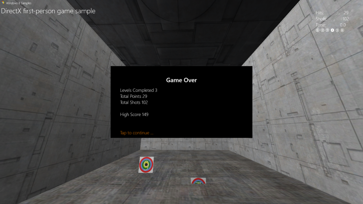

# <a name="add-a-user-interface"></a>Добавление пользовательского интерфейса


\[ Обновлено для приложений UWP в Windows10. Статьи о Windows 8.x см. в [архиве](http://go.microsoft.com/fwlink/p/?linkid=619132) \]

Мы увидели, как в примере игры реализуется главный игровой объект и основная инфраструктура отрисовки. Теперь давайте рассмотрим, как игрок получает сведения о текущем состоянии игры. Далее вы узнаете, как добавить простые пункты меню и компоненты, отображаемые на экране поверх выхода конвейера трехмерной графики.

## <a name="objective"></a>Цель


-   Добавить основные графические элементы и функции пользовательского интерфейса в игру UWP на базе DirectX.

## <a name="the-user-interface-overlay"></a>Перекрытие пользовательского интерфейса


Для отображения текста и элементов пользовательского интерфейса в игре DirectX существует множество способов. Здесь мы подробно рассмотрим один: [Direct2D](https://msdn.microsoft.com/library/windows/apps/dd370990.aspx) (с [DirectWrite](https://msdn.microsoft.com/library/windows/desktop/dd368038) для текстовых элементов).

Сначала нужно понять, что нельзя сделать с помощью Direct2D. В отличие от HTML и XAML эта библиотека не предназначена для разработки пользовательского интерфейса и макетов. Она не содержит компонентов пользовательского интерфейса (списков, кнопок и т.д.) и компонентов макета (блоков, таблиц, сеток и т.п.)

Direct2D— это набор API для рисования двухмерных пиксельных примитивов и эффектов. Начиная работу с Direct2D, придерживайтесь простых решений. Сложные макеты и функции интерфейса требуют времени на разработку и заблаговременного планирования. Если в игре нужен сложный пользовательский интерфейс (такой, как в стратегиях и симуляторах), рекомендуется разрабатывать его с помощью XAML.

(Сведения о разработке пользовательского интерфейса с помощью XAML в игре DirectX UWP см. в разделе [Образец расширения игры](tutorial-resources.md).)

В этом примере игры используются два основных компонента пользовательского интерфейса: экранное отображение результатов и игровых элементов управления и перекрытие для отображения текста и параметров состояния игры (например, сведений о паузе и параметров начала уровня).

### <a name="using-direct2d-for-a-heads-up-display"></a>Использование Direct2D для отображения экранных элементов

Это отображение экранных элементов для примера игры без визуальных элементов. Оно не загромождает экран, позволяя игроку сосредоточиться на перемещении по трехмерному миру и стрельбе по мишеням. Хороший интерфейс и экранные элементы никогда не должны мешать игроку своевременно реагировать на игровые события.


Видно, что перекрытие состоит из простых примитивов: двух пересекающихся линий, представляющих прицел, и двух прямоугольников для [управления перемещением и обзором](tutorial--adding-controls.md). В правом верхнем углу текст DirectWrite сообщает игроку текущее число выстрелов и попаданий, оставшееся время на уровень и номер текущего уровня. Состояние отображения экранных элементов перекрытия задается методом **Render** класса **GameHud**. Код выглядит так:

```cpp
void GameHud::Render(
    _In_ Simple3DGame^ game,
    _In_ ID2D1DeviceContext* d2dContext,
    _In_ Windows::Foundation::Rect windowBounds
    )
{
    if (m_showTitle)
    {
        d2dContext->DrawBitmap(
            m_logoBitmap.Get(),
            D2D1::RectF(
                GameConstants::Margin,
                GameConstants::Margin,
                m_logoSize.width + GameConstants::Margin,
                m_logoSize.height + GameConstants::Margin
                )
            );
        d2dContext->DrawTextLayout(
            Point2F(m_logoSize.width + 2.0f * GameConstants::Margin, GameConstants::Margin),
            m_titleHeaderLayout.Get(),
            m_textBrush.Get()
            );
        d2dContext->DrawTextLayout(
            Point2F(GameConstants::Margin, m_titleBodyVerticalOffset),
            m_titleBodyLayout.Get(),
            m_textBrush.Get()
            );
    }

    if (game != nullptr)
    {
        // This section is only used after the game state has been initialized.
        static const int bufferLength = 256;
        static char16 wsbuffer[bufferLength];
        int length = swprintf_s(
            wsbuffer,
            bufferLength,
            L"Hits:\t%10d\nShots:\t%10d\nTime:\t%8.1f",
            game->TotalHits(),
            game->TotalShots(),
            game->TimeRemaining()
            );

        d2dContext->DrawText(
            wsbuffer,
            length,
            m_textFormatBody.Get(),
            D2D1::RectF(
                windowBounds.Width - GameConstants::HudRightOffset,
                GameConstants::HudTopOffset,
                windowBounds.Width,
                GameConstants::HudTopOffset + (GameConstants::HudBodyPointSize + GameConstants::Margin) * 3
                ),
            m_textBrush.Get()
            );

        // Using the unicode characters starting at 0x2780 ( ➀ ) for the consecutive levels of the game.
        // For completed levels, start with 0x278A ( ➊ ) (This is 0x2780 + 10).
        uint32 levelCharacter[6];
        for (uint32 i = 0; i < 6; i++)
        {
            levelCharacter[i] = 0x2780 + i + ((static_cast<uint32>(game->LevelCompleted()) == i) ? 10 : 0);
        }
        length = swprintf_s(
            wsbuffer,
            bufferLength,
            L"%lc %lc %lc %lc %lc %lc",
            levelCharacter[0],
            levelCharacter[1],
            levelCharacter[2],
            levelCharacter[3],
            levelCharacter[4],
            levelCharacter[5]
            );
        d2dContext->DrawText(
            wsbuffer,
            length,
            m_textFormatBodySymbol.Get(),
            D2D1::RectF(
                windowBounds.Width - GameConstants::HudRightOffset,
                GameConstants::HudTopOffset + (GameConstants::HudBodyPointSize + GameConstants::Margin) * 3 + GameConstants::Margin,
                windowBounds.Width,
                GameConstants::HudTopOffset + (GameConstants::HudBodyPointSize+ GameConstants::Margin) * 4
                ),
            m_textBrush.Get()
            );

        if (game->IsActivePlay())
        {
            // Draw a rectangle for the touch input for the move control.
            d2dContext->DrawRectangle(
                D2D1::RectF(
                    0.0f,
                    windowBounds.Height - GameConstants::TouchRectangleSize,
                    GameConstants::TouchRectangleSize,
                    windowBounds.Height
                    ),
                m_textBrush.Get()
                );
            // Draw a rectangle for the touch input for the fire control.
            d2dContext->DrawRectangle(
                D2D1::RectF(
                    windowBounds.Width - GameConstants::TouchRectangleSize,
                    windowBounds.Height - GameConstants::TouchRectangleSize,
                    windowBounds.Width,
                    windowBounds.Height
                    ),
                m_textBrush.Get()
                );

            // Draw the cross hairs.
            d2dContext->DrawLine(
                D2D1::Point2F(windowBounds.Width / 2.0f - GameConstants::CrossHairHalfSize, windowBounds.Height / 2.0f),
                D2D1::Point2F(windowBounds.Width / 2.0f + GameConstants::CrossHairHalfSize, windowBounds.Height / 2.0f),
                m_textBrush.Get(),
                3.0f
                );
            d2dContext->DrawLine(
                D2D1::Point2F(windowBounds.Width / 2.0f, windowBounds.Height / 2.0f - GameConstants::CrossHairHalfSize),
                D2D1::Point2F(windowBounds.Width / 2.0f, windowBounds.Height / 2.0f + GameConstants::CrossHairHalfSize),
                m_textBrush.Get(),
                3.0f
                );
        }
    }
}
```

Здесь однобуферная прорисовка Direct2D, заданная для перекрытия, обновляется в соответствии с меняющимся числом попаданий, оставшимся временем и номером уровня. Прямоугольники рисуются методом [**DrawRect**](https://msdn.microsoft.com/library/windows/desktop/dd371902), а прицел — двумя вызовами [**DrawLine**](https://msdn.microsoft.com/library/windows/desktop/dd371895).

> **Примечание.**   Возможно, вы заметили, что в вызове **GameHud::Render** используется параметр [**Windows::Foundation::Rect**](https://msdn.microsoft.com/library/windows/apps/br225994), который содержит размер прямоугольника главного окна. Этот пример показывает важнейшую часть программирования пользовательского интерфейса: получение размера окна в единицах DIP (аппаратно-независимые пиксели), где 1DIP равен 1/96 дюйма. При рисовании Direct2D масштабирует единицы в реальные пиксели, учитывая параметр Windows DPI (число точек на дюйм). Аналогично при рисовании текста в DirectWrite размер шрифта задается не в точках, а в DIP. Значения DIP выражаются числами с плавающей запятой.

 

### <a name="displaying-game-state-information-with-an-overlay"></a>Отображение сведений о состоянии игры с использованием перекрытия

Помимо отображения экранных элементов, в примере игры есть перекрытие, представляющее пять состояний игры, каждое из которых содержит большой черный прямоугольник с текстом для игрока. (Заметьте, что в этих состояниях не рисуются прямоугольники для управления движением и обзором, поскольку они не активны.) Вот эти состояния:

-   Перекрытие в начале игры. Отображается, когда игрок начинает игру. Содержит лучший результат по сеансам игры.

    

-   Пауза.

    

-   Начало уровня. Отображается, когда игрок начинает новый уровень.

    

-   Конец игры. Отображается, когда игрок не проходит уровень.

    

-   Игровая статистика. Отображается, когда игрок выигрывает. Здесь показано окончательное число очков, набранное игроком.

    

Посмотрим, как инициализируется и рисуется перекрытие в этих пяти состояниях.

### <a name="initializing-and-drawing-the-overlay"></a>Инициализация и рисование перекрытия

Во всех пяти состояниях есть общие моменты. Во-первых, фоном служит черный прямоугольник в центре экрана. Во-вторых, отображается текст заголовка или основной текст. В-третьих, текст выводится шрифтом Segoe UI поверх фонового прямоугольника. В результате необходимые ресурсы и методы реализации состояний оказываются весьма схожи.

В примере игры используются четыре метода (**GameInfoOverlay::Initialize**, **GameInfoOverlay::SetDpi**, **GameInfoOverlay::RecreateDirectXResources** и **GameInfoOverlay::RecreateDpiDependentResources**) для инициализации, настройки параметра DPI, повторного создания ресурсов DirectWrite (текстовых элементов) и построения перекрытия для отображения соответственно. Вот код этих четырех методов:

```cpp
void GameInfoOverlay::Initialize(
    _In_ ID2D1Device*         d2dDevice,
    _In_ ID2D1DeviceContext*  d2dContext,
    _In_ IDWriteFactory*      dwriteFactory,
    _In_ float                dpi)
{
    m_initialized = true;

    m_dwriteFactory = dwriteFactory;
    m_dpi = dpi;
    m_d2dDevice = d2dDevice;
    m_d2dContext = d2dContext;

    ComPtr<ID2D1Factory> factory;
    d2dDevice->GetFactory(&factory);

    DX::ThrowIfFailed(
        factory.As(&m_d2dFactory)
        );

    RecreateDirectXResources();
}
```

```cpp
void GameInfoOverlay::SetDpi(float dpi)
{
    if (m_initialized)
    {
        if (dpi != m_dpi)
        {
            m_dpi = dpi;
            RecreateDpiDependentResources();
        }
    }
}
```

```cpp
void GameInfoOverlay::RecreateDirectXResources()
{
    if (!m_initialized)
    {
        return;
    }

    // Create D2D Resources.
    DX::ThrowIfFailed(
        m_dwriteFactory->CreateTextFormat(
            L"Segoe UI",
            nullptr,
            DWRITE_FONT_WEIGHT_MEDIUM,
            DWRITE_FONT_STYLE_NORMAL,
            DWRITE_FONT_STRETCH_NORMAL,
            32,         // font size
            L"en-us",   // locale
            &m_textFormatTitle
            )
        );

    DX::ThrowIfFailed(
        m_dwriteFactory->CreateTextFormat(
            L"Segoe UI",
            nullptr,
            DWRITE_FONT_WEIGHT_LIGHT,
            DWRITE_FONT_STYLE_NORMAL,
            DWRITE_FONT_STRETCH_NORMAL,
            24,         // font size
            L"en-us",   // locale
            &m_textFormatBody
            )
        );

    DX::ThrowIfFailed(
        m_textFormatTitle->SetTextAlignment(DWRITE_TEXT_ALIGNMENT_CENTER)
        );
    DX::ThrowIfFailed(
        m_textFormatTitle->SetParagraphAlignment(DWRITE_PARAGRAPH_ALIGNMENT_NEAR)
        );
    DX::ThrowIfFailed(
        m_textFormatBody->SetTextAlignment(DWRITE_TEXT_ALIGNMENT_LEADING)
        );
    DX::ThrowIfFailed(
        m_textFormatBody->SetParagraphAlignment(DWRITE_PARAGRAPH_ALIGNMENT_NEAR)
        );

    DX::ThrowIfFailed(
        m_d2dContext->CreateSolidColorBrush(
            D2D1::ColorF(D2D1::ColorF::White),
            &m_textBrush
            )
        );
    DX::ThrowIfFailed(
        m_d2dContext->CreateSolidColorBrush(
            D2D1::ColorF(D2D1::ColorF::Black),
            &m_backgroundBrush
            )
        );
     DX::ThrowIfFailed(
        m_d2dContext->CreateSolidColorBrush(
            D2D1::ColorF(0xdb7100, 1.0f),
            &m_actionBrush
            )
        );

     RecreateDpiDependentResources();
}
```

```cpp
void GameInfoOverlay::RecreateDpiDependentResources()
{
    m_levelBitmap = nullptr;

    // Create a D2D bitmap to be used for Game Info Overlay when waiting to
    // start a level or to display game statistics.
    D2D1_BITMAP_PROPERTIES1 properties;
    properties.pixelFormat.format = DXGI_FORMAT_B8G8R8A8_UNORM;
    properties.pixelFormat.alphaMode = D2D1_ALPHA_MODE_PREMULTIPLIED;
    properties.dpiX = m_dpi;
    properties.dpiY = m_dpi;
    properties.bitmapOptions = D2D1_BITMAP_OPTIONS_TARGET;
    properties.colorContext = nullptr;
    DX::ThrowIfFailed(
        m_d2dContext->CreateBitmap(
            D2D1::SizeU(
                static_cast<UINT32>(GameInfoOverlayConstant::Width * m_dpi / 96.0f),
                static_cast<UINT32>(GameInfoOverlayConstant::Height * m_dpi / 96.0f)
                ),
            nullptr,
            0,
            &properties,
            &m_levelBitmap
            )
        );
    m_d2dContext->SetTarget(m_levelBitmap.Get());
    m_d2dContext->BeginDraw();
    m_d2dContext->SetTransform(D2D1::Matrix3x2F::Identity());
    m_d2dContext->Clear(D2D1::ColorF(D2D1::ColorF::Black));
    HRESULT hr = m_d2dContext->EndDraw();
    if (hr != D2DERR_RECREATE_TARGET)
    {
        // The D2DERR_RECREATE_TARGET indicates there has been a problem with the underlying
        // D3D device.  All subsequent rendering will be ignored until the device is recreated.
        // This error will be propagated and the appropriate D3D error will be returned from the
        // swapchain->Present(...) call.   At that point, the sample will recreate the device
        // and all associated resources.  As a result, the D2DERR_RECREATE_TARGET doesn't
        // need to be handled here.
        DX::ThrowIfFailed(hr);
    }
}

```

Метод **Initialize** получает фабрику из объекта [**ID2D1Device**](https://msdn.microsoft.com/library/windows/desktop/hh404478) и создает контекст [**ID2D1DeviceContext**](https://msdn.microsoft.com/library/windows/desktop/hh404479), в котором может рисовать сам объект перекрытия, а в поле **m\_dWriteFactory** задается переданная ссылка [**IDWriteFactory**](https://msdn.microsoft.com/library/windows/desktop/dd368183). Также задается значение DPI для контекста. Затем вызывается метод **RecreateDeviceResources** для сборки и рисования перекрытия.

Метод **RecreateDeviceResources** использует объект фабрики DirectWrite для создания средств форматирования (кистей) для строк в заголовке и основном тексте, которые будут отображаться в перекрытии. Он создает белую кисть для написания текста, черную кисть для рисования фона и оранжевую кисть для уведомления о действиях. Затем вызовом метода **RecreateDpiDependentResources** подготавливается растровое изображение, на котором будет рисоваться текст, при помощи метода [**ID2D1DeviceContext::CreateBitmap**](https://msdn.microsoft.com/library/windows/desktop/hh404480). Наконец, метод **RecreateDpiDependentResources** задает однобуферную прорисовку в контексте устройства Direct2D для растрового изображения и устанавливает для каждого его пикселя черный цвет.

Теперь нужен только текст.

### <a name="representing-game-state-in-the-overlay"></a>Представление состояния игры в перекрытии

Каждому из пяти состояний перекрытия в игре соответствует метод в объекте **GameInfoOverlay**. Эти методы рисуют вариант перекрытия для явной передачи игроку информации об игре. Передаваемая информация представляется двумя строками: заголовок и основной текст. В данном примере ресурсы и макет для такой информации уже настроены в методе **RecreateDeviceResources**, поэтому нужно только задать строки, соответствующие каждому состоянию перекрытия.

Теперь в определении класса **GameInfoOverlay** объявляются три прямоугольные области, соответствующие определенным участкам перекрытия.

```cpp
static const D2D1_RECT_F titleRectangle = D2D1::RectF(50.0f, 50.0f, GameInfoOverlayConstant::Width - 50.0f, 100.0f);
static const D2D1_RECT_F bodyRectangle = D2D1::RectF(50.0f, 110.0f, GameInfoOverlayConstant::Width - 50.0f, GameInfoOverlayConstant::Height - 50.0f);
static const D2D1_RECT_F actionRectangle = D2D1::RectF(50.0f, GameInfoOverlayConstant::Height - 45.0f, GameInfoOverlayConstant::Width - 50.0f, GameInfoOverlayConstant::Height - 5.0f);
```

Каждая из этих областей имеет специальное предназначение:

-   **titleRectangle** — область, в которой выписывается текст заголовка.
-   **bodyRectangle** — область, в которой выписывается основной текст.
-   **actionRectangle** — область, в которой выписывается текст, информирующий игрока о необходимости конкретного действия. (Располагается в левой нижней части растрового изображения перекрытия.)

Рассмотрим один из методов состояния — **GameInfoOverlay::SetGameStats** — с учетом расположения этих областей и узнаем, как рисуется перекрытие.

```cpp
void GameInfoOverlay::SetGameStats(int maxLevel, int hitCount, int shotCount)
{
    int length;
    Platform::String^ string;

    m_d2dContext->SetTarget(m_levelBitmap.Get());
    m_d2dContext->BeginDraw();
    m_d2dContext->SetTransform(D2D1::Matrix3x2F::Identity());
    m_d2dContext->FillRectangle(&titleRectangle, m_backgroundBrush.Get());
    m_d2dContext->FillRectangle(&bodyRectangle, m_backgroundBrush.Get());
    string = "High Score";

    m_d2dContext->DrawText(
        string->Data(),
        string->Length(),
        m_textFormatTitle.Get(),
        titleRectangle,
        m_textBrush.Get()
        );
    length = swprintf_s(
        wsbuffer,
        bufferLength,
        L"Levels Completed %d\nTotal Points %d\nTotal Shots %d",
        maxLevel,
        hitCount,
        shotCount
        );
    string = ref new Platform::String(wsbuffer, length);
    m_d2dContext->DrawText(
        string->Data(),
        string->Length(),
        m_textFormatBody.Get(),
        bodyRectangle,
        m_textBrush.Get()
        );
    HRESULT hr = m_d2dContext->EndDraw();
    if (hr != D2DERR_RECREATE_TARGET)
    {
        // The D2DERR_RECREATE_TARGET indicates there has been a problem with the underlying
        // D3D device.  All subsequent rendering will be ignored until the device is recreated.
        // This error will be propagated and the appropriate D3D error will be returned from the
        // swapchain->Present(...) call.   At that point, the sample will recreate the device
        // and all associated resources.  As a result, the D2DERR_RECREATE_TARGET doesn't
        // need to be handled here.
        DX::ThrowIfFailed(hr);
    }
}
```

Используя контекст устройства Direct2D, который объект **GameInfoOverlay** инициализировал и настроил методами **Initialize** и **RecreateDirectXResources**, этот метод заполняет прямоугольники заголовка и основного текста черным цветом с помощью кисти фона. Белой кистью в прямоугольнике заголовка рисуется текст "High Score" (Лучший результат), а в прямоугольнике основного текста — строка с обновленным состоянием игры.

Прямоугольник действий обновляется последующим вызовом метода **GameInfoOverlay::SetAction** из метода в объекте **DirectXApp**, который предоставляет данные о состоянии игры, необходимые **SetAction** для определения выводимого игроку сообщения, например "Tap to continue" (Коснитесь для продолжения).

Перекрытие для каждого состояния выбирается в методе **SetGameInfoOverlay** объекта **DirectXApp** следующим образом:

```cpp
void DirectXApp::SetGameInfoOverlay(GameInfoOverlayState state)
{
    m_gameInfoOverlayState = state;
    switch (state)
    {
    case GameInfoOverlayState::Loading:
        m_renderer->InfoOverlay()->SetGameLoading(m_loadingCount);
        break;

    case GameInfoOverlayState::GameStats:
        m_renderer->InfoOverlay()->SetGameStats(
            m_game->HighScore().levelCompleted + 1,
            m_game->HighScore().totalHits,
            m_game->HighScore().totalShots
            );
        break;

    case GameInfoOverlayState::LevelStart:
        m_renderer->InfoOverlay()->SetLevelStart(
            m_game->LevelCompleted() + 1,
            m_game->CurrentLevel()->Objective(),
            m_game->CurrentLevel()->TimeLimit(),
            m_game->BonusTime()
            );
        break;

    case GameInfoOverlayState::GameOverCompleted:
        m_renderer->InfoOverlay()->SetGameOver(
            true,
            m_game->LevelCompleted() + 1,
            m_game->TotalHits(),
            m_game->TotalShots(),
            m_game->HighScore().totalHits
            );
        break;

    case GameInfoOverlayState::GameOverExpired:
        m_renderer->InfoOverlay()->SetGameOver(
            false,
            m_game->LevelCompleted(),
            m_game->TotalHits(),
            m_game->TotalShots(),
            m_game->HighScore().totalHits
            );
        break;

    case GameInfoOverlayState::Pause:
        m_renderer->InfoOverlay()->SetPause();
        break;
    }
}
```

Теперь можно передавать игроку текст в зависимости от игрового состояния.

### <a name="next-steps"></a>Следующие шаги

Следующий раздел называется [Добавление элементов управления](tutorial--adding-controls.md). В нем мы рассмотрим, как игрок взаимодействует с игрой и как вводимые команды меняют состояние игры.

### <a name="complete-sample-code-for-this-section"></a>Полный пример кода для этого раздела

GameHud.h

```cpp
//// THIS CODE AND INFORMATION IS PROVIDED "AS IS" WITHOUT WARRANTY OF
//// ANY KIND, EITHER EXPRESSED OR IMPLIED, INCLUDING BUT NOT LIMITED TO
//// THE IMPLIED WARRANTIES OF MERCHANTABILITY AND/OR FITNESS FOR A
//// PARTICULAR PURPOSE.
////
//// Copyright (c) Microsoft Corporation. All rights reserved

#pragma once

#include "Simple3DGame.h"
#include "DirectXSample.h"

ref class Simple3DGame;

ref class GameHud
{
internal:
    GameHud(
        _In_ Platform::String^ titleHeader,
        _In_ Platform::String^ titleBody
        );

    void CreateDeviceIndependentResources(
        _In_ IDWriteFactory* dwriteFactory,
        _In_ IWICImagingFactory* wicFactory
        );

    void CreateDeviceResources(_In_ ID2D1DeviceContext* d2dContext);
    void UpdateForWindowSizeChange(_In_ Windows::Foundation::Rect windowBounds);
    void Render(
        _In_ Simple3DGame^ game,
        _In_ ID2D1DeviceContext* d2dContext,
        _In_ Windows::Foundation::Rect windowBounds
        );

private:
    Microsoft::WRL::ComPtr<IDWriteFactory>              m_dwriteFactory;
    Microsoft::WRL::ComPtr<IWICImagingFactory>          m_wicFactory;

    Microsoft::WRL::ComPtr<ID2D1SolidColorBrush>        m_textBrush;
    Microsoft::WRL::ComPtr<IDWriteTextFormat>           m_textFormatBody;
    Microsoft::WRL::ComPtr<IDWriteTextFormat>           m_textFormatBodySymbol;

    Microsoft::WRL::ComPtr<IDWriteTextFormat>           m_textFormatTitleHeader;
    Microsoft::WRL::ComPtr<IDWriteTextFormat>           m_textFormatTitleBody;
    Microsoft::WRL::ComPtr<ID2D1Bitmap>                 m_logoBitmap;
    Microsoft::WRL::ComPtr<IDWriteTextLayout>           m_titleHeaderLayout;
    Microsoft::WRL::ComPtr<IDWriteTextLayout>           m_titleBodyLayout;

    bool                                                m_showTitle;
    Platform::String^                                   m_titleHeader;
    Platform::String^                                   m_titleBody;

    float                                               m_titleBodyVerticalOffset;
    D2D1_SIZE_F                                         m_logoSize;
    D2D1_SIZE_F                                         m_maxTitleSize;
};
```

GameHud.cpp

```cpp
//// THIS CODE AND INFORMATION IS PROVIDED "AS IS" WITHOUT WARRANTY OF
//// ANY KIND, EITHER EXPRESSED OR IMPLIED, INCLUDING BUT NOT LIMITED TO
//// THE IMPLIED WARRANTIES OF MERCHANTABILITY AND/OR FITNESS FOR A
//// PARTICULAR PURPOSE.
////
//// Copyright (c) Microsoft Corporation. All rights reserved

#include "pch.h"
#include "GameHud.h"
#include "GameConstants.h"

using namespace Microsoft::WRL;
using namespace Windows::UI::Core;
using namespace Windows::ApplicationModel;
using namespace Windows::Foundation;
using namespace Windows::Storage;
using namespace Windows::UI::ViewManagement;
using namespace Windows::Graphics::Display;
using namespace D2D1;

//----------------------------------------------------------------------

GameHud::GameHud(
    _In_ Platform::String^ titleHeader,
    _In_ Platform::String^ titleBody
    )
{
    m_titleHeader = titleHeader;
    m_titleBody = titleBody;

    m_showTitle = true;
    m_titleBodyVerticalOffset = GameConstants::Margin;
    m_logoSize = D2D1::SizeF(0.0f, 0.0f);
}

//----------------------------------------------------------------------

void GameHud::CreateDeviceIndependentResources(
    _In_ IDWriteFactory* dwriteFactory,
    _In_ IWICImagingFactory* wicFactory
    )
{
    m_dwriteFactory = dwriteFactory;
    m_wicFactory = wicFactory;

    DX::ThrowIfFailed(
        m_dwriteFactory->CreateTextFormat(
            L"Segoe UI",
            nullptr,
            DWRITE_FONT_WEIGHT_LIGHT,
            DWRITE_FONT_STYLE_NORMAL,
            DWRITE_FONT_STRETCH_NORMAL,
            GameConstants::HudBodyPointSize,
            L"en-us",
            &m_textFormatBody
            )
        );
    DX::ThrowIfFailed(
        m_dwriteFactory->CreateTextFormat(
            L"Segoe UI Symbol",
            nullptr,
            DWRITE_FONT_WEIGHT_LIGHT,
            DWRITE_FONT_STYLE_NORMAL,
            DWRITE_FONT_STRETCH_NORMAL,
            GameConstants::HudBodyPointSize,
            L"en-us",
            &m_textFormatBodySymbol
            )
        );
    DX::ThrowIfFailed(
        m_dwriteFactory->CreateTextFormat(
            L"Segoe UI Light",
            nullptr,
            DWRITE_FONT_WEIGHT_LIGHT,
            DWRITE_FONT_STYLE_NORMAL,
            DWRITE_FONT_STRETCH_NORMAL,
            GameConstants::HudTitleHeaderPointSize,
            L"en-us",
            &m_textFormatTitleHeader
            )
        );
    DX::ThrowIfFailed(
        m_dwriteFactory->CreateTextFormat(
            L"Segoe UI Light",
            nullptr,
            DWRITE_FONT_WEIGHT_LIGHT,
            DWRITE_FONT_STYLE_NORMAL,
            DWRITE_FONT_STRETCH_NORMAL,
            GameConstants::HudTitleBodyPointSize,
            L"en-us",
            &m_textFormatTitleBody
            )
        );

    DX::ThrowIfFailed(m_textFormatBody->SetTextAlignment(DWRITE_TEXT_ALIGNMENT_LEADING));
    DX::ThrowIfFailed(m_textFormatBody->SetParagraphAlignment(DWRITE_PARAGRAPH_ALIGNMENT_NEAR));
    DX::ThrowIfFailed(m_textFormatBodySymbol->SetTextAlignment(DWRITE_TEXT_ALIGNMENT_LEADING));
    DX::ThrowIfFailed(m_textFormatBodySymbol->SetParagraphAlignment(DWRITE_PARAGRAPH_ALIGNMENT_NEAR));
    DX::ThrowIfFailed(m_textFormatTitleHeader->SetTextAlignment(DWRITE_TEXT_ALIGNMENT_LEADING));
    DX::ThrowIfFailed(m_textFormatTitleHeader->SetParagraphAlignment(DWRITE_PARAGRAPH_ALIGNMENT_NEAR));
    DX::ThrowIfFailed(m_textFormatTitleBody->SetTextAlignment(DWRITE_TEXT_ALIGNMENT_LEADING));
    DX::ThrowIfFailed(m_textFormatTitleBody->SetParagraphAlignment(DWRITE_PARAGRAPH_ALIGNMENT_NEAR));
}

//----------------------------------------------------------------------

void GameHud::CreateDeviceResources(_In_ ID2D1DeviceContext* d2dContext)
{
    auto location = Package::Current->InstalledLocation;
    Platform::String^ path = Platform::String::Concat(location->Path, "\\");
    path = Platform::String::Concat(path, "windows-sdk.png");

    ComPtr<IWICBitmapDecoder> wicBitmapDecoder;
    DX::ThrowIfFailed(
        m_wicFactory->CreateDecoderFromFilename(
            path->Data(),
            nullptr,
            GENERIC_READ,
            WICDecodeMetadataCacheOnDemand,
            &wicBitmapDecoder
            )
        );

    ComPtr<IWICBitmapFrameDecode> wicBitmapFrame;
    DX::ThrowIfFailed(
        wicBitmapDecoder->GetFrame(0, &wicBitmapFrame)
        );

    ComPtr<IWICFormatConverter> wicFormatConverter;
    DX::ThrowIfFailed(
        m_wicFactory->CreateFormatConverter(&wicFormatConverter)
        );

    DX::ThrowIfFailed(
        wicFormatConverter->Initialize(
            wicBitmapFrame.Get(),
            GUID_WICPixelFormat32bppPBGRA,
            WICBitmapDitherTypeNone,
            nullptr,
            0.0,
            WICBitmapPaletteTypeCustom  // The BGRA format has no palette, so this value is ignored.
            )
        );

    double dpiX = 96.0f;
    double dpiY = 96.0f;
    DX::ThrowIfFailed(
        wicFormatConverter->GetResolution(&dpiX, &dpiY)
        );

    // Create D2D Resources.
    DX::ThrowIfFailed(
        d2dContext->CreateBitmapFromWicBitmap(
            wicFormatConverter.Get(),
            BitmapProperties(
                PixelFormat(DXGI_FORMAT_B8G8R8A8_UNORM, D2D1_ALPHA_MODE_PREMULTIPLIED),
                static_cast<float>(dpiX),
                static_cast<float>(dpiY)
                ),
            &m_logoBitmap
            )
        );

    m_logoSize = m_logoBitmap->GetSize();

    DX::ThrowIfFailed(
        d2dContext->CreateSolidColorBrush(
            D2D1::ColorF(D2D1::ColorF::White),
            &m_textBrush
            )
        );
}

//----------------------------------------------------------------------

void GameHud::UpdateForWindowSizeChange(_In_ Windows::Foundation::Rect windowBounds)
{
    m_maxTitleSize.width = windowBounds.Width - GameConstants::HudSafeWidth;
    m_maxTitleSize.height = windowBounds.Height;

    float headerWidth = m_maxTitleSize.width - (m_logoSize.width + 2 * GameConstants::Margin);

    if (headerWidth > 0)
    {
        // Only resize the text layout for the Title area when there is enough space.
        m_showTitle = true;

        DX::ThrowIfFailed(
            m_dwriteFactory->CreateTextLayout(
                m_titleHeader->Data(),
                m_titleHeader->Length(),
                m_textFormatTitleHeader.Get(),
                headerWidth,
                m_maxTitleSize.height,
                &m_titleHeaderLayout
                )
            );

        DWRITE_TEXT_METRICS metrics = {0};
        DX::ThrowIfFailed(
            m_titleHeaderLayout->GetMetrics(&metrics)
            );

        // Compute the vertical size of the laid out header and logo.  This could change
        // based on the window size and the layout of the text.  In some cases, the text
        // may wrap.
        m_titleBodyVerticalOffset = max(m_logoSize.height + GameConstants::Margin * 2, metrics.height + 2 * GameConstants::Margin);

        DX::ThrowIfFailed(
            m_dwriteFactory->CreateTextLayout(
                m_titleBody->Data(),
                m_titleBody->Length(),
                m_textFormatTitleBody.Get(),
                m_maxTitleSize.width,
                m_maxTitleSize.height - m_titleBodyVerticalOffset,
                &m_titleBodyLayout
                )
            );
    }
    else
    {
        // Not enough horizontal space for the titles, so just turn it off.
        m_showTitle = false;
    }
}

//----------------------------------------------------------------------

void GameHud::Render(
    _In_ Simple3DGame^ game,
    _In_ ID2D1DeviceContext* d2dContext,
    _In_ Windows::Foundation::Rect windowBounds
    )
{
    if (m_showTitle)
    {
        d2dContext->DrawBitmap(
            m_logoBitmap.Get(),
            D2D1::RectF(
                GameConstants::Margin,
                GameConstants::Margin,
                m_logoSize.width + GameConstants::Margin,
                m_logoSize.height + GameConstants::Margin
                )
            );
        d2dContext->DrawTextLayout(
            Point2F(m_logoSize.width + 2.0f * GameConstants::Margin, GameConstants::Margin),
            m_titleHeaderLayout.Get(),
            m_textBrush.Get()
            );
        d2dContext->DrawTextLayout(
            Point2F(GameConstants::Margin, m_titleBodyVerticalOffset),
            m_titleBodyLayout.Get(),
            m_textBrush.Get()
            );
    }

    if (game != nullptr)
    {
        // This section is only used after the game state has been initialized.
        static const int bufferLength = 256;
        static char16 wsbuffer[bufferLength];
        int length = swprintf_s(
            wsbuffer,
            bufferLength,
            L"Hits:\t%10d\nShots:\t%10d\nTime:\t%8.1f",
            game->TotalHits(),
            game->TotalShots(),
            game->TimeRemaining()
            );

        d2dContext->DrawText(
            wsbuffer,
            length,
            m_textFormatBody.Get(),
            D2D1::RectF(
                windowBounds.Width - GameConstants::HudRightOffset,
                GameConstants::HudTopOffset,
                windowBounds.Width,
                GameConstants::HudTopOffset + (GameConstants::HudBodyPointSize + GameConstants::Margin) * 3
                ),
            m_textBrush.Get()
            );

        // Using the unicode characters starting at 0x2780 ( ➀ ) for the consecutive levels of the game.
        // For completed levels start with 0x278A ( ➊ ) (This is 0x2780 + 10).
        uint32 levelCharacter[6];
        for (uint32 i = 0; i < 6; i++)
        {
            levelCharacter[i] = 0x2780 + i + ((static_cast<uint32>(game->LevelCompleted()) == i) ? 10 : 0);
        }
        length = swprintf_s(
            wsbuffer,
            bufferLength,
            L"%lc %lc %lc %lc %lc %lc",
            levelCharacter[0],
            levelCharacter[1],
            levelCharacter[2],
            levelCharacter[3],
            levelCharacter[4],
            levelCharacter[5]
            );
        d2dContext->DrawText(
            wsbuffer,
            length,
            m_textFormatBodySymbol.Get(),
            D2D1::RectF(
                windowBounds.Width - GameConstants::HudRightOffset,
                GameConstants::HudTopOffset + (GameConstants::HudBodyPointSize + GameConstants::Margin) * 3 + GameConstants::Margin,
                windowBounds.Width,
                GameConstants::HudTopOffset + (GameConstants::HudBodyPointSize+ GameConstants::Margin) * 4
                ),
            m_textBrush.Get()
            );

        if (game->IsActivePlay())
        {
            // Draw a rectangle for the touch input for the move control.
            d2dContext->DrawRectangle(
                D2D1::RectF(
                    0.0f,
                    windowBounds.Height - GameConstants::TouchRectangleSize,
                    GameConstants::TouchRectangleSize,
                    windowBounds.Height
                    ),
                m_textBrush.Get()
                );
            // Draw a rectangle for the touch input for the fire control.
            d2dContext->DrawRectangle(
                D2D1::RectF(
                    windowBounds.Width - GameConstants::TouchRectangleSize,
                    windowBounds.Height - GameConstants::TouchRectangleSize,
                    windowBounds.Width,
                    windowBounds.Height
                    ),
                m_textBrush.Get()
                );

            // Draw the cross hairs.
            d2dContext->DrawLine(
                D2D1::Point2F(windowBounds.Width / 2.0f - GameConstants::CrossHairHalfSize, windowBounds.Height / 2.0f),
                D2D1::Point2F(windowBounds.Width / 2.0f + GameConstants::CrossHairHalfSize, windowBounds.Height / 2.0f),
                m_textBrush.Get(),
                3.0f
                );
            d2dContext->DrawLine(
                D2D1::Point2F(windowBounds.Width / 2.0f, windowBounds.Height / 2.0f - GameConstants::CrossHairHalfSize),
                D2D1::Point2F(windowBounds.Width / 2.0f, windowBounds.Height / 2.0f + GameConstants::CrossHairHalfSize),
                m_textBrush.Get(),
                3.0f
                );
        }
    }
}
```

GameInfoOverlay.h

```cpp
//// THIS CODE AND INFORMATION IS PROVIDED "AS IS" WITHOUT WARRANTY OF
//// ANY KIND, EITHER EXPRESSED OR IMPLIED, INCLUDING BUT NOT LIMITED TO
//// THE IMPLIED WARRANTIES OF MERCHANTABILITY AND/OR FITNESS FOR A
//// PARTICULAR PURPOSE.
////
//// Copyright (c) Microsoft Corporation. All rights reserved

#pragma once

namespace GameInfoOverlayConstant
{
    static const float Width    = 750.0f;
    static const float Height   = 380.0f;
};

enum class GameInfoOverlayCommand
{
    None,
    TapToContinue,
    PleaseWait,
    PlayAgain,
};

ref class GameInfoOverlay
{
internal:
    GameInfoOverlay();

    void Initialize(
        _In_ ID2D1Device*         d2dDevice,
        _In_ ID2D1DeviceContext*  d2dContext,
        _In_ IDWriteFactory*      dwriteFactory,
        _In_ float                dpi
        );

    void RecreateDirectXResources();
    void SetDpi(float dpi);

    void SetGameLoading(uint32 dots);
    void SetGameStats(int maxLevel, int hitCount, int shotCount);
    void SetGameOver(bool win, int maxLevel, int hitCount, int shotCount, int highScore);
    void SetLevelStart(int level, Platform::String^ objective, float timeLimit, float bonusTime);
    void SetPause();
    void SetAction(GameInfoOverlayCommand action);
    void HideGameInfoOverlay() { m_visible = false; };
    void ShowGameInfoOverlay() { m_visible = true; };
    bool Visible() { return m_visible; };
    ID2D1Bitmap1* Bitmap() { return m_levelBitmap.Get(); }

private:
    void RecreateDpiDependentResources();

    bool                                            m_initialized;
    float                                           m_dpi;
    bool                                            m_visible;

    Microsoft::WRL::ComPtr<ID2D1Factory1>           m_d2dFactory;
    Microsoft::WRL::ComPtr<ID2D1Device>             m_d2dDevice;
    Microsoft::WRL::ComPtr<ID2D1DeviceContext>      m_d2dContext;
    Microsoft::WRL::ComPtr<IDWriteFactory>          m_dwriteFactory;

    Microsoft::WRL::ComPtr<ID2D1Bitmap1>            m_levelBitmap;
    Microsoft::WRL::ComPtr<IDWriteTextFormat>       m_textFormatTitle;
    Microsoft::WRL::ComPtr<IDWriteTextFormat>       m_textFormatBody;
    Microsoft::WRL::ComPtr<ID2D1SolidColorBrush>    m_textBrush;
    Microsoft::WRL::ComPtr<ID2D1SolidColorBrush>    m_backgroundBrush;
    Microsoft::WRL::ComPtr<ID2D1SolidColorBrush>    m_actionBrush;
};
```

GameInfoOverlay.cpp

```cpp
//// THIS CODE AND INFORMATION IS PROVIDED "AS IS" WITHOUT WARRANTY OF
//// ANY KIND, EITHER EXPRESSED OR IMPLIED, INCLUDING BUT NOT LIMITED TO
//// THE IMPLIED WARRANTIES OF MERCHANTABILITY AND/OR FITNESS FOR A
//// PARTICULAR PURPOSE.
////
//// Copyright (c) Microsoft Corporation. All rights reserved

#include "pch.h"
#include "GameInfoOverlay.h"
#include "DirectXSample.h"

using namespace Windows::UI::Core;
using namespace Windows::Foundation;
using namespace Microsoft::WRL;
using namespace Windows::UI::ViewManagement;
using namespace Windows::Graphics::Display;
using namespace D2D1;

static const D2D1_RECT_F titleRectangle = D2D1::RectF(50.0f, 50.0f, GameInfoOverlayConstant::Width - 50.0f, 100.0f);
static const D2D1_RECT_F bodyRectangle = D2D1::RectF(50.0f, 110.0f, GameInfoOverlayConstant::Width - 50.0f, GameInfoOverlayConstant::Height - 50.0f);
static const D2D1_RECT_F actionRectangle = D2D1::RectF(50.0f, GameInfoOverlayConstant::Height - 45.0f, GameInfoOverlayConstant::Width - 50.0f, GameInfoOverlayConstant::Height - 5.0f);
static const int bufferLength = 1000;
static char16 wsbuffer[bufferLength];

GameInfoOverlay::GameInfoOverlay():
    m_initialized(false),
    m_visible(false)
{
}
//----------------------------------------------------------------------
void GameInfoOverlay::Initialize(
    _In_ ID2D1Device*         d2dDevice,
    _In_ ID2D1DeviceContext*  d2dContext,
    _In_ IDWriteFactory*      dwriteFactory,
    _In_ float                dpi)
{
    m_initialized = true;

    m_dwriteFactory = dwriteFactory;
    m_dpi = dpi;
    m_d2dDevice = d2dDevice;
    m_d2dContext = d2dContext;

    ComPtr<ID2D1Factory> factory;
    d2dDevice->GetFactory(&factory);

    DX::ThrowIfFailed(
        factory.As(&m_d2dFactory)
        );

    RecreateDirectXResources();
}
//----------------------------------------------------------------------
void GameInfoOverlay::SetDpi(float dpi)
{
    if (m_initialized)
    {
        if (dpi != m_dpi)
        {
            m_dpi = dpi;
            RecreateDpiDependentResources();
        }
    }
}
//----------------------------------------------------------------------
void GameInfoOverlay::RecreateDirectXResources()
{
    if (!m_initialized)
    {
        return;
    }

    // Create D2D resources.
    DX::ThrowIfFailed(
        m_dwriteFactory->CreateTextFormat(
            L"Segoe UI",
            nullptr,
            DWRITE_FONT_WEIGHT_MEDIUM,
            DWRITE_FONT_STYLE_NORMAL,
            DWRITE_FONT_STRETCH_NORMAL,
            32,         // font size
            L"en-us",   // locale
            &m_textFormatTitle
            )
        );

    DX::ThrowIfFailed(
        m_dwriteFactory->CreateTextFormat(
            L"Segoe UI",
            nullptr,
            DWRITE_FONT_WEIGHT_LIGHT,
            DWRITE_FONT_STYLE_NORMAL,
            DWRITE_FONT_STRETCH_NORMAL,
            24,         // font size
            L"en-us",   // locale
            &m_textFormatBody
            )
        );

    DX::ThrowIfFailed(
        m_textFormatTitle->SetTextAlignment(DWRITE_TEXT_ALIGNMENT_CENTER)
        );
    DX::ThrowIfFailed(
        m_textFormatTitle->SetParagraphAlignment(DWRITE_PARAGRAPH_ALIGNMENT_NEAR)
        );
    DX::ThrowIfFailed(
        m_textFormatBody->SetTextAlignment(DWRITE_TEXT_ALIGNMENT_LEADING)
        );
    DX::ThrowIfFailed(
        m_textFormatBody->SetParagraphAlignment(DWRITE_PARAGRAPH_ALIGNMENT_NEAR)
        );

    DX::ThrowIfFailed(
        m_d2dContext->CreateSolidColorBrush(
            D2D1::ColorF(D2D1::ColorF::White),
            &m_textBrush
            )
        );
    DX::ThrowIfFailed(
        m_d2dContext->CreateSolidColorBrush(
            D2D1::ColorF(D2D1::ColorF::Black),
            &m_backgroundBrush
            )
        );
     DX::ThrowIfFailed(
        m_d2dContext->CreateSolidColorBrush(
            D2D1::ColorF(0xdb7100, 1.0f),
            &m_actionBrush
            )
        );

     RecreateDpiDependentResources();
}
//----------------------------------------------------------------------
void GameInfoOverlay::RecreateDpiDependentResources()
{
    m_levelBitmap = nullptr;

    // Create a D2D bitmap to be used for Game Info Overlay when waiting to
    // start a level or when displaying game statistics.
    D2D1_BITMAP_PROPERTIES1 properties;
    properties.pixelFormat.format = DXGI_FORMAT_B8G8R8A8_UNORM;
    properties.pixelFormat.alphaMode = D2D1_ALPHA_MODE_PREMULTIPLIED;
    properties.dpiX = m_dpi;
    properties.dpiY = m_dpi;
    properties.bitmapOptions = D2D1_BITMAP_OPTIONS_TARGET;
    properties.colorContext = nullptr;
    DX::ThrowIfFailed(
        m_d2dContext->CreateBitmap(
            D2D1::SizeU(
                static_cast<UINT32>(GameInfoOverlayConstant::Width * m_dpi / 96.0f),
                static_cast<UINT32>(GameInfoOverlayConstant::Height * m_dpi / 96.0f)
                ),
            nullptr,
            0,
            &properties,
            &m_levelBitmap
            )
        );
    m_d2dContext->SetTarget(m_levelBitmap.Get());
    m_d2dContext->BeginDraw();
    m_d2dContext->SetTransform(D2D1::Matrix3x2F::Identity());
    m_d2dContext->Clear(D2D1::ColorF(D2D1::ColorF::Black));
    HRESULT hr = m_d2dContext->EndDraw();
    if (hr != D2DERR_RECREATE_TARGET)
    {
        // The D2DERR_RECREATE_TARGET indicates there has been a problem with the underlying
        // D3D device.  All subsequent rendering will be ignored until the device is recreated.
        // This error will be propagated and the appropriate D3D error will be returned from the
        // swapchain->Present(...) call.   At that point, the sample will recreate the device
        // and all associated resources.  As a result, the D2DERR_RECREATE_TARGET doesn't
        // need to be handled here.
        DX::ThrowIfFailed(hr);
    }
}
//----------------------------------------------------------------------
void GameInfoOverlay::SetGameLoading(uint32 dots)
{
    int length;
    Platform::String^ string = "Loading Resources";

    m_d2dContext->SetTarget(m_levelBitmap.Get());
    m_d2dContext->BeginDraw();
    m_d2dContext->SetTransform(D2D1::Matrix3x2F::Identity());
    m_d2dContext->FillRectangle(&titleRectangle, m_backgroundBrush.Get());
    m_d2dContext->FillRectangle(&bodyRectangle, m_backgroundBrush.Get());
    m_d2dContext->FillRectangle(&actionRectangle, m_backgroundBrush.Get());

    m_d2dContext->DrawText(
        string->Data(),
        string->Length(),
        m_textFormatTitle.Get(),
        titleRectangle,
        m_textBrush.Get()
        );

    dots = dots % 10;
    for (length = 0; length < 25; length++)
    {
        wsbuffer[length] = L' ';
    }
    for (uint32 i = 0; i < dots; i++)
    {
        wsbuffer[length++] = 0x25CF;   // This is a Dot character in the font.
        wsbuffer[length++] = L' ';
        wsbuffer[length++] = L' ';
        wsbuffer[length++] = L' ';
    }

    m_d2dContext->DrawText(
        wsbuffer,
        length,
        m_textFormatBody.Get(),
        bodyRectangle,
        m_actionBrush.Get()
        );

    HRESULT hr = m_d2dContext->EndDraw();
    if (hr != D2DERR_RECREATE_TARGET)
    {
        // The D2DERR_RECREATE_TARGET indicates there has been a problem with the underlying
        // D3D device.  All subsequent rendering will be ignored until the device is recreated.
        // This error will be propagated and the appropriate D3D error will be returned from the
        // swapchain->Present(...) call.   At that point, the sample will recreate the device
        // and all associated resources.  As a result, the D2DERR_RECREATE_TARGET doesn't
        // need to be handled here.
        DX::ThrowIfFailed(hr);
    }
}
//----------------------------------------------------------------------
void GameInfoOverlay::SetGameStats(int maxLevel, int hitCount, int shotCount)
{
    int length;
    Platform::String^ string;

    m_d2dContext->SetTarget(m_levelBitmap.Get());
    m_d2dContext->BeginDraw();
    m_d2dContext->SetTransform(D2D1::Matrix3x2F::Identity());
    m_d2dContext->FillRectangle(&titleRectangle, m_backgroundBrush.Get());
    m_d2dContext->FillRectangle(&bodyRectangle, m_backgroundBrush.Get());
    string = "High Score";

    m_d2dContext->DrawText(
        string->Data(),
        string->Length(),
        m_textFormatTitle.Get(),
        titleRectangle,
        m_textBrush.Get()
        );
    length = swprintf_s(
        wsbuffer,
        bufferLength,
        L"Levels Completed %d\nTotal Points %d\nTotal Shots %d",
        maxLevel,
        hitCount,
        shotCount
        );
    string = ref new Platform::String(wsbuffer, length);
    m_d2dContext->DrawText(
        string->Data(),
        string->Length(),
        m_textFormatBody.Get(),
        bodyRectangle,
        m_textBrush.Get()
        );
    HRESULT hr = m_d2dContext->EndDraw();
    if (hr != D2DERR_RECREATE_TARGET)
    {
        // The D2DERR_RECREATE_TARGET indicates there has been a problem with the underlying
        // D3D device.  All subsequent rendering will be ignored until the device is recreated.
        // This error will be propagated and the appropriate D3D error will be returned from the
        // swapchain->Present(...) call.   At that point, the sample will recreate the device
        // and all associated resources.  As a result, the D2DERR_RECREATE_TARGET doesn't
        // need to be handled here.
        DX::ThrowIfFailed(hr);
    }
}
//----------------------------------------------------------------------
void GameInfoOverlay::SetGameOver(bool win, int maxLevel, int hitCount, int shotCount, int highScore)
{
    int length;
    Platform::String^ string;


    m_d2dContext->SetTarget(m_levelBitmap.Get());
    m_d2dContext->BeginDraw();
    m_d2dContext->SetTransform(D2D1::Matrix3x2F::Identity());
    m_d2dContext->FillRectangle(&titleRectangle, m_backgroundBrush.Get());
    m_d2dContext->FillRectangle(&bodyRectangle, m_backgroundBrush.Get());
    if (win)
    {
        string = "You WON!";
    }
    else
    {
        string = "Game Over";
    }
    m_d2dContext->DrawText(
        string->Data(),
        string->Length(),
        m_textFormatTitle.Get(),
        titleRectangle,
        m_textBrush.Get()
        );
    length = swprintf_s(
        wsbuffer,
        bufferLength,
        L"Levels Completed %d\nTotal Points %d\nTotal Shots %d\n\nHigh Score %d\n",
        maxLevel,
        hitCount,
        shotCount,
        highScore
        );
    m_d2dContext->DrawText(
        wsbuffer,
        length,
        m_textFormatBody.Get(),
        bodyRectangle,
        m_textBrush.Get()
        );
    HRESULT hr = m_d2dContext->EndDraw();
    if (hr != D2DERR_RECREATE_TARGET)
    {
        // The D2DERR_RECREATE_TARGET indicates there has been a problem with the underlying
        // D3D device.  All subsequent rendering will be ignored until the device is recreated.
        // This error will be propagated and the appropriate D3D error will be returned from the
        // swapchain->Present(...) call.   At that point, the sample will recreate the device
        // and all associated resources.  As a result, the D2DERR_RECREATE_TARGET doesn't
        // need to be handled here.
        DX::ThrowIfFailed(hr);
    }
}
//----------------------------------------------------------------------
void GameInfoOverlay::SetLevelStart(int level, Platform::String^ objective, float timeLimit, float bonusTime)
{
    int length;
    Platform::String^ string;

    m_d2dContext->SetTarget(m_levelBitmap.Get());
    m_d2dContext->BeginDraw();
    m_d2dContext->SetTransform(D2D1::Matrix3x2F::Identity());
    m_d2dContext->FillRectangle(&titleRectangle, m_backgroundBrush.Get());
    m_d2dContext->FillRectangle(&bodyRectangle, m_backgroundBrush.Get());
    length = swprintf_s(wsbuffer, bufferLength, L"Level %d", level);
    m_d2dContext->DrawText(
        wsbuffer,
        length,
        m_textFormatTitle.Get(),
        titleRectangle,
        m_textBrush.Get()
        );

    if (bonusTime > 0.0f)
    {
        length = swprintf_s(
            wsbuffer,
            bufferLength,
            L"Objective: %s\nTime  Limit: %6.1f sec\nBonus Time: %6.1f sec\n",
            objective->Data(),
            timeLimit,
            bonusTime
            );
    }
    else
    {
        length = swprintf_s(
            wsbuffer,
            bufferLength,
            L"Objective: %s\nTime  Limit: %6.1f sec\n",
            objective->Data(),
            timeLimit
            );
    }
    string = ref new Platform::String(wsbuffer, length);
    m_d2dContext->DrawText(
        string->Data(),
        string->Length(),
        m_textFormatBody.Get(),
        bodyRectangle,
        m_textBrush.Get()
        );
    HRESULT hr = m_d2dContext->EndDraw();
    if (hr != D2DERR_RECREATE_TARGET)
    {
        // The D2DERR_RECREATE_TARGET indicates there has been a problem with the underlying
        // D3D device.  All subsequent rendering will be ignored until the device is recreated.
        // This error will be propagated and the appropriate D3D error will be returned from the
        // swapchain->Present(...) call.   At that point, the sample will recreate the device
        // and all associated resources.  As a result, the D2DERR_RECREATE_TARGET doesn't
        // need to be handled here.
        DX::ThrowIfFailed(hr);
    }
}
//----------------------------------------------------------------------
void GameInfoOverlay::SetPause()
{
    Platform::String^ string;

    m_d2dContext->SetTarget(m_levelBitmap.Get());
    m_d2dContext->BeginDraw();
    m_d2dContext->SetTransform(D2D1::Matrix3x2F::Identity());
    m_d2dContext->FillRectangle(&titleRectangle, m_backgroundBrush.Get());
    m_d2dContext->FillRectangle(&bodyRectangle, m_backgroundBrush.Get());
    string = "Game Paused";

    m_d2dContext->DrawText(
        string->Data(),
        string->Length(),
        m_textFormatTitle.Get(),
        bodyRectangle,
        m_textBrush.Get()
        );
    HRESULT hr = m_d2dContext->EndDraw();
    if (hr != D2DERR_RECREATE_TARGET)
    {
        // The D2DERR_RECREATE_TARGET indicates there has been a problem with the underlying
        // D3D device.  All subsequent rendering will be ignored until the device is recreated.
        // This error will be propagated and the appropriate D3D error will be returned from the
        // swapchain->Present(...) call.   At that point, the sample will recreate the device
        // and all associated resources.  As a result, the D2DERR_RECREATE_TARGET doesn't
        // need to be handled here.
        DX::ThrowIfFailed(hr);
    }
}
//----------------------------------------------------------------------
void GameInfoOverlay::SetAction(GameInfoOverlayCommand action)
{
    Platform::String^ string;

    m_d2dContext->SetTarget(m_levelBitmap.Get());
    m_d2dContext->BeginDraw();
    m_d2dContext->SetTransform(D2D1::Matrix3x2F::Identity());
    m_d2dContext->FillRectangle(&actionRectangle, m_backgroundBrush.Get());

    switch (action)
    {
    case GameInfoOverlayCommand::PlayAgain:
        string = "Tap to play again ...";
        break;
    case GameInfoOverlayCommand::PleaseWait:
        string = "Level loading, please wait ...";
        break;
    case GameInfoOverlayCommand::TapToContinue:
        string = "Tap to continue ...";
        break;
    default:
        string = "";
        break;
    }
    if (action != GameInfoOverlayCommand::None)
    {
        m_d2dContext->DrawText(
            string->Data(),
            string->Length(),
            m_textFormatBody.Get(),
            actionRectangle,
            m_actionBrush.Get()
            );
    }
    HRESULT hr = m_d2dContext->EndDraw();
    if (hr != D2DERR_RECREATE_TARGET)
    {
        // The D2DERR_RECREATE_TARGET indicates there has been a problem with the underlying
        // D3D device.  All subsequent rendering will be ignored until the device is recreated.
        // This error will be propagated and the appropriate D3D error will be returned from the
        // swapchain->Present(...) call.   At that point, the sample will recreate the device
        // and all associated resources.  As a result, the D2DERR_RECREATE_TARGET doesn't
        // need to be handled here.
        DX::ThrowIfFailed(hr);
    }
}
```

## <a name="related-topics"></a>Связанные разделы


[Создание простой игры UWP c использованием DirectX](tutorial--create-your-first-metro-style-directx-game.md)

 

 


