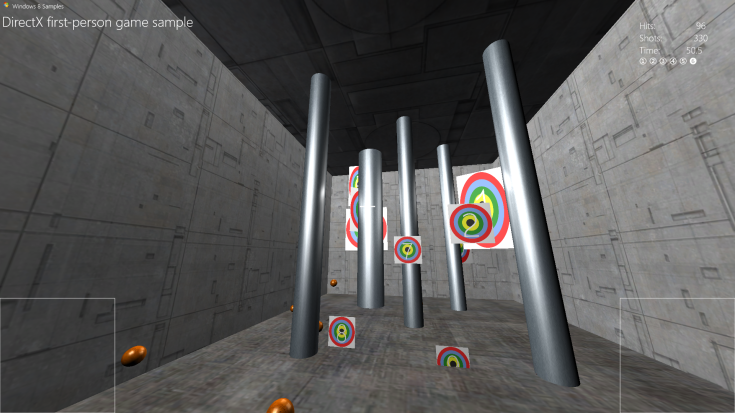

# Создание простой игры универсальной платформы Windows (UWP) с использованием DirectX

\[ Обновлено для приложений UWP в Windows 10. Статьи о Windows 8.x см. в [архиве](http://go.microsoft.com/fwlink/p/?linkid=619132) \]

Из данных учебников вы узнаете, как создать игру универсальной платформы Windows (UWP) с помощью DirectX и C++. Мы расскажем обо всех основных частях игры, включая процессы загрузки таких активов, как графика и сетки, создание основного цикла игры, реализацию простого конвейера визуализации, а также добавление звуков и элементов управления.

Мы покажем основные методы разработки игр UWP и дадим общие рекомендации. Полная игра не предоставляется. Вместо этого мы рассмотрим основные понятия разработки игр UWP с использованием DirectX и дадим рекомендации по работе с этими понятиями в среде выполнения Windows.

## Цель

-   Использовать основные понятия и компоненты игры UWP на базе DirectX и научиться разрабатывать игры UWP с помощью DirectX.

## Необходимо знать

Прежде чем приступить к изучению руководства, необходимо знать следующее.

-   Microsoft C++ с расширениями компонентов (C++/CX). Это обновление Microsoft C++, в которое входит автоматический подсчет ссылок, является языком разработки игр UWP с помощью DirectX 11.1 или более поздних версий.
-   Базовое знание линейной алгебры и ньютоновской физики.
-   Базовое знание терминологии программирования графики.
-   Базовое знание программирования в Windows.
-   Базовые знания API [Direct2D](https://msdn.microsoft.com/en-us/library/windows/apps/dd370990.aspx) и [Direct3D 11](https://msdn.microsoft.com/library/windows/desktop/hh404569).

##  Образец игры-шутера Direct3D Магазина Windows

В данном образце реализована простая игра-шутер от первого лица, в которой игрок стреляет шарами по движущимся целям. Попадание в цель приносит определенное количество очков, и игрок может пройти 6 уровней с возрастающей сложностью. После прохождения всех уровней очки суммируются, и игрок видит окончательный счет.

В этом образце демонстрируются основные понятия игры:

-   Взаимодействие между DirectX 11.1 и средой выполнения Windows
-   Преобразование перспективы и камера в трехмерной игре от первого лица
-   Стереоскопические трехмерные эффекты
-   Обнаружение конфликтов между объектами в 3D
-   Обработка пользовательского ввода с помощью мыши, сенсорной технологии и элементов управления контроллера Xbox 360
-   Микширование звука и воспроизведение
-   Базовый конечный автомат игры

| Тема | Описание |
|---------------------------------------------------------------------------------------------------|----------------------------------------------------------------------------------------------------------------------------------------------------------------------------------------------------------------------------------------------------------------------------------------------------------------------------------------------------------------------------------------------------------------------------------------------------------------|
| [Настройка проекта игры](tutorial--setting-up-the-games-infrastructure.md) | Первым шагом сборки вашей игры является настройка проекта в Microsoft Visual Studio, позволяющая свести к минимуму работу по созданию инфраструктуры кода. Вы можете сэкономить много времени и усилий, выбрав правильный шаблон и настроив проект специально для разработки игры. Ниже описан процесс настройки и выбора конфигурации для проекта по разработке простой игры. |
| [Определение структуры приложения UWP](tutorial--building-the-games-metro-style-app-framework.md) | Первый этап программирования игры UWP на базе DirectX заключается в создании структуры, которая позволит объекту игры взаимодействовать с Windows. Сюда входят такие свойства среды выполнения Windows, как приостановка и возобновление обработки событий, фокус и прикрепление окна, а также события, взаимодействия и переходы для пользовательского интерфейса. Мы рассмотрим на образце, как структурирована игра и как она определяет конечный автомат высокого уровня для взаимодействия игрока и системы. |
| [Определение основного игрового объекта](tutorial--defining-the-main-game-loop.md) | Давайте подробнее рассмотрим игровой объект и механизм реализации правил взаимодействия с внутриигровым миром. |
| [Сборка структуры визуализации](tutorial--assembling-the-rendering-pipeline.md) | Теперь мы покажем, как образец игры использует эту структуру и состояние для отображения графики. Здесь мы рассмотрим реализацию структуры визуализации, начиная с инициализации графического устройства и заканчивая представлением графических объектов для отображения. |
| [Добавление пользовательского интерфейса](tutorial--adding-a-user-interface.md) | Мы увидели, как в примере игры реализуется главный игровой объект и основная инфраструктура отрисовки. Теперь давайте рассмотрим, как игрок получает сведения о текущем состоянии игры. Далее вы узнаете, как добавить простые пункты меню и компоненты, отображаемые на экране поверх выхода конвейера трехмерной графики. |
| [Добавление элементов управления](tutorial--adding-controls.md) | Сейчас мы рассмотрим, как реализовать элементы управления движением и обзором в 3D-игре на реальном примере и как разработать основные элементы управления касанием, мышью и игровым устройством. |
| [Добавление звука](tutorial--adding-sound.md) | На этом этапе мы познакомимся с тем, как в образце игры-шутера создается объект для воспроизведения звука с помощью API [XAudio2](https://msdn.microsoft.com/library/windows/desktop/ee415813). |
| [Расширение образца игры](tutorial-resources.md) | Поздравляем! Теперь вы знаете основные компоненты для создания трехмерной игры игры UWP на базе DirectX. Вы можете настроить структуру игры, включая поставщик представлений и конвейер визуализации, а также реализовать основной цикл игры. Вы также можете создать базовое наложение пользовательского интерфейса и включить в него звуки и элементы управления. Следующие ресурсы помогут вам в дальнейшем освоении разработки игр на основе DirectX и создании своей собственной игры. |
 

 

 

<!--HONumber=Jun16_HO4-->

