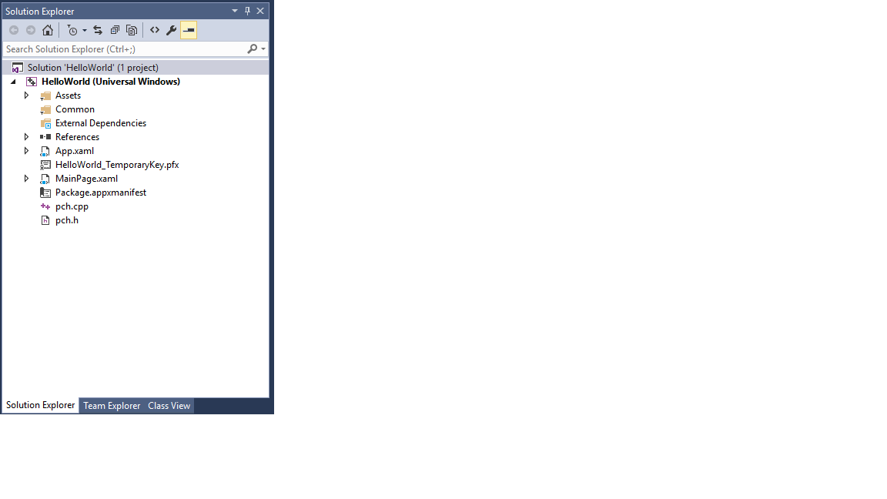

# Создание приложения «Hello World» на C++ (Windows 10)

В Microsoft Visual Studio 2015 вы можете использовать язык C++ для разработки приложения, которое работает в Windows 10, в том числе на телефонах под управлением Windows 10. Интерфейс пользователя в этих приложениях определен на языке XAML.

Чтобы разработать приложение, которое работает в Windows 8.1 и Windows Phone 8.1, используйте Microsoft Visual Studio 2013 с обновлением 3 или более позднюю версию. Выполните действия, указанные [здесь](https://msdn.microsoft.com/library/windows/apps/Dn263168). Самое существенное отличие заключается в том, что для Windows 8.1 и Windows Phone 8.1 используется решение с тремя проектами: для компьютера (или планшета), для телефона и для общего кода. В разработке для Windows 10 все коды используют один и тот же проект.

Учебники для других языков программирования см. в следующих разделах.

-   [Создание первого приложения Магазина Windows на JavaScript](https://msdn.microsoft.com/library/windows/apps/BR211385)

-   [Создание первого приложения Магазина Windows на C# или Visual Basic](https://msdn.microsoft.com/library/windows/apps/Hh974581)

## Перед началом работы

-   Для работы с этим учебником необходимо использовать Visual Studio 2015 Community или более поздней версии или одну из версий Visual Studio 2015, кроме Community, на компьютере под управлением Windows 10 или Windows 8.1. Для скачивания перейдите на страницу [Получение инструментов](http://go.microsoft.com/fwlink/p/?LinkId=532666).
-   Установите подходящий пакет [SDK](http://go.microsoft.com/fwlink/?LinkId=533049) для разработки приложений универсальной платформы для Windows.
-   Вам также потребуется лицензия разработчика. Инструкции см. на странице [Получение лицензии разработчика](https://msdn.microsoft.com/library/windows/apps/Hh974578).
-   Предполагается, что вы имеете общее представление о стандартном C++ и о XAML и владеете понятиями, описанными в разделе [Обзор языка XAML](https://msdn.microsoft.com/library/windows/apps/Mt185595).
-   Также предполагается, что вы используете в Visual Studio макет окна по умолчанию. Чтобы вернуться к макету по умолчанию, выберите в строке меню пункт **Окно** > **Сброс макета окон**.
-   Обратите внимание, что существует известная проблема с Visual Studio 2015, которая может привести к исключению NullReferenceException при загрузке конструктора XAML. Эта проблема блокирует некоторые из этапов этого учебника, если вы не собираетесь применить решение. Подробнее об этой проблеме и решении, см. в [этой записи форума MSDN](http://go.microsoft.com/fwlink/p/?LinkId=624036) .

## Сравнение классических приложений на C++ с приложениями для Windows

Если у вас есть опыт создания классических приложений для Windows на C++, то некоторые аспекты программирования приложений Магазина Windows и приложений для Windows Phone вам, вероятно, покажутся хорошо знакомыми, а другие потребуют изучения.

### Сходство с традиционным программированием на C++

-   Вы можете использовать STL, CRT (за некоторыми исключениями) и любую другую библиотеку C++, если код не пытается вызвать функции Windows, которые недоступны из среды выполнения Windows.

-   Если вы привыкли работать с визуальными конструкторами, можно использовать конструктор, встроенный в Microsoft Visual Studio, или использовать полнофункциональное приложение Blend для Visual Studio. Если вы обычно пишете код для пользовательского интерфейса вручную, вы точно так же можете писать код XAML.

-   Создаваемые приложения могут использовать типы операционной системы Windows и ваши собственные настраиваемые типы.

-   Вы по-прежнему можете использовать отладчик, профилировщик и другие инструменты разработки Visual Studio.

-   Для компиляции созданных вами приложений в машинный код так же используется компилятор Visual C++. Выполнение приложений Магазина Windows на C++ не поддерживается в управляемой среде выполнения.

### Что нового?

-   Принципы разработки приложений Магазина Windows и универсальных приложений для Windows существенно отличаются от принципов разработки классических приложений. Утрачивают значение границы окон, подписи, диалоговые окна и прочее. Наибольшее значение приобретает содержимое. При создании универсальных приложений для Windows этим принципам необходимо следовать с самого начала стадии планирования.

-   Для определения всего пользовательского интерфейса используется XAML. Разделение между пользовательским интерфейсом и основной логикой в универсальном приложении для Windows намного более очевидно, чем в приложениях MFC или Win32. В то время как вы работаете над поведением приложения в файле кода, другие специалисты могут работать над внешним видом пользовательского интерфейса в файле XAML.

-   Программирование выполняется главным образом с помощью нового объектно-ориентированного API среды выполнения Windows с улучшенной навигацией, хотя на устройствах Windows для ряда функций можно по-прежнему использовать Win32.

-   С помощью C++/CX можно использовать и создавать объекты среды выполнения Windows. C++/CX разрешает обработку исключений C++, делегаты, события и автоматический подсчет ссылок для динамически создаваемых объектов. При использовании C++/CX особенности базовой архитектуры COM и Windows скрыты от кода приложения. Подробнее: [Справочник по языку C++/CX](https://msdn.microsoft.com/en-us/library/windows/apps/hh699871.aspx).

-   Приложение компилируется в пакет, также включающий метаданные о типах, которые содержатся в приложении, используемых ресурсах и требуемых возможностях (доступ к файловой системе, Интернету, камере и т. д.).

-   В Магазине Windows и Магазине Windows Phone приложение проходит сертификацию для подтверждения его надежности, после чего оно становится доступным для миллионов потенциальных клиентов.

## Приложение Магазина Hello World на C++

Наше первое приложение Hello World демонстрирует некоторые основные возможности взаимодействия, стилей и макета. Мы создадим приложение, используя шаблон проекта универсального приложения для Windows. Если вы разрабатывали приложения для Windows 8.1 и Windows Phone 8.1 ранее, возможно, вы помните, что вам нужны были три проекта в Visual Studio: один для приложения для Windows, один для приложения для телефона и еще один с общим кодом. Благодаря универсальной платформе Windows (UWP) в Windows 10 можно создать всего один проект, который работает на всех устройствах, в том числе на настольных компьютерах и ноутбуках под управлением Windows 10, таких устройствах, как планшеты, мобильные телефоны и т. д.

Начнем с основ.

-   Создание проекта универсального приложения для Windows в Visual Studio 2015 или более поздней версии

-   Общее представление о проектах и создаваемых файлах.

-   Общее представление о расширениях в расширениях компонентов Visual C++ (C++/CX) и способах их использования

**Сначала создайте решение в Visual Studio**

1.  В Visual Studio в строке меню выберите **Файл** > **Создать** > **Проект**.

2.  В диалоговом окне **Создать проект** разверните на левой панели узел **Установленные** > **Visual C++** > **Windows** > **Универсальные приложения для Windows**.

3.  На центральной панели выберите **Пустое приложение (универсальные приложения для Windows)**.

4.  Введите имя проекта. Он будет называться HelloWorld.

 

5.  Нажмите кнопку **ОК**.

   Если это первый проект UWP, который вы создали, и вы не включали режим разработчика на компьютере, отобразится диалоговое окно режима разработчика. Щелкните ссылку, чтобы открыть страницу параметров, позволяющую настроить режим разработчика. Режим разработчика позволяет разворачивать и запускать ваши приложения локально.

   Файлы вашего проекта созданы.

Перед тем как продолжить работу, давайте изучим файлы решения.



### Информация о файлах проекта

Каждый файл с расширением XAML в папке проекта имеет соответствующий файл .XAML.H и файл .XAML.CPP в той же папке, а также файл .G и файл .G.HPP в папке "Generated Files", которая находится на диске, но не является частью проекта. Следует изменить эти XAML-файлы, чтобы создать элементы пользовательского интерфейса и соединить их с источниками данных (привязка данных). Следует изменить файлы .H и .CPP, чтобы добавить настраиваемую логику для обработчиков событий. Автоматически создаваемые файлы представляют преобразование разметки XAML в C++. Не изменяйте эти файлы, но вы можете изучить их, чтобы лучше понимать, как работает код программной части. В основном созданный файл содержит частичное определение класса для корневого элемента XAML. Это тот же самый класс, который вы изменяете в файлах \*.XAML.H и .CPP. Созданные файлы объявляют дочерние элементы пользовательского интерфейса XAML как члены класса, чтобы вы могли ссылаться на них в своем коде. Во время выполнения сборки созданный код и ваш код объединяются в полное определение класса, а затем компилируются.

Давайте сначала посмотрим на файлы проекта.

-   **App.xaml, App.xaml.h, App.xaml.cpp** — представляют объект приложения, который является точкой входа приложения. App.xaml не содержит разметки пользовательского интерфейса, относящейся к отдельным страницам, но вы можете добавить стили и другие элементы пользовательского интерфейса, которые следует сделать доступными с любой страницы. Файлы кода программной части содержат обработчики для событий **OnLaunched** и **OnSuspending**. Обычно сюда добавляется пользовательский код для инициализации приложения при запуске, а также здесь выполняется очистка при приостановке и завершении работы.
-   **MainPage.xaml, MainPage.xaml.h, MainPage.xaml.cpp** — содержат разметку XAML и код программной части для стандартной начальной страницы в приложении. Эта страница не поддерживает навигацию и не имеет встроенных элементов управления.
-   **pch.h, pch.cpp** — предварительно скомпилированный файл заголовка и файл, который включает его в ваш проект. В файле pch.h вы можете добавлять любые заголовки, которые не изменяются часто и которые добавлены в другие файлы в решении.
-   **Package.appxmanifest** — XML-файл, описывающий возможности устройства, которые необходимы вашему приложению. Также содержит информацию о версии приложения и другие метаданные. Чтобы открыть этот файл в **конструкторе манифеста**, просто дважды щелкните его.
-   **HelloWorld\_TemporaryKey.pfx** — ключ, разрешающий развертывание приложения на этом компьютере из Visual Studio.

## Начало работы с программным кодом

Если вы изучите код в файлах App.xaml.h, App.xaml.cpp в общем проекте, то заметите, что в основном понимаете код C++. Тем не менее есть и некоторые незнакомые элементы синтаксиса, если вы ранее не сталкивались с приложениями для среды выполнения Windows, или если вы работали с C++/CLI. Вот общие нестандартные элементы синтаксиса, которые вы можете увидеть в C++/CX:

-   **Классы "ref"**

Почти все классы среды выполнения Windows, которые включают в себя все типы в API Windows (элементы управления XAML, страницы в вашем приложении, сам класс App, все объекты устройств и сетевые объекты, все типы контейнеров), объявляются как **ref class**. (Несколько типов в Windows: **класс значения** или **структура** значения). Класс ref может использоваться из любого языка. В C++ время жизни этих типов регулируется с помощью автоматического подсчета ссылок (а не сборки мусора), чтобы не приходилось явно удалять эти объекты. Вы также можете создавать свои собственные классы "ref".

```cpp
    namespace HelloWorld
    {
        /// <summary>
        /// An empty page that can be used on its own or navigated to within a Frame.
        /// </summary>
        public ref class MainPage sealed
        {
        public:
            MainPage();

        };
    }
```    

Все типы среды выполнения Windows должны объявляться в пространстве имен и, в отличие от самих типов в C++ стандарта ISO, иметь модификатор доступа. Модификатор **public** делает класс видимым для компонентов среды выполнения Windows, которые находятся вне пространства имен. Ключевое слово **sealed** означает, что класс не может быть базовым классом. Почти все классы ref запечатаны. Наследование классов широко не используется, потому что JavaScript его не понимает.

-   **ref new** и **^ (крышка)**

 Переменная класса ref объявляется с помощью оператора «^» («крышка»), и создается экземпляр объекта с помощью ключевого слова «ref new». После этого вы получаете доступ к методам экземпляров объекта, используя оператор "->" почти так же, как указатель C++. Доступ к статическим методам можно получить с помощью оператора "::", как в C++ стандарта ISO.

 В следующем коде мы используем полное имя, чтобы создать экземпляр объекта, и оператор «->», чтобы вызвать метод экземпляров.

 ```cpp
    Windows::UI::Xaml::Media::Imaging::BitmapImage^ bitmapImage =
        ref new Windows::UI::Xaml::Media::Imaging::BitmapImage();
      
    bitmapImage->SetSource(fileStream);
    ```

   Typically, in a .cpp file we would add a `using namespace  Windows::UI::Xaml::Media::Imaging` directive and the auto keyword, so that the same code would look like this:

```cpp
    auto bitmapImage = ref new BitmapImage();
    bitmapImage->SetSource(fileStream);
```

-   **Свойства**

   Класс ref может иметь свойства, которые, как и в управляемых языках, являются специальными функциями-членами. Они отображаются в виде полей в потребляющем коде.

```cpp
    public ref class SaveStateEventArgs sealed
            {
            public:

                // Declare the property
                property Windows::Foundation::Collections::IMap<Platform::String^, Platform::Object^>^ PageState
                {
                    Windows::Foundation::Collections::IMap<Platform::String^, Platform::Object^>^ get();
                }
    ...
    };

    ...
    // consume the property like a public field
    void PhotoPage::SaveState(Object^ sender, Common::SaveStateEventArgs^ e)
    {    
        if (mruToken != nullptr && !mruToken->IsEmpty())
        {
            e->PageState->Insert("mruToken", mruToken);
        }
    }
```

-   **Делегаты**

   Как и в управляемых языках, делегат — это ссылочный тип, который инкапсулирует функцию с помощью специальной подписи. Делегаты часто используются с событиями и обработчиками событий.

```cpp
    // Delegate declaration (within namespace scope)
    public delegate void LoadStateEventHandler(Platform::Object^ sender, LoadStateEventArgs^ e);

    // Event declaration (class scope)
    public ref class NavigationHelper sealed
    {
      public:
        event LoadStateEventHandler^ LoadState;
    };

    // Create the event handler in consuming class
    MainPage::MainPage()
    {
        auto navigationHelper = ref new Common::NavigationHelper(this);
        navigationHelper->LoadState += ref new Common::LoadStateEventHandler(this, &MainPage::LoadState);
    }
```

## Добавление содержимого в приложение

Давайте добавим содержимое в приложение.

**Шаг 1. Изменение вашей начальной страницы**

1.  В **Обозревателе решений** откройте файл MainPage.xaml.
2.  Создайте элементы управления для пользовательского интерфейса, добавив следующий код XAML в корневой элемент [**Grid**](https://msdn.microsoft.com/library/windows/apps/BR242704) сразу после его закрывающего тега. В нем содержится [**StackPanel**](https://msdn.microsoft.com/library/windows/apps/BR209635) с [**TextBlock**](https://msdn.microsoft.com/library/windows/apps/BR209652), который запрашивает имя пользователя; элемент [**TextBox**](https://msdn.microsoft.com/library/windows/apps/BR209683), который принимает имя пользователя; элемент [**Button**](https://msdn.microsoft.com/library/windows/apps/BR209265) и еще один элемент **TextBlock**.

```xml
    <StackPanel x:Name="contentPanel" Margin="120,30,0,0">
        <TextBlock HorizontalAlignment="Left" Text="Hello World" FontSize="36"/>
        <TextBlock Text="What's your name?"/>
        <StackPanel x:Name="inputPanel" Orientation="Horizontal" Margin="0,20,0,20">
            <TextBox x:Name="nameInput" Width="300" HorizontalAlignment="Left"/>
            <Button x:Name="inputButton" Content="Say \"Hello\""/>
        </StackPanel>
        <TextBlock x:Name="greetingOutput"/>
    </StackPanel>
```

Подробнее о макете XAML: [Навигация, макет и представления](https://msdn.microsoft.com/library/windows/apps/Dn263172).

3.  На этот момент вы создали очень простое универсальное приложение для Windows. Если вы хотите увидеть, как выглядит приложение UWP, нажмите клавишу F5, чтобы выполнить сборку, развернуть и запустить приложение в режиме отладки.

Сначала появится экран-заставка по умолчанию. На нем будет присутствовать изображение (Assets\\SplashScreen.scale-100.png) и цвет фона, указанный в файле манифеста приложения. Подробнее о том, как настраивать экран-заставку, см. в разделе о [добавлении экрана-заставки](https://msdn.microsoft.com/library/windows/apps/Hh465332).

После того как экран-заставка исчезнет, появится ваше приложение. Отобразится основная страница приложения.

Нажмите клавишу Windows или кнопку меню "Пуск", чтобы перейти в меню "Пуск", и обратите внимание, что при развертывании приложение добавляется в список установленных программ меню "Пуск". Оно также появляется, когда вы нажимаете новую ссылку рядом с кнопкой "Все приложения". Чтобы снова запустить приложение, просто нажмите или щелкните его плитку, нажмите клавишу F5 или Ctrl+F5 в Visual Studio, как обычно.

 

   Пока это приложение не умеет выполнять много функций, но вас можно поздравить с успешным созданием вашего первого универсального приложения для Windows.

   Чтобы завершить отладку и закрыть приложение, вернитесь в Visual Studio и нажмите клавиши SHIFT+F5.

   Дополнительные сведения см. в статье [Выполнение приложения Магазина в Visual Studio](http://go.microsoft.com/fwlink/p/?LinkId=619619).

   В приложении можно вводить информацию в [**TextBox**](https://msdn.microsoft.com/library/windows/apps/BR209683), но при нажатии [**Button**](https://msdn.microsoft.com/library/windows/apps/BR209265) ничего не происходит. Позднее мы создадим для кнопки обработчик события [**Click**](https://msdn.microsoft.com/library/windows/apps/BR227737), который отображает персонализированное приветствие.

## Запуск приложения в эмуляторе мобильного устройства


Ваше приложение работает на любом устройстве с Windows 10, поэтому давайте посмотрим, как оно выглядит в Windows Phone. В этом разделе требуется Windows Phone под управлением Windows 10 или доступ к эмулятору Windows Phone. Также требуется запустить Visual Studio на физическом компьютере (не на виртуальной машине) с включенным и поддерживаемым HyperV.

Помимо возможности отладки на настольном ПК Visual Studio предоставляет возможность развертывания и отладки приложения на физическом мобильном устройстве, подключенном к компьютеру, или на эмуляторе мобильного устройства. Вы можете выбрать эмулятор для устройств с теми или иными параметрами памяти и экрана.

-   **Устройство**
-   **Эмулятор 10.0.0.0 WVGA, 4 дюйма, 512 МБ**
-   Различные эмуляторы в других конфигурациях

Рекомендуется протестировать приложение на устройстве с маленьким экраном и ограниченным объемом оперативной памяти, поэтому используется параметр **Эмулятор 10.0.0.0 WVGA, 4 дюйма, 512 МБ**.
**Совет.** Подробнее об использовании эмулятора телефона см. в разделе [Выполнение приложений Windows Phone в эмуляторе](http://go.microsoft.com/fwlink/p/?LinkId=394233).

 

Чтобы выполнить отладку приложения на физическом устройстве, необходимо, чтобы устройство было зарегистрировано для разработки. Дополнительные сведения см. в разделе [Регистрация устройства Windows Phone](https://msdn.microsoft.com/library/windows/apps/Dn614128).

**Запуск отладки в эмуляторе мобильного устройства**

1.  В меню целевого устройства () на панели инструментов **Стандартная** выберите **Эмулятор 10.0.10240.0 WVGA, 4 дюйма, 512 МБ**.
2.  Нажмите кнопку **Начать отладку** () на панели инструментов.

   либо

   В меню **Отладка** выберите команду **Начать отладку**.

   либо

   Нажмите клавишу F5.

В эмуляторе мобильного устройства приложение выглядит следующим образом.


Visual Studio запускает выбранный эмулятор и затем разворачивает и запускает приложение. Прежде всего вы заметите, что левое поле размером 120 пикселей, которое хорошо выглядит на локальном компьютере, сдвигает содержимое за пределы небольшого экрана мобильного устройства. Далее вы узнаете, как адаптировать пользовательский интерфейс к различным размерам экрана, чтобы ваше приложение всегда выглядело хорошо.

## Шаг 2. Создание обработчика события

1.  В файле MainPage.xaml в коде XAML или в представлении конструирования выберите элемент Say Hello [**Button**](https://msdn.microsoft.com/library/windows/apps/BR209265) в добавленном ранее элементе [**StackPanel**](https://msdn.microsoft.com/library/windows/apps/BR209635).
2.  Нажмите клавиши ALT+ВВОД, чтобы открыть окно **Свойства**, а затем нажмите кнопку «События» ().
3.  Найдите событие [**Click**](https://msdn.microsoft.com/library/windows/apps/BR227737). В его текстовом поле введите имя функции, которая обрабатывает событие **Click**. Для этого примера введите Button\_Click.


4.  Нажмите клавишу ВВОД. Метод обработчика событий создается в файле MainPage.xaml.cpp и открывается в редакторе кода. Вы можете добавить код, который выполняется при возникновении события.

   В то же время в MainPage.xaml код XAML для [**Button**](https://msdn.microsoft.com/library/windows/apps/BR209265) обновляется, чтобы объявить обработчик событий [**Click**](https://msdn.microsoft.com/library/windows/apps/BR227737) следующим образом.

```xml
    <Button Content="Say \"Hello\"" Click="Button_Click"/>
```

Вы также можете просто добавить это значение к коду xaml вручную. Это может быть удобно, если не загружается конструктор. При вводе вручную введите "Щелкнуть" и позвольте IntelliSense отобразить параметр, чтобы добавить новый обработчик событий. Таким образом, Visual Studio создает необходимую декларацию о методе и заглушку.

Конструктор не сможет загрузиться, если во время отрисовки возникнет необработанное исключение. Отрисовка в конструкторе предусматривает запуск версии времени разработки страницы. Это может быть удобно для отключения запущенного кода пользователя. Это можно сделать, изменив значение параметра в диалоговом окне **"Сервис ", "Параметры"**. В разделе **Конструктор XAML** снимите флажок **Запускать код проекта в конструкторе XAML (если поддерживается)**.

5.  В файле MainPage.xaml.cpp добавьте следующий код в обработчик событий **Button\_Click**, который вы только что создали. В этом коде вы получаете имя пользователя из элемента управления `nameInput` [**TextBox**](https://msdn.microsoft.com/library/windows/apps/BR209683) и используете его, чтобы создать приветствие. `greetingOutput` [**TextBlock**](https://msdn.microsoft.com/library/windows/apps/BR209652) отображает результат.

```cpp
    void HelloWorld::MainPage::Button_Click(Platform::Object^ sender, Windows::UI::Xaml::RoutedEventArgs^ e)
    {
        greetingOutput->Text = "Hello, " + nameInput->Text + "!";
    }
```

6.  Назначьте проект запускаемым, а затем нажмите клавишу F5, чтобы выполнить сборку и запустить приложение. При вводе имени в текстовое поле и нажатии кнопки приложение отображает персонализированное приветствие.


## Шаг 3. Стиль начальной страницы

### Выбор темы

Внешний вид и функциональность приложения можно легко изменить. По умолчанию ваше приложение использует ресурсы со светлым стилем. Системные ресурсы также включают светлую тему. Примените ее и посмотрите, как будет выглядеть приложение.

**Переключение на темную тему**

1.  Откройте файл App.xaml.
2.  В открывающем теге [**Application**](https://msdn.microsoft.com/library/windows/apps/BR242324) измените свойство [**RequestedTheme**](https://msdn.microsoft.com/library/windows/apps/windows.ui.xaml.application.requestedtheme) и установите для него значение **Dark**:

```xml
   RequestedTheme="Light"
```

Вот полный тег [**Application**](https://msdn.microsoft.com/library/windows/apps/BR242324) с темной темой:

```xml 
        <Application
        x:Class="HelloWorld.App"
        xmlns="http://schemas.microsoft.com/winfx/2006/xaml/presentation"
        xmlns:x="http://schemas.microsoft.com/winfx/2006/xaml"
        xmlns:local="using:HelloWorld" 
        RequestedTheme="Dark">
```

3.  Чтобы выполнить сборку и запустить приложение, нажмите клавишу F5. Обратите внимание, что проект использует темную тему.


Какую тему использовать? Любую, какую пожелаете! Мы рекомендуем для приложений, которые главным образом отображают изображения или видео, лучше использовать темную тему, а для приложений с большим объемом текста — светлую тему. Если применяется пользовательская цветовая схема, используйте тему, которая лучше всего сочетается с внешним видом вашего приложения. В остальных разделах настоящего руководства мы используем светлую тему на снимках экрана.

**Примечание.** Тема применяется после запуска приложения. Ее нельзя изменить, пока приложение работает.

### Использование системных стилей

В данный момент в приложении для Windows текст является слишком мелким и трудным для чтения. Давайте исправим это, применив системный стиль.

**Изменение стиля элемента**

1.  Откройте файл MainPage.xaml в проекте Windows.
2.  В коде XAML или в представлении конструирования выберите добавленный ранее элемент What's your name? [**TextBlock**](https://msdn.microsoft.com/library/windows/apps/BR209652).
3.  В окне **Свойства** (**F4**) нажмите кнопку «Свойства» () в правом верхнем углу.
4.  Разверните группу **Текст** и установите размер шрифта 18 пикселей.
5.  Разверните группу **Разное** и найдите свойство **Style**.
6.  Щелкните маркер свойств (зеленый прямоугольник справа от свойства **Стиль**), а затем в меню выберите пункты **Системный ресурс** > **BaseTextBlockStyle**.

 **BaseTextBlockStyle** — это ресурс, который определен в [**ResourceDictionary**](https://msdn.microsoft.com/library/windows/apps/BR208794) в файле <root>\\Program Files\\Windows Kits\\10\\Include\\winrt\\xaml\\design\\generic.xaml.


 Вид текста в рабочей области конструирования XAML изменится. В редакторе XAML обновляется код XAML для [**TextBlock**](https://msdn.microsoft.com/library/windows/apps/BR209652).

```xml
   <TextBlock Text="What's your name?" Style="{StaticResource BasicTextStyle}"/><
```

7.  Повторите процесс, чтобы установить размер шрифта, и назначьте значение **BaseTextBlockStyle** элементу `greetingOutput`[**TextBlock**](https://msdn.microsoft.com/library/windows/apps/BR209652).

  **Совет.** Хотя в этом элементе [**TextBlock**](https://msdn.microsoft.com/library/windows/apps/BR209652), нет текста, при наведении указателя мыши на поверхность разработки XAML голубой контур показывает его расположение, чтобы его можно было выбрать.  

  XAML-код теперь выглядит так:

```xml
    <StackPanel x:Name="contentPanel" Margin="120,30,0,0">
        <TextBlock Style="{ThemeResource BaseTextBlockStyle}" FontSize="16" Text="What's your name?"/>
        <StackPanel x:Name="inputPanel" Orientation="Horizontal" Margin="0,20,0,20">
            <TextBox x:Name="nameInput" Width="300" HorizontalAlignment="Left"/>
            <Button x:Name="inputButton" Content="Say \"Hello\"" Click="Button_Click"/>
        </StackPanel>
        <TextBlock Style="{ThemeResource BaseTextBlockStyle}" FontSize="16" x:Name="greetingOutput"/>
    </StackPanel>
```

8.  Чтобы выполнить сборку и запустить приложение, нажмите клавишу F5. Теперь оно выглядит следующим образом:

 

### Шаг 4. Адаптация пользовательского интерфейса к различным размерам окон

Теперь мы адаптируем пользовательский интерфейс к различным размерам экрана, чтобы приложение выглядело хорошо на мобильных устройствах. Для этого добавьте [**VisualStateManager**](https://msdn.microsoft.com/library/windows/apps/BR209021) и установите свойства, применяемые для различных визуальных состояний.

**Настройка макета пользовательского интерфейса**

1.  В редакторе XAML добавьте этот блок XAML после открывающего тега корневого элемента [**Grid**](https://msdn.microsoft.com/library/windows/apps/BR242704).

```xml
    <VisualStateManager.VisualStateGroups>
        <VisualStateGroup>
            <VisualState x:Name="wideState">
                <VisualState.StateTriggers>
                    <AdaptiveTrigger MinWindowWidth="641" />
                </VisualState.StateTriggers>
            </VisualState>
            <VisualState x:Name="narrowState">
                <VisualState.StateTriggers>
                    <AdaptiveTrigger MinWindowWidth="0" />
                </VisualState.StateTriggers>
                <VisualState.Setters>
                    <Setter Target="contentPanel.Margin" Value="20,30,0,0"/>
                    <Setter Target="inputPanel.Orientation" Value="Vertical"/>
                    <Setter Target="inputButton.Margin" Value="0,4,0,0"/>
                </VisualState.Setters>
            </VisualState>
        </VisualStateGroup>
    </VisualStateManager.VisualStateGroups>
```

2.  Выполните отладку приложения на локальном компьютере. Обратите внимание, что пользовательский интерфейс выглядит так же, как и раньше, пока ширина окна не станет меньше 641 аппаратно-независимого пикселя (DIP).
3.  Выполните отладку приложения на эмуляторе мобильного устройства. Обратите внимание, что пользовательский интерфейс использует свойства, указанные вами в `narrowState`, и правильно отображается на маленьком экране.


Если вы использовали [**VisualStateManager**](https://msdn.microsoft.com/library/windows/apps/BR209021) в предыдущих версиях XAML, можно заметить, что в XAML здесь используется упрощенный синтаксис.

У [**VisualState**](https://msdn.microsoft.com/library/windows/apps/BR209007) с именем `wideState` имеется [**AdaptiveTrigger**](https://msdn.microsoft.com/library/windows/apps/Dn890382), для свойства [**MinWindowWidth**](https://msdn.microsoft.com/en-us/library/windows/apps/windows.ui.xaml.adaptivetrigger.minwindowwidth) которого задано значение 641. Это означает, что состояние будет применяться только тогда, когда ширина окна составляет не менее минимального значения 641 DIP. Вы не указываете никакие объекты [**Setter**](https://msdn.microsoft.com/library/windows/apps/BR208817) для этого состояния, поэтому оно использует свойства макета, заданные в XAML для содержимого страницы.

У второго [**VisualState**](https://msdn.microsoft.com/library/windows/apps/BR209007), `narrowState`, имеется [**AdaptiveTrigger**](https://msdn.microsoft.com/library/windows/apps/Dn890382), для свойства [**MinWindowWidth**](https://msdn.microsoft.com/en-us/library/windows/apps/windows.ui.xaml.adaptivetrigger.minwindowwidth) которого задано значение 0. Это состояние применяется, когда ширина окна больше 0, но меньше 641 DIP. (Для 641 DIP применяется `wideState`.) В этом состоянии необходимо указать некоторые объекты [**Setter**](https://msdn.microsoft.com/library/windows/apps/BR208817), чтобы изменить свойства макета элементов управления в пользовательском интерфейсе:

-   Вы уменьшаете левое поле элемента `contentPanel` со 120 до 20.
-   Вы изменяете [**Orientation**](https://msdn.microsoft.com/library/windows/apps/windows.ui.xaml.controls.stackpanel.orientation) для элемента `inputPanel` с **Horizontal** на **Vertical**.
-   Вы добавляете верхнее поле высотой 4 DIP к элементу `inputButton`.

### Резюме

Поздравляем, вы завершили изучение первого учебника. Вы научились добавлять содержимое в универсальные приложения для Windows, менять их внешний вид и реализовывать возможности взаимодействия.

## Дальнейшие действия

Если у вас есть проект универсального приложения для Windows, ориентированный на Windows 8.1 и (или) Windows Phone 8.1, вы можете перенести его в Windows 10. Для этого действия нет автоматического процесса, но его можно выполнить вручную без особых усилий. Начните новый проект универсального приложения для Windows, чтобы получить последнюю структуру системы и файлы манифеста проекта, скопируйте файлы кода в структуру каталогов проекта, добавьте элементы в проект и перепишите код XAML, используя [**VisualStateManager**](https://msdn.microsoft.com/library/windows/apps/BR209021) в соответствии с рекомендациями в этом разделе. Дополнительные сведения см. в разделах: [Перенос проекта среды выполнения Windows 8 в проект универсальной платформы Windows (UWP)](https://msdn.microsoft.com/library/windows/apps/Mt188203) и [Перенос на универсальную платформу Windows (C++)](http://go.microsoft.com/fwlink/p/?LinkId=619525).

Если у вас есть код на C++, который вы хотите включить в приложение UWP, например для создания нового пользовательского интерфейса UWP для существующего приложения, см. раздел [Инструкции: использование существующего кода C++ в проекте универсального приложения для Windows](http://go.microsoft.com/fwlink/p/?LinkId=619623).


<!--HONumber=Mar16_HO1-->


