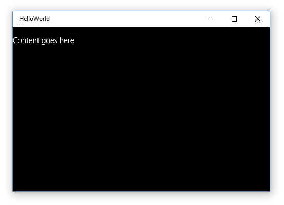

# Создание приложения «Hello, world» (JS)

В этом учебнике описано, как с помощью JavaScript и HTML создать простое приложение «Hello, world», предназначенное для универсальной платформы Windows (UWP) в Windows 10. С помощью единственного проекта в Microsoft Visual Studio вы можете создать приложение, работающее на любом устройстве с Windows 10. Основное внимание мы уделим созданию приложений, которые работают одинаково хорошо как на настольных компьютерах, так и на мобильных устройствах.

**Важно**   Этот учебник предназначен для использования с Microsoft Visual Studio 2015 и Windows 10. Он не будет работать правильно с предыдущими версиями.

В этом разделе вы научитесь выполнять следующие действия.

-   Создание нового проекта
-   Добавление содержимого HTML на начальную страницу
-   Обработка ввода с помощью касаний, пера и мыши
-   Запускать проект на локальном ПК и на эмуляторе телефона в Visual Studio.
-   Создание собственных пользовательских стилей
-   Использование элемента управления из библиотеки Windows для JavaScript

##Перед началом работы...


-   Здесь описываются шаги, используемые для создания простого универсального приложения. Поэтому мы настоятельно рекомендуем вам прочесть и понять общую информацию в разделах [Новости разработки в Windows 10](https://dev.windows.com/whats-new-windows-10-dev-preview) и [Что такое универсальное приложение для Windows](whats-a-uwp.md), прежде чем запускать этот учебник.
-   Для работы с этим учебником вам потребуются Windows 10 и Visual Studio 2015. Подробнее см. в разделе [Подготовка](get-set-up.md).
-   Мы также предполагаем, что в Visual Studio используется компоновка окна по умолчанию. Если макет по умолчанию изменен, его можно сбросить в меню **Window** (Окно), выбрав команду **Reset Window Layout** (Сбросить макет окна).

##Шаг 1. Создание нового проекта в Visual Studio.


Создадим новое приложение с именем `HelloWorld`. Вот как это сделать.

1.  Запустите Visual Studio 2015.

    Откроется начальный экран Visual Studio 2015.

    (Далее Visual Studio 2015 будет упоминаться просто как Visual Studio.)

2.  В меню **Файл** выберите элемент **Создать** > **Проект**.

    Откроется диалоговое окно **Создание проекта**. Левая панель диалогового окна позволяет выбрать тип отображаемого шаблона.

3.  На левой панели разверните узел **Установленные > Шаблоны > JavaScript > Windows** и выберите группу шаблонов **Универсальные**. На центральной панели диалогового окна отображается список шаблонов проектов для приложений универсальной платформы Windows (UWP).

    

    В этом руководстве мы используем шаблон **Пустое приложение**. Этот шаблон позволяет создать небольшое приложение UWP, которое можно скомпилировать и запустить, несмотря на отсутствие в нем данных и элементов управления пользовательского интерфейса. Вы будете добавлять элементы управления и данные в процессе работы с этим руководством.

4.  На центральной панели выберите шаблон **Пустое приложение (Universal Windows)**.

    Шаблон **Пустое приложение** дает возможность создать обладающее минимальным функционалом приложение UWP, которое компилируется и запускается, но не содержит данных или элементов управления пользовательского интерфейса. Вы добавите элементы управления в приложение в процессе работы с этим руководством.

5.  Введите «HelloWorld» в текстовое поле **Имя**.
6.  Нажмите **ОК**, чтобы создать проект.

    Visual Studio создаст проект и отобразит его в **обозревателе решений**.

    

Хотя шаблон **Пустое приложение** предоставляет только минимальные возможности, он содержит ряд файлов.

-   файл манифеста (package.appxmanifest), в котором описывается ваше приложение (имя, описание, плитка, начальная страница, экран-заставка и т. п.) и перечисляются файлы, содержащиеся в приложении;
-   набор изображений логотипов (images/Square150x150Logo.scale-200.png, images/Square44x44Logo.scale-200.png и images/Wide310x150Logo.scale-200.png) для отображения на начальном экране;
-   изображение (images/StoreLogo.png) для представления вашего приложения в Магазине Windows;
-   экран-заставка (images/SplashScreen.scale-200.png), который будет отображаться при запуске вашего приложения;
-   начальная страница (default.html) и соответствующий файл JavaScript (default.js), который выполняется при запуске приложения.

Для просмотра и изменения файлов дважды щелкните нужный файл в **обозревателе решений**.

Эти файлы необходимы для всех приложений UWP на JavaScript. Они должны содержаться в любом проекте, который вы создаете в Visual Studio.

##Шаг 2. Запуск приложения


К этому моменту вы создали очень простое приложение. Этот этап подходит для сборки, развертывания и запуска приложения, а также его просмотра. Вы можете выполнить отладку приложения на локальном компьютере, симуляторе или эмуляторе, а также на удаленном устройстве. Меню целевого устройства в Visual Studio.


### Запуск приложения на настольном ПК

По умолчанию приложение запускается на локальном компьютере. Меню целевого устройства предоставляет ряд возможностей для отладки приложения на устройствах с настольного ПК.

-   **Симулятор**
-   **Локальный компьютер**
-   **Удаленный компьютер**

**Запуск отладки на локальном компьютере**

1.  Убедитесь, что в меню целевого устройства () на панели инструментов **Стандартная** выбран параметр **Локальный компьютер**. (Этот параметр выбран по умолчанию.)
2.  Нажмите кнопку **Начать отладку** () на панели инструментов.

   либо

   В меню **Отладка** выберите команду **Начать отладку**.

   либо

   Нажмите клавишу F5.

Приложение откроется в новом окне и сначала отобразится экран-заставка по умолчанию. Экран-заставка определяется изображением (SplashScreen.png) и цветом фона (указанным в манифесте приложения).

После исчезновения экрана-заставки появится ваше приложение. Оно представляет собой черный экран с текстом «Место для содержимого».



Нажмите клавишу Windows, чтобы открыть меню **Пуск**, и выберите пункт «Все программы». Обратите внимание, что при локальном развертывании приложения его плитка добавляется в меню **Пуск**. Чтобы снова запустить приложение (не в режиме отладки) нажмите или щелкните соответствующую плитку в меню **Пуск**.

Ваше приложение пока что умеет не много, но все равно поздравляем — вы создали свое первое приложение UWP!

**Остановка отладки**

-   Нажмите кнопку **Остановить отладку** () на панели инструментов.

   либо

   В меню **Отладка** выберите команду **Остановить отладку**.

   либо

   Закройте окно приложения.

### Запуск приложения в эмуляторе мобильного устройства

Ваше приложение работает на любом устройстве с Windows 10, поэтому давайте посмотрим, как оно выглядит в Windows Phone.

Помимо возможности отладки на настольном ПК Visual Studio предоставляет возможность развертывания и отладки приложения на физическом мобильном устройстве, подключенном к компьютеру, или на эмуляторе мобильного устройства. Вы можете выбрать эмулятор для устройств с теми или иными параметрами памяти и экрана.

-   **устройство;**
-   **Эмулятор <SDK version> WVGA, 4 дюйма, 512 МБ**
-   **Эмулятор <SDK version> WVGA, 4 дюйма, 1 ГБ**
-   и т. д. (различные эмуляторы с другими конфигурациями).

Рекомендуется протестировать приложение на устройстве с маленьким экраном и ограниченным объемом памяти, поэтому используйте параметр **Эмулятор 10.0.10240.0 WVGA 4 дюйма, 512 МБ**.
**Запуск отладки в эмуляторе мобильного устройства**

1.  В меню целевого устройства () на панели инструментов **Стандартная** выберите **Эмулятор 10.0.10240.0 WVGA 4 дюйма 512 МБ**.
2.  Нажмите кнопку **Начать отладку** () на панели инструментов.

   либо

   В меню **Отладка** выберите команду **Начать отладку**.

   
Visual Studio запускает выбранный эмулятор и затем разворачивает и запускает приложение. В эмуляторе мобильного устройства приложение выглядит следующим образом.


## Шаг 3. Изменение начальной страницы

Один из файлов, которые создает для вас Visual Studio, — это файл default.html, представляющий собой начальную страницу приложения. При запуске приложение отображает содержимое этой начальной страницы. Начальная страница также содержит ссылки на файлы кода приложения и таблицы стилей. Начальная страница приложения, созданная Visual Studio:

```html
<!DOCTYPE html>
<html>
<head>
    <meta charset="utf-8" />
    <title>HelloWorld</title>

    <!-- WinJS references -->
    <link href="WinJS/css/ui-dark.css" rel="stylesheet" />
    <script src="WinJS/js/base.js"></script>
    <script src="WinJS/js/ui.js"></script>

    <!-- HelloWorld references -->
    <link href="/css/default.css" rel="stylesheet" />
    <script src="/js/default.js"></script>
</head>
<body class="win-type-body">
    <p>Content goes here</p>
</body>
</html>
```

Добавим новое содержимое в файл default.html. Так же, как и при редактировании любого другого HTML-файла, содержимое добавляется в элемент [**body**](https://msdn.microsoft.com/library/windows/apps/Hh453011). Для создания приложения можно использовать элементы HTML5 (с [некоторыми исключениями](https://msdn.microsoft.com/library/windows/apps/Hh465380)). Это означает, что можно использовать такие элементы HTML5, как [**h1**](https://msdn.microsoft.com/library/windows/apps/Hh441078), [**p**](https://msdn.microsoft.com/library/windows/apps/Hh453431), [**button**](https://msdn.microsoft.com/library/windows/apps/Hh453017), [**div**](https://msdn.microsoft.com/library/windows/apps/Hh453133) и [**img**](https://msdn.microsoft.com/library/windows/apps/Hh466114).

**Изменение начальной страницы**

1.  Замените содержимое элемента [**body**](https://msdn.microsoft.com/library/windows/apps/Hh453011) на заголовок первого уровня «Hello, world!», какой-нибудь текст, запрашивающий имя пользователя, элемент [**input**](https://msdn.microsoft.com/library/windows/apps/Hh453271), принимающий имя пользователя, элемент [**button**](https://msdn.microsoft.com/library/windows/apps/Hh453017) и элемент [**div**](https://msdn.microsoft.com/library/windows/apps/Hh453133). Назначьте идентификаторы для **input**, **button** и **div**.

 ```html
    <body class="win-type-body">
        <h1>Hello, world!</h1>
        <p>What' s your name?</p>
        <input id="nameInput" type="text" />
        <button id="helloButton">Say "Hello"</button>
        <div id="greetingOutput"></div>
    </body>
 ```

2.  Запустите приложение на локальном компьютере. Оно выглядит следующим образом.


   Вы можете ввести текст в элемент [**input**](https://msdn.microsoft.com/library/windows/apps/Hh453271), но если нажать [**button**](https://msdn.microsoft.com/library/windows/apps/Hh453017), пока ничего не случится. Некоторые объекты, такие как **button**, могут отправлять сообщения, когда возникают определенные события. Подобные сообщения о событиях дают вам возможность выполнять какие-либо действия в ответ на событие. Поместите код, выполняемый в ответ на событие, в метод обработчика события.

   Далее мы создадим для [**button**](https://msdn.microsoft.com/library/windows/apps/Hh453017) обработчик события, который отображает персональное приветствие. Мы добавим код обработчика события в файл default.js.

##Шаг 4. Создание обработчика события

При создании нашего проекта в Visual Studio был создан файл /js/default.js. Этот файл содержит код для обработки жизненного цикла вашего приложения. В этот же файл мы запишем дополнительный код, обеспечивающий взаимодействие с файлом default.html.

Откройте файл default.js.

Прежде чем приступить к добавлению собственного кода, рассмотрим первые и последние строки в файле.

```javascript
(function () {
    "use strict";

     // Omitted code 

 })(); 
```

Вас может удивить их назначение. Эти строки кода служат оболочкой для остального кода в файле default.js, которая превращает его в самостоятельно выполняющуюся анонимную функцию. Самостоятельно выполняющаяся анонимная функция помогает избегать конфликта имен или случайного изменения значений. Это также исключает лишние идентификаторы из глобального пространства имен, что повышает быстродействие. Это кажется несколько странным, но такая практика полезна при программировании.

Следующая строка кода включает [строгий режим](https://msdn.microsoft.com/en-us/library/windows/apps/br230269.aspx) для кода JavaScript. Строгий режим обеспечивает дополнительную проверку ошибок кода. Например, он не позволит использовать неявно объявленные переменные или назначить значение свойству, доступному только для чтения.

Рассмотрим оставшийся код в файле default.js. Он обрабатывает события [**activated**](https://msdn.microsoft.com/library/windows/apps/BR212679) и [**checkpoint**](https://msdn.microsoft.com/library/windows/apps/BR229839) вашего приложения. Подробнее эти события мы рассмотрим позже. Пока нам достаточно знать, что событие **activated** возникает при запуске приложения.

```javascript
   (function () {
    "use strict";

    var app = WinJS.Application;
    var activation = Windows.ApplicationModel.Activation;

    app.onactivated = function (args) {
        if (args.detail.kind === activation.ActivationKind.launch) {
            if (args.detail.previousExecutionState !== activation.ApplicationExecutionState.terminated) {
                // TODO: This application has been newly launched. Initialize your application here.
            } else {
                // TODO: This application was suspended and then terminated.
                // To create a smooth user experience, restore application state here so that it looks like the app never stopped running.
            }
            args.setPromise(WinJS.UI.processAll());
        }
    };

    app.oncheckpoint = function (args) {
        // TODO: This application is about to be suspended. Save any state that needs to persist across suspensions here.
        // You might use the WinJS.Application.sessionState object, which is automatically saved and restored across suspension.
        // If you need to complete an asynchronous operation before your application is suspended, call args.setPromise().
    };

    app.start();
})();
```

Определим обработчик события для объекта [**button**](https://msdn.microsoft.com/library/windows/apps/Hh453017). Наш новый обработчик события получает имя пользователя из элемента управления `nameInput`[**input**](https://msdn.microsoft.com/library/windows/apps/Hh453271) и использует его для вывода приветствия в элементе `greetingOutput`[**div**](https://msdn.microsoft.com/library/windows/apps/Hh453133), который был вами создан в последнем разделе.

### Использование событий, которые поддерживают сенсорный ввод, ввод с помощью мыши и ввод с помощью пера

В приложении UWP не нужно беспокоиться о различиях между сенсорным вводом, вводом с помощью мыши и другими видами ввода с помощью указателя. Просто используйте такие известные вам события, как [**click**](https://msdn.microsoft.com/library/windows/apps/Hh441312), и они будут работать для всех видов ввода.

**Совет.** Ваше приложение может также использовать новые события *MSPointer\** и *MSGesture\**, которые поддерживают сенсорный ввод, ввод с помощью мыши и ввод с помощью пера и могут предоставлять дополнительную информацию об устройстве, которое вызвало событие. Подробнее об этом см. в разделах [Реакция на взаимодействие с пользователем](https://msdn.microsoft.com/library/windows/apps/Hh700412) и [Жесты, манипуляции и взаимодействия](https://msdn.microsoft.com/library/windows/apps/Hh761498).

Продолжим работу и создадим обработчик события.

**Создание обработчика события**

1.  В файле default.js после обработчика события [**app.oncheckpoint**](https://msdn.microsoft.com/library/windows/apps/BR229839) и перед вызовом [**app.start**](https://msdn.microsoft.com/library/windows/apps/BR229705) создайте функцию обработчика события [**click**](https://msdn.microsoft.com/library/windows/apps/Hh441312) с именем `buttonClickHandler`, имеющую единственный входной параметр `eventInfo`.
```javascript
    function buttonClickHandler(eventInfo) {
     
        }
```

2.  Внутри нашего обработчика события получите имя пользователя из элемента управления `nameInput`[**input**](https://msdn.microsoft.com/library/windows/apps/Hh453271) и используйте его, чтобы создать приветствие. Используйте `greetingOutput`[**div**](https://msdn.microsoft.com/library/windows/apps/Hh453133), чтобы отобразить результат.
```javascript
    function buttonClickHandler(eventInfo) {
            var userName = document.getElementById("nameInput").value;
            var greetingString = "Hello, " + userName + "!";
            document.getElementById("greetingOutput").innerText = greetingString; 
        }
 ```

Вы добавили новый обработчик события в файл default.js. Теперь требуется зарегистрировать его.

## Шаг 5. Регистрация обработчика события при запуске приложения


Теперь осталось только зарегистрировать обработчик событий для кнопки. Рекомендуемым способом регистрации обработчика события является вызов [**addEventListener**](https://msdn.microsoft.com/library/windows/apps/Hh441145) из кода приложения. Наиболее удобным моментом для регистрации обработчика события является активация приложения. К счастью, Visual Studio создает в файле default.js код, который обрабатывает активацию приложения — это обработчик события [**app.onactivated**](https://msdn.microsoft.com/library/windows/apps/BR212679). Рассмотрим этот код.

```javascript
    var app = WinJS.Application;
    var activation = Windows.ApplicationModel.Activation;

    app.onactivated = function (args) {
        if (args.detail.kind === activation.ActivationKind.launch) {
            if (args.detail.previousExecutionState !== activation.ApplicationExecutionState.terminated) {
                // TODO: This application has been newly launched. Initialize your application here.
            } else {
                // TODO: This application was suspended and then terminated.
                // To create a smooth user experience, restore application state here so that it looks like the app never stopped running.
            }
            args.setPromise(WinJS.UI.processAll());
        }
    };
```

Код внутри обработчика события [**onactivated**](https://msdn.microsoft.com/library/windows/apps/BR212679) проверяет, какой тип активации имеет место. Имеется много типов активации. Например, приложение активируется, когда пользователь запускает его или когда пользователь хочет открыть файл, связанный с приложением. (Подробнее см. в разделе [Жизненный цикл приложения](https://msdn.microsoft.com/library/windows/apps/Mt243287).)

Нас интересует активация [**запуском**](https://msdn.microsoft.com/library/windows/apps/BR224693). Приложение *запускается*, если оно не выполнялось и пользователь его активировал.

```javascript
    app.onactivated = function (args) {
        if (args.detail.kind === activation.ActivationKind.launch) {
```

Если имеет место активация запуском, код проверяет, как приложение завершило работу в прошлый раз.

```javascript
            if (args.detail.previousExecutionState !== activation.ApplicationExecutionState.terminated) {
                // TODO: This application has been newly launched. Initialize your application here.
            } else {
                // TODO: This application was suspended and then terminated.
                // To create a smooth user experience, restore application state here so that it looks like the app never stopped running.
            }
```

Затем вызывается [**WinJS.UI.processAll**](https://msdn.microsoft.com/library/windows/apps/Hh440975).

```javascript
            args.setPromise(WinJS.UI.processAll());
        }
    };
```    

Функция [**WinJS.UI.processAll**](https://msdn.microsoft.com/library/windows/apps/Hh440975) вызывается вне зависимости от того, завершало ли приложение работу прежде или оно запускается впервые. Функция **WinJS.UI.processAll** включена в вызов метода [**setPromise**](https://msdn.microsoft.com/library/windows/apps/JJ215609), который обеспечивает отображение экрана-заставки до готовности страницы приложения.

**Совет.** Функция [**WinJS.UI.processAll**](https://msdn.microsoft.com/library/windows/apps/Hh440975) проверяет файл default.html на наличие элементов управления WinJS и инициализирует их. Пока что мы не добавили ни один из этих элементов управления, однако рекомендуется оставить этот код на случай, если потребуется добавить их позже.

Удобная точка регистрации обработчиков событий для элементов управления, не входящих в WinJS, находится сразу после вызова [**WinJS.UI.processAll**](https://msdn.microsoft.com/library/windows/apps/Hh440975).

**Регистрация обработчика события**

-   В обработчике события [**onactivated**](https://msdn.microsoft.com/library/windows/apps/BR212679) в файле default.js извлеките элемент `helloButton` и используйте функцию [**addEventListener**](https://msdn.microsoft.com/library/windows/apps/Hh441145), чтобы зарегистрировать обработчик события [**click**](https://msdn.microsoft.com/library/windows/apps/Hh441312). Добавьте этот код после вызова [**WinJS.UI.processAll**](https://msdn.microsoft.com/library/windows/apps/Hh440975).

```javascript
   app.onactivated = function (args) {
            if (args.detail.kind === activation.ActivationKind.launch) {
                if (args.detail.previousExecutionState !== activation.ApplicationExecutionState.terminated) {
                    // TODO: This application has been newly launched. Initialize your application here.
                } else {
                    // TODO: This application was suspended and then terminated.
                    // To create a smooth user experience, restore application state here so that it looks like the app never stopped running.
                }
                args.setPromise(WinJS.UI.processAll());

             // Retrieve the button and register our event handler. 
                var helloButton = document.getElementById("helloButton");
                helloButton.addEventListener("click", buttonClickHandler, false);
            }
        };
```    

Ниже приведен полный код обновленного файла default.js.

```javascript
   (function () {
    "use strict";

    var app = WinJS.Application;
    var activation = Windows.ApplicationModel.Activation;

    app.onactivated = function (args) {
        if (args.detail.kind === activation.ActivationKind.launch) {
            if (args.detail.previousExecutionState !== activation.ApplicationExecutionState.terminated) {
                // TODO: This application has been newly launched. Initialize your application here.
            } else {
                // TODO: This application was suspended and then terminated.
                // To create a smooth user experience, restore application state here so that it looks like the app never stopped running.
            }
            args.setPromise(WinJS.UI.processAll());

            // Retrieve the button and register our event handler. 
            var helloButton = document.getElementById("helloButton");
            helloButton.addEventListener("click", buttonClickHandler, false);
        }
    };

    app.oncheckpoint = function (args) {
        // TODO: This application is about to be suspended. Save any state that needs to persist across suspensions here.
        // You might use the WinJS.Application.sessionState object, which is automatically saved and restored across suspension.
        // If you need to complete an asynchronous operation before your application is suspended, call args.setPromise().
    };

    function buttonClickHandler(eventInfo) {
        var userName = document.getElementById("nameInput").value;
        var greetingString = "Hello, " + userName + "!";
        document.getElementById("greetingOutput").innerText = greetingString;
    }

    app.start();
})();
```

Запустите приложение. Когда вы вводите имя в текстовое поле и нажимаете кнопку, приложение отображает персональное приветствие. Вот как это выглядит на локальном компьютере и в эмуляторе.


**Примечание.** Если вам непонятно, почему мы используем [**addEventListener**](https://msdn.microsoft.com/library/windows/apps/Hh441145) для регистрации нашего события в коде вместо определения события [**onclick**](https://msdn.microsoft.com/library/windows/apps/Hh441312) в HTML, ознакомьтесь с подробным объяснением в статье [Создание простых приложений](https://msdn.microsoft.com/library/windows/apps/Hh780660).

## Шаг 6. Добавление элемента управления библиотеки Windows для JavaScript


Помимо стандартных элементов управления HTML, вы можете использовать любые элементы управления из библиотеки Windows для JavaScript, например, [**WinJS.UI.DatePicker**](https://msdn.microsoft.com/library/windows/apps/BR211681), [**WinJS.UI.FlipView**](https://msdn.microsoft.com/library/windows/apps/BR211711), [**WinjS.UI.ListView**](https://msdn.microsoft.com/library/windows/apps/BR211837) и [**WinJS.UI.Rating**](https://msdn.microsoft.com/library/windows/apps/BR211895).

В отличие от элементов управления HTML у элементов управления WinJS нет выделенных элементов разметки: например, нельзя создать элемент управления [**Rating**](https://msdn.microsoft.com/library/windows/apps/BR211895), добавив элемент `<rating />`. Чтобы добавить элемент управления WinJS, нужно создать элемент [**div**](https://msdn.microsoft.com/library/windows/apps/Hh453133) и с помощью атрибута [**data-win-control**](https://msdn.microsoft.com/library/windows/apps/Hh440969) указать нужный тип элемента управления. Чтобы добавить элемент управления **Rating**, нужно установить для атрибута значение «WinJS.UI.Rating».

Давайте добавим в приложение элемент управления [**Rating**](https://msdn.microsoft.com/library/windows/apps/BR211895).

1.  В файле default.html добавьте элементы управления [**label**](https://msdn.microsoft.com/library/windows/apps/Hh453321) и [**Rating**](https://msdn.microsoft.com/library/windows/apps/BR211895) после `greetingOutput`[**div**](https://msdn.microsoft.com/library/windows/apps/Hh453133).

    ```html
    <body class="win-type-body">
        <h1>Hello, world!</h1>
        <p>What' s your name?</p>
        <input id="nameInput" type="text" />
        <button id="helloButton">Say "Hello"</button>
        <div id="greetingOutput"></div>
        <label for="ratingControlDiv">
            Rate this greeting:
        </label>
        <div id="ratingControlDiv" data-win-control="WinJS.UI.Rating">
        </div>
    </body> 
    ```

2.  Запустите приложение на локальном компьютере. Обратите внимание на новый элемент управления [**Rating**](https://msdn.microsoft.com/library/windows/apps/BR211895).

   

> Для загрузки элемента управления [**Rating**](https://msdn.microsoft.com/library/windows/apps/BR211895) страница должна вызвать [**WinJS.UI.processAll**](https://msdn.microsoft.com/library/windows/apps/Hh440975). Так как наше приложение использует один из шаблонов Visual Studio, файл default.js уже содержит вызов **WinJS.UI.processAll**, как описано ранее на шаге 5, поэтому вам не нужно добавлять никакой код.

На данном этапе при щелчке элемента управления [**Rating**](https://msdn.microsoft.com/library/windows/apps/BR211895) только изменяется оценка. Больше никакие действия не выполняются. Давайте воспользуемся обработчиком событий, чтобы выполнялось какое-нибудь действие при изменении оценки пользователем.

## Шаг 7. Регистрация обработчика событий для элемента управления библиотеки Windows для JavaScript


Регистрация обработчика событий для элемента управления WinJS немного отличается от регистрации обработчика событий для стандартного элемента управления HTML. Ранее мы упоминали, что обработчик событий [**onactivated**](https://msdn.microsoft.com/library/windows/apps/BR212679) вызывает метод [**WinJS.UI.processAll**](https://msdn.microsoft.com/library/windows/apps/Hh440975), чтобы инициализировать WinJS в вашей разметке. Функция **WinJS.UI.processAll** включена в вызов метода [**setPromise**](https://msdn.microsoft.com/library/windows/apps/JJ215609).

```javascript
            args.setPromise(WinJS.UI.processAll());           
```

Если бы элемент [**Rating**](https://msdn.microsoft.com/library/windows/apps/BR211895) был стандартным элементом управления HTML, вы могли бы добавить обработчик событий после этого вызова в [**WinJS.UI.processAll**](https://msdn.microsoft.com/library/windows/apps/Hh440975). Но в случае такого элемента управления WinJS, как **Rating**, задача немного усложняется. Поскольку **WinJS.UI.processAll** создает для нас элемент управления **Rating**, мы не можем добавить обработчик события для **Rating**, пока **WinJS.UI.processAll** не завершит обработку.

Если бы метод [**WinJS.UI.processAll**](https://msdn.microsoft.com/library/windows/apps/Hh440975) был обычным методом, мы могли бы зарегистрировать обработчик событий [**Rating**](https://msdn.microsoft.com/library/windows/apps/BR211895) сразу после его вызова. Но метод **WinJS.UI.processAll** является асинхронным, поэтому любой следующий за ним код может выполняться до завершения метода **WinJS.UI.processAll**. Что же делать в таком случае? Мы используем объект [**Promise**](https://msdn.microsoft.com/library/windows/apps/BR211867) для получения уведомления о завершении **WinJS.UI.processAll**.

Как и все асинхронные методы WinJS, [**WinJS.UI.processAll**](https://msdn.microsoft.com/library/windows/apps/Hh440975) возвращает объект [**Promise**](https://msdn.microsoft.com/library/windows/apps/BR211867). Объект **Promise** «обещает», что какое-то действие будет выполнено в будущем. Когда это действие будет выполнено, **Promise** завершит работу.

Объекты [
              **Promise**
            ](https://msdn.microsoft.com/library/windows/apps/BR211867) содержат метод [**then**](https://msdn.microsoft.com/library/windows/apps/BR229728), который принимает «завершенную» функцию в качестве параметра. **Promise** вызывает эту функцию по ее завершении.

Добавив код к «завершенной» функции и передав ее содержащемуся в объекте [**Promise**](https://msdn.microsoft.com/library/windows/apps/BR211867) методу [**then**](https://msdn.microsoft.com/library/windows/apps/BR229728), вы можете быть уверены, что ваш код будет выполнен после завершения [**WinJS.UI.processAll**](https://msdn.microsoft.com/library/windows/apps/Hh440975).

1.  Выведем значение оценки при ее выборе пользователем. В файле default.html создайте элемент [**div**](https://msdn.microsoft.com/library/windows/apps/Hh453133) для отображения значения оценки и присвойте его идентификатору **id** значение «ratingOutput».
```html
        <body class="win-type-body">
        <h1>Hello, world!</h1>
        <p>What' s your name?</p>
        <input id="nameInput" type="text" />
        <button id="helloButton">Say "Hello"</button>
        <div id="greetingOutput"></div>
        <label for="ratingControlDiv">
            Rate this greeting:
        </label>
        <div id="ratingControlDiv" data-win-control="WinJS.UI.Rating">
        </div>
        <div id="ratingOutput"></div>
    </body>
```

2.  В файле default.js создайте для элемента управления [**Rating**](https://msdn.microsoft.com/library/windows/apps/BR211895) обработчик события [**change**](https://msdn.microsoft.com/library/windows/apps/BR211891) с именем `ratingChanged`. Параметр [**eventInfo**](https://msdn.microsoft.com/library/windows/apps/Hh465776) содержит свойство **detail.tentativeRating**, которое предоставляет новую оценку пользователя. Извлеките это значение и отобразите его в выходном элементе [**div**](https://msdn.microsoft.com/library/windows/apps/Hh453133).

```javascript
        function ratingChanged(eventInfo) {

            var ratingOutput = document.getElementById("ratingOutput");
            ratingOutput.innerText = eventInfo.detail.tentativeRating; 
        }
    ```

3.  Update the code in the [**onactivated**](https://msdn.microsoft.com/library/windows/apps/BR212679) event handler that calls [**WinJS.UI.processAll**](https://msdn.microsoft.com/library/windows/apps/Hh440975) by adding a call to the [**then**](https://msdn.microsoft.com/library/windows/apps/BR229728) method and passing it a `completed` function. In the `completed` function, retrieve the `ratingControlDiv` element that hosts the [**Rating**](https://msdn.microsoft.com/library/windows/apps/BR211895) control. Then use the [**winControl**](https://msdn.microsoft.com/library/windows/apps/Hh770814) property to retrieve the actual **Rating** control. (This example defines the `completed` function inline.)

```javascript
           args.setPromise(WinJS.UI.processAll().then(function completed() {

                    // Retrieve the div that hosts the Rating control.
                    var ratingControlDiv = document.getElementById("ratingControlDiv");

                    // Retrieve the actual Rating control.
                    var ratingControl = ratingControlDiv.winControl;

                    // Register the event handler. 
                    ratingControl.addEventListener("change", ratingChanged, false);

                }));
    ```

4.  While it's fine to register event handlers for HTML controls after the call to [**WinJS.UI.processAll**](https://msdn.microsoft.com/library/windows/apps/Hh440975), it's also OK to register them inside your `completed` function. For simplicity, let's go ahead and move all your event handler registrations inside the [**then**](https://msdn.microsoft.com/library/windows/apps/BR229728) event handler.

Here's the updated [**onactivated**](https://msdn.microsoft.com/library/windows/apps/BR212679) event handler:

```javascript
       app.onactivated = function (args) {
            if (args.detail.kind === activation.ActivationKind.launch) {
                if (args.detail.previousExecutionState !== activation.ApplicationExecutionState.terminated) {
                    // TODO: This application has been newly launched. Initialize your application here.
                } else {
                    // TODO: This application was suspended and then terminated.
                    // To create a smooth user experience, restore application state here so that it looks like the app never stopped running.
                }
                args.setPromise(WinJS.UI.processAll().then(function completed() {

                    // Retrieve the div that hosts the Rating control.
                    var ratingControlDiv = document.getElementById("ratingControlDiv");

                    // Retrieve the actual Rating control.
                    var ratingControl = ratingControlDiv.winControl;

                    // Register the event handler. 
                    ratingControl.addEventListener("change", ratingChanged, false);

                    // Retrieve the button and register our event handler. 
                    var helloButton = document.getElementById("helloButton");
                    helloButton.addEventListener("click", buttonClickHandler, false);

                }));

            }
        };
```        

5.  Запустите приложение. Когда вы выбираете значение оценки, приложение выводит числовое значение под элементом управления [**Rating**](https://msdn.microsoft.com/library/windows/apps/BR211895).


## Резюме

Поздравляем! Вы создали свое первое приложение для Windows 10 и платформы UWP на языках JavaScript и HTML.


<!--HONumber=Jun16_HO4-->


