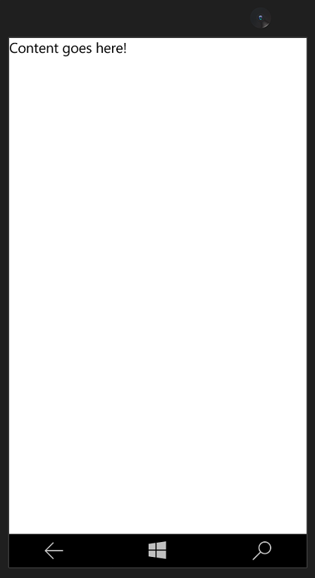

# <a name="create-a-hello-world-app-js"></a>Создание приложения "Hello, world" (JS)

В этом учебнике описано, как с помощью JavaScript и HTML создать простое приложение «Hello, world», предназначенное для универсальной платформы Windows (UWP) в Windows 10. С помощью единственного проекта в Microsoft Visual Studio вы можете создать приложение, работающее на любом устройстве с Windows 10.

В этом разделе вы научитесь выполнять следующие действия.

-   Создание нового проекта **Visual Studio 2015**, предназначенного для **Windows 10** и платформы **UWP**.
-   Добавление содержимого HTML на начальную страницу
-   Обработка ввода с помощью касаний, пера и мыши
-   Запуск проекта на локальном компьютере и на эмуляторе телефона в Visual Studio
-   Использование элемента управления библиотеки Windows для JavaScript

## <a name="before-you-start"></a>Перед началом работы...

-   [Что представляет собой универсальное приложение для Windows](whats-a-uwp.md)?
-   Для работы с этим учебником вам потребуются Windows 10 и Visual Studio 2015. [Подготовка](get-set-up.md).
-   Мы также предполагаем, что в Visual Studio используется компоновка окна по умолчанию. Если макет по умолчанию изменен, его можно сбросить в меню **Window** (Окно), выбрав команду **Reset Window Layout** (Сбросить макет окна).

## <a name="step-1-create-a-new-project-in-visual-studio"></a>Шаг 1. Создание нового проекта в Visual Studio.

Создадим новое приложение с именем `HelloWorld`. Вот как это сделать.
1.  Запустите Visual Studio 2015.

2.  В меню **Файл** выберите **Создать > Проект...**, чтобы открыть диалоговое окно *Новый проект*.

3.  В списке шаблонов слева разверните **Установленные > Шаблоны > JavaScript > Windows** и выберите **Универсальные**, чтобы увидеть список шаблонов проектов UWP. Выберите **Приложение WinJS (универсальное приложение для Windows)**.

    

    В этом руководстве используется шаблон **Приложение WinJS**. Этот шаблон позволяет создать небольшое приложение UWP, которое можно скомпилировать и запустить, несмотря на отсутствие в нем данных и элементов управления пользовательского интерфейса. Вы будете добавлять элементы управления и данные в процессе работы с этим руководством.

   (Если эти параметры не отображаются, убедитесь, что вы установили средства разработки универсальных приложений для Windows. Подробнее см. в разделе [Подготовка](get-set-up.md)).

4.  Введите «HelloWorld» в текстовое поле **Имя**.
5.  Чтобы создать проект, нажмите кнопку **ОК**.
6.  Будет предложено выбрать поддерживаемые версии Windows: **Целевая версия** и **Минимальная версия**. Можно использовать параметры по умолчанию, поэтому нажмите **ОК**.

    Visual Studio создает проект, и он отображается в **обозревателе решений**.

    

Хотя шаблон **Приложение WinJS** предоставляет только минимальные возможности, он содержит ряд файлов.

-   файл манифеста (package.appxmanifest), в котором описывается ваше приложение (имя, описание, плитка, начальная страница, экран-заставка и т. п.) и перечисляются файлы, содержащиеся в приложении;
-   набор изображений логотипов (images/Square150x150Logo.scale-200.png, images/Square44x44Logo.scale-200.png и images/Wide310x150Logo.scale-200.png) для отображения на начальном экране;
-   изображение (images/StoreLogo.png) для представления вашего приложения в Магазине Windows;
-   экран-заставка (images/SplashScreen.scale-200.png), который будет отображаться при запуске вашего приложения;
-   начальная страница (index.html) и соответствующий файл JavaScript (main.js), который выполняется при запуске приложения.

Для просмотра и изменения файлов дважды щелкните нужный файл в **обозревателе решений**.

Эти файлы необходимы для всех приложений UWP на JavaScript. Они должны содержаться в любом проекте, который вы создаете в Visual Studio.

## <a name="step-2-launch-the-app"></a>Шаг 2. Запуск приложения


К этому моменту вы создали очень простое приложение. Этот этап подходит для сборки, развертывания и запуска приложения, а также его просмотра. Вы можете выполнить отладку приложения на локальном компьютере, симуляторе или эмуляторе, а также на удаленном устройстве. Меню целевого устройства в Visual Studio.


### <a name="start-the-app-on-a-desktop-device"></a>Запуск приложения на настольном ПК

По умолчанию приложение запускается на локальном компьютере. Меню целевого устройства предоставляет ряд возможностей для отладки приложения на устройствах с настольного ПК.

-   **Симулятор**
-   **Локальный компьютер**
-   **Удаленный компьютер**

**Запуск отладки на локальном компьютере**

1.  Убедитесь, что в меню целевого устройства () на панели инструментов **Стандартная** выбран параметр **Локальный компьютер**. (Этот параметр выбран по умолчанию.)
2.  Нажмите кнопку **Начать отладку** () на панели инструментов.

   либо

   В меню **Отладка** выберите команду **Начать отладку**.

   либо

   Нажмите клавишу F5.

Приложение откроется в новом окне и сначала отобразится экран-заставка по умолчанию. Экран-заставка определяется изображением (SplashScreen.png) и цветом фона (указанным в манифесте приложения).

После исчезновения экрана-заставки появится ваше приложение. Оно представляет собой черный экран с текстом «Место для содержимого».


Нажмите клавишу Windows, чтобы открыть меню **Пуск**, и выберите пункт «Все программы». Обратите внимание, что при локальном развертывании приложения его плитка добавляется в меню **Пуск**. Чтобы снова запустить приложение (не в режиме отладки) нажмите или щелкните соответствующую плитку в меню **Пуск**.

Ваше приложение пока что умеет не много, но все равно поздравляем — вы создали свое первое приложение UWP!

**Остановка отладки**

-   Нажмите кнопку **Остановить отладку** () на панели инструментов.

   либо

   В меню **Отладка** выберите команду **Остановить отладку**.

   либо

   Закройте окно приложения.

### <a name="start-the-app-on-a-mobile-device-emulator"></a>Запуск приложения в эмуляторе мобильного устройства

Ваше приложение работает на любом устройстве с Windows 10, поэтому давайте посмотрим, как оно выглядит в Windows Phone.

Помимо возможности отладки на настольном ПК Visual Studio предоставляет возможность развертывания и отладки приложения на физическом мобильном устройстве, подключенном к компьютеру, или на эмуляторе мобильного устройства. Вы можете выбрать эмулятор для устройств с теми или иными параметрами памяти и экрана.

-   **устройство;**
-   **Эмулятор <SDK version> WVGA, 4 дюйма, 512 МБ**
-   **Эмулятор <SDK version> WVGA, 4 дюйма, 1 ГБ**
-   и т. д. (различные эмуляторы с другими конфигурациями).

(Если эти эмуляторы не отображаются, убедитесь, что вы установили средства разработки универсальных приложений для Windows. Подробнее см. в разделе [Подготовка](get-set-up.md)).

Рекомендуется протестировать приложение на устройстве с маленьким экраном и ограниченным объемом памяти, поэтому используйте параметр **Эмулятор 10.0.14393.0 WVGA 4 дюйма, 512 МБ**.

**Запуск отладки в эмуляторе мобильного устройства**

1.  В меню целевого устройства () на панели инструментов **Стандартная** выберите **Эмулятор 10.0.14393.0 WVGA 4 дюйма 512 МБ**.
2.  Нажмите кнопку **Начать отладку** () на панели инструментов.

   либо

   В меню **Отладка** выберите команду **Начать отладку**.


Visual Studio запускает выбранный эмулятор и затем развертывает и запускает приложение. Первый запуск эмулятора может занимать некоторое время. Может появиться ошибка, относящаяся к HyperV; при нажатии кнопки **Повторить** она будет устранена. В эмуляторе мобильного устройства приложение выглядит следующим образом.



## <a name="step-3-modify-your-start-page"></a>Шаг 3. Изменение начальной страницы

Один из файлов, которые создает для вас Visual Studio, — это файл **index.html**, представляющий собой начальную страницу приложения. При запуске приложение отображает содержимое этой начальной страницы. Начальная страница также содержит ссылки на файлы кода приложения и таблицы стилей. Начальная страница приложения, созданная Visual Studio:

```html
<!DOCTYPE html>
<html>
<head>
    <meta charset="utf-8" />
    <title>HelloWorld</title>

    <!-- WinJS references -->
    <link href="lib/winjs-4.0.1/css/ui-light.css" rel="stylesheet" />
    <script src="lib/winjs-4.0.1/js/base.js"></script>
    <script src="lib/winjs-4.0.1/js/ui.js"></script>

    <!-- HelloWorld references -->
    <link href="/css/default.css" rel="stylesheet" />
    <script src="/js/main.js"></script>
</head>
<body class="win-type-body">
    <div>Content goes here!</div>
</body>
</html>
```

Добавим новое содержимое в файл default.html. Как и при редактировании любого другого HTML-файла, содержимое добавляется в элемент [body](https://msdn.microsoft.com/library/windows/apps/Hh453011). Для создания приложения можно использовать элементы HTML5 (с [некоторыми исключениями](https://msdn.microsoft.com/library/windows/apps/Hh465380)). Это означает, что можно использовать такие элементы HTML5, как [h1](https://msdn.microsoft.com/library/windows/apps/Hh441078), [p](https://msdn.microsoft.com/library/windows/apps/Hh453431), [button](https://msdn.microsoft.com/library/windows/apps/Hh453017), [div](https://msdn.microsoft.com/library/windows/apps/Hh453133) и [img](https://msdn.microsoft.com/library/windows/apps/Hh466114).

**Изменение начальной страницы**

1.  Замените содержимое элемента **body** на заголовок первого уровня «Hello, world!», какой-нибудь текст, запрашивающий имя пользователя, элемент **input**, принимающий имя пользователя, элемент **button** и элемент **div**. Назначьте идентификаторы для **input**, **button** и **div**.

 ```html
    <body class="win-type-body">
        <h1>Hello, world!</h1>
        <p>What's your name?</p>
        <input id="nameInput" type="text" />
        <button id="helloButton">Say "Hello"</button>
        <div id="greetingOutput"></div>
    </body>
 ```

2.  Запустите приложение на локальном компьютере. Оно выглядит следующим образом.


   Вы можете ввести текст в элемент **input**, но пока при нажатии элемента **button** ничего не происходит. Некоторые объекты, такие как **button**, могут отправлять сообщения, когда возникают определенные события. Подобные сообщения о событиях дают вам возможность выполнять какие-либо действия в ответ на событие. Поместите код, выполняемый в ответ на событие, в метод обработчика события.

   Далее мы создадим для элемента **button** обработчик события, который отображает персональное приветствие. Мы добавим код обработчика события в файл main.js.

## <a name="step-4-create-an-event-handler"></a>Шаг 4. Создание обработчика события

При создании нашего проекта в Visual Studio был создан файл /js/main.js. Этот файл содержит код для обработки жизненного цикла вашего приложения. В этот же файл мы запишем дополнительный код, обеспечивающий взаимодействие для файла index.html.

Откройте файл main.js.

Прежде чем приступить к добавлению собственного кода, рассмотрим первые и последние строки в файле.

```javascript
(function () {
    "use strict";

     // Omitted code

 })();
```

Вас может удивить их назначение. Эти строки кода служат оболочкой для остального кода в файле main.js, которая превращает его в самостоятельно выполняющуюся анонимную функцию. Самостоятельно выполняющаяся анонимная функция помогает избегать конфликта имен или случайного изменения значений. Это также исключает лишние идентификаторы из глобального пространства имен, что повышает быстродействие. Это кажется несколько странным, но такая практика полезна при программировании.

Следующая строка кода включает [строгий режим](https://msdn.microsoft.com/library/windows/apps/br230269.aspx) для кода JavaScript. Строгий режим обеспечивает дополнительную проверку ошибок кода. Например, он не позволит использовать неявно объявленные переменные или назначить значение свойству, доступному только для чтения.

Рассмотрим оставшийся код в файле main.js. Он обрабатывает события [activated](https://msdn.microsoft.com/library/windows/apps/BR212679) и [checkpoint](https://msdn.microsoft.com/library/windows/apps/BR229839) вашего приложения. Подробнее эти события мы рассмотрим позже. Пока нам достаточно знать, что событие **activated** возникает при запуске приложения.

```javascript
   (function () {
    "use strict";

    var app = WinJS.Application;
    var activation = Windows.ApplicationModel.Activation;
    var isFirstActivation = true;

    app.onactivated = function (args) {
          if (args.detail.kind === activation.ActivationKind.voiceCommand) {
            // TODO: Handle relevant ActivationKinds. For example, if your app can be started by voice commands,
            // this is a good place to decide whether to populate an input field or choose a different initial view.
        }
          else if (args.detail.kind === activation.ActivationKind.launch) {
            // A Launch activation happens when the user launches your app via the tile
            // or invokes a toast notification by clicking or tapping on the body.
              if (args.detail.arguments) {
                // TODO: If the app supports toasts, use this value from the toast payload to determine where in the app
                // to take the user in response to them invoking a toast notification.
              }
              else if (args.detail.previousExecutionState === activation.ApplicationExecutionState.terminated) {
                // TODO: This application had been suspended and was then terminated to reclaim memory.
                // To create a smooth user experience, restore application state here so that it looks like the app never stopped running.
                // Note: You may want to record the time when the app was last suspended and only restore state if they've returned after a short period.
            }
        }

        if (!args.detail.prelaunchActivated) {
            // TODO: If prelaunchActivated were true, it would mean the app was prelaunched in the background as an optimization.
            // In that case it would be suspended shortly thereafter.
            // Any long-running operations (like expensive network or disk I/O) or changes to user state which occur at launch
            // should be done here (to avoid doing them in the prelaunch case).
            // Alternatively, this work can be done in a resume or visibilitychanged handler.
        }

        if (isFirstActivation) {
            // TODO: The app was activated and had not been running. Do general startup initialization here.
            document.addEventListener("visibilitychange", onVisibilityChanged);
            args.setPromise(WinJS.UI.processAll());
        }

        isFirstActivation = false;
    };
```

Определим обработчик события для объекта [button](https://msdn.microsoft.com/library/windows/apps/Hh453017). Наш новый обработчик события получает имя пользователя из элемента управления `nameInput` [input](https://msdn.microsoft.com/library/windows/apps/Hh453271) и использует его для вывода приветствия в элементе `greetingOutput` **div**, который был вами создан в последнем разделе.

### <a name="using-events-that-work-for-touch-mouse-and-pen-input"></a>Использование событий, которые поддерживают сенсорный ввод, ввод с помощью мыши и ввод с помощью пера

В приложении UWP не нужно беспокоиться о различиях между сенсорным вводом, вводом с помощью мыши и другими видами ввода с помощью указателя. Просто используйте такие известные вам события, как [click](https://msdn.microsoft.com/library/windows/apps/Hh441312), и они будут работать для всех видов ввода.

**Совет.** Ваше приложение может также использовать новые события *MSPointer\** и *MSGesture\**, которые поддерживают сенсорный ввод, ввод с помощью мыши и ввод с помощью пера и могут предоставлять дополнительную информацию об устройстве, которое вызвало событие. Подробнее об этом см. в разделах [Реакция на взаимодействие с пользователем](https://msdn.microsoft.com/library/windows/apps/Hh700412) и [Жесты, манипуляции и взаимодействия](https://msdn.microsoft.com/library/windows/apps/Hh761498).

Продолжим работу и создадим обработчик события.

**Создание обработчика события**

1.  В файле main.js после обработчика события [**app.oncheckpoint**](https://msdn.microsoft.com/library/windows/apps/BR229839) и перед вызовом [**app.start**](https://msdn.microsoft.com/library/windows/apps/BR229705) создайте функцию обработчика события [**click**](https://msdn.microsoft.com/library/windows/apps/Hh441312) с именем `buttonClickHandler`, имеющую единственный входной параметр с именем `eventInfo`.
```javascript
    function buttonClickHandler(eventInfo) {

        }
```

2.  Внутри нашего обработчика события получите имя пользователя из элемента управления `nameInput` [**input**](https://msdn.microsoft.com/library/windows/apps/Hh453271) и используйте его, чтобы создать приветствие. Используйте `greetingOutput` [**div**](https://msdn.microsoft.com/library/windows/apps/Hh453133), чтобы отобразить результат.
```javascript
    function buttonClickHandler(eventInfo) {
            var userName = document.getElementById("nameInput").value;
            var greetingString = "Hello, " + userName + "!";
            document.getElementById("greetingOutput").innerText = greetingString;
        }
 ```

Вы добавили новый обработчик события в файл main.js. Теперь требуется зарегистрировать его.

## <a name="step-5-register-the-event-handler-when-your-app-launches"></a>Шаг 5. Регистрация обработчика события при запуске приложения


Теперь осталось только зарегистрировать обработчик событий для кнопки. Рекомендуемым способом регистрации обработчика события является вызов [addEventListener](https://msdn.microsoft.com/library/windows/apps/Hh441145) из кода приложения. Наиболее удобным моментом для регистрации обработчика события является активация приложения. Как вы уже видели, Visual Studio создает для нас в файле main.js некоторый код, который обрабатывает активацию приложения.


Код внутри обработчика события [onactivated](https://msdn.microsoft.com/library/windows/apps/BR212679) проверяет, какой тип активации имеет место. Имеется много типов активации. Например, приложение активируется, когда пользователь запускает его или когда пользователь хочет открыть файл, связанный с приложением. (Подробнее см. в разделе [Жизненный цикл приложения](https://msdn.microsoft.com/library/windows/apps/Mt243287).)

Нас интересует активация [запуском](https://msdn.microsoft.com/library/windows/apps/BR224693). Приложение *запускается*, если оно не выполнялось и пользователь его активировал. Функция [WinJS.UI.processAll](https://msdn.microsoft.com/library/windows/apps/Hh440975) вызывается вне зависимости от того, завершалась ли работа приложения прежде или оно запускается впервые. Функция **WinJS.UI.processAll** включена в вызов метода [setPromise](https://msdn.microsoft.com/library/windows/apps/JJ215609), который обеспечивает отображение экрана-заставки до готовности страницы приложения.

**Совет.** Функция **WinJS.UI.processAll** проверяет файл default.html на наличие элементов управления WinJS и инициализирует их. Пока что мы не добавили ни один из этих элементов управления, однако рекомендуется оставить этот код на случай, если потребуется добавить их позже.

Удобная точка регистрации обработчиков событий для элементов управления, не входящих в WinJS, находится сразу после вызова **WinJS.UI.processAll**.

**Регистрация обработчика события**

-   В обработчике события [**onactivated**](https://msdn.microsoft.com/library/windows/apps/BR212679) в файле main.js извлеките элемент `helloButton` и используйте функцию [**addEventListener**](https://msdn.microsoft.com/library/windows/apps/Hh441145), чтобы зарегистрировать обработчик события [**click**](https://msdn.microsoft.com/library/windows/apps/Hh441312). Добавьте этот код после вызова [**WinJS.UI.processAll**](https://msdn.microsoft.com/library/windows/apps/Hh440975).

```javascript
   app.onactivated = function (args) {
           // Omitted code
           if (isFirstActivation) {
              document.addEventListener("visibilitychange", onVisibilityChanged);
              args.setPromise(WinJS.UI.processAll());

              // Add your code to retrieve the button and register the event handler.
              var helloButton = document.getElementById("helloButton");
              helloButton.addEventListener("click", buttonClickHandler, false);
            }

```    


Запустите приложение. Когда вы вводите имя в текстовое поле и нажимаете кнопку, приложение отображает персональное приветствие.

**Примечание.** Если вам непонятно, почему мы используем [addEventListener](https://msdn.microsoft.com/library/windows/apps/Hh441145) для регистрации нашего события в коде вместо определения события [onclick](https://msdn.microsoft.com/library/windows/apps/Hh441312) в HTML, ознакомьтесь с подробным объяснением в статье [Создание простых приложений](https://msdn.microsoft.com/library/windows/apps/Hh780660).

## <a name="step-6-add-a-windows-library-for-javascript-control"></a>Шаг 6. Добавление элемента управления библиотеки Windows для JavaScript


Помимо стандартных элементов управления HTML, вы можете использовать любые элементы управления из библиотеки [Windows для JavaScript](https://msdn.microsoft.com/library/windows/apps/BR229782), например [WinJS.UI.DatePicker](https://msdn.microsoft.com/library/windows/apps/BR211681), [WinJS.UI.FlipView](https://msdn.microsoft.com/library/windows/apps/BR211711), [WinjS.UI.ListView](https://msdn.microsoft.com/library/windows/apps/BR211837) и [WinJS.UI.Rating](https://msdn.microsoft.com/library/windows/apps/BR211895).

В отличие от элементов управления HTML, у элементов управления WinJS нет выделенных элементов разметки: например, нельзя создать элемент управления [Rating](https://msdn.microsoft.com/library/windows/apps/BR211895), добавив элемент `<rating />`. Чтобы добавить элемент управления WinJS, нужно создать элемент **div** и с помощью атрибута [data-win-control](https://msdn.microsoft.com/library/windows/apps/Hh440969) указать нужный тип элемента управления. Чтобы добавить элемент управления **Rating**, нужно установить для атрибута значение «WinJS.UI.Rating».

**Добавьте элемент управления Rating в приложения.**

1.  В файле index.html добавьте элементы управления [label](https://msdn.microsoft.com/library/windows/apps/Hh453321) и [Rating](https://msdn.microsoft.com/library/windows/apps/BR211895) после `greetingOutput` **div**.

```html
    <body class="win-type-body">
        <h1>Hello, world!</h1>
        <p>What's your name?</p>
        <input id="nameInput" type="text" />
        <button id="helloButton">Say "Hello"</button>
        <div id="greetingOutput"></div>
        <label for="ratingControlDiv">
            Rate this greeting:
        </label>
        <div id="ratingControlDiv" data-win-control="WinJS.UI.Rating">
        </div>
    </body>
```

2.  Запустите приложение на локальном компьютере. Обратите внимание на новый элемент управления [**Rating**](https://msdn.microsoft.com/library/windows/apps/BR211895).

   

> Для загрузки элемента управления **Rating** страница должна вызвать [WinJS.UI.processAll](https://msdn.microsoft.com/library/windows/apps/Hh440975). Так как наше приложение использует один из шаблонов Visual Studio, файл main.js уже содержит вызов **WinJS.UI.processAll**, как описано ранее, поэтому вам не нужно добавлять никакой код.

На данном этапе при щелчке элемента управления **Rating** просто изменяется оценка, больше никакие действия не выполняются. Давайте воспользуемся обработчиком событий, чтобы выполнялось какое-нибудь действие при изменении оценки пользователем.

## <a name="step-7-register-an-event-handler-for-a-windows-library-for-javascript-control"></a>Шаг 7. Регистрация обработчика событий для элемента управления библиотеки Windows для JavaScript


Регистрация обработчика событий для элемента управления WinJS немного отличается от регистрации обработчика событий для стандартного элемента управления HTML. Ранее мы упоминали, что обработчик событий **onactivated** вызывает метод **WinJS.UI.processAll**, чтобы инициализировать WinJS в вашей разметке. Вызов **WinJS.UI.processAll** включен в вызов метода **setPromise**, как показано ниже:

```javascript
            args.setPromise(WinJS.UI.processAll());           
```

Если бы элемент **Rating** был стандартным элементом управления HTML, можно было бы добавить обработчик событий после этого вызова **WinJS.UI.processAll**. Но в случае такого элемента управления WinJS, как **Rating**, задача немного усложняется. Поскольку **WinJS.UI.processAll** создает для нас элемент управления **Rating**, мы не можем добавить обработчик события для **Rating**, пока **WinJS.UI.processAll** не завершит обработку.

Если бы метод **WinJS.UI.processAll** был обычным методом, мы могли бы зарегистрировать обработчик событий **Rating** сразу после его вызова. Но метод **WinJS.UI.processAll** является асинхронным, поэтому любой следующий за ним код может выполняться до завершения метода **WinJS.UI.processAll**. Что же делать в таком случае? Мы используем объект [Promise](https://msdn.microsoft.com/library/windows/apps/BR211867) для получения уведомления о завершении **WinJS.UI.processAll**.

Как и все асинхронные методы WinJS, **WinJS.UI.processAll** возвращает объект **Promise**. Объект **Promise** «обещает», что какое-то действие будет выполнено в будущем. Когда это действие будет выполнено, **Promise** завершит работу.

Объекты [Promise](https://msdn.microsoft.com/library/windows/apps/BR211867) содержат метод [then](https://msdn.microsoft.com/library/windows/apps/BR229728), который принимает функцию «completed» в качестве параметра. **Promise** вызывает эту функцию по ее завершении.

Добавив код к функции «completed» и передав ее в метод **then** объекта **Promise**, вы можете быть уверены, что ваш код будет выполнен после завершения **WinJS.UI.processAll**.

**Вывод значения оценки, выбранного пользователем**

1.  В файле index.html создайте элемент [**div**](https://msdn.microsoft.com/library/windows/apps/Hh453133) для отображения значения оценки и присвойте его идентификатору **id** значение «ratingOutput».

```html
        <body class="win-type-body">
        <h1>Hello, world!</h1>
        <p>What's your name?</p>
        <input id="nameInput" type="text" />
        <button id="helloButton">Say "Hello"</button>
        <div id="greetingOutput"></div>
        <label for="ratingControlDiv">
            Rate this greeting:
        </label>
        <div id="ratingControlDiv" data-win-control="WinJS.UI.Rating">
        </div>
        <div id="ratingOutput"></div>
    </body>
```

2.  В файле main.js создайте для элемента управления **Rating** обработчик события [change](https://msdn.microsoft.com/library/windows/apps/BR211891) с именем `ratingChanged`. Параметр [eventInfo](https://msdn.microsoft.com/library/windows/apps/Hh465776) содержит свойство **detail.tentativeRating**, которое предоставляет новую оценку пользователя. Извлеките это значение и отобразите его в выходном элементе **div**.

```javascript
        function ratingChanged(eventInfo) {

            var ratingOutput = document.getElementById("ratingOutput");
            ratingOutput.innerText = eventInfo.detail.tentativeRating;
        }
```

3.  Обновите код в обработчике событий [onactivated](https://msdn.microsoft.com/library/windows/apps/BR212679), который вызывает [WinJS.UI.processAll](https://msdn.microsoft.com/library/windows/apps/Hh440975), добавив вызов метода [then](https://msdn.microsoft.com/library/windows/apps/BR229728) и передав ему функцию `completed`. Из функции `completed` извлеките элемент `ratingControlDiv`, который содержит элемент управления [Rating](https://msdn.microsoft.com/library/windows/apps/BR211895). Затем используйте свойство [winControl](https://msdn.microsoft.com/library/windows/apps/Hh770814), чтобы извлечь фактический элемент управления **Rating**. (В данном примере определяется встроенная функция `completed` .)

```javascript
           args.setPromise(WinJS.UI.processAll().then(function completed() {

                    // Retrieve the div that hosts the Rating control.
                    var ratingControlDiv = document.getElementById("ratingControlDiv");

                    // Retrieve the actual Rating control.
                    var ratingControl = ratingControlDiv.winControl;

                    // Register the event handler.
                    ratingControl.addEventListener("change", ratingChanged, false);

                }));
```

4.  Можно регистрировать обработчики событий для элементов управления HTML как после вызова [**WinJS.UI.processAll**](https://msdn.microsoft.com/library/windows/apps/Hh440975), так и внутри функции `completed`. Для простоты продолжим работу и переместим все ваши регистрации обработчиков событий внутрь обработчика событий [**then**](https://msdn.microsoft.com/library/windows/apps/BR229728).

    Вот обновленный обработчик событий [**onactivated**](https://msdn.microsoft.com/library/windows/apps/BR212679):

```javascript
    (function () {
    "use strict";

    var app = WinJS.Application;
    var activation = Windows.ApplicationModel.Activation;
    var isFirstActivation = true;

    app.onactivated = function (args) {
        if (args.detail.kind === activation.ActivationKind.voiceCommand) {
            // TODO: Handle relevant ActivationKinds. For example, if your app can be started by voice commands,
            // this is a good place to decide whether to populate an input field or choose a different initial view.
        }
        else if (args.detail.kind === activation.ActivationKind.launch) {
            // A Launch activation happens when the user launches your app via the tile
            // or invokes a toast notification by clicking or tapping on the body.
            if (args.detail.arguments) {
                // TODO: If the app supports toasts, use this value from the toast payload to determine where in the app
                // to take the user in response to them invoking a toast notification.
            }
            else if (args.detail.previousExecutionState === activation.ApplicationExecutionState.terminated) {
                // TODO: This application had been suspended and was then terminated to reclaim memory.
                // To create a smooth user experience, restore application state here so that it looks like the app never stopped running.
                // Note: You may want to record the time when the app was last suspended and only restore state if they've returned after a short period.
            }
        }

        if (!args.detail.prelaunchActivated) {
            // TODO: If prelaunchActivated were true, it would mean the app was prelaunched in the background as an optimization.
            // In that case it would be suspended shortly thereafter.
            // Any long-running operations (like expensive network or disk I/O) or changes to user state which occur at launch
            // should be done here (to avoid doing them in the prelaunch case).
            // Alternatively, this work can be done in a resume or visibilitychanged handler.
        }

        if (isFirstActivation) {
            // TODO: The app was activated and had not been running. Do general startup initialization here.
            document.addEventListener("visibilitychange", onVisibilityChanged);

            args.setPromise(WinJS.UI.processAll().then(function completed() {
                var ratingControlDiv = document.getElementById("ratingControlDiv");
                var ratingControl = ratingControlDiv.winControl;
                ratingControl.addEventListener("change",ratingChanged, false);
            }));

            var helloButton = document.getElementById("helloButton");
            helloButton.addEventListener("click", buttonClickHandler, false);

        }

        isFirstActivation = false;
    };

```        

    Run the app. When you select a rating value, it outputs the numeric value below the [**Rating**](https://msdn.microsoft.com/library/windows/apps/BR211895) control.


## <a name="summary"></a>Сводка

Поздравляем! Вы создали свое первое приложение для Windows 10 и платформы UWP с помощью JavaScript и HTML!

Дальнейшие действия Документы по [WinJS](https://developer.microsoft.com/windows/develop/winjs) помогут приступить к работе с библиотекой Windows для JavaScript, либо можно сразу перейти к [следующим шагам](learn-more.md).

